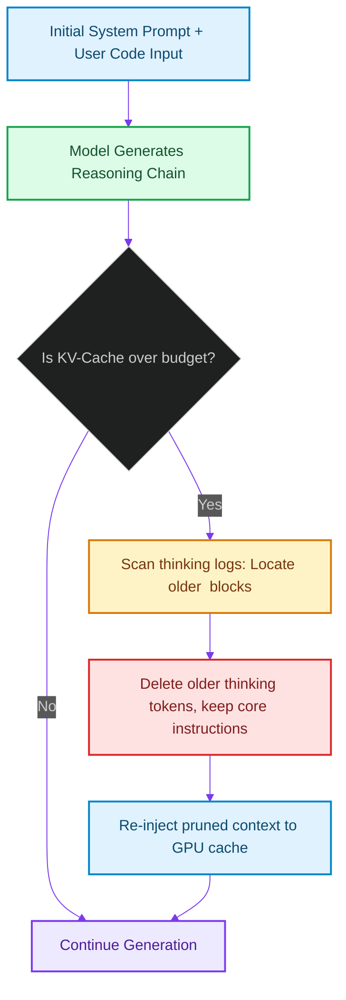

# Dynamic Token-Dropping: Optimizing Edge KV-Cache Slices for Local Reflection Loops

> [!NOTE]
> **📖 Article Overview**
> Reasoning models (like DeepSeek-R1, o1, or local Qwen-7B-Instruct) execute long chain-of-thought (CoT) reflection loops to self-correct during code generation. While reasoning quality is high, the VRAM cost is severe. As the thinking thread grows, the GPU's Key-Value (KV) cache becomes bloated, dragging down generation speed and eventually hitting VRAM limits. In this article, we analyze KV-cache memory dynamics, design a **Dynamic Token-Dropping Gate**, and implement an intermediate thinking token pruner in Python.

---

## The Cost of Deep Thinking

Reasoning chains are highly effective for code generation:
1. `Generate draft implementation`
2. `Analyze syntax and run tests`
3. `Identify bugs and rewrite code blocks`

This loop is represented as tokens. In a local model, each token generated must be cached in GPU VRAM (the **KV-Cache**) to speed up subsequent token generations.

If an agent runs 5 reflection cycles, the KV-Cache can exceed **32,000 tokens** [1]. On consumer GPUs or edge servers, this causes two issues:
* **Context Decay**: Generation speed slows down because the GPU spends more time scanning the KV-cache.
* **Out-of-Memory (OOM) Failures**: The VRAM required to store the KV-cache exceeds physical capacity, crashing the execution process.

To prevent this, we must build a **Dynamic Token-Dropping Manager**.



By dropping older reasoning loops, we keep the KV-cache bounded and prevent VRAM memory overflows.

---

## 1. Under the Hood: KV-Cache Compression vs. Token Dropping

Modern runtimes (like vLLM or llama.cpp) use hardware-level optimizations to squeeze KV-caches:
* **PagedAttention**: Segmenting the KV-cache into virtual blocks to prevent VRAM fragmentation.
* **Grouped-Query Attention (GQA)**: Sharing key-value states across multiple query heads to reduce VRAM footprints.
* **Dynamic Token-Dropping**: An application-level logic gate that scans token streams, isolates transient thinking blocks (e.g. `<think>...</think>` tags), and prunes them from memory once the code output is verified, keeping only the final code and system prompts.

---

## 2. Setting up Pruning Boundaries

To drop tokens safely, the budget manager must follow strict rules:
1. **Never drop the System Prompt**: Core instructions and schemas must remain warm in the cache.
2. **Never drop the target file signature**: The file code under modification must stay in memory.
3. **Only drop intermediate thinking blocks**: Once a reflection loop finishes, its intermediate thinking tokens are evictable.

---

## Code Demo: Dynamic Thinking Token Pruner

Below is a Python implementation of a KV-cache token-dropping manager. It tracks token usage limits, parses thinking tags (`<think>...</think>`), and evicts older reasoning blocks to keep memory utilization under budget constraints.

```python
import re
from typing import List, Dict, Any

class TokenBudgetManager:
    def __init__(self, max_token_budget: int):
        self.max_token_budget = max_token_budget

    def prune_thinking_history(self, prompt: str, conversation_history: List[str]) -> List[str]:
        # Estimate token count (simple word-count approximation for simulation)
        system_tokens = len(prompt.split())
        history_tokens = sum(len(turn.split()) for turn in conversation_history)
        total_estimate = system_tokens + history_tokens

        print(f"📊 [Token Budget] Current estimate: {total_estimate}/{self.max_token_budget} tokens.")

        if total_estimate <= self.max_token_budget:
            return conversation_history

        print("⚠️ [Token Budget] Budget exceeded! Initiating dynamic token-dropping...")
        pruned_history = []
        
        # Traverse history from oldest to newest to locate evictable thinking blocks
        for turn in conversation_history:
            # Check if we are still over budget
            current_tokens = system_tokens + sum(len(t.split()) for t in pruned_history) + history_tokens - sum(len(t.split()) for t in conversation_history[:conversation_history.index(turn)])
            
            if current_tokens > self.max_token_budget:
                # Use regex to isolate <think>...</think> tags and strip them
                # Leaving only the final assistant code response or user feedback
                clean_turn = re.sub(r"<think>.*?</think>", "<!-- Stale thinking block pruned by budget manager -->", turn, flags=re.DOTALL)
                pruned_history.append(clean_turn)
                
                old_len = len(turn.split())
                new_len = len(clean_turn.split())
                print(f"✂️ [Pruned] Dropped {old_len - new_len} intermediate thinking tokens.")
            else:
                pruned_history.append(turn)

        return pruned_history

if __name__ == "__main__":
    # Configure token budget: e.g. max 120 tokens for simulation purposes
    budget_manager = TokenBudgetManager(max_token_budget=120)

    system_instruction = "You are a coding assistant. Complete tasks inside sandbox boundaries."

    # Simulated conversation logs containing verbose chain-of-thought blocks
    history = [
        """User: Add auth validation to app.py""",
        """Assistant:
<think>
Checking auth.py structure.
Found missing token decryption key rotation.
I need to write validation logic.
Adding try-except handlers.
</think>
def validate_token(token):
    if not token:
        raise ValueError("Invalid token")
    return True""",
        """User: The code works, but add logger tracing too."""
    ]

    print("🤖 Processing chat context before model execution...")
    print("--------------------------------------------------")
    
    # Process and prune history
    optimized_history = budget_manager.prune_thinking_history(system_instruction, history)

    print("\n--- Optimized Chat History for LLM Context Window ---")
    for idx, turn in enumerate(optimized_history, 1):
        print(f"\n[Turn #{idx}]")
        print(turn)
```

---

## Architectural Guidelines

* **Implement Thinking Tags**: Ensure local models write reasoning chains inside clear structural boundaries (e.g. `<think>...</think>`) to facilitate easy extraction.
* **Verify Code Safety First**: Never drop intermediate reasoning logs until the generated code compiles successfully. If compilation fails, the logs are required to debug issues.
* **Combine with PagedAttention**: Host your models using runtimes that support virtual memory management (like vLLM) to maximize the latency benefits of pruned caches. [2]

## References & Further Reading

1. **Ongaro, D., & Ousterhout, J. (2014)**. *In Search of an Understandable Consensus Algorithm*. USENIX ATC. [https://raft.github.io/raft.pdf](https://raft.github.io/raft.pdf)
2. **Lamport, L. (2001)**. *Paxos Made Simple*. ACM SIGACT News. [https://lamport.azurewebsites.net/pubs/paxos-simple.pdf](https://lamport.azurewebsites.net/pubs/paxos-simple.pdf)
3. **Burrows, M. (2006)**. *The Chubby Lock Service for Loosely-Coupled Distributed Systems*. OSDI. [https://research.google/pubs/pub27897/](https://research.google/pubs/pub27897/)
4. **Kwon, W., et al. (2023)**. *Efficient Memory Management for Large Language Model Serving with PagedAttention*. SOSP. [https://arxiv.org/abs/2309.06180](https://arxiv.org/abs/2309.06180)
5. **Dao, T., et al. (2022)**. *FlashAttention: Fast and Memory-Efficient Exact Attention with IO-Awareness*. NeurIPS. [https://arxiv.org/abs/2205.14135](https://arxiv.org/abs/2205.14135)
6. **Leviathan, Y., Kalman, M., & Matias, Y. (2023)**. *Fast Inference from Transformers via Speculative Decoding*. ICML. [https://arxiv.org/abs/2211.17192](https://arxiv.org/abs/2211.17192)
