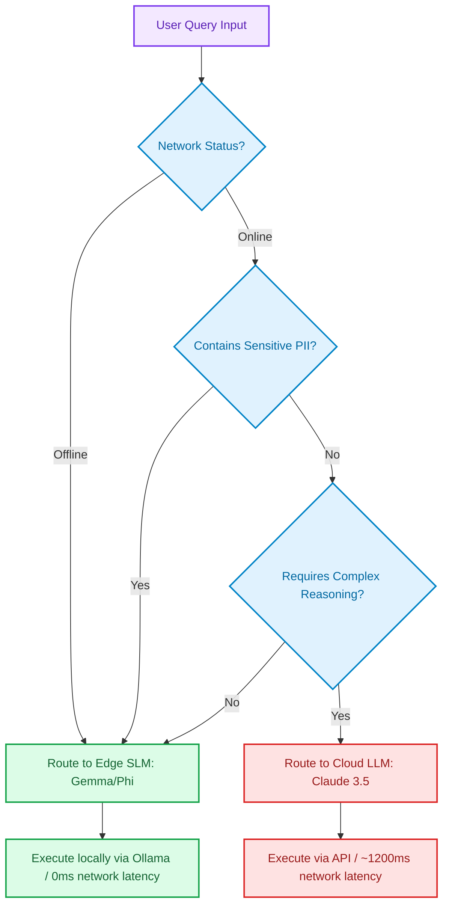

# Edge SLMs vs. Cloud LLMs: Navigating the Spectrum of Parameter Budgets

> ### 📖 Article Overview
> * **What this article is about:** An engineering trade-off comparison between running Small Language Models (SLMs like Gemma 2 or Phi-4) locally on the edge vs. querying large cloud-scale APIs (like Claude 3.5 Sonnet or GPT-4o).
> * **Why it matters:** Defaulting to cloud APIs for simple LLM tasks is a major source of cost, latency, and security issues. Designing a hybrid routing architecture allows teams to achieve production efficiency.
> * **What we synthesized:** Local SLMs offer sub-second latency, zero token costs, and absolute data privacy, but lack deep reasoning and have limited contexts. Cloud LLMs offer state-of-the-art logic and massive context windows, but suffer from high latency, recurring costs, and PII leakage risks.

---

For years, the gold standard of large language model (LLM) engineering was simple: bigger is better. Trillion-parameter dense models (like GPT-4) dominated benchmarks, leading developers to route every single text extraction, summary, or query through cloud-hosted APIs.

In 2026, this approach is increasingly seen as an architectural anti-pattern. 

The industry has entered the era of **Parameter Budgets**. Instead of relying exclusively on giant cloud models, software architects use **Small Language Models (SLMs)** running locally on the edge—such as Google's Gemma 2 (9B/27B) or Microsoft's Phi-4 (14B)—and reserve cloud LLM calls only for complex reasoning tasks.

This article synthesizes the trade-offs of Edge SLMs vs. Cloud LLMs, detailing **what is good (pros)**, **what is not (cons)**, and how to build an edge-first routing middleware, as modeled in my hybrid clinical assistant project, [MedEdge](https://github.com/akmalkhaniub/MedEdge).

---

## The Edge-First Decision Routing Pipeline

Deploying a hybrid model requires an intelligent router that evaluates security, network state, and query complexity to decide whether to dispatch a job to a local SLM or trigger a cloud API.



---

## Synthesis: What's Good & What's Not

### 1. Small Edge SLMs (Gemma 2 / Phi-4)
Edge SLMs are highly optimized models (typically ranging from 2B to 14B parameters) quantized to run on local laptops, smartphones, or edge servers.

*   **What's Good (The Pros)**:
    *   *Sub-Second Latency*: Bypasses internet network hops. Running Gemma 2 9B locally on an Nvidia RTX card delivers **45+ tokens per second** with sub-200ms response times.
    *   *Data Isolation*: Patient summaries, financial transactions, or internal repository logs never leave the device, ensuring 100% HIPAA/GDPR data privacy.
    *   *Zero Token Charges*: No recurring API bills. Once deployed, the run cost is simply electricity.
*   **What's Not (The Cons)**:
    *   *Logical Reasoning Limits*: SLMs fail at multi-step planning, code generation, and complex logical synthesis.
    *   *Context Capacity*: Local VRAM constraints restrict context windows (often capping at 8K tokens) compared to the million-token windows supported by cloud engines.

---

### 2. Cloud-Scale LLMs (Claude 3.5 / GPT-4o)
Frontier models hosted behind high-throughput cloud endpoints.

*   **What's Good (The Pros)**:
    *   *Frontier Intelligence*: Excellent common-sense reasoning, multi-tool orchestration, and deep code debugging.
    *   *Enormous Context*: Easily ingests entire books, logs, or repositories within a single prompt context.
*   **What's Not (The Cons)**:
    *   *High Latency*: Network round-trips add substantial overhead, making real-time autocomplete or instant chat prompts slow.
    *   *PII Vulnerability*: Exposing corporate or patient data to external API servers introduces data privacy risks.
    *   *Compounding Costs*: Enterprise agent loops that iterate hundreds of times per task create unpredictable monthly token bills.

---

## Coding an Edge-First Router in TypeScript

Here is a TypeScript middleware representing an edge-first routing pipeline. The controller analyzes a query's complexity (e.g. token length or keyword indicators) and privacy flags to decide whether to query a local **Ollama** runtime or fall back to the **Anthropic Claude API**. This is modeled on routing systems designed in [MedEdge](https://github.com/akmalkhaniub/MedEdge).

```typescript
import { Anthropic } from "@anthropic-ai/sdk";
import axios from "axios";

const anthropic = new Anthropic({ apiKey: process.env.ANTHROPIC_API_KEY });
const OLLAMA_URL = "http://localhost:11434/api/generate";

interface RouteDecision {
  destination: "local" | "cloud";
  reason: string;
}

// 1. Simple heuristic router analyzing PII and complexity
function evaluateQuery(query: string): RouteDecision {
  const piiKeywords = ["SSN", "patient_id", "password", "medical_record"];
  const complexKeywords = ["optimize", "refactor", "diagnose", "analyze", "compare"];
  
  // Rule A: Force local if PII keywords are present
  const hasPII = piiKeywords.some(keyword => query.toLowerCase().includes(keyword));
  if (hasPII) {
    return { destination: "local", reason: "PII detected - routing to local SLM for privacy." };
  }

  // Rule B: Route to cloud if complex logic is requested
  const isComplex = complexKeywords.some(keyword => query.toLowerCase().includes(keyword)) || query.length > 500;
  if (isComplex) {
    return { destination: "cloud", reason: "Complex logic or large prompt detected - routing to Cloud LLM." };
  }

  return { destination: "local", reason: "Standard task - routing to local Edge SLM." };
}

// 2. Main controller
export async function executeRouter(query: string): Promise<string> {
  const route = evaluateQuery(query);
  console.log(`[Router Decision]: ${route.reason}`);

  if (route.destination === "local") {
    try {
      const response = await axios.post(OLLAMA_URL, {
        model: "gemma2:9b",
        prompt: query,
        stream: false
      });
      return response.data.response;
    } catch (err) {
      console.warn("Local SLM unavailable - falling back to cloud.");
    }
  }

  // Cloud fallback / execution
  const msg = await anthropic.messages.create({
    model: "claude-3-5-sonnet-20241022",
    max_tokens: 1024,
    messages: [{ role: "user", content: query }],
  });
  
  return msg.content[0].text;
}
```

---

## Edge-First Implementation Checklist

* [ ] **Local Quantization checks**: Validate that local machines have sufficient unified memory or dedicated VRAM (minimum 8GB for 7B-9B models) to hold quantized GGUF weights.
* [ ] **Network State listeners**: Integrate offline network state listeners (`navigator.onLine` in web clients) to force local SLM execution if cellular network connectivity drops.
* [ ] **Strict PII Scanners**: Implement local regex scanners to detect SSNs or phone numbers in inputs, forcing local routing even if the query requires complex reasoning.

---

## Conclusion & Key Takeaways

Optimizing the parameter budget is the most critical design pattern for high-performance, cost-sensitive AI systems:
1. **Match Scale to Need:** Standard text processing and parsing are highly suited for local SLMs like Phi-4 or Gemma 2. Do not pay cloud markup or accept network round-trip overhead for basic classifications.
2. **Implement Guardrails:** A hybrid model works only when supported by deterministic filters (network detection, regex-based PII scans, and length analyzers) checking queries before dispatch.
3. **Decouple Privacy:** Edge models guarantee data containment, making them the primary option for systems handling PII in healthcare, finance, or secure environments.

*Takeaway:* Production-grade architecture does not rely on the largest model available—it selects the narrowest model that can execute the task reliably.

---

## References & Further Reading

* **Google Gemma 2 Architecture**: Google DeepMind Gemma Team. *Gemma 2: Improving Open Language Models*. Details parameters, distillation techniques, and edge performance. [Google Discover Gemma](https://deepmind.google/technologies/gemma/).
* **Microsoft Phi Small Models**: Microsoft Research. *Phi-3 Technical Report: A Highly Capable Language Model Locally on Your Phone*. [Microsoft Research Phi](https://www.microsoft.com/en-us/research/).

*To inspect how local-first Gemma runtimes are integrated into clinical mobile layouts, check out our clinical assistant repository [MedEdge](https://github.com/akmalkhaniub/MedEdge).*
