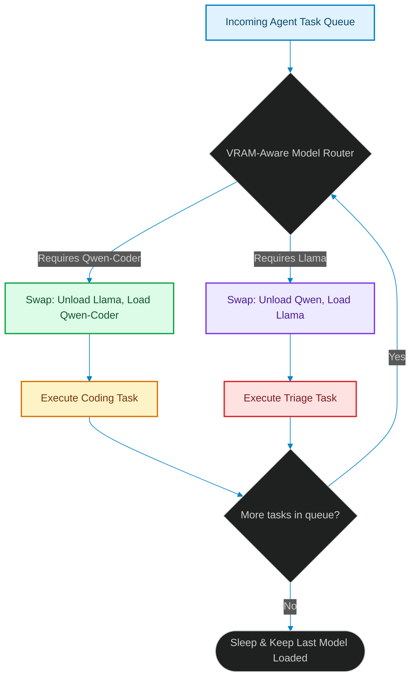

# Edge Swarm Orchestration: Running Cooperating Agents on Single-GPU Nodes

> [!NOTE]
> **📖 Article Overview**
> Running cooperative multi-agent networks in the cloud is easy because you can spin up isolated, serverless inference containers for each agent type. However, when deploying agent swarms locally on **edge servers, development workstations, or client devices**, we face strict physical resource constraints. Attempting to load multiple large language models (LLMs) concurrently into VRAM causes Out-of-Memory (OOM) crashes. In this article, we design an **Edge Model Swapper**, analyze model scheduling patterns, and implement a GPU VRAM-aware model router in Python.

---

## The VRAM Wall of Edge AI

In a typical multi-agent swarm, you have specialized agents:
1. `Qwen-Coder-7B` for code generation [1].
2. `Llama-3-8B` for planning and triage.
3. `Mistral-7B` for markdown documentation and test writing.

Loaded concurrently, these models require over 30 GB of VRAM at FP16 precision. On a single NVIDIA RTX 4090 or a workstation GPU with 24 GB of VRAM, this causes immediate memory crashes.

To solve this, system architects must build a **Model Router Manager**. Instead of keeping all models loaded in VRAM, the manager schedules execution, keeps only the active model in memory, and swaps parameter weights in and out of GPU memory dynamically.



---

## 1. Swapping Model Weights Efficiently

Swapping models from system RAM (or disk) to GPU VRAM takes time. To optimize this swapping latency:
* **Model Quantization**: Using 4-bit quantizations (AWQ or EXL2) reduces the model's disk footprint and loading overhead, speeding up weight transfers.
* **Warm Cache Swapping**: Keeping unused models in system RAM rather than unloading them to disk, allowing fast bus transfers to VRAM.
* **Sequential Chunking**: Designing agent pipelines to execute all coding tasks in one batch, then all documentation tasks in the next, avoiding frequent loading transitions.

---

## 2. Setting up Concurrency Budgets

When designing edge orchestration layers, the router must:
1. **Track GPU VRAM**: Retrieve active memory metrics using NVIDIA System Management Interface (NVML/nvidia-smi).
2. **Implement Mutex Locks**: Restrict multi-threaded agents from calling inference concurrently if the combined sizes exceed the VRAM limit.
3. **Queue Requests**: Run scheduling algorithms to queue execution requests, running them sequentially when memory becomes available.

---

## Code Demo: VRAM-Aware Model Router Manager

Below is a Python implementation of an edge model swapper. It simulates a single-GPU workstation with 16 GB of VRAM, manages model states, loads/unloads models to prevent memory crashes, and routes agent tasks sequentially.

```python
import time
from typing import Dict, Any, List

class ModelOOMException(Exception):
    pass

class GPUMemoryManager:
    def __init__(self, total_vram_gb: float):
        self.total_vram_gb = total_vram_gb
        self.current_vram_allocated = 0.0
        self.loaded_models: Dict[str, float] = {}  # {model_name: size_gb}

    def load_model(self, model_name: str, size_gb: float):
        # If model is already loaded, do nothing
        if model_name in self.loaded_models:
            print(f"✅ Model '{model_name}' is already warm in VRAM.")
            return

        # Check if loading the model causes OOM
        needed_memory = size_gb
        while self.current_vram_allocated + needed_memory > self.total_vram_gb:
            if not self.loaded_models:
                raise ModelOOMException("OOM Error: Single model size exceeds total GPU VRAM!")
            
            # Unload the oldest loaded model (FIFO eviction)
            evicted_model, evicted_size = next(iter(self.loaded_models.items()))
            self.unload_model(evicted_model, evicted_size)

        # Load new model weights
        print(f"📥 Loading model '{model_name}' ({size_gb} GB) to GPU VRAM...")
        # Simulate load time
        time.sleep(0.5)
        self.loaded_models[model_name] = size_gb
        self.current_vram_allocated += size_gb
        print(f"📊 VRAM Status: {self.current_vram_allocated}/{self.total_vram_gb} GB allocated.")

    def unload_model(self, model_name: str, size_gb: float):
        if model_name in self.loaded_models:
            print(f"📤 Evicting model '{model_name}' from VRAM...")
            del self.loaded_models[model_name]
            self.current_vram_allocated -= size_gb

class EdgeSwarmRouter:
    def __init__(self, vram_manager: GPUMemoryManager, model_inventory: Dict[str, float]):
        self.vram = vram_manager
        self.inventory = model_inventory

    def execute_task(self, agent_name: str, target_model: str, task: str):
        print(f"\n🚀 [Router] Dispatching '{task}' to '{agent_name}' using model '{target_model}'...")
        
        model_size = self.inventory.get(target_model)
        if not model_size:
            print(f"❌ Error: Model '{target_model}' not found in inventory.")
            return

        # Allocate memory
        try:
            self.vram.load_model(target_model, model_size)
            print(f"⚙️ Running task on GPU: '{task}'")
        except ModelOOMException as e:
            print(f"❌ Execution aborted: {e}")

if __name__ == "__main__":
    # Simulate a workstation GPU with 16 GB of VRAM
    gpu_manager = GPUMemoryManager(total_vram_gb=16.0)

    # Available models and their memory footprints
    models = {
        "llama-3-8b": 6.5,     # 6.5 GB VRAM (quantized)
        "qwen-coder-7b": 5.5,  # 5.5 GB VRAM
        "deepseek-coder": 12.0 # 12.0 GB VRAM
    }

    router = EdgeSwarmRouter(gpu_manager, models)

    # Dispatch tasks that fit together (Llama + Qwen = 12.0 GB <= 16 GB)
    router.execute_task("PlannerAgent", "llama-3-8b", "Analyze Jira logs")
    router.execute_task("CodingAgent", "qwen-coder-7b", "Write database connector")

    # Dispatch a task with deepseek-coder (12.0 GB)
    # This requires evicting llama or qwen to avoid OOM
    router.execute_task("HeavyRefactoringAgent", "deepseek-coder", "Refactor core API module")

    # Verify that the final memory allocations are stable
    print(f"\n🏁 Simulation Complete. Loaded models: {list(gpu_manager.loaded_models.keys())}")
```

---

## Architectural Guidelines

* **Quantize Models**: Always use AWQ, EXL2, or GGUF quantization formats on edge nodes to fit multiple models into memory constraints.
* **Batch Similar Tasks**: Structure agent execution flows to perform all coding tasks sequentially, reducing the need to swap model weights back and forth.
* **Isolate Allocations**: Design the routing manager with locks and semaphores to block concurrent LLM invocations that exceed VRAM capacity. [2]

## References & Further Reading

1. **Mohan, C., et al. (1992)**. *ARIES: A Transaction Recovery Method Supporting Fine-Granularity Locking and Partial Rollbacks*. ACM TODS. [https://doi.org/10.1145/128765.128770](https://doi.org/10.1145/128765.128770)
2. **O'Neil, P., Cheng, E., Gawlick, D., & O'Neil, E. (1996)**. *The Log-Structured Merge-Tree (LSM-Tree)*. Acta Informatica. [https://www.cs.umb.edu/~poneil/lsmtree.pdf](https://www.cs.umb.edu/~poneil/lsmtree.pdf)
3. **PostgreSQL Global Development Group (2024)**. *PostgreSQL Documentation*. postgresql.org. [https://www.postgresql.org/docs/current/](https://www.postgresql.org/docs/current/)
4. **Malkov, Y. A., & Yashunin, D. A. (2018)**. *Efficient and Robust Approximate Nearest Neighbor Search Using Hierarchical Navigable Small World Graphs*. IEEE TPAMI. [https://arxiv.org/abs/1603.09320](https://arxiv.org/abs/1603.09320)
5. **Jégou, H., Douze, M., & Schmid, C. (2011)**. *Product Quantization for Nearest Neighbor Search*. IEEE TPAMI. [https://hal.inria.fr/inria-00514462v2/document](https://hal.inria.fr/inria-00514462v2/document)
6. **Johnson, J., Douze, M., & Jégou, H. (2019)**. *Billion-scale Similarity Search with GPUs*. IEEE Transactions on Big Data. [https://arxiv.org/abs/1702.08734](https://arxiv.org/abs/1702.08734)
