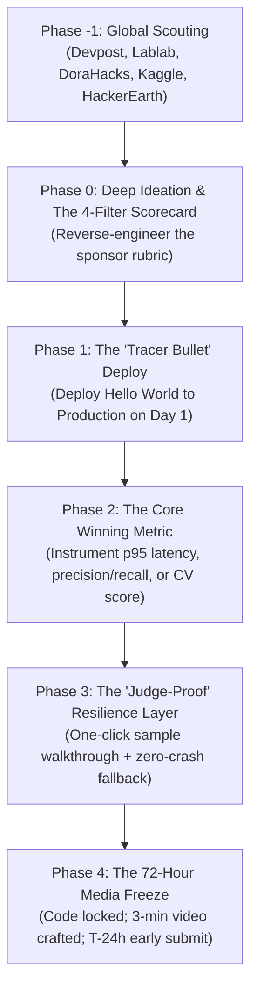

# 🏆 Engineering the Hackathon: A Systems Engineer's Playbook to Beat Deadline Chaos, Billing Walls, and Toy Wrappers

**Author:** Akmal Khan, PhD  
**Published:** October 2026  
**Tags:** AI Engineering, Systems Architecture, Hackathons, Cloud Infrastructure, Developer Productivity  

---

## ⚡ The Illusion of the 48-Hour Hustle

In the developer community, hackathons are romanticized as sleep-deprived, caffeine-fueled sprints where engineers frantically string together APIs over a weekend.

Every season, thousands of skilled developers enter competitions on Devpost, Lablab.ai, Kaggle, and DoraHacks. Yet, Sunday night invariably devolves into a familiar catastrophe:
- At 11:30 PM, deployment fails because a cloud provider prompts for an unexpected credit card verification or blocks a container build.
- The live demo fails on a judge's machine because an external API rate-limit triggers an unhandled `undefined` in the UI.
- The 3-minute demo video—which accounts for 70% of judging scores—is hastily recorded in a 15-minute rush with muffled microphone audio and zero editing.
- The finished project is relegated to the "also-ran" pile because it is fundamentally indistinguishable from fifty other generic chatbot wrappers.

Hackathons are not won by frantic late-night improvisation. **They are won by disciplined systems engineering.**

Having built autonomous agent meshes, low-latency audio pipelines, and high-performance ML workflows across competitive arenas, I developed an operational framework that treats hackathon development not as an adrenaline sprint, but as **high-velocity product delivery with deterministic quality gates**.

Here is the blueprint.

---



---

## 🧭 Phase -1: Don't Hunt on One Platform

Most participants browse a single platform like Devpost and miss the broader landscape of specialized challenges. A disciplined hackathon strategist monitors seven key ecosystems:

1. **Devpost:** Flagship enterprise cloud, developer tooling, and Fortune 500 corporate challenges (Amazon, AWS, Google, Meta).
2. **Lablab.ai:** Frontier Generative AI, audio/speech intelligence, and fast LLM deployment sprints (AMD, AssemblyAI, Cohere, ElevenLabs).
3. **DoraHacks:** Autonomous AI agents, Web3 infrastructure, and robotics/swarm challenges ($50k–$150k prize pools).
4. **HackerEarth:** Deep coding agent challenges and technical enterprise benchmarks.
5. **Kaggle:** Competitive machine learning, formal reasoning benchmarks (ARC Prize), and computer vision competitions.
6. **Devfolio:** Grassroots open-source hackathons and developer ecosystems across APAC and North America.
7. **Taikai & Unstop:** Global corporate innovation tournaments.

---

## 🎯 Phase 0: Deep Ideation & The 4-Filter Scorecard

> **The Cardinal Rule:** A technically flawless implementation of a boring idea will almost never win. Ideation determines whether you place in the top 3 or disappear in the middle of 300 submissions.

### The Saturated Idea Blacklist
Before generating ideas, establish what **not** to build. Eighty percent of amateur hackathon submissions fall into five saturated buckets:
- ❌ *The Generic Customer Support Bot*
- ❌ *The Resume & Interview Preparation Assistant*
- ❌ *The Basic PDF / Document Q&A Summarizer*
- ❌ *The Meal / Workout / Generic Habit Generator*
- ❌ *The Trivial Code Explainer with naive LLM prompts*

Strictly blacklisting these five categories immediately propels your concept into the top 20% of novelty.

### The Persona-Problem-Action-Artifact Formula
Winning projects solve a high-stakes, expensive operational problem for a specific persona and execute **autonomous action** rather than merely offering advice:

$$\text{Winning Project} = \text{[High-Value Persona]} + \text{[Expensive/Time-Consuming Pain]} + \text{[Autonomous Action Loop]} + \text{[Tangible Deliverable Artifact]}$$

*Example from our DevOps project:*
- **Persona:** Cloud Infrastructure & SecOps Engineers.
- **Pain Point:** Auditing multi-thousand-line Terraform repositories for security drift and over-privileged IAM roles.
- **Action:** Static AST parsing + LLM reasoning + automated patch generation.
- **Artifact:** A verified, compilable pull request opened directly against the repository.

### The 1-Page Ideation Scorecard
Before writing a single line of code, score each candidate idea out of 25 across five filters. **Only projects scoring ≥ 21/25 are greenlit.**

| Filter | Core Question | Target |
| :--- | :--- | :---: |
| **1. Sponsor Alignment** | Does the project place the sponsor's newest, highest-margin, or most hyped API at the architectural center? | 5 / 5 |
| **2. Pain Point Gravity** | Is this an expensive, bleeding-neck problem that an enterprise or professional would pay real money to resolve? | 5 / 5 |
| **3. The 10-Second Wow Hook** | Is there a tangible visual or audible moment in the first 60 seconds that makes a judge lean forward? | 4–5 / 5 |
| **4. Technical Depth** | Does the system demonstrate rigorous software engineering (AST analysis, WebSockets, telemetry) beyond an API wrapper? | 4–5 / 5 |
| **5. 14-Day Feasibility** | Can this be built, tested, and deployed to production standards within the available timeline? | 5 / 5 |

---

## 🚀 Phase 1: The "Tracer Bullet" Deploy (Day 1)

**Rule: Deploy the Hello World skeleton to production on Day 1.**

Never leave containerization, hosting, or DNS configuration to the final 48 hours. On Day 1:
1. Write a minimal multi-stage `Dockerfile` with separate build and production runner stages.
2. Deploy the container to a serverless platform (Google Cloud Run or AWS ECS) with active SSL and WebSocket support.
3. Wire a single real authenticated handshake to the sponsor's API.
4. Verify the public `/api/health` endpoint on an external smartphone.

By solving cloud billing, container dependencies, and domain routing in the first 48 hours, you eliminate 90% of deadline panic. When feature development wraps up in Week 2, deployment is a simple, deterministic `git push`.

---

## 🧠 Phase 2: Instrumenting the "One Winning Metric"

Judges evaluate engineering depth through measurable proof. Every strong submission must be anchored around **one quantitative, verifiable metric**:

- **Voice & Real-Time Audio:** Instrument turnaround latency (`p95 < 1200 ms`) and barge-in interruption speed (`< 200 ms`).
- **Security & Agentic Workflows:** Measure precision, recall, and F1 score (`1.0`) on a labeled, held-out test fixture.
- **Competitive Machine Learning:** Cross-validated metric score (QWK, Log-Loss, or TRA) computed on local validation splits.
- **Mobile & Full-Stack:** Full sandbox purchase lifecycle, entitlement state verification, and analytics funnel conversion tracking.

Surface this metric visibly in the user interface via an **Observability / Telemetry HUD** and expose it through a structured `/api/metrics` endpoint. When judges see live p50/p95 percentiles instrumented directly in your UI, your submission immediately separates itself from wrapper toys.

---

## 🛡️ Phase 3: The "Judge-Proof" Resilience Layer

Hackathon judges review dozens of entries under severe time constraints—typically spending less than 3 minutes per submission. They will **not**:
- Register for an account.
- Input personal credit card details.
- Provide their own proprietary API keys.
- Upload 500 MB test files.

If your application requires friction, the judge moves on. Your UI must be **Judge-Proof**:

1. **The One-Click Preloaded Walkthrough:** Include a prominent `"Try Sample"` or `"Load Demo"` button in the header. Clicking it must immediately populate rich data, diarized transcripts, and interactive visualizations.
2. **Zero-Crash Honest Fallbacks:** If a sponsor API experiences downtime or rate-limiting during judging, the application must gracefully degrade to bundled mock assets with honest UI badging (e.g., `[Sample Walkthrough Mode]`) rather than throwing an unhandled 500 error.

---

## 🎬 Phase 4: The 72-Hour Media Freeze

> **The Golden Rule:** All feature development stops 72 hours before the deadline.

The final three days belong exclusively to **media production, documentation, and early submission**.

### The 3-Minute Video Script (70% of Judging Weight)
Judges watch your video before reading your code. Structure the video with cold precision:

```
[0:00 - 0:30] Hook & Problem:
              - Articulate the real-world operational friction with crisp clarity.
              - Show the clean UI interface.

[0:30 - 1:15] The Live Solution in Action:
              - Trigger the one-click demo.
              - Walk through the primary workflow resolving the problem end-to-end.

[1:15 - 2:00] The "Wow" Factor & Technical Depth:
              - Showcase the core technical differentiator (barge-in interrupt, AST vulnerability patch).
              - Highlight the live Telemetry / Latency HUD.

[2:00 - 2:30] Sponsor Architecture Breakdown:
              - Present the Mermaid architecture diagram showing the sponsor's technology at the center.
              - Detail anti-hallucination grounding and data safety.

[2:30 - 3:00] Systems Rigor & Conclusion:
              - Flash the 100% passing test suite and open-source GitHub repository.
              - Conclude with a strong, memorable statement on real-world impact.
```

### The T-24 Hour Submission Gate
Always submit **24 hours before the portal closes**.
Hackathon portals experience severe traffic surges, timeouts, and form upload failures during the final 4 hours. Submitting a day early guarantees:
- Public URL links are verified from external networks.
- Video playback permissions (Public or Unlisted) are confirmed.
- Documentation and Mermaid diagrams render correctly on GitHub.

---

## 🏁 The Engineering Quality Rubric

| Level | Classification | Definition of Done |
| :--- | :--- | :--- |
| **L0** | Prototype | Runs locally; baseline logic; mocks for external services. |
| **L1** | Solid | Strict TypeScript/Python; unit tests passing; CI workflow configured. |
| **L2** | Competitive | Real sponsor integration proven; deployed to live public URL; measured metric instrumented. |
| **L3** | Winning Tier | Hardened edge cases; live Telemetry HUD; one-click preloaded demo; polished 3-minute video; submitted T-24h early. |

---

## 🎯 Conclusion

High-performance hackathon execution is not about heroic, sleepless nights. It is about **eliminating uncertainty through structured engineering**:
1. Reverse-engineer the rubric during ideation.
2. Deploy on Day 1.
3. Build for one undeniable metric.
4. Make the app judge-proof.
5. Freeze code 72 hours early and treat video production as a primary engineering artifact.

When you apply this playbook, winning ceases to be a gamble—it becomes the repeatable outcome of disciplined engineering.
