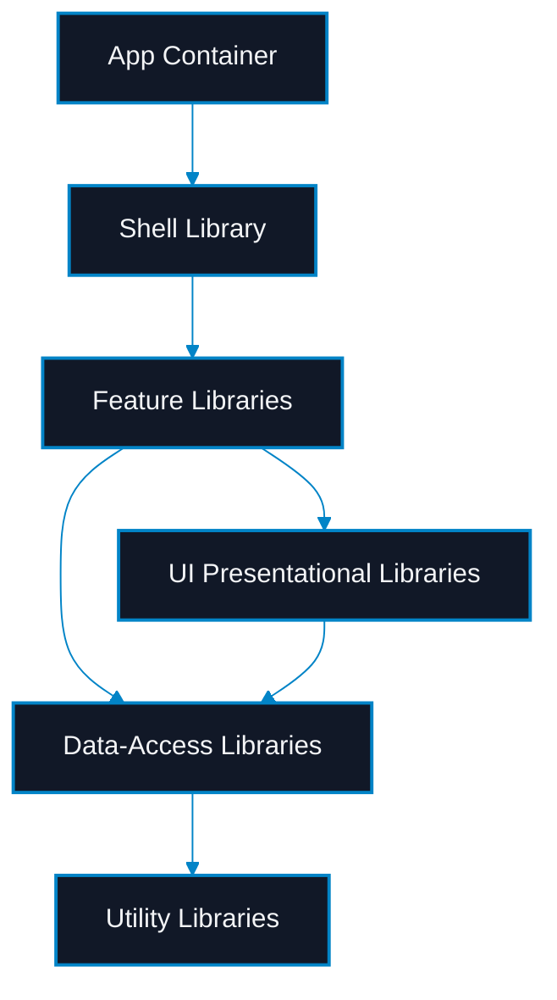

# Enterprise Angular Architectures: Domain-Driven Design, Signal State, and Monorepo Scalability

> [!NOTE]
> **📖 Article Overview**
> When Angular applications grow from medium-sized projects to enterprise platforms worked on by multiple teams, standard component structures break down. Unchecked cross-module imports turn the codebase into a "spaghetti dependency" mess, compile times soar, and state management becomes a bottleneck. This article covers how to architect enterprise Angular applications using **Domain-Driven Design (DDD) principles inside Nx monorepos**, replacing heavy boilerplate state libraries with **lightweight Signal Stores**, and optimizing CI/CD with **incremental compilation caching**.

---

## Architecture: Monorepos with DDD & Nx

In an enterprise monorepos structure, we isolate functionality into modular libraries under distinct domains. Instead of writing all application code inside a single `src/app` folder, we split domains and categorise every library into one of five strict layers:

1. **Shell**: Entry point of the domain, handling routing, layout, and global interceptors.
2. **Feature**: Smart containers containing business routing, triggering data loads, and orchestrating components.
3. **UI**: Presentational (dumb) components that receive data via inputs and emit actions via outputs. They are framework-agnostic where possible and have no side-effects.
4. **Data-Access**: Manages API calls, state management, HTTP clients, and data models.
5. **Utility**: Pure helper functions, formatting tools, and common validators.

### Strict Dependency Boundaries

To prevent circular dependencies and maintain architectural integrity, we enforce strict uni-directional import rules:



We configure these rules in the monorepo's `eslint.json` using project tags:
* `type:app` can only import `type:shell`
* `type:feature` can import `type:ui`, `type:data-access`, and `type:util` (but never other `type:feature` or `type:shell`)
* `type:ui` can only import `type:util` (never `type:data-access`)
* `type:data-access` can only import `type:util`

---

## Lightweight State Management with Signal Stores

Enterprise Angular historically relied on heavy libraries like NgRx, creating massive boilerplate code (actions, reducers, selectors, effects) for simple operations. With the introduction of **Angular Signals**, we can build custom, lightweight, type-safe reactive state stores directly without dependencies.

Here is a complete, production-grade custom `SignalStore` pattern using Angular's native Signals API:

```typescript
import { computed, inject, Injectable, signal } from '@angular/core';
import { HttpClient } from '@angular/common/http';
import { catchError, map, Observable, of, tap } from 'rxjs';

export interface User {
  id: number;
  name: string;
  email: string;
}

export interface UserState {
  users: User[];
  loading: boolean;
  error: string | null;
}

const initialState: UserState = {
  users: [],
  loading: false,
  error: null,
};

@Injectable({
  providedIn: 'root'
})
export class UserStore {
  private readonly http = inject(HttpClient);
  
  // 1. State container using private writable signal
  private readonly state = signal<UserState>(initialState);

  // 2. Public selectors exposing read-only signals
  readonly users = computed(() => this.state().users);
  readonly loading = computed(() => this.state().loading);
  readonly error = computed(() => this.state().error);
  readonly userCount = computed(() => this.state().users.length);

  // 3. State update methods
  private updateState(partialState: Partial<UserState>): void {
    this.state.update((current) => ({
      ...current,
      ...partialState
    }));
  }

  // 4. Async actions invoking APIs and syncing state
  loadUsers(): Observable<User[]> {
    this.updateState({ loading: true, error: null });

    return this.http.get<User[]>('/api/users').pipe(
      tap((users) => {
        this.updateState({ users, loading: false });
      }),
      catchError((err) => {
        this.updateState({ 
          error: err.message || 'Failed to load users', 
          loading: false 
        });
        return of([]);
      })
    );
  }

  addUser(user: Omit<User, 'id'>): void {
    this.updateState({ loading: true });
    
    this.http.post<User>('/api/users', user).pipe(
      tap((newUser) => {
        this.state.update((current) => ({
          ...current,
          users: [...current.users, newUser],
          loading: false
        }));
      }),
      catchError((err) => {
        this.updateState({ 
          error: err.message || 'Failed to add user', 
          loading: false 
        });
        return of(null);
      })
    ).subscribe();
  }
}
```

---

## Caching and Scaling Build Pipelines

As the codebase scales to hundreds of libraries, building the entire project on every commit becomes unsustainable. We utilize **Nx Build Caching** and **Incremental Builds** to drastically optimize pipeline performance.

### 1. Affected Commands
Rather than building and testing the entire workspace, we run tests and builds only on files changed in the pull request:

```bash
# Run tests only on libraries affected by the current git branch
npx nx affected:test --base=origin/main --head=HEAD

# Build only the affected applications and their dependencies
npx nx affected:build --base=origin/main --head=HEAD --parallel=3
```

### 2. Remote Build Cache
By configuring local and remote build caches in `nx.json`, developers and CI runners fetch pre-compiled assets rather than rebuilding identical files:

```json
{
  "tasksRunnerOptions": {
    "default": {
      "runner": "nx/tasks-runners/default",
      "options": {
        "cacheableOperations": ["build", "test", "lint", "e2e"]
      }
    }
  }
}
```

---

## Conclusion & Takeaways

To build Angular platforms that scale gracefully across multi-team enterprises:
* [ ] **Enforce strict library boundaries**: Tag libraries as `shell`, `feature`, `ui`, `data-access`, or `util` and use ESLint rules to block circular inputs.
* [ ] **Migrate to Signal Stores**: Stop writing redundant actions and reducers. Use Angular's reactive Signals to build lightweight state managers.
* [ ] **Optimize CI with Nx Affected**: Save computation hours by building, linting, and testing only the affected graph changes.
* [ ] **Keep UI components pure**: Separate layout orchestration from raw template styling to ensure UI components remain reusable and testable.
