# Event-Driven Agent Queues: Decoupling LLM API Calls with Redis & BullMQ

> [!NOTE]
> **📖 Article Overview**
> Running multi-step AI agents inside synchronous HTTP request/response loops is a recipe for server timeouts and thread exhaustion. If an agent run takes 30 seconds, holding the connection open exposes your gateway to failures. This article details an **Event-Driven Architecture** that decouples API ingestion from execution using **Redis** and **BullMQ**. We evaluate queue-based state persistence, rate-limit retry patterns, and provide a complete, runnable TypeScript implementation.

---

## The Request-Timeout Bottleneck in Agentic Systems

In classic web applications, API responses are expected within milliseconds. However, modern AI agent loops are slow:
1.  **Multi-Step Reasoning**: Agents planning steps, executing tools, inspecting results, and writing files frequently require multiple sequential LLM calls.
2.  **Latency Accumulation**: A single API call to a frontier model (like Claude 3.5 Sonnet) takes 2 to 5 seconds. If an agent loops 5 times, total transaction time easily exceeds 20 seconds.

If your backend executes these runs synchronously within an HTTP POST request, your server threads will block. Under high concurrency, your gateway will exhaust its thread pool, causing incoming client requests to fail. Furthermore, if the user's connection drops midway, the agent task continues running blindly, consuming expensive API tokens with no client to receive the output.

The solution is **Asynchronous Event-Driven Decoupling**: return a job ID immediately to the client, push the agent task to a message queue, and process it in the background using dedicated workers.

---

## Decoupled Agent Queue Lifecycle

An event-driven agent infrastructure maps jobs through waiting, active, completed, and failed queues, storing progress and intermediate steps in a shared Redis backend.

```mermaid
%%{init: {'theme': 'dark', 'themeVariables': { 'primaryColor': '#0ea5e9', 'primaryTextColor': '#f3f4f6', 'primaryBorderColor': '#38bdf8', 'lineColor': '#0ea5e9', 'secondaryColor': '#111827', 'tertiaryColor': '#111827'}}}%%
graph TD
    A[Client User Interface] -->|1. POST /api/agent/run| B[API Gateway: Node.js/Hono]
    B -->|2. Generate Job UUID & Push Job| C[Redis database]
    B -->|3. Return 202 Accepted + Job UUID| A
    
    subgraph SG1_BullmqTaskCluster ["BullMQ Task Cluster"]
        D[BullMQ Worker Pool] -->|4. Pull Job from Queue| C
        D -->|5. Execute Step 1: LLM Call| E[Frontier API: Claude]
        D -->|6. Execute Step 2: Tool Run| F[Sandbox Container]
        D -->|7. Save Result & Update Job Status| C
    end
    
    A -->|8. Poll GET /api/jobs/:id| B
    B -->|9. Query Job Status| C

    style A fill:#1e293b,stroke:#0ea5e9,stroke-width:2px
    style B fill:#0f172a,stroke:#38bdf8,stroke-width:2px
    style C fill:#0ea5e9,stroke:#0f172a,stroke-width:2px,color:#0f172a
    style D fill:#111827,stroke:#10b981,stroke-width:2px
    style E fill:#1e293b,stroke:#a855f7,stroke-width:2px
```



### Key Queue Mechanics
*   **Job Deferral**: The gateway validates the request, schedules a worker job via BullMQ, and immediately responds with a `202 Accepted` status and a unique tracking token.
*   **Worker Execution**: Decoupled workers pull tasks from Redis, executing agent logic step-by-step.
*   **Error Isolation & Backoff**: If the LLM provider returns a `429 Rate Limit Exceeded` error, the queue automatically triggers exponential backoff retries, preserving the state of the agent run.

---

## What's Good & What's Not

| What's Good (Pros) | What's Not (Cons) |
| --- | --- |
| * Infinite Scalability: Decouples server threads from heavy agent computation tasks. | * Increased State Overhead: Frontends must support active polling, WebSockets, or Server-Sent Events. |
| * Built-In Rate-Limit Gates: Exponential retries prevent model API limits from crashing client runs | * Multi-Service Setup: Demands running Redis alongside your primary application database, increasing DevOps tasks. |
| * Job Persistence: Tasks survive backend server restarts, continuing runs from cache. | * Complex Debugging: Distributed execution trace logs are harder to align than simple synchronous error stacks. |

---

## Technical Implementation: Decoupling Agent Tasks with BullMQ

Below is a complete TypeScript implementation using **BullMQ** and **ioredis** to configure an asynchronous job queue and worker pool.

```typescript
import { Queue, Worker, Job, QueueEvents } from 'bullmq';
import Redis from 'ioredis';

// 1. Establish Redis Connection Configuration
const REDIS_HOST = process.env.REDIS_HOST || '127.0.0.1';
const REDIS_PORT = Number(process.env.REDIS_PORT) || 6379;
const connection = new Redis({ host: REDIS_HOST, port: REDIS_PORT, maxRetriesPerRequest: null });

const QUEUE_NAME = 'agent-execution-queue';

// 2. Initialize the Task Queue
export const agentQueue = new Queue(QUEUE_NAME, {
  connection,
  defaultJobOptions: {
    attempts: 3, // Retry up to 3 times on model timeouts
    backoff: {
      type: 'exponential',
      delay: 5000, // Wait 5s, 10s, 20s...
    },
    removeOnComplete: true, // Clean up job payload on success
  },
});

// 3. Define the Agent Worker Processor
const agentWorker = new Worker(
  QUEUE_NAME,
  async (job: Job) => {
    const { userId, agentTask, parameters } = job.data;
    console.log(`[*] Processing Job ${job.id} for User ${userId}: "${agentTask}"`);

    // Simulate multi-step agent execution
    await job.updateProgress(10); // Update frontend progress
    
    // Step 1: Mock LLM Planner Call
    console.log(`[Job ${job.id}] Step 1: Fetching plan from LLM...`);
    await new Promise((r) => setTimeout(r, 2000));
    await job.updateProgress(50);

    // Step 2: Mock Code Execution Tool
    console.log(`[Job ${job.id}] Step 2: Executing tool inside isolated sandbox...`);
    await new Promise((r) => setTimeout(r, 2000));
    await job.updateProgress(90);

    // Step 3: Final Synthesis
    console.log(`[Job ${job.id}] Step 3: Compiling report...`);
    await new Promise((r) => setTimeout(r, 1000));

    return {
      status: 'completed',
      output: `Successfully executed: "${agentTask}". Analysis completed.`,
      timestamp: new Date().toISOString(),
    };
  },
  { connection, concurrency: 5 } // Process up to 5 agent runs in parallel per worker node
);

// Register Worker Listeners
agentWorker.on('completed', (job) => {
  console.log(`[+] Job ${job.id} completed successfully.`);
});

agentWorker.on('failed', (job, err) => {
  console.error(`[-] Job ${job?.id} failed with error: ${err.message}`);
});

// 4. Client Request Example (Enqueuing a task)
async function triggerAgentTask(userId: string, task: string) {
  const job = await agentQueue.add(`agent-task-${userId}`, {
    userId,
    agentTask: task,
    parameters: { model: 'claude-3-5-sonnet' },
  });
  console.log(`[+] Enqueued job successfully. Tracking ID: ${job.id}`);
  return job.id;
}

// Running mock trigger
if (require.main === module) {
  triggerAgentTask('usr_10492', 'Audit database indexing logs and report locking contentions');
}
```

---

## Conclusion & Key Takeaways

Event-driven queues are the foundation of stable enterprise AI platforms. By transitioning from synchronous block-on-request logic to asynchronous BullMQ workers, you protect your system from API failures, rate-limit blocks, and server crashes.

*   **Pace your calls**: Use BullMQ's concurrency settings to restrict the number of parallel LLM calls, matching your API tier's rate limits.
*   **Enforce state persistence**: Always write intermediate agent steps back to Redis or PostgreSQL so users don't lose progress if a connection drops.

In our next article, [Real-Time Token Streaming: Designing SSE and WebSocket Gateways in Node/Hono](file:///G:/ReplitProjects/akmalkhaniub.github.io/blog/real-time-token-streaming-sse-websockets.html), we will discuss how to stream these background queue updates back to your frontend in real-time.

---

### Research References & Resources
*   **BullMQ Documentation**: [Task Queue Manager for Node.js](https://docs.bullmq.io/)
*   **Redis Architecture**: [How to configure Redis for high-durability caching](https://redis.io/)
*   **Distributed Systems Guide**: *Designing Event-Driven Architectures for Scale* (O'Reilly)
