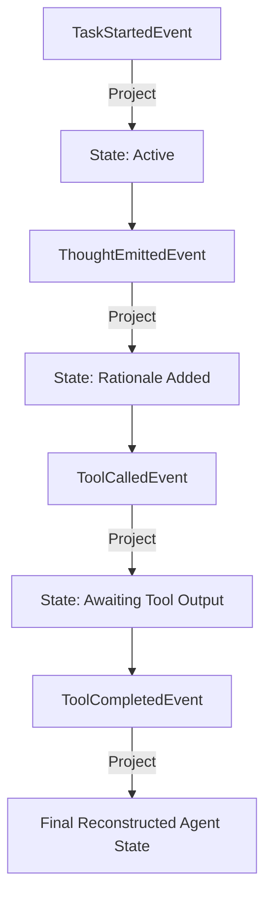

# Event-Sourced Agent Trajectories: Immutable Auditing for Distributed Swarms

In traditional software architectures, database state is typically managed using CRUD (Create, Read, Update, Delete) patterns. In this model, the database only stores the **current state** of a record. If a row is updated, the previous state is overwritten and lost forever.

When designing complex multi-agent swarms, CRUD database patterns are a major liability. If an agent fails after 15 tool execution steps, a simple state table cannot answer critical questions:
* *Why did the agent decide to call a specific tool at Step 8?*
* *What was the exact prompt context loaded from vector memory before the failure?*
* *How do we audit the decision lineage for legal or safety compliance?*

To solve this, production agent systems use **Event Sourcing**. Instead of storing the agent's current state, we record every intermediate thought, tool invocation, and handoff as a sequence of **immutable delta events**. This article explains how to build an event-sourced trajectory store for distributed swarms.

---

## The Event Sourcing Model

In an event-sourced agent architecture, the system state is reconstructed dynamically by reading the event stream from the beginning and applying each event to a blank state object—a process called **Projection**:



### Key Architectural Benefits
1. **100% Audit Trace**: Full execution history is preserved. Every decision is auditable down to the millisecond.
2. **Time-Travel Debugging**: Developers can replay any past execution path step-by-step to diagnose edge-case errors.
3. **Optimistic Concurrency**: Prevents concurrent database write conflicts by ensuring events are only appended, never modified.

---

## Python Trajectory Event Store & Projection

Here is a Python implementation of an event-sourced trajectory store, defining structured lifecycle events and demonstrating how to project the current aggregate state dynamically.

```python
import json
import uuid
from datetime import datetime
from typing import List, Dict, Any, Optional

# 1. Base Event Schema
class Event:
    def __init__(self, aggregate_id: str, event_type: str, data: Dict[str, Any]):
        self.event_id = str(uuid.uuid4())
        self.aggregate_id = aggregate_id
        self.event_type = event_type
        self.timestamp = datetime.utcnow().isoformat()
        self.data = data

    def to_json(self) -> str:
        return json.dumps(self.__dict__)

# 2. Reconstructed State Aggregate
class TrajectoryAggregate:
    def __init__(self, trajectory_id: str):
        self.trajectory_id = trajectory_id
        self.status = "IDLE"
        self.current_step = 0
        self.thoughts: List[str] = []
        self.executed_tools: List[str] = []
        self.results: Dict[str, Any] = {}
        self.final_response: Optional[str] = None

    def apply(self, event: Event) -> None:
        """
        State mutation logic. Modifies state based on event type.
        """
        self.current_step += 1
        
        if event.event_type == "TaskInitialized":
            self.status = "ACTIVE"
            print(f"[State Update] Task initialized: {event.data['query']}")
            
        elif event.event_type == "ThoughtEmitted":
            self.thoughts.append(event.data["thought"])
            print(f"[State Update] Thought recorded: {event.data['thought'][:40]}...")
            
        elif event.event_type == "ToolExecuted":
            tool_name = event.data["tool_name"]
            self.executed_tools.append(tool_name)
            self.results[tool_name] = event.data["output"]
            print(f"[State Update] Tool {tool_name} returned success.")
            
        elif event.event_type == "TaskCompleted":
            self.status = "COMPLETED"
            self.final_response = event.data["response"]
            print(f"[State Update] Aggregate completed with output: {self.final_response}")

# 3. Simple In-Memory Event Store
class EventStore:
    def __init__(self):
        self._streams: Dict[str, List[Event]] = {}

    def append(self, event: Event) -> None:
        if event.aggregate_id not in self._streams:
            self._streams[event.aggregate_id] = []
        self._streams[event.aggregate_id].append(event)

    def get_stream(self, aggregate_id: str) -> List[Event]:
        return self._streams.get(aggregate_id, [])

# Demonstration Execution
if __name__ == "__main__":
    store = EventStore()
    stream_id = str(uuid.uuid4())

    # Simulate agent generating events
    print("Agent generating trajectory events...")
    store.append(Event(stream_id, "TaskInitialized", {"query": "Find deadlocks in prod-db"}))
    store.append(Event(stream_id, "ThoughtEmitted", {"thought": "Query pg_stat_activity to inspect blocked queries"}))
    store.append(Event(stream_id, "ToolExecuted", {"tool_name": "run_sql", "output": {"blocked_pid": 1052, "blocking_pid": 84}}))
    store.append(Event(stream_id, "TaskCompleted", {"response": "Deadlock located at PID 1052 caused by transaction block at PID 84"}))

    # Reconstruct current state from event stream (Projection)
    print("\nProjecting state aggregate...")
    history = store.get_stream(stream_id)
    aggregate = TrajectoryAggregate(stream_id)
    
    for event in history:
        aggregate.apply(event)

    print(f"\nFinal State - Status: {aggregate.status}, Steps Evaluated: {aggregate.current_step}")
    print(f"Executed Tools: {aggregate.executed_tools}")
```

---

## Important Pitfalls in Event Sourcing

Keep these constraints in mind to ensure storage efficiency:

> [!IMPORTANT]
> **Event Stream Bloat**: Long-running agent swarms can generate thousands of micro-events (e.g. tracking character-by-character token streaming). Storing everything directly inside your database can lead to query latency spikes. Implement snapshotting—saving the aggregate state every 50 events—so the projection loop only needs to replay events generated *after* the latest snapshot.

> [!CAUTION]
> **Schema Versioning**: As your agent tools change, event payloads will change. Never modify existing historical events in your database. Instead, implement versioned event adapters (e.g. `ToolExecutedV2`) to handle old event schemas during projection loops.
