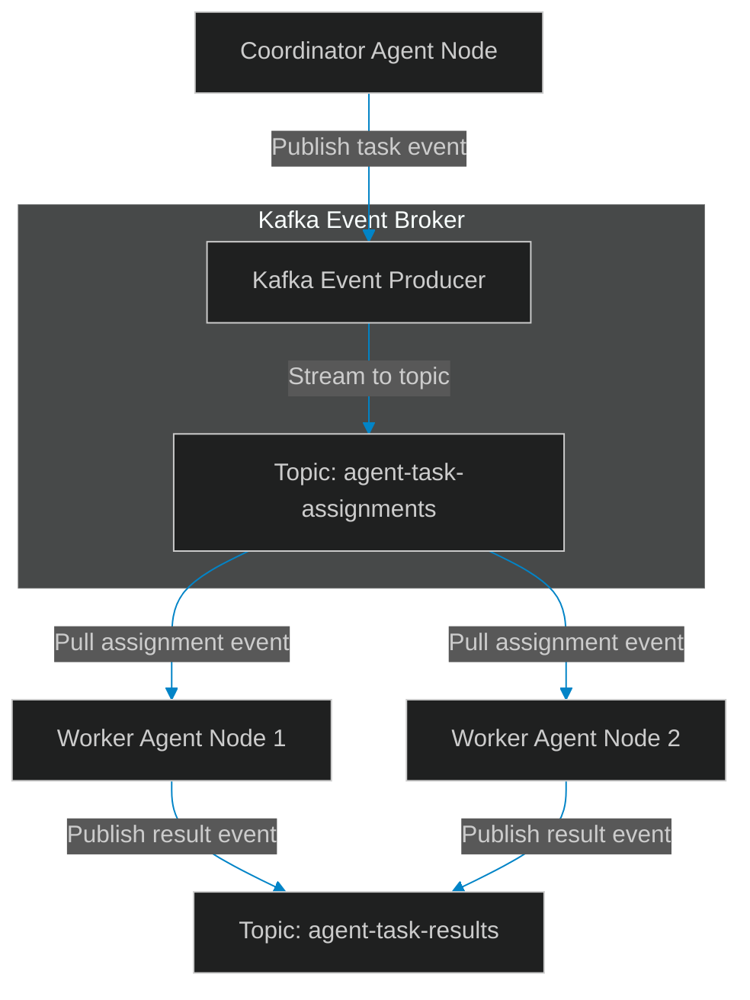

# Kafka Event Streams: Designing Event Schemas for Swarms

> [!NOTE]
> **📖 Article Overview**
> When multi-agent systems rely on synchronous HTTP API calls to communicate, they run into scaling bottlenecks. If a coordinator agent waits for three worker nodes to complete tasks, the coordinator's execution thread blocks, causing database timeouts and memory buildup. To build scalable, high-throughput systems, architects must transition to **Event-Driven Architectures**. By routing tasks and status logs asynchronously across Apache Kafka event streams, we decouple agent nodes. In this article, we design standardized event schemas and implement an async Kafka producer simulator in Python.

---

## The Bottleneck of Synchronous Swarms

In basic REST-based agent networks:
* **Blocking Thread Pools**: Coordinator servers freeze while waiting for slow LLM generations or web scraping queries to complete.
* **Tight Coupling**: Adding new observability workers or audit tools requires modifying the primary agent code, increasing regression risks.
* **The Solution**: **Kafka Message Streaming**. We route task status logs to shared Kafka topics. Downstream workers subscribe to relevant topics, enabling asynchronous parallel execution.



---

## 1. Structuring Standardized Event Schemas

To coordinate asynchronous messages:
* **Define Action Schemas**: Every message must conform to a strict JSON structure containing `event_type`, `correlation_id`, `source_node`, and `payload` variables.
* **Implement Partition Keys**: Partition topics using the `correlation_id` (task session key) to guarantee that related events are processed in order by single partitions.

---

## 2. Setting up Non-Blocking Producers

The event stream manager publishes events asynchronously:
1. **Queue Messages**: Store event payloads in a local buffer before flushing them to the broker.
2. **Execute Callbacks**: Trigger confirmation callbacks upon successful broker receipts to handle packet dropouts.

---

## Code Demo: Kafka Event Producer Simulator

Below is a Python implementation of an asynchronous event producer. It compiles JSON event payloads, simulates routing to Kafka topics, and handles delivery receipts.

```python
import time
import uuid
import json
from typing import Dict, Any, Tuple

class SimulatedKafkaProducer:
    def __init__(self, bootstrap_servers: str):
        self.bootstrap_servers = bootstrap_servers
        self.published_events: List[Dict[str, Any]] = []

    def compile_event_payload(self, event_type: str, source: str, payload_data: Dict[str, Any], correlation_id: str = None) -> Dict[str, Any]:
        # Structure standardized event message schema
        return {
            "event_id": str(uuid.uuid4()),
            "correlation_id": correlation_id or str(uuid.uuid4()),
            "event_type": event_type,
            "source_node": source,
            "timestamp_ms": int(time.time() * 1000),
            "payload": payload_data
        }

    def publish_to_topic(self, topic: str, key: str, value_event: Dict[str, Any]) -> Tuple[bool, str]:
        print(f"📡 [Kafka Producer] Publishing to topic '{topic}' | Key: {key[:8]}...")
        
        # Verify JSON serialization
        try:
            serialized_payload = json.dumps(value_event)
        except TypeError:
            return False, "Serialization Error: Payload is not JSON serializable."

        # Simulate OTLP network delay
        time.sleep(0.1)
        self.published_events.append(value_event)
        
        return True, f"Success: Offset 10{len(self.published_events)} acknowledged."

if __name__ == "__main__":
    producer = SimulatedKafkaProducer(bootstrap_servers="localhost:9092")

    print("🛡️ Initializing Kafka Event Producer Swarm...")
    print("-----------------------------------------------")

    # Compile a task assignment event
    correlation_key = str(uuid.uuid4())
    task_payload = {"task_id": "job_101", "instruction": "Analyze system performance database logs"}
    
    event = producer.compile_event_payload(
        event_type="TASK_ASSIGNED",
        source="orchestrator_agent",
        payload_data=task_payload,
        correlation_id=correlation_key
    )

    # Publish event to Kafka Topic
    success, receipt = producer.publish_to_topic(
        topic="agent-task-assignments",
        key=correlation_key,
        value_event=event
    )

    print("\n📈 --- Delivery Receipt Confirmation ---")
    print(f"Status: {success}")
    print(f"Receipt: {receipt}")
    print("\n--- Serialized Event Schema ---")
    print(json.dumps(event, indent=2))
```

---

## Event-Driven Takeaways

* **Standardize Message Structures**: Enforce strict JSON event schemas containing unique event and correlation IDs across all nodes.
* **Partition by Correlation ID**: Route related agent task events to the same partition using identical keys to guarantee ordering.
* **Buffer Messages Asynchronously**: Use background memory queue loops to stream metrics without blocking primary agent run threads.
