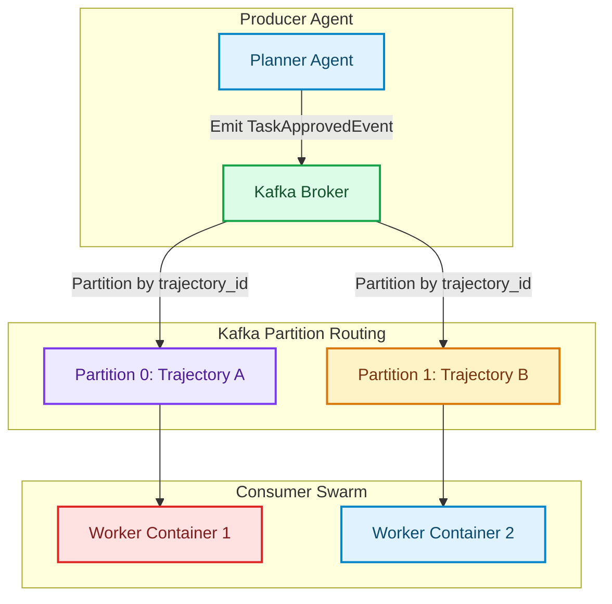

# Coordinating Swarms over Kafka: Partitioned Topics and Replay Security

In basic multi-agent systems, agents communicate using direct, synchronous HTTP calls or simple in-memory queues (like Python's `asyncio [1].Queue`). While this works for simple workflows, it creates critical bottlenecks in enterprise architectures:
1. **Coupling**: If the "Validator Agent" goes offline, the upstream "Writer Agent" blocks and fails immediately.
2. **No Scaling**: Direct calls cannot scale processing across multiple concurrent agent worker containers.
3. **No Execution Guarantee**: If a node crashes during a long-running computation, the execution state is lost.

To build resilient, highly scalable agent swarms, production systems use **Apache Kafka** as an event-driven telemetry and routing broker. This article details designing partitioned event topologies, propagating tracing context across asynchronous boundaries, and implementing replay security to manage duplicate messages.

---

## The Kafka Swarm Coordination Model

Rather than invoking downstream services directly, agents write status and command events to Kafka topics. Downstream workers subscribe to these topics and process events asynchronously:



### 1. Partitioned Topics for In-Order Execution
Kafka topics are divided into physical **partitions**. Messages inside a single partition are guaranteed to be read in the exact order they were written. 
* **The Pattern**: By using the `trajectory_id` as the Kafka message partition key, we guarantee that all execution steps for a specific task route to the exact same partition. Multiple workers can process different trajectories concurrently, but a single trajectory's events are processed sequentially by a single worker, preventing out-of-order execution bugs.

### 2. Context Propagation & Distributed Tracing
Because events cross thread and network boundaries, we must propagate tracing contexts (W3C traceparent headers) inside Kafka message metadata headers. This allows platforms (like OpenTelemetry or Langfuse) to reconstruct the full multi-agent execution path.

---

## Implementing a Resilient Kafka Agent Consumer

Here is a Python implementation of an event-driven Kafka consumer for agent swarms. It demonstrates context propagation and uses Redis-based idempotency checks to prevent duplicate execution (replay security).

```python
import json
import time
from typing import Dict, Any

# Mock Kafka Message Envelope
class KafkaMessage:
    def __init__(self, key: str, value: Dict[str, Any], headers: Dict[str, str]):
        self.key = key          # Partition key: trajectory_id
        self.value = value      # Event payload
        self.headers = headers  # Metadata (headers)

# Mock Redis Store for Idempotency
class RedisIdempotencyCache:
    def __init__(self):
        self._keys = set()

    def is_duplicate(self, idempotency_key: str) -> bool:
        if idempotency_key in self._keys:
            return True
        # Store key with a TTL in real Redis
        self._keys.add(idempotency_key)
        return False

class KafkaAgentConsumer:
    """
    Kafka consumer worker that processes agent events, enforces replay safety,
    and extracts tracing metadata headers.
    """
    def __init__(self, idempotency_cache: RedisIdempotencyCache):
        self.cache = idempotency_cache

    def consume_event(self, message: KafkaMessage) -> None:
        trajectory_id = message.key
        event_payload = message.value
        headers = message.headers

        # 1. Replay Security: Enforce uniqueness using message ID
        message_id = event_payload.get("message_id")
        if not message_id or self.cache.is_duplicate(message_id):
            print(f"[Replay Warning] Ignored duplicate event message: {message_id}")
            return

        # 2. Context Propagation: Extract OpenTelemetry traceparent headers
        traceparent = headers.get("traceparent", "00-00000000000000000000000000000000-0000000000000000-00")
        print(f"[Tracing] Active Span context parent initialized: {traceparent}")

        # 3. Process the event payload
        event_type = event_payload.get("event_type")
        print(f"[Worker] Processing event '{event_type}' for trajectory {trajectory_id}...")
        
        # Simulate agent execution work
        time.sleep(0.1)
        print(f"[Worker] Successfully processed event: {message_id}\n")

# Demonstration Usage
if __name__ == "__main__":
    cache = RedisIdempotencyCache()
    consumer = KafkaAgentConsumer(cache)

    # Prepare mock event
    event = {
        "message_id": "msg-8854-abcd-9988",
        "event_type": "ExecuteCodeBlock",
        "code": "print('Hello World')",
        "timestamp": 1784694200
    }
    
    headers = {
        "traceparent": "00-4bf92f3577b34da6a3ce929d0e0e4736-00f067aa0ba902b7-01"
    }

    msg1 = KafkaMessage(key="trajectory-1025", value=event, headers=headers)
    msg2 = KafkaMessage(key="trajectory-1025", value=event, headers=headers) # Duplicate replay

    # Process events
    print("Submitting first event...")
    consumer.consume_event(msg1)

    print("Submitting replay of the same event...")
    consumer.consume_event(msg2)
```

---

## Important Pitfalls in Kafka Swarm Coordination

Ensure your event-driven routing avoids these production issues:

> [!IMPORTANT]
> **Consumer Lag Rebalances**: If an agent takes too long to process a single event (e.g. waiting 60s for a complex local code execution run), Kafka may assume the consumer container crashed and trigger a partition rebalance. Always offload long-running computations to background threads or Celery tasks, returning control to the Kafka consumer loop immediately.

> [!CAUTION]
> **Out-of-Order Handoffs**: If you change the partition key format from `trajectory_id` to something arbitrary (like `agent_role`), events for the same task will route to different partitions, resulting in race conditions where Step 3 completes before Step 2. Keep the partition key strictly bound to the execution transaction. [2]

## References & Further Reading

1. **Mohan, C., et al. (1992)**. *ARIES: A Transaction Recovery Method Supporting Fine-Granularity Locking and Partial Rollbacks*. ACM TODS. [https://doi.org/10.1145/128765.128770](https://doi.org/10.1145/128765.128770)
2. **O'Neil, P., Cheng, E., Gawlick, D., & O'Neil, E. (1996)**. *The Log-Structured Merge-Tree (LSM-Tree)*. Acta Informatica. [https://www.cs.umb.edu/~poneil/lsmtree.pdf](https://www.cs.umb.edu/~poneil/lsmtree.pdf)
3. **PostgreSQL Global Development Group (2024)**. *PostgreSQL Documentation*. postgresql.org. [https://www.postgresql.org/docs/current/](https://www.postgresql.org/docs/current/)
4. **Kreps, J., Narkhede, N., & Rao, J. (2011)**. *Kafka: a Distributed Messaging System for Log Processing*. NetDB. [https://notes.stephenholiday.com/Kafka.pdf](https://notes.stephenholiday.com/Kafka.pdf)
5. **DeCandia, G., et al. (2007)**. *Dynamo: Amazon's Highly Available Key-value Store*. SOSP. [https://www.allthingsdistributed.com/files/amazon-dynamo-sosp2007.pdf](https://www.allthingsdistributed.com/files/amazon-dynamo-sosp2007.pdf)
6. **Carbone, P., et al. (2015)**. *Apache Flink: Stream and Batch Processing in a Single Engine*. IEEE Data Engineering Bulletin. [https://www.vldb.org/pvldb/vol8/p1970-carbone.pdf](https://www.vldb.org/pvldb/vol8/p1970-carbone.pdf)
