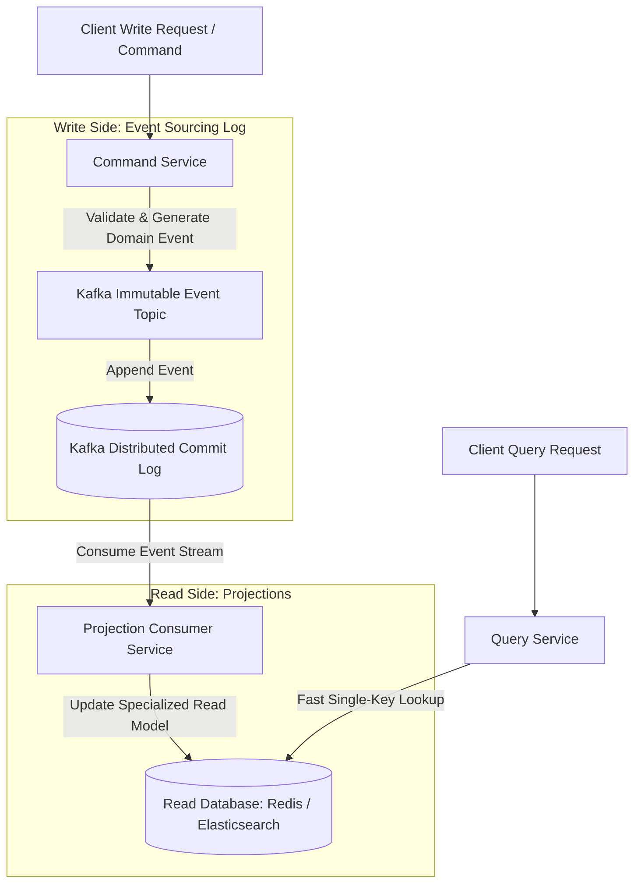

# Event-Driven Microservices: Designing CQRS & Event Sourcing with Kafka

In traditional CRUD database architectures, a single relational table serves both write operations and query reads. As application traffic scales to hundreds of thousands of operations per second, this unified model creates severe database lock contention. Complex analytical queries slow down concurrent write transactions, while normalized database schemas force heavy SQL JOIN operations during read requests.

To decouple high-volume write workloads from complex query patterns, software architects combine **Command Query Responsibility Segregation (CQRS)** with **Event Sourcing** over **Apache Kafka**.

Instead of overwriting current state in-place, Event Sourcing stores every state change as an immutable, append-only domain event. Kafka streams these events to distributed projection consumers that maintain specialized, fast read models.

This article details how to architect a CQRS and Event Sourcing system with Kafka.

---

## CQRS & Event Sourcing Pipeline Architecture

The flow of write commands, immutable event streams, and projected read models:



### Core Architectural Principles
1. **Command Side (Write)**: Accepts user intentions (e.g. `CreateOrderCommand`), validates business rules, and emits immutable domain events (e.g. `OrderCreatedEvent`). The command side never queries read database tables.
2. **Event Store (Kafka)**: Acts as the single source of truth. Events are appended sequentially into partitioned Kafka topics, preserving total ordering per partition key (such as `order_id`).
3. **Query Side (Read)**: Asynchronous consumer services consume the Kafka event stream and build optimized read views (such as denormalized JSON documents in Elasticsearch or key-value caches in Redis).

---

## Python Implementation: CQRS & Event Sourcing Engine

Here is a production-grade Python simulation of a CQRS and Event Sourcing engine. It handles command processing, appends immutable events to an event store, and projects optimized read models:

```python
import time
from typing import List, Dict, Any, Optional
from pydantic import BaseModel, Field

# 1. Define Immutable Domain Events
class DomainEvent(BaseModel):
    event_id: str
    aggregate_id: str
    event_type: str
    payload: Dict[str, Any]
    timestamp: float = Field(default_factory=time.time)

# 2. Command Models
class CreateOrderCommand(BaseModel):
    order_id: str
    customer_id: str
    items: List[Dict[str, Any]]
    total_amount: float

# 3. Write Side: Event Store & Command Handler
class OrderCommandHandler:
    def __init__(self, event_log: List[DomainEvent]):
        self.event_log = event_log

    def handle_create_order(self, cmd: CreateOrderCommand) -> DomainEvent:
        """Validates command business rules and generates OrderCreatedEvent."""
        if cmd.total_amount <= 0:
            raise ValueError("Order total amount must be positive!")

        event = DomainEvent(
            event_id=f"evt-{int(time.time() * 1000)}",
            aggregate_id=cmd.order_id,
            event_type="OrderCreated",
            payload={
                "customer_id": cmd.customer_id,
                "items": cmd.items,
                "total_amount": cmd.total_amount,
                "status": "CREATED"
            }
        )
        # Append to Event Store (Kafka Topic Simulation)
        self.event_log.append(event)
        print(f" 📝 [Command Handler] Emitted & Appended Event '{event.event_type}' for Order {cmd.order_id}")
        return event

# 4. Read Side: Projection Engine (Building Read View)
class OrderReadModelProjection:
    def __init__(self):
        # Denormalized Read Database (Simulating Redis / Mongo read cache)
        self.read_db: Dict[str, Dict[str, Any]] = {}

    def project_event(self, event: DomainEvent):
        """Asynchronously consumes events and updates read projections."""
        order_id = event.aggregate_id
        if event.event_type == "OrderCreated":
            self.read_db[order_id] = {
                "order_id": order_id,
                "customer_id": event.payload["customer_id"],
                "total_items": len(event.payload["items"]),
                "total_amount": event.payload["total_amount"],
                "status": event.payload["status"],
                "last_updated": event.timestamp
            }
            print(f" 🔮 [Read Projection] Materialized Read Model for Order {order_id}")

    def query_order(self, order_id: str) -> Optional[Dict[str, Any]]:
        """Fast read-side query without locks or complex joins."""
        return self.read_db.get(order_id)

# Demonstration Execution
if __name__ == "__main__":
    kafka_event_stream: List[DomainEvent] = []
    
    command_handler = OrderCommandHandler(kafka_event_stream)
    projection_engine = OrderReadModelProjection()

    print("🚀 Demonstrating CQRS & Event Sourcing Pipeline...")
    print("=" * 75)

    # 1. Client Issues Write Command
    cmd = CreateOrderCommand(
        order_id="ord-9901",
        customer_id="cust-402",
        items=[{"item": "Laptop", "price": 1200.0}, {"item": "Mouse", "price": 45.0}],
        total_amount=1245.0
    )
    event = command_handler.handle_create_order(cmd)

    # 2. Projection Consumer Consumes Event from Kafka
    projection_engine.project_event(event)

    # 3. Client Issues Read Query on Materialized Model
    print("\n🔍 Executing Fast Read-Side Query...")
    read_view = projection_engine.query_order("ord-9901")
    print(f" Result: {read_view}")
```

---

## CQRS & Event Sourcing Gotchas

When deploying CQRS and Event Sourcing with Kafka:

> [!IMPORTANT]
> **Account for Eventual Consistency**: Read projections update asynchronously after Kafka events are consumed. Clients querying the read database immediately after issuing a write command may read stale data. Design user interfaces to handle eventual consistency (e.g. optimistic UI updates or WebSocket push notifications).

> [!CAUTION]
> **Plan for Event Schema Evolution**: Over years of production, event payload structures inevitably change. Use schema registries (like Confluent Schema Registry with Avro/Protobuf) and version event types (`OrderCreatedV1`, `OrderCreatedV2`) to ensure projection consumers do not crash on historical events.

---

## Real-World Enterprise Impact
Teams deploying CQRS and Event Sourcing with Kafka report:
* **10x Write Throughput**: Appending events to partitioned Kafka logs eliminates relational database row locks.
* **Audit-Proof System History**: Retaining immutable event logs provides complete audit trails and enables rebuilding new read models from scratch at any time.
