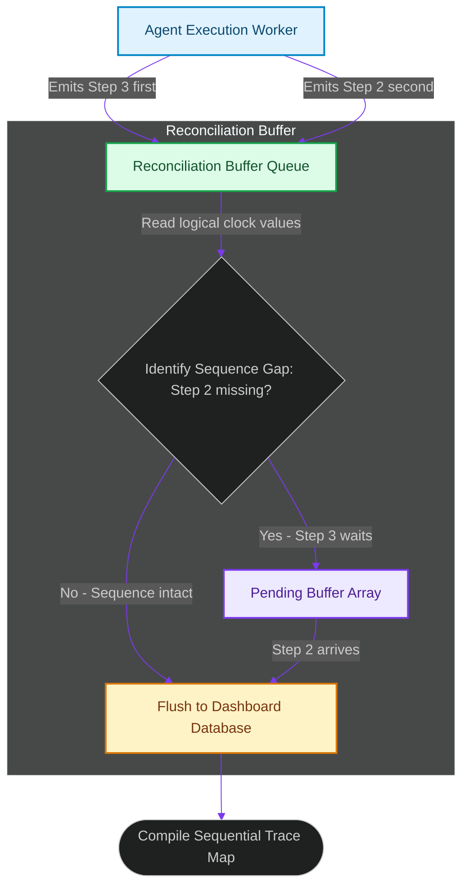

# Out-of-Order Message Reconciliation: Managing Async Event Timing Inconsistencies

> [!NOTE]
> **📖 Article Overview**
> While asynchronous event streams allow multi-agent swarms to execute tasks concurrently, they introduce a fundamental distributed systems bug: **Out-of-Order Execution Logs**. In a concurrent environment, an event emitted during step 3 of a task might arrive at the aggregation server before step 2 finishes due to network path variances or partition queue delays. If logs are saved flatly, user dashboards display scrambled, nonsensical histories. To maintain trace consistency, developers use **Vector Clock Reconciliation**. In this article, we design an event reconciliation queue in Python that re-orders async payloads dynamically using vector timestamps.

---

## The Chaos of Async Event Arrival

In concurrent event networks:
* **The Chronological Scramble**: Distributed worker nodes send telemetry logs asynchronously [1]. Physical clock drift prevents depending solely on server timestamps.
* **Corrupted State Replays**: Visualizing debug traces is impossible if tool-returned values appear inside parent timelines before the tool's call event is registered.
* **The Solution**: **Vector Clock Reconciliation**. We attach sequential version integers (logical clocks) representing agent states to each event. The aggregation queue buffers out-of-order payloads and reconstructs histories sequentially.



---

## 1. Defining Logical Vector Timestamps

To track causality:
* **Maintain Logical Sequences**: Tag each agent-emitted log payload with a sequence integer (e.g. `sequence_id = 2`).
* **Identify Missing Nodes**: If the incoming message's `sequence_id` does not match the active target pointer (e.g., received `3` but target is `2`), hold the payload.

---

## 2. Setting up the Reconciliation Queue

The reconciliation manager coordinates message ordering:
1. **Queue out-of-order items**: Store out-of-sequence logs in a temporary memory dictionary.
2. **Flush continuous segments**: As soon as the missing sequence number arrives, flush it and all subsequent consecutive stored messages in a batch.

---

## Code Demo: Vector Clock Reconciliation Queue

Below is a Python implementation of an event-reordering reconciliation queue. It buffers out-of-order events, sorts logical sequences, and flushes sequential timelines.

```python
import json
from typing import List, Dict, Any

class VectorReconciliationQueue:
    def __init__(self):
        # The expected next sequence integer to process
        self.next_sequence_id = 1
        # Temporary memory buffer for out-of-order payloads
        self.pending_buffer: Dict[int, Dict[str, Any]] = {}
        self.committed_logs: List[Dict[str, Any]] = []

    def ingest_event(self, event: Dict[str, Any]):
        seq_id = event.get("sequence_id")
        if not seq_id:
            print("⚠️ [Reconciliation] Ignored event: missing sequence_id.")
            return

        print(f"📥 [Ingest] Received Event: '{event['step']}' (Seq ID: {seq_id})")

        # 1. Store event in pending buffer
        self.pending_buffer[seq_id] = event

        # 2. Flush continuous sequence segments starting at next_sequence_id
        while self.next_sequence_id in self.pending_buffer:
            ready_event = self.pending_buffer.pop(self.next_sequence_id)
            self.committed_logs.append(ready_event)
            print(f"   🚀 [Commit] Committed Sequence {self.next_sequence_id}: '{ready_event['step']}'")
            self.next_sequence_id += 1

if __name__ == "__main__":
    reconciler = VectorReconciliationQueue()

    # Simulated trace events arriving out-of-order due to concurrent networks
    out_of_order_events = [
        {"sequence_id": 3, "step": "3. Execute Code Command", "payload": "exit_code=0"},
        {"sequence_id": 1, "step": "1. Compile Goal DAG", "payload": "nodes=3"},
        # Sequence 2 arrives last (causing sequence 3 to be held in buffer first)
        {"sequence_id": 2, "step": "2. Run Syntax Sanity check", "payload": "pass=True"}
    ]

    print("🛡️ Processing Vector Clock Reconciliation Pipeline...")
    print("-----------------------------------------------------")

    for event in out_of_order_events:
        reconciler.ingest_event(event)
        print(f"   [Buffer State] Pending count: {len(reconciler.pending_buffer)}\n")

    print("📈 --- Final Committed Chronological Trace ---")
    for log in reconciler.committed_logs:
        print(f"    Seq {log['sequence_id']}: {log['step']} | Payload: {log['payload']}")
```

---

## Message Reconciliation Takeaways

* **Implement Logical Sequence Keys**: Always include sequential sequence integers in agent event headers.
* **Buffer Gaps in Memory**: Hold higher-sequence items in a temporary buffer when a gap is identified in incoming data.
* **Flush Sequential Logs**: Flush buffered logs in batches only after the missing sequence keys arrive to keep trace outputs clear. [2]

## References & Further Reading

1. **Axboe, J. (2019)**. *Efficient IO with io_uring*. kernel.dk. [https://kernel.dk/io_uring.pdf](https://kernel.dk/io_uring.pdf)
2. **Linux Kernel Community (2024)**. *BPF Documentation*. kernel.org. [https://docs.kernel.org/bpf/](https://docs.kernel.org/bpf/)
3. **Høiland-Jørgensen, T., et al. (2018)**. *The eXpress Data Path: Fast Programmable Packet Processing in the Operating System Kernel*. CoNEXT. [https://dl.acm.org/doi/10.1145/3281411.3281443](https://dl.acm.org/doi/10.1145/3281411.3281443)
4. **Cytron, R., et al. (1991)**. *Efficiently Computing Static Single Assignment Form and the Control Dependence Graph*. ACM TOPLAS. [https://doi.org/10.1145/115372.115320](https://doi.org/10.1145/115372.115320)
5. **Lattner, C., & Adve, V. (2004)**. *LLVM: A Compilation Framework for Lifelong Program Analysis & Transformation*. CGO. [https://llvm.org/pubs/2004-01-30-CGO-LLVM.pdf](https://llvm.org/pubs/2004-01-30-CGO-LLVM.pdf)
6. **V8 Team (2024)**. *V8 Orinoco and Garbage Collection*. v8.dev. [https://v8.dev/blog](https://v8.dev/blog)
