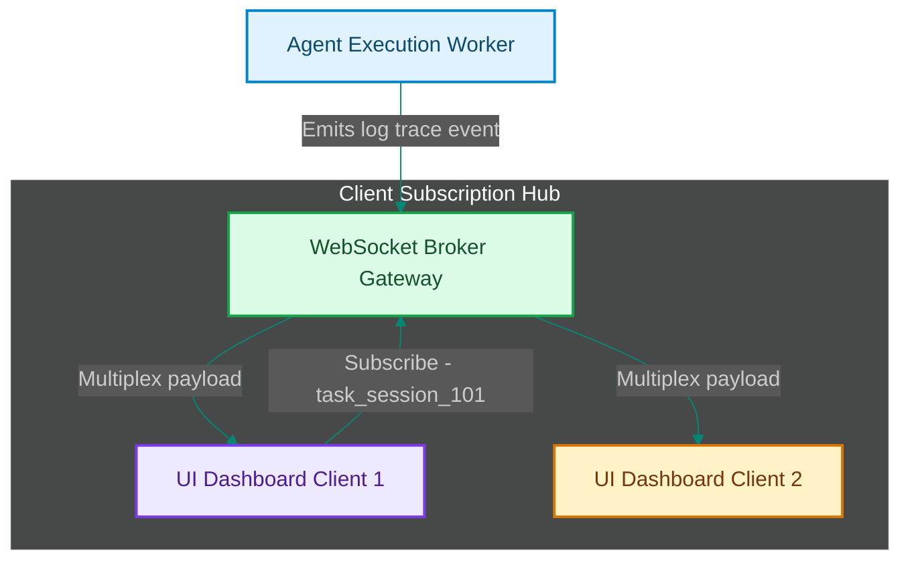

# WebSocket Broker Gateways: Streaming Live Agent Status Updates to UI Clients

> [!NOTE]
> **📖 Article Overview**
> Running asynchronous agent tasks introduces a user-experience challenge: users dislike blank screens or loading indicators that spin for minutes while models generate responses. To build interactive user interfaces, developers must stream agent actions (thoughts, tool runs, token metrics) in real time. Standard polling APIs generate excessive database load. To stream telemetry efficiently, teams implement **WebSocket Broker Gateways**. By establishing persistent, bi-directional connections, we multiplex log events directly to dashboards. In this article, we implement an asynchronous WebSocket event broker gateway in Python.

---

## The Efficiency of WebSocket Gateways

In legacy status tracking configurations:
* **Database Thrashing**: Hundreds of UI clients polling HTTP status endpoints every second degrades database read speeds [1].
* **Delayed Feedback**: Users see execution updates seconds after they occur, degrading the interactive feel.
* **The Solution**: **WebSocket Event Brokers**. We establish persistent TCP sockets using WebSockets. When an agent emits a step execution trace event, the gateway routes the event payload immediately to all subscribed clients.



---

## 1. Multiplexing Subscriber Channels

To route WebSocket updates:
* **Channel Subscriptions**: Track client sockets using connection registries categorized by task session IDs (e.g. `channel_user_id`).
* **Clean Disconnections**: Ensure sockets are removed from subscriber lists during timeouts or window closures to prevent memory leaks.

---

## 2. Setting up Non-Blocking Event Loops

The WebSocket gateway manages traffic inside an async event loop:
1. **Asynchronous Ingestion**: Read agent events using non-blocking queues (e.g. `asyncio.Queue`).
2. **Broadcast Batching**: Stream events immediately without waiting for HTTP response codes.

---

## Code Demo: WebSocket Telemetry Broker

Below is a Python implementation of an asynchronous WebSocket broker gateway. It manages connection channels, parses subscription commands, and simulates streaming trace logs to clients.

```python
import asyncio
import json
from typing import Dict, Set, Any

class WebSocketTelemetryBroker:
    def __init__(self):
        # Maps channel names (session IDs) to subscriber socket sets
        self.channels: Dict[str, Set[str]] = {}

    def subscribe_client(self, client_id: str, channel_id: str):
        if channel_id not in self.channels:
            self.channels[channel_id] = set()
        self.channels[channel_id].add(client_id)
        print(f"🔌 [WebSocket] Client '{client_id}' subscribed to channel: '{channel_id}'")

    def unsubscribe_client(self, client_id: str, channel_id: str):
        if channel_id in self.channels:
            self.channels[channel_id].discard(client_id)
            if not self.channels[channel_id]:
                del self.channels[channel_id]
            print(f"🔌 [WebSocket] Client '{client_id}' unsubscribed from channel: '{channel_id}'")

    async def broadcast_event_to_channel(self, channel_id: str, event_data: Dict[str, Any]):
        subscribers = self.channels.get(channel_id, set())
        if not subscribers:
            return

        print(f"\n📡 [WebSocket Broker] Broadcasting to channel '{channel_id}' ({len(subscribers)} clients):")
        
        # Simulate sending events asynchronously to all connected client sockets
        for client in subscribers:
            await asyncio.sleep(0.01) # Simulate non-blocking network socket output
            print(f"   ✈️ Pushed event to '{client}' | Step: {event_data.get('step')} | Status: {event_data.get('status')}")

if __name__ == "__main__":
    broker = WebSocketTelemetryBroker()

    async def run_simulation():
        print("🛡️ Starting WebSocket Telemetry Broker Gateway...")
        print("-------------------------------------------------")

        # 1. Simulate client browser socket connections subscribing to task session
        session_id = "task_run_xyz"
        broker.subscribe_client(client_id="browser_conn_1", channel_id=session_id)
        broker.subscribe_client(client_id="browser_conn_2", channel_id=session_id)

        # 2. Simulate agent worker emitting execution trace logs
        trace_log_1 = {"step": "1. Research Goal", "status": "COMPLETED", "tokens": 850}
        trace_log_2 = {"step": "2. Generate Schema", "status": "IN_PROGRESS", "tokens": 1200}

        await broker.broadcast_event_to_channel(session_id, trace_log_1)
        await broker.broadcast_event_to_channel(session_id, trace_log_2)

        # 3. Simulate client closing browser tab
        broker.unsubscribe_client(client_id="browser_conn_1", channel_id=session_id)

    asyncio.run(run_simulation())
```

---

## WebSocket Gateway Takeaways

* **Decouple Ingestion from Broadcast**: Buffer agent log traces in queues before routing them to client connections.
* **Manage Connection Registries**: De-allocate inactive sockets immediately to protect server memory.
* **Provide Structured Channels**: Partition subscriptions by task session IDs to avoid routing irrelevant logs to users. [2]

## References & Further Reading

1. **Lamport, L. (1978)**. *Time, Clocks, and the Ordering of Events in a Distributed System*. CACM. [https://lamport.azurewebsites.net/pubs/time-clocks.pdf](https://lamport.azurewebsites.net/pubs/time-clocks.pdf)
2. **Gilbert, S., & Lynch, N. (2002)**. *Brewer's Conjecture and the Feasibility of Consistent, Available, Partition-Tolerant Web Services*. ACM SIGACT News. [https://web.mit.edu/6.033/www/papers/p80-gilbert.pdf](https://web.mit.edu/6.033/www/papers/p80-gilbert.pdf)
3. **OpenTelemetry Authors (2024)**. *OpenTelemetry Specification*. CNCF. [https://opentelemetry.io/docs/specs/otel/](https://opentelemetry.io/docs/specs/otel/)
