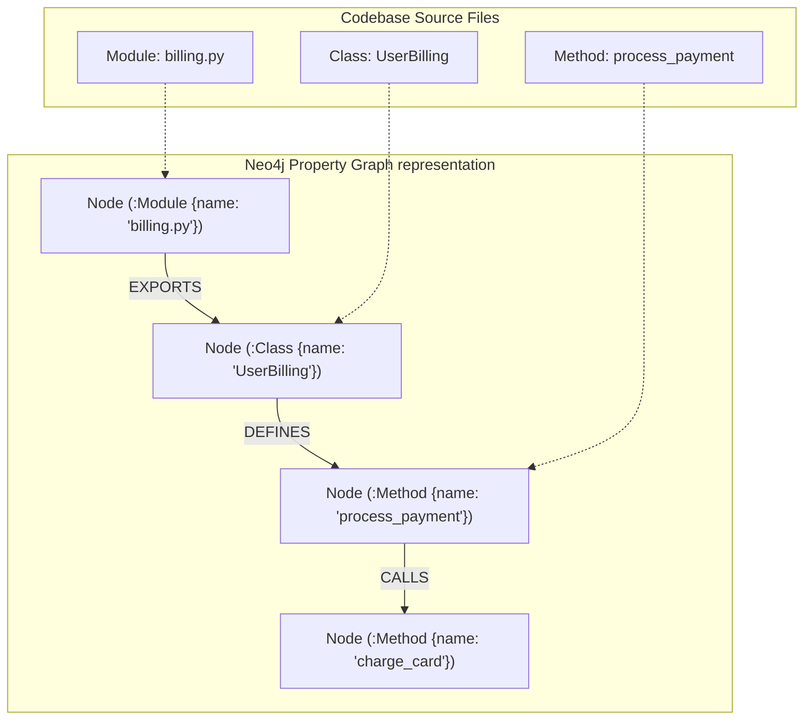

# Extracting Code AST Knowledge Graphs with Neo4j & Cypher

To build software engineering agents capable of reasoning about multi-file codebases, we must provide them with a structured, queryable model of the code's architecture. While flat file vectors allow simple lexical lookups, they completely fail at tracking structural dependencies across modules.

A robust solution is to parse source repositories into an **Abstract Syntax Tree (AST)** and ingest the resulting entity-relationship network into a graph database like **Neo4j**.

Once codebase entities (classes, methods, modules) and relations (`CALLS`, `INHERITS`, `IMPORTS`) are stored as property graphs, agents can use **Cypher** queries to inspect dependency trees, audit security side effects, and map architectural pathways.

This article details how to extract AST metadata and populate a Neo4j knowledge graph using Python.

---

## AST-to-Neo4j Property Schema

The code parser translates Abstract Syntax Tree components directly into nodes and edges within the graph database:



### Ingestion Node & Edge Definitions

* **Nodes**:
  * `(:Module {filepath: string})`: Represents a physical source code file.
  * `(:Class {name: string, docstring: string})`: Represents a class declaration.
  * `(:Method {name: string, is_async: boolean})`: Represents a class method or standard function.
* **Relationship Edges**:
  * `[:IMPORTS]`: Links a module to its imported dependencies.
  * `[:DEFINES]`: Maps modules to classes, and classes to methods.
  * `[:INHERITS]`: Captures parent-child class hierarchies.
  * `[:CALLS]`: Connects calling functions to their targets, establishing the invocation network.

---

## Python Implementation: AST-to-Neo4j Exporter

Here is a production Python implementation using Python's native `ast` module and the official `neo4j` driver. It extracts structural entity relations from a source code string and generates Cypher query transactions to populate a Neo4j database:

```python
import ast
from typing import List, Dict, Any
from pydantic import BaseModel
# Note: In production, install via: pip install neo4j
# from neo4j import GraphDatabase 

class GraphNodeSpec(BaseModel):
    label: str  # Module, Class, Method
    properties: Dict[str, Any]

class GraphEdgeSpec(BaseModel):
    source_id: str
    target_id: str
    rel_type: str  # DEFINES, CALLS, INHERITS

class CodeBaseGraphExtractor:
    """
    Parses source code files via AST and generates specifications
    for Neo4j graph nodes and relationship edges.
    """
    def __init__(self, filepath: str):
        self.filepath = filepath
        self.nodes: List[GraphNodeSpec] = []
        self.edges: List[GraphEdgeSpec] = []

    def parse_code(self, source_code: str):
        tree = ast.parse(source_code)
        
        # 1. Create Module Node
        module_id = self.filepath
        self.nodes.append(GraphNodeSpec(
            label="Module",
            properties={"id": module_id, "filepath": self.filepath}
        ))

        # 2. Traverse Class Definitions
        for node in ast.walk(tree):
            if isinstance(node, ast.ClassDef):
                class_id = f"{self.filepath}::{node.name}"
                self.nodes.append(GraphNodeSpec(
                    label="Class",
                    properties={"id": class_id, "name": node.name}
                ))
                self.edges.append(GraphEdgeSpec(
                    source_id=module_id, target_id=class_id, rel_type="DEFINES"
                ))

                # Track Inheritance
                for base in node.bases:
                    if isinstance(base, ast.Name):
                        self.edges.append(GraphEdgeSpec(
                            source_id=class_id, target_id=base.id, rel_type="INHERITS"
                        ))

                # Traverse Methods within Class
                for subnode in node.body:
                    if isinstance(subnode, ast.FunctionDef):
                        method_id = f"{class_id}::{subnode.name}"
                        self.nodes.append(GraphNodeSpec(
                            label="Method",
                            properties={"id": method_id, "name": subnode.name}
                        ))
                        self.edges.append(GraphEdgeSpec(
                            source_id=class_id, target_id=method_id, rel_type="DEFINES"
                        ))

            # 3. Track Standalone Functions
            elif isinstance(node, ast.FunctionDef) and not self._is_inside_class(node, tree):
                func_id = f"{self.filepath}::{node.name}"
                self.nodes.append(GraphNodeSpec(
                    label="Method",
                    properties={"id": func_id, "name": node.name}
                ))
                self.edges.append(GraphEdgeSpec(
                    source_id=module_id, target_id=func_id, rel_type="DEFINES"
                ))

    def _is_inside_class(self, node: ast.FunctionDef, tree: ast.AST) -> bool:
        # Check parents to confirm if function is defined inside a ClassDef
        for parent in ast.walk(tree):
            if isinstance(parent, ast.ClassDef):
                if node in parent.body:
                    return True
        return False

    def push_to_neo4j(self, driver_session):
        """
        Executes Cypher transactions to write specs into Neo4j database.
        """
        # Ingest Nodes
        for node in self.nodes:
            cypher = f"""
            MERGE (n:{node.label} {{id: $props.id}})
            SET n += $props
            """
            driver_session.run(cypher, props=node.properties)

        # Ingest Edges
        for edge in self.edges:
            cypher = f"""
            MATCH (a {{id: $source_id}})
            MATCH (b {{id: $target_id}})
            MERGE (a)-[r:{edge.rel_type}]->(b)
            """
            driver_session.run(cypher, source_id=edge.source_id, target_id=edge.target_id)

# Demonstration Execution
if __name__ == "__main__":
    sample_code = """
import os

class UserBilling(BaseBilling):
    def process_payment(self, amount):
        gateway = self.get_gateway()
        gateway.charge(amount)

    def get_gateway(self):
        return "Stripe"
"""
    extractor = CodeBaseGraphExtractor("billing.py")
    extractor.parse_code(sample_code)

    print("🔍 Extracted Nodes:")
    for n in extractor.nodes:
        print(f"  [{n.label}] {n.properties}")

    print("\n🔗 Extracted Edges:")
    for e in extractor.edges:
        print(f"  {e.source_id} --({e.rel_type})--> {e.target_id}")
```

---

## Tracing Dependency Chains with Cypher

Once ingested, engineers and agents can query the property graph using Cypher.

> [!TIP]
> **Find All Classes Inheriting from a Base Class**:
> ```cypher
> MATCH (child:Class)-[:INHERITS]->(parent:Class {name: 'BaseBilling'})
> RETURN child.name
> ```

> [!IMPORTANT]
> **Find the Dependency Chain of Call Instructions**:
> To trace if Method `process_payment` recursively triggers methods in other classes:
> ```cypher
> MATCH path = (m:Method {name: 'process_payment'})-[:CALLS*1..3]->(target:Method)
> RETURN path
> ```

---

## Important Ingestion Guardrails

When extracting codebase knowledge graphs:

> [!IMPORTANT]
> **Resolve Dynamic Calls Offline**: Abstract Syntax Trees parse static code calls (`gateway.charge()`). They cannot resolve dynamic runtime targets where the concrete class depends on configuration. Supplement static AST edges with dynamic trace logs or runtime instrumentation when available.

> [!CAUTION]
> **Isolate Large Ingestions with Transaction Batching**: Ingesting a large repository with thousands of modules in a single transaction can block Neo4j database locks. Segment parsing tasks and run Cypher queries in batches of 500 nodes.

---

## Real-World Enterprise Impact
Teams deploying AST Neo4j Code Graphs report:
* **Instant Structural Auditing**: Agents track architectural side effects across thousands of files in milliseconds instead of reading file texts sequentially.
* **Accurate Code Refactoring**: Visualizing call graphs helps prevent circular imports and broken references during codebase changes.
