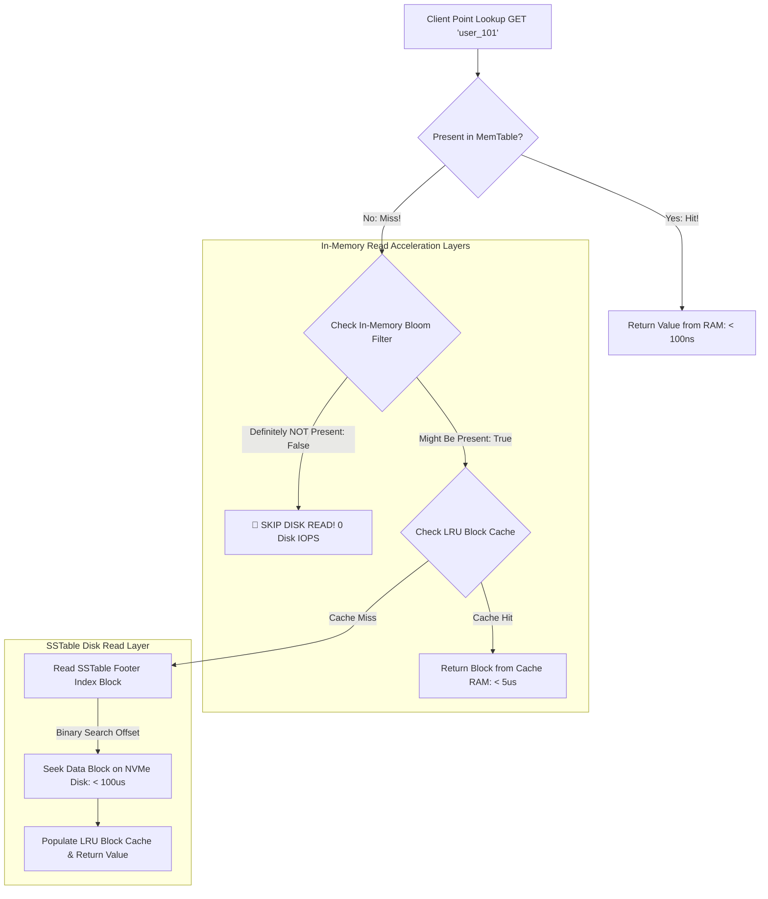

# Fast Point Lookups: Block Cache, Index Block & Counting Bloom Filters

While Log-Structured Merge-Tree (LSM-Tree) storage engines (**RocksDB**, **LevelDB**) excel at high-throughput write workloads, point lookups (`GET key`) face an inherent structural challenge: **Read Amplification**.

If a requested key is not present in the active in-memory MemTable, the database must search across multiple immutable Sorted String Table (SSTable) files on disk.

Scanning every SSTable file on disk for a non-existent key results in devastating read latency spikes (issuing tens of disk I/O operations per query).

To achieve sub-millisecond point lookup latencies, high-performance storage engines employ a **3-Tier Read Acceleration Stack**: **In-Memory Bloom Filters**, **SSTable Index Blocks**, and **Block Caches**.

This article details Bloom Filter bit-array mathematics, binary search Index Blocks, and LRU Block Caching.

---

## LSM-Tree Fast Read Acceleration Pipeline

How Bloom Filters, Index Blocks, and Block Caches intercept read queries before touching disk:



### Core Read Acceleration Mechanics
1. **Counting / Bit-Array Bloom Filters**: A probabilistic data structure stored entirely in RAM alongside each SSTable file. A Bloom filter uses $k$ independent hash functions to set bits in an $m$-bit array:
   * **If Bloom Filter returns `False`**: The key is **guaranteed NOT to exist** in that SSTable. The storage engine skips reading that SSTable file completely (0 disk IOPS!).
   * **If Bloom Filter returns `True`**: The key *might* exist (with a controlled false-positive probability, e.g. $1\%$). The engine proceeds to inspect the SSTable's Index Block.
2. **SSTable Index Blocks**: Located in the trailing footer of each SSTable file. Instead of scanning an entire $64\text{ MB}$ SSTable sequentially, the Index Block contains a sparse directory mapping the highest key of each $4\text{ KB}$ data block to its exact byte offset. The storage engine performs an $O(\log N)$ **binary search** on the Index Block to locate the exact $4\text{ KB}$ data block.
3. **Block Cache (LRU / Clock Cache)**: Maintains recently accessed uncompressed $4\text{ KB}$ data blocks in RAM. If consecutive queries read keys within the same data block, the Block Cache hits, completely bypassing disk I/O.

---

## Python Implementation: Fast LSM Point Lookup Engine

Here is a production-grade Python implementation of an LSM Read Acceleration Pipeline featuring a Counting Bloom Filter, Index Block Binary Search, and LRU Block Cache:

```python
import mmh3
from typing import List, Dict, Tuple, Optional
from pydantic import BaseModel

class BloomFilter:
    """
    In-memory Bit-Array Bloom Filter using MurmurHash3.
    """
    def __init__(self, size_bits: int = 256, num_hashes: int = 3):
        self.size_bits = size_bits
        self.num_hashes = num_hashes
        self.bit_array = [0] * size_bits

    def add(self, key: str):
        for seed in range(self.num_hashes):
            idx = mmh3.hash(key, seed) % self.size_bits
            self.bit_array[idx] = 1

    def contains(self, key: str) -> bool:
        for seed in range(self.num_hashes):
            idx = mmh3.hash(key, seed) % self.size_bits
            if self.bit_array[idx] == 0:
                return False  # DEFINITELY NOT PRESENT!
        return True  # MIGHT BE PRESENT

class LRUBlockCache:
    """
    Simple Least-Recently Used (LRU) Block Cache for 4KB Data Blocks.
    """
    def __init__(self, capacity: int = 2):
        self.capacity = capacity
        self.cache: Dict[str, Dict[str, str]] = {}
        self.lru_order: List[str] = []

    def get(self, block_id: str) -> Optional[Dict[str, str]]:
        if block_id in self.cache:
            self.lru_order.remove(block_id)
            self.lru_order.append(block_id)
            return self.cache[block_id]
        return None

    def put(self, block_id: str, block_data: Dict[str, str]):
        if block_id in self.cache:
            self.lru_order.remove(block_id)
        elif len(self.cache) >= self.capacity:
            evict = self.lru_order.pop(0)
            del self.cache[evict]
            print(f" 🧹 [LRU Cache] Evicted Block '{evict}' from RAM Cache.")
        self.cache[block_id] = block_data
        self.lru_order.append(block_id)

class FastLSMPointLookupEngine:
    """
    Executes Accelerated Point Lookups across Bloom Filters, Index Blocks, and Block Cache.
    """
    def __init__(self, sstable_data: Dict[str, Dict[str, str]]):
        self.sstable_data = sstable_data  # {block_id: {key: val}}
        self.bloom_filter = BloomFilter(size_bits=256, num_hashes=3)
        self.index_block: List[Tuple[str, str]] = []  # [(last_key, block_id)]
        self.block_cache = LRUBlockCache(capacity=2)

        # Build Bloom Filter & Index Block
        for block_id, records in sstable_data.items():
            last_key = ""
            for k in records.keys():
                self.bloom_filter.add(k)
                last_key = k
            self.index_block.append((last_key, block_id))
        self.index_block.sort(key=lambda x: x[0])

    def point_lookup(self, key: str) -> Optional[str]:
        print(f"\n🔍 Point Lookup for Key: '{key}'")

        # Step 1: In-Memory Bloom Filter Check
        if not self.bloom_filter.contains(key):
            print(" 🚫 [Bloom Filter] Returned FALSE -> Key DEFINITELY NOT PRESENT! Skipping disk scan (0 IOPS).")
            return None

        print(" 🟢 [Bloom Filter] Returned TRUE -> Key MIGHT be present!")

        # Step 2: Binary Search Index Block for Target Data Block ID
        target_block_id = None
        for max_key, block_id in self.index_block:
            if key <= max_key:
                target_block_id = block_id
                break

        if not target_block_id:
            print(" ❌ [Index Block] Key exceeds all block bounds.")
            return None

        # Step 3: Check LRU Block Cache
        cached_block = self.block_cache.get(target_block_id)
        if cached_block:
            print(f" ⚡ [Block Cache HIT] Loaded Data Block '{target_block_id}' from RAM Cache!")
            return cached_block.get(key)

        # Step 4: Fallback to Disk Read
        print(f" 💾 [Disk Read] Fetching Data Block '{target_block_id}' from NVMe Disk...")
        disk_block = self.sstable_data[target_block_id]
        self.block_cache.put(target_block_id, disk_block)
        return disk_block.get(key)

# Demonstration Execution
if __name__ == "__main__":
    # Mock SSTable with 3 Data Blocks
    mock_sstable = {
        "block_0": {"apple": "red", "banana": "yellow"},
        "block_1": {"cherry": "dark_red", "date": "brown"},
        "block_2": {"elderberry": "purple", "fig": "green"}
    }

    engine = FastLSMPointLookupEngine(mock_sstable)

    print("🚀 Demonstrating Fast LSM Point Lookup Read Pipeline...")
    print("=" * 75)

    # 1. Lookup Non-Existent Key -> Intercepted by Bloom Filter (0 Disk IOPS!)
    res1 = engine.point_lookup("watermelon")

    # 2. Lookup Existing Key -> Disk Read & Populates Block Cache
    res2 = engine.point_lookup("cherry")
    print(f"   • Result: {res2}")

    # 3. Lookup Key in Same Data Block -> Hits Block Cache (0 Disk IOPS!)
    res3 = engine.point_lookup("date")
    print(f"   • Result: {res3}")
```

---

## Read Acceleration Gotchas & Best Practices

When tuning LSM read path performance:

> [!IMPORTANT]
> **Use Ribbon Filters for 30% Space Savings**: Standard Bloom filters require 10 bits per key to achieve a 1% false-positive rate. Upgrading to **Ribbon Filters** (used in modern RocksDB) achieves identical false-positive rates with $30\%$ lower memory footprint.

> [!CAUTION]
> **Avoid Large Uncompressed Data Blocks**: Setting data block sizes too large (e.g. $1\text{ MB}$ blocks instead of $4\text{ KB}$) causes massive Block Cache thrashing, as loading a single key requires caching megabytes of unneeded neighbour records.

---

## Real-World Enterprise Impact
Storage engines deploying Bloom Filters, Index Blocks, and Block Caches (such as **RocksDB** and **LevelDB**) report:
* **Over 99% Reduction in Disk Reads for Negative Queries**: Intercepting non-existent key lookups via Bloom filters saves millions of unnecessary disk IOPS daily.
* **Sub-100 Microsecond p99 Read Latencies**: Servicing repeated point lookups directly from LRU Block Cache matches in-memory database performance.
