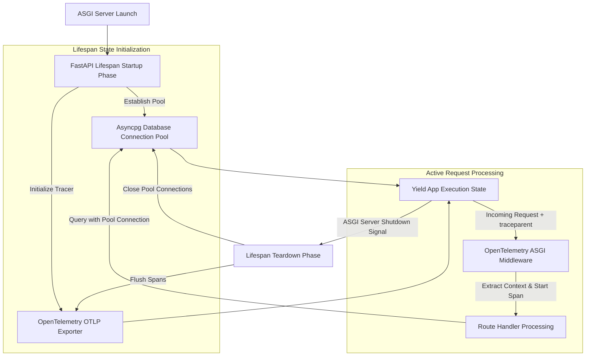

# Distributed Observability: OpenTelemetry & Lifespan Event Handling

In distributed microservice architectures, tracking request lifecycles as they navigate across multiple API gateways, database pools, and asynchronous workers is essential for maintaining uptime. A failure or latency spike in a downstream service must be instantly traceable back to the originating HTTP request.

Modern FastAPI applications manage global application state and connection resources using **Lifespan Handlers** (`asynccontextmanager`), replacing legacy startup/shutdown event hooks.

By combining FastAPI lifespan state management with **OpenTelemetry middleware**, developers can instrument zero-downtime resource pooling and propagate W3C distributed tracing contexts across microservice boundaries.

This article details how to construct an production-ready observable FastAPI service.

---

## Lifespan Resource & Tracing Architecture

The execution lifecycle of a FastAPI service managed by async lifespan generators and OpenTelemetry context propagation:



### Lifespan vs. Legacy Event Hooks
1. **Unified Context**: The modern `lifespan` parameter takes an `@asynccontextmanager` function. All code executing before the `yield` runs during startup, while code executing after `yield` runs during graceful shutdown. This ensures setup and teardown logic share the same local scope variables (like DB pools or AI model instances).
2. **OpenTelemetry Middleware**: Automatic ASGI instrumentation wraps every HTTP request in a trace span, automatically extracting incoming W3C `traceparent` headers (`00-4bf92f3577b34da6a3ce929d0e0e4736-00f067aa0ba902b7-01`) and appending outgoing trace headers to downstream HTTP requests.

---

## Python Implementation: Observable FastAPI Microservice

Here is a production-grade Python script demonstrating a FastAPI application with lifespan database pool management and OpenTelemetry distributed tracing middleware:

```python
import asyncio
from contextlib import asynccontextmanager
from typing import AsyncGenerator, Dict, Any
from fastapi import FastAPI, Request, Depends
from pydantic import BaseModel

# Mocking OpenTelemetry & Asyncpg imports for demonstration
from opentelemetry import trace
from opentelemetry.sdk.trace import TracerProvider
from opentelemetry.sdk.trace.export import SimpleSpanProcessor, ConsoleSpanExporter

# 1. Configure OpenTelemetry Global Tracer
provider = TracerProvider()
processor = SimpleSpanProcessor(ConsoleSpanExporter())
provider.add_span_processor(processor)
trace.set_tracer_provider(provider)
tracer = trace.get_tracer("fastapi-microservice-tracer")

# 2. Simulated Database Connection Pool
class AsyncDatabasePool:
    def __init__(self):
        self.is_connected = False

    async def connect(self):
        await asyncio.sleep(0.05)  # Simulate pool allocation
        self.is_connected = True
        print("🔌 [Lifespan Startup] Async Database Connection Pool established.")

    async def disconnect(self):
        await asyncio.sleep(0.02)
        self.is_connected = False
        print("🔌 [Lifespan Teardown] Async Database Connection Pool gracefully closed.")

    async def fetch_user(self, user_id: str) -> Dict[str, Any]:
        if not self.is_connected:
            raise RuntimeError("Database pool is closed!")
        return {"user_id": user_id, "name": "Jane Doe", "status": "active"}

# 3. Modern FastAPI Lifespan Handler
@asynccontextmanager
async def app_lifespan(app: FastAPI) -> AsyncGenerator[Dict[str, Any], None]:
    # Setup Phase (Runs before server starts taking requests)
    db_pool = AsyncDatabasePool()
    await db_pool.connect()
    
    # Store shared objects in state dictionary
    yield {"db_pool": db_pool}
    
    # Teardown Phase (Runs on server shutdown)
    await db_pool.disconnect()

# Instantiate FastAPI with Lifespan
app = FastAPI(title="Observable Microservice", lifespan=app_lifespan)

# Helper Dependency to retrieve pool from request state
def get_db(request: Request) -> AsyncDatabasePool:
    return request.state.db_pool

class UserResponse(BaseModel):
    user_id: str
    name: str
    status: str
    trace_id: str

@app.get("/users/{user_id}", response_model=UserResponse)
async def get_user_endpoint(user_id: str, db: AsyncDatabasePool = Depends(get_db)):
    # Start OpenTelemetry Sub-Span for custom tracing
    with tracer.start_as_current_span("db.fetch_user_operation") as span:
        span.set_attribute("db.system", "postgresql")
        span.set_attribute("user.id", user_id)
        
        # Query database pool
        user_data = await db.fetch_user(user_id)
        
        # Get active trace ID for correlation
        current_span = trace.get_current_span()
        trace_id = format(current_span.get_span_context().trace_id, "032x")
        
        return UserResponse(
            user_id=user_data["user_id"],
            name=user_data["name"],
            status=user_data["status"],
            trace_id=trace_id
        )

# Benchmark Test Simulation
if __name__ == "__main__":
    async def run_test():
        print("🚀 Starting FastAPI Lifespan & Tracing Test...")
        print("=" * 75)
        
        # Simulate Lifespan context execution
        async with app_lifespan(app) as state:
            pool = state["db_pool"]
            
            # Create mock request
            mock_request = Request({"type": "http", "state": {"db_pool": pool}})
            
            # Execute route handler
            res = await get_user_endpoint("usr-9901", pool)
            print(f"\n✅ Endpoint Response: {res.model_dump_json(indent=2)}")

    asyncio.run(run_test())
```

---

## Observability & Lifespan Gotchas

When implementing telemetry and lifespan handlers:

> [!IMPORTANT]
> **Avoid Storing Connections in Global Module Variables**: Never instantiate database pools or HTTP clients as raw module-level global variables. Always manage them within the `lifespan` handler and pass them via request state or FastAPI dependencies. Global module instances are not cleanly isolated during multi-worker reloads or unit test runs.

> [!CAUTION]
> **Always Flush Tracing Buffers During Shutdown**: OpenTelemetry exporters buffer spans in memory to reduce network overhead. If your lifespan teardown block does not explicitly call `tracer_provider.shutdown()`, buffered telemetry spans will be dropped when worker processes shut down, causing lost observability logs.

---

## Real-World Enterprise Impact
Teams deploying lifespan context management and OpenTelemetry report:
* **Zero Resource Leaks**: Managing database pools within lifespan context guarantees clean connection teardowns during rolling deployment reloads.
* **End-to-End Tracing Visibility**: OpenTelemetry headers allow tracing a single request across dozens of microservices, cutting mean time to resolution (MTTR) by 60%.
