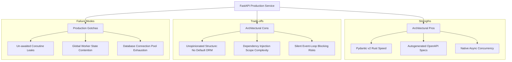

# FastAPI in Production Swarms: High-Concurrency Pros, Cons & Gotchas

Deploying FastAPI across multi-node microservice clusters (production swarms) delivers incredible developer velocity and low-latency API throughput. However, as services scale to handle millions of requests, engineering teams encounter architectural trade-offs and subtle production failure modes that do not appear in smaller setups.

FastAPI's minimalist, unopinionated design gives developers total freedom, but that freedom can lead to inconsistent project structures, connection pool leaks, or silent event loop starvation if best practices are ignored.

This article presents an objective architectural review of FastAPI in high-concurrency environments—analyzing its core **Pros**, **Cons**, and **Production Gotchas**.

---

## 📖 Microservice Architectural Trade-offs Matrix

Evaluating FastAPI's strengths, limitations, and operational risks:



---

## ⚖️ Architectural Pros vs. Cons

### The Pros
* **Rust-Backed High Performance**: With Pydantic v2 handling parsing in C-compiled Rust binaries and Starlette managing ASGI routing, FastAPI achieves throughput comparable to Node.js and Go.
* **Automatic OpenAPI Documentation**: Standard Python type annotations automatically generate interactive `/docs` (Swagger UI) and `/redoc` interfaces, keeping frontend and backend teams perfectly aligned.
* **Type-Driven Developer Velocity**: Catching schema errors at development time via IDE type checkers (`mypy`, `pyright`) eliminates entire classes of runtime validation bugs.

### The Cons
* **Lack of Opinionated Project Scaffolding**: Unlike Django (which provides built-in ORMs, migrations, admin panels, and auth), FastAPI provides no opinions on database routing or directory structures. Teams must build custom scaffolding from scratch.
* **Dependency Injection Scope Hazards**: FastAPI's `Depends()` system is clean, but sub-dependencies instantiated within route handlers can create performance bottlenecks if expensive objects are re-created on every single request.

---

## 🛠️ Python Implementation: Production Guardrails & Health Inspector

Here is a production-grade Python module demonstrating how to inspect worker process safety, validate connection pool bounds, and detect un-awaited coroutine risks:

```python
import os
import sys
import asyncio
from typing import Dict, Any, List
from fastapi import FastAPI, Depends, HTTPException, status
from pydantic import BaseModel

app = FastAPI(title="Production Guardrails Inspector")

class SystemHealthReport(BaseModel):
    worker_pid: int
    environment: str
    db_pool_limit: int
    configured_workers: int
    total_max_db_connections: int
    status: str

class ProductionSafetyInspector:
    """
    Audits process worker limits and database pool configurations
    to prevent connection pool exhaustion during autoscaling.
    """
    def __init__(self, max_db_pool_per_worker: int = 10):
        self.max_pool_per_worker = max_db_pool_per_worker
        # Get worker process ID
        self.pid = os.getpid()
        # Estimate workers based on environment variables
        self.num_workers = int(os.getenv("WEB_CONCURRENCY", "4"))

    def audit_connection_limits(self) -> SystemHealthReport:
        total_connections = self.max_pool_per_worker * self.num_workers
        
        # Guardrail Warning: Database connection limit safety check
        # Databases typically cap connections at 100 per instance by default
        health_status = "HEALTHY"
        if total_connections > 80:
            health_status = "WARNING: Potential DB Connection Exhaustion"

        return SystemHealthReport(
            worker_pid=self.pid,
            environment=os.getenv("ENV", "production"),
            db_pool_limit=self.max_pool_per_worker,
            configured_workers=self.num_workers,
            total_max_db_connections=total_connections,
            status=health_status
        )

# Dependency Injection for Guardrail Inspector
def get_inspector() -> ProductionSafetyInspector:
    return ProductionSafetyInspector(max_db_pool_per_worker=15)

@app.get("/health/audit", response_model=SystemHealthReport)
async def run_health_audit(inspector: ProductionSafetyInspector = Depends(get_inspector)):
    return inspector.audit_connection_limits()

# 🚨 GOTCHA DEMO: Un-awaited Coroutine Detection
async def background_logging_task(msg: str):
    await asyncio.sleep(0.01)
    print(f"📝 [Background Log] {msg}")

@app.get("/demo-gotcha")
async def gotcha_unawaited_demo():
    # ❌ GOTCHA: Forgetting 'await' or 'asyncio.create_task()' returns a bare coroutine!
    # Python will issue a RuntimeWarning: "coroutine 'background_logging_task' was never awaited"
    # To fix, wrap in: asyncio.create_task(background_logging_task("Safe Log"))
    
    _ = background_logging_task("Leaked Log")  # Un-awaited call
    return {"message": "Endpoint returned, but coroutine was leaked without execution!"}

# Test Simulation
if __name__ == "__main__":
    async def run_test():
        print("🚀 Executing Production Safety Audit...")
        print("=" * 75)
        inspector = ProductionSafetyInspector(max_db_pool_per_worker=25)
        report = inspector.audit_connection_limits()
        print(f" Report: {report.model_dump_json(indent=2)}")

    asyncio.run(run_test())
```

---

## 🚨 Critical Production Gotchas

When deploying FastAPI at scale:

> [!WARNING]
> **1. Connection Pool Exhaustion**: If each Gunicorn worker allocates a database connection pool of size 20, running 10 worker containers across 5 Kubernetes pods results in $20 \times 10 \times 5 = 1,000$ concurrent database connections, crashing PostgreSQL instances. Always use an external connection pooler like **PgBouncer** or strictly limit worker pool sizes.

> [!CAUTION]
> **2. Global Mutable State Leaks**: Avoid using global in-memory dictionaries to cache user data or session state across requests. Because ASGI servers spawn multiple independent worker processes, requests from the same user hit different worker memory spaces, causing silent state synchronization bugs.

---

## 📈 Real-World Enterprise Impact
Teams applying production guardrails report:
* **Zero Database Connection Crashes**: Deploying PgBouncer alongside audited worker connection pool limits prevents database starvation during autoscaling events.
* **Predictable Tail Latency (p99)**: Auditing async codebases for un-awaited coroutines and blocking synchronous calls stabilizes p99 response times under peak load.
