# Schema Serialization Speedups: Migrating to Pydantic v2 in FastAPI

FastAPI relies on **Pydantic** for input validation, query string parsing, and response serialization. In earlier versions of FastAPI (using Pydantic v1), validating large nested JSON payloads or serializing thousands of database records into response models incurred significant CPU overhead. Pydantic v1 executed validation via pure Python loops, making data parsing the single largest bottleneck in high-throughput APIs.

The release of **Pydantic v2** fundamentally transformed FastAPI's throughput characteristics. By rewriting the validation and serialization engine in **Rust** (`pydantic-core`), Pydantic v2 achieved a **5x to 15x performance increase**.

This article explores the internal Rust-backed architecture of Pydantic v2, key syntax migration patterns, and performance optimization techniques for FastAPI.

---

## Pydantic v1 vs. Pydantic v2 Architecture

The architectural evolution from pure Python loops to Rust-compiled validation graphs:

```mermaid
graph TD
  subgraph SG1_LegacyPydanticV1 ["Legacy Pydantic v1 (Pure Python)"]
    A[Raw JSON Payload] --> B[CPython JSON Decoder]
    B --> C[Python Object Instantiation]
    C --> D[Pure Python Field Validation Loop]
    D --> E[Validated Model Instance]
  end
  
  subgraph SG2_ModernPydanticV2 ["Modern Pydantic v2 (Rust Core)"]
    F[Raw JSON Payload / Bytes] --> G[Rust pydantic-core Binary Engine]
    G -->|Direct C-API Memory Allocation| H[Compiled Schema Validation Graph]
    H --> I[Validated FastAPI Model Instance: 10x Speedup]
  end
```



### Key Performance Innovations in Pydantic v2
1. **Rust `pydantic-core` Engine**: Validation graphs are pre-compiled into C-compatible binary data structures when the model class is defined. During HTTP requests, incoming JSON bytes are parsed and validated directly in Rust, bypassing CPython interpreter overhead.
2. **Direct CPython Memory Allocation**: Model instantiation avoids creating intermediate Python dictionary representations, writing fields directly into Python object memory slots.
3. **Zero-Copy Serialization**: High-speed JSON serialization (`model.model_dump_json()`) serializes Pydantic objects straight to JSON strings in Rust, eliminating the need to construct intermediary Python dictionaries first.

---

## Python Implementation: Pydantic v2 High-Throughput Serialization

Here is a production-grade Python script demonstrating Pydantic v2 validation patterns, custom field validators, and JSON dump benchmarks:

```python
import time
from typing import List, Optional
from pydantic import BaseModel, Field, EmailStr, field_validator, ConfigDict

# 1. Define Modern Pydantic v2 Schema
class OrderItemSchema(BaseModel):
    item_id: str
    quantity: int = Field(..., gt=0, description="Quantity must be greater than zero")
    unit_price: float = Field(..., gt=0.0)

class TransactionPayloadSchema(BaseModel):
    # Modern ConfigDict replaces old Config inner class
    model_config = ConfigDict(str_strip_whitespace=True, validate_assignment=True)

    transaction_id: str
    user_email: str
    items: List[OrderItemSchema]
    coupon_code: Optional[str] = None

    # Modern @field_validator replaces legacy @validator
    @field_validator("transaction_id")
    @classmethod
    def validate_transaction_id_prefix(cls, value: str) -> str:
        if not value.startswith("tx-"):
            raise ValueError("transaction_id must begin with prefix 'tx-'")
        return value

# Benchmark Runner
def benchmark_pydantic_v2_throughput(num_records: int = 20_000):
    print(f"🚀 Benchmarking Pydantic v2 Parsing & Serialization across {num_records:,} payloads...")
    print("=" * 75)

    raw_payload_template = {
        "transaction_id": "tx-889021",
        "user_email": " customer@domain.com ",  # Will be whitespace-stripped by ConfigDict
        "items": [
            {"item_id": "prod-1", "quantity": 2, "unit_price": 49.99},
            {"item_id": "prod-2", "quantity": 1, "unit_price": 12.50}
        ],
        "coupon_code": "SUMMER2026"
    }

    # 1. Measure Batch Validation Speed
    start_val = time.perf_counter()
    validated_models = [TransactionPayloadSchema.model_validate(raw_payload_template) for _ in range(num_records)]
    val_duration = time.perf_counter() - start_val
    val_rps = num_records / val_duration

    print(f" ✅ Validation Time  : {val_duration:.4f} seconds")
    print(f" 📊 Validation Rate  : {val_rps:,.2f} models/sec")

    # 2. Measure High-Speed Rust JSON Serialization (model_dump_json)
    start_ser = time.perf_counter()
    json_bytes_list = [model.model_dump_json() for model in validated_models]
    ser_duration = time.perf_counter() - start_ser
    ser_rps = num_records / ser_duration

    print(f" ✅ Serialization Time: {ser_duration:.4f} seconds")
    print(f" 📊 Serialization Rate: {ser_rps:,.2f} dumps/sec")

if __name__ == "__main__":
    benchmark_pydantic_v2_throughput(num_records=25_000)
```

---

## Migration Gotchas: Pydantic v1 ➔ v2

When upgrading legacy FastAPI projects to Pydantic v2:

> [!IMPORTANT]
> **Replace Legacy Method Calls**: Update `.dict()` to `.model_dump()` and `.json()` to `.model_dump_json()`. While legacy alias wrappers exist in v2, calling them incurs Python deprecation overhead and bypasses the fastest Rust serialization code paths.

> [!CAUTION]
> **Watch for `@model_validator` Mode Differences**: In Pydantic v2, `@model_validator(mode='before')` receives raw dictionary input before field parsing, while `mode='after'` receives the instantiated model instance. Confusing these modes will cause runtime `AttributeError` exceptions when migrating complex validators.

---

## Real-World Enterprise Impact
Teams migrating FastAPI services to Pydantic v2 report:
* **80% Lower Serialization Latency**: High-volume JSON APIs experience dramatic latency drops when returning large array responses.
* **Reduced Memory Allocations**: Lower memory churn reduces Python Garbage Collection (GC) pauses, smoothing out response tail latencies (p99).
