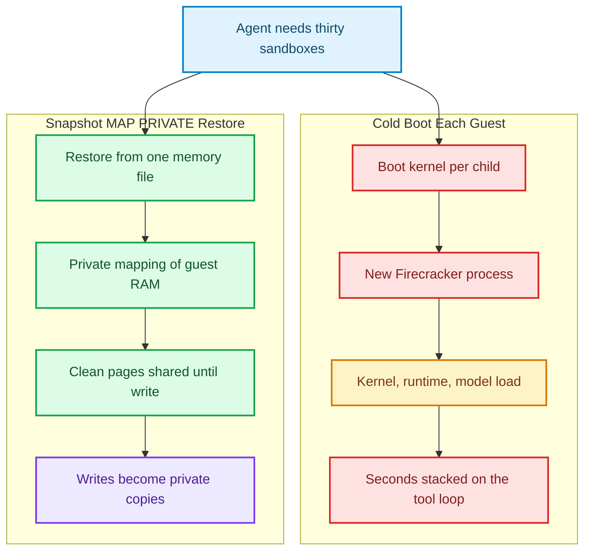
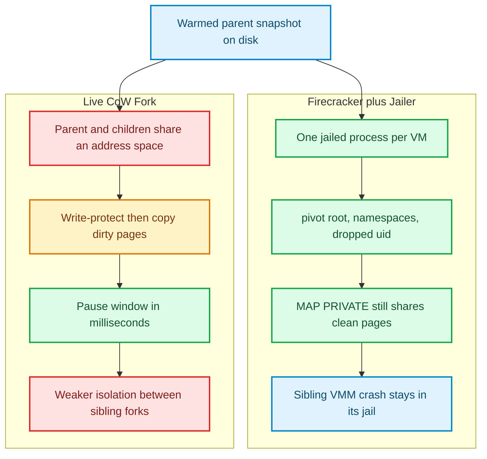

An agent that fans out thirty code-exec children does not have thirty seconds. Cold-booting a Firecracker microVM—kernel, virtio, runtime, warmed interpreter—is a *second-class* tax when you pay it once. Pay it thirty times in a tool loop and the user watches a progress bar that is really a BIOS.

Someone on the infra channel will say “snapshot it.” They will be half right.

Firecracker can pause a warmed parent, write guest RAM plus device state to files, and restore that snapshot into a *new* Firecracker process [1][2]. Restore does not `memcpy` the RAM file. It `mmap`s it `MAP_PRIVATE`: reads fault in from the file; writes become anonymous private copies [2][3]. Thirty children can share the parent’s clean pages. RSS looks like thirty guests. Proportional set size looks like one guest plus whatever each child dirtied.

That is not `fork()`. It is not a live copy of a running VM. It is not the idle-pool pop in the pre-warmed sandbox essay [11]. And it does not give you Jailer’s threat model for free. Figure 1 is the fork people think they bought versus the mapping they actually got.



*Figure 1: Cold Firecracker boot repeats kernel init per child. Snapshot restore maps one immutable guest-memory file `MAP_PRIVATE` so clean pages stay shared until a write. Source: Firecracker snapshotting design and `mmap(2)` [2][3].*

The right column is how AWS clones query processors in DSQL and how Lambda hides cold start: boot once, snapshot, restore many, share unchanged pages, copy on write [4][5]. The left column is what you still have if your “pool” is just thirty paused containers in a Python list [11].

---

## Restore is not fork

Firecracker’s original paper is a jail-and-boot story: a dedicated kernel per function, a stripped device model, Jailer for `chroot` / cgroup / privilege drop, designed so that a breakout of one microVM is not a breakout of the host [1][6]. Snapshotting arrived later as a performance overlay on that model. The overlay has rules.

A snapshot is at least two files: guest memory, and microVM state (KVM plus Firecracker-emulated devices). Disks stay the operator’s problem. Full snapshots are resume-able. Diff snapshots record pages dirtied since the last snapshot into a sparse file; they are generally not resume-able alone and have to be recombined with a base, with the exception of diff snapshots of *booted* VMs that Firecracker documents as resume-able [2]. Load creates a new process, maps the memory file, resets the dirty bitmap, and leaves the guest paused until you resume it [2]. The memory file **must remain immutable** for the lifetime of every VM that maps it. Mutating it from the host is undefined behavior in guest RAM [2]. Snapshot restore latency also depends on the host’s cgroup generation: Firecracker documents a sharp penalty on cgroup v1 kernels around 5.4 and recommends cgroup v2 for snapshot hosts [2].

`MAP_PRIVATE` is the entire density trick. From the man page: writes do not carry through to the underlying file; the kernel supplies anonymous pages instead [3]. Firecracker’s docs say the quiet part: you keep the file around because it *is* the shared backing for every clone’s clean pages [2]. Delete it and you have not saved disk. You have pulled the page cache out from under running guests.

This still starts a **new Firecracker process per child**. Each child can be Jailer’d. The jailer `unshare`s a mount namespace, marks mounts private, bind-mounts the chroot on itself, `pivot_root`s, detaches the old root, and `chroot`s for good measure. It creates cgroup subfolders (v1 or v2), writes the Firecracker pid into `tasks`, and drops to the uid/gid you passed [6][7]. Production host setup is explicit that Jailer inputs are trusted, that each instance should get a unique unprivileged uid/gid, and that path arguments must not be writable by other local users [7]. Sibling clones share *file-backed RAM*. They do not share a process, a jail, or a network namespace unless you made that mistake on purpose. That is the production topology Marc Brooker describes as “cloning”: restore as many times as you like from one snapshot, share clean pages, isolate writes [5]. Shared clean pages can even land once in some levels of the CPU cache hierarchy, which is a density bonus the original Firecracker paper never promised [5].

It is also why live CoW forks that keep parent and children in **one address space** are a different machine. Figure 2 splits them.



*Figure 2: Firecracker snapshot restore preserves one-jailed-process-per-VM. Live CoW (userfaultfd write-protect, or a same-process VMM) cuts the pause window by refusing that isolation. Sources: Jailer, `userfaultfd(2)`, k7d, forkd [6][8][9][10].*

k7d’s own comparison is unusually honest: a live CoW fork of a running VM can land in about five milliseconds, and a whole Kubernetes cluster in about a hundred—but sibling isolation is weaker than Firecracker’s one-jailed-process-per-VM because parent and child memory must be mappings in the same process [9]. That is not a footnote. Jailer’s `pivot_root` is pointless if the sibling VMM is a thread in your address space. forkd’s v0.4 live BRANCH uses `UFFDIO_WRITEPROTECT` on a shared memfd so the source VM pauses only for vCPU/device dump while dirty pages copy out of band; they vendored Firecracker because upstream `MAP_SHARED` guest RAM was the gap they could not paper over [10]. `userfaultfd` is a Linux syscall for handling page faults in userspace, including write-protect faults [8]. That is a *running-parent* protocol. Snapshot restore never needed it. Restore’s parent is a file.

If you needed a control-plane sketch, it is a lease over a snapshot backend—not a `foo` VM:

```go
package sandbox

import (
	"context"
	"errors"
	"net/http"
	"time"
)

type SnapshotBackend struct {
	MemoryFile string
	VMState    string
	ReadOnly   bool
}

type AgentSandboxLease struct {
	LeaseID    string
	JailerUID  int
	JailerGID  int
	Backend    SnapshotBackend
	Timeout    time.Duration
}

var (
	ErrSnapshotMutable = errors.New("guest memory file must stay immutable")
	ErrJailerIdent     = errors.New("each Firecracker jail needs its own uid and gid")
)

type Controller struct {
	snapshotLoadURL string
	http            *http.Client
}

func (c *Controller) RestoreLease(ctx context.Context, lease AgentSandboxLease) error {
	if !lease.Backend.ReadOnly {
		return ErrSnapshotMutable
	}
	if lease.JailerUID == 0 || lease.JailerGID == 0 {
		return ErrJailerIdent
	}
	if lease.Timeout > 0 {
		var cancel context.CancelFunc
		ctx, cancel = context.WithTimeout(ctx, lease.Timeout)
		defer cancel()
	}
	req, err := http.NewRequestWithContext(ctx, http.MethodPut, c.snapshotLoadURL, nil)
	if err != nil {
		return err
	}
	resp, err := c.http.Do(req)
	if err != nil {
		return err
	}
	defer resp.Body.Close()
	if resp.StatusCode >= 300 {
		return errors.New("snapshot load rejected")
	}
	return nil
}
```

The HTTP shape is illustrative; Firecracker’s real API is a Unix socket with a JSON `PUT /snapshot/load` [2]. The invariants are not illustrative. Unique uid/gid per jail is in the production host guide [7]. Immutability of the memory file is in the snapshot doc [2].

---

## Uniqueness after the clone

Sharing pages is the easy half. The hard half is that every clone wakes up believing it is the parent.

Brooker, Catangiu, Danilov, Graf, MacCarthaigh, and Sandu wrote the paper the rest of us keep rediscovering: *Restoring Uniqueness in MicroVM Snapshots* [4]. Cryptographic tokens, UUID caches, PRNG state, and MAC addresses duplicated across restores are not theoretical. They are how you mint two TLS connections that look like one, or two guests that answer ARP for the same Ethernet address. Firecracker’s own snapshot security section says resuming the same snapshot more than once is **insecure** unless you have a uniqueness story [2]. Linux 5.18+ guests can reseed the in-kernel PRNG via VMGenID on resume. Userspace caches of random bytes will not [2][4]. `MADV_WIPEONSUSPEND` exists because some secrets should not survive the snapshot at all [4].

An agent sandbox that restores thirty children from a warmed CPython snapshot and then lets each child “generate a request id” from a module-level `uuid4()` called at import time has thirty identical request ids. The uniqueness paper is not an AWS curiosity. It is the reason your fan-out correlated on a nonce.

Network and vsock are similarly unromantic. Packets in flight are lost. Open vsock connections close; listen sockets in the guest survive [2]. Clones need new TAPs, new MACs, new addresses. Treat resume as a new machine that happens to share page cache with its siblings.

---

## Measuring MAP_PRIVATE without a guest

This environment has `/dev/kvm`. It does not ship a Firecracker rootfs, so we do not invent guest boot numbers. We measured the host MMU geometry Firecracker restore actually uses.

`benchmarks/firecracker-cow` maps a 512 MiB file—the size of a small microVM RAM image—`MAP_PRIVATE` in eight sibling processes. Four of them dirty 64 MiB. All eight stay alive together so `Shared_Clean` in `/proc/self/smaps` means what the man page says. Hardware: Go 1.22.2, linux/amd64, 4 CPUs.

| Mapper | RSS | Shared_Clean | Private_Dirty | PSS |
|---|---|---|---|---|
| Clean sibling | 512 MiB | **512 MiB** | 0 | 72 MiB |
| Dirty sibling (64 MiB writes) | 512 MiB | **448 MiB** | **64 MiB** | 120 MiB |
| Eight siblings, PSS sum | — | — | **256 MiB** dirty | **768 MiB** |

Eight private copies of 512 MiB would be 4,096 MiB of unique RAM. The measured proportional set is 768 MiB: one 512 MiB file plus 256 MiB of dirty private pages. The kernel charged shared pages fairly across the eight mappers (512 / 8 = 64 MiB each, plus page tables, which is why clean PSS is 72 MiB rather than 64).

The `mmap` syscall itself was 8–174 µs. Dirtying 64 MiB took 36–66 ms. An anonymous `memcpy` of the same 512 MiB file took **483 ms**. Restore is fast because it does not copy. First-touch still faults. Writes still allocate. Density is a property of *how little the children diverge*.

That last sentence is the agent-sandbox punchline. A child that JIT-compiles a unique module, or dirties a model weight tensor, stops being cheap. A child that runs a short Python snippet against an already-imported stdlib stays in the shared set. Pre-warmed *pools* [11] still matter when you need a clean, already-booted guest and you do not want to restore uniqueness. Snapshot clones matter when you want thirty of the *same* warmed world and you are willing to re-unique them. gRPC-plus-microVM isolation [12] is the boundary protocol, not the memory protocol. Pick all three on purpose.

Live CoW remains the temptation. k7d and forkd publish pause windows we did not reproduce here; treat their milliseconds as *their* measurements [9][10]. The architectural claim we will stand on is narrower: you cannot have Firecracker Jailer’s sibling isolation and a same-process live fork. Figure 2 is that refusal.

---

The 2026 agent-sandbox market is a race to hide boot. E2B-style products, Mitos CRDs, k7d cluster forks, forkd live BRANCH—all of them discovered that users will forgive a jail if the first `exec` feels like `fork`. Lambda’s threat model went the other way: strangers on a multi-tenant host, one process per VM, uniqueness restored in microseconds [1][4][5]. Both answers are coherent. Mixing them is how you ship a “Firecracker sandbox” that is actually eight mappings in one address space with a marketing diagram of a jail.

Fork memory for tenants you trust. Jail processes for tenants you do not. Milliseconds are a property of the isolation story you chose, not a number you can steal from someone else’s pause window.

---

## References & Further Reading

1. **Agache, A., Brooker, M., Iordache, A., Liguori, A., Neugebauer, R., Piwonka, P., and Popa, D.-M. (2020)**. *Firecracker: Lightweight Virtualization for Serverless Computing*. USENIX NSDI. [https://www.usenix.org/conference/nsdi20/presentation/agache](https://www.usenix.org/conference/nsdi20/presentation/agache)
2. **Firecracker Maintainers (2026)**. *Firecracker Snapshotting*. [https://github.com/firecracker-microvm/firecracker/blob/main/docs/snapshotting/snapshot-support.md](https://github.com/firecracker-microvm/firecracker/blob/main/docs/snapshotting/snapshot-support.md)
3. **Linux man-pages project**. *mmap(2)*. [https://man7.org/linux/man-pages/man2/mmap.2.html](https://man7.org/linux/man-pages/man2/mmap.2.html)
4. **Brooker, M., Catangiu, A. C., Danilov, M., Graf, A., MacCarthaigh, C., and Sandu, A. (2021)**. *Restoring Uniqueness in MicroVM Snapshots*. arXiv:2102.12892. [https://arxiv.org/abs/2102.12892](https://arxiv.org/abs/2102.12892)
5. **Brooker, M. (2025)**. *Seven Years of Firecracker*. [https://brooker.co.za/blog/2025/09/18/firecracker.html](https://brooker.co.za/blog/2025/09/18/firecracker.html)
6. **Firecracker Maintainers**. *The Firecracker Jailer*. [https://github.com/firecracker-microvm/firecracker/blob/main/docs/jailer.md](https://github.com/firecracker-microvm/firecracker/blob/main/docs/jailer.md)
7. **Firecracker Maintainers**. *Production Host Setup Recommendations*. [https://github.com/firecracker-microvm/firecracker/blob/main/docs/prod-host-setup.md](https://github.com/firecracker-microvm/firecracker/blob/main/docs/prod-host-setup.md)
8. **Linux man-pages project**. *userfaultfd(2)*. [https://man7.org/linux/man-pages/man2/userfaultfd.2.html](https://man7.org/linux/man-pages/man2/userfaultfd.2.html)
9. **Katakate**. *k7d*. GitHub. [https://github.com/Katakate/k7d](https://github.com/Katakate/k7d)
10. **forkd**. *DESIGN v0.4 (live BRANCH / UFFDIO_WRITEPROTECT)*. [https://github.com/deeplethe/forkd/blob/main/DESIGN-v0.4.md](https://github.com/deeplethe/forkd/blob/main/DESIGN-v0.4.md)
11. **Khan, A. (2026)**. *Pre-Warmed Micro-VM Pools: Sub-10ms Sandbox Provisioning for Code Agents*. [https://akmalkhaniub.github.io/blog/system-design-pre-warmed-micro-vm-pools-sub-10ms-sandboxes.html](https://akmalkhaniub.github.io/blog/system-design-pre-warmed-micro-vm-pools-sub-10ms-sandboxes.html)
12. **Khan, A. (2026)**. *Zero-Trust Tool Sandboxes: Isolation with gRPC and MicroVMs*. [https://akmalkhaniub.github.io/blog/security-zero-trust-grpc-microvm-sandboxing.html](https://akmalkhaniub.github.io/blog/security-zero-trust-grpc-microvm-sandboxing.html)
