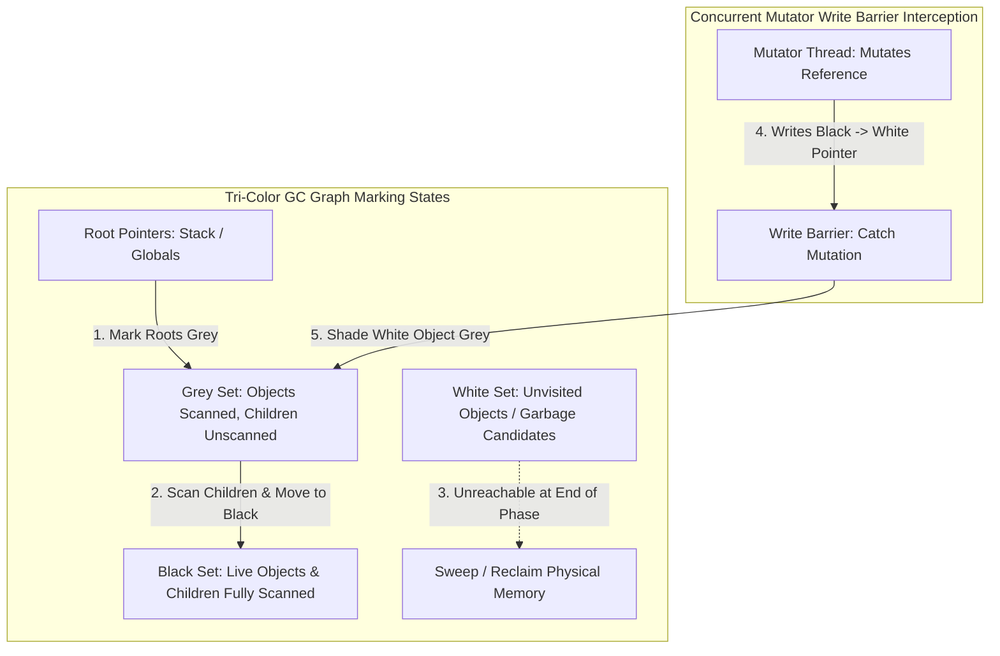

# Garbage Collection Mechanics: Tri-Color Marking, Concurrent Compaction & Generational GC

In managed programming runtimes (such as Java JVM, Go, V8 JavaScript, and PyPy), automatic memory reclamation via **Garbage Collection (GC)** is essential for developer productivity and memory safety.

However, early garbage collector designs relied on **Stop-The-World (STW)** pauses. During STW phases, the runtime freezes all user application threads ("mutators") while scanning the heap. On large heaps ($64\text{ GB}$ to $512\text{ GB}$), STW pauses can last **500ms to 5,000ms**, destroying p99 SLA guarantees in high-frequency trading and real-time microservices.

To achieve sub-millisecond GC pauses ($\le 1\text{ms}$) on multi-terabyte heaps, modern runtimes (**Go GC**, **Java ZGC**, **Shenandoah GC**) utilize **Concurrent Tri-Color Marking**, **Write Barriers**, and **Colored Pointers**.

This article details the Tri-Color Abstraction, Write Barriers, and Generational GC compaction algorithms.

---

## Tri-Color Marking & Write Barrier Architecture

How concurrent garbage collectors track live objects while mutator threads mutate heap references:



### Core Garbage Collection Principles
1. **Tri-Color Marking Abstraction**: Objects in the heap are assigned one of three color states during GC marking:
   * **White**: Unvisited objects. At the start of GC, all objects are White. At the end of marking, remaining White objects are unreachable **Garbage** and are swept.
   * **Grey**: Visited objects whose child references have not yet been scanned. The GC worker processes objects from the Grey set.
   * **Black**: Reachable live objects whose child references have all been fully scanned. Black objects cannot point directly to White objects without an intervening Grey object.
2. **The Lost Object Problem & Write Barriers**: If a user thread (mutator) breaks a reference between a Grey object and a White object and attaches that White object to a Black object *while the GC is running concurrently*, the GC would miss the White object and accidentally delete live memory!
   To prevent this, runtimes use **Write Barriers** (e.g. Dijkstra or Yuasa write barriers) that intercept pointer writes, shading any overwritten or newly referenced White object to **Grey** immediately.
3. **Weak Generational Hypothesis**: "Most objects die young." Runtimes divide the heap into generations:
   * **Eden / Young Generation**: New allocations occur here. Minor GCs run frequently and quickly because $\approx 95\%$ of objects are already dead.
   * **Tenured / Old Generation**: Objects surviving multiple Minor GC cycles are promoted to the Old Generation and collected infrequently during Major GCs.
4. **Colored Pointers & Load Barriers (Java ZGC)**: ZGC embeds 4 GC metadata bits directly into the unused upper bits of 64-bit virtual memory pointers (`Marked0`, `Marked1`, `Remapped`). When mutator threads dereference a pointer, a CPU **Load Barrier** checks these bits, allowing ZGC to compact memory concurrently with zero STW pauses!

---

## Python Implementation: Tri-Color GC Engine with Write Barrier

Here is a production-grade Python implementation of a Concurrent Tri-Color Mark-and-Sweep Garbage Collector with Write Barrier interception:

```python
from typing import Dict, List, Set, Optional
from pydantic import BaseModel

class HeapObject(BaseModel):
    obj_id: str
    color: str = "WHITE"  # WHITE, GREY, BLACK
    references: List[str] = []

class ConcurrentTriColorGC:
    """
    Simulates a Concurrent Tri-Color Mark-and-Sweep Collector.
    Demonstrates Write Barrier interception to prevent the Lost Object Problem.
    """
    def __init__(self):
        self.heap: Dict[str, HeapObject] = {}
        self.roots: Set[str] = set()
        self.grey_set: List[str] = []
        self.is_gc_marking = False

    def allocate(self, obj_id: str, references: List[str] = []) -> HeapObject:
        obj = HeapObject(obj_id=obj_id, references=list(references))
        self.heap[obj_id] = obj
        return obj

    def write_barrier(self, src_obj_id: str, target_obj_id: str):
        """
        Dijkstra Write Barrier: Intercepts reference mutations during marking phase.
        If a reference to a WHITE object is written, shade it GREY immediately!
        """
        if self.is_gc_marking:
            target_obj = self.heap.get(target_obj_id)
            if target_obj and target_obj.color == "WHITE":
                target_obj.color = "GREY"
                self.grey_set.append(target_obj_id)
                print(f" 🛡️ [Write Barrier] Intercepted Black->White write! Shaded '{target_obj_id}' to GREY.")

    def start_concurrent_marking(self):
        """Phase 1: Mark Roots as GREY."""
        self.is_gc_marking = True
        print("\n🚀 [GC Phase 1] Starting Concurrent Tri-Color Marking...")
        for root_id in self.roots:
            if root_id in self.heap:
                obj = self.heap[root_id]
                obj.color = "GREY"
                self.grey_set.append(root_id)
                print(f"   • Marked Root '{root_id}' as GREY.")

    def mark_step(self):
        """Phase 2: Process Grey Set concurrently."""
        if not self.grey_set:
            return

        curr_id = self.grey_set.pop(0)
        curr_obj = self.heap[curr_id]

        print(f" ⚙️ [GC Marking] Scanning object '{curr_id}'...")
        for child_id in curr_obj.references:
            child = self.heap.get(child_id)
            if child and child.color == "WHITE":
                child.color = "GREY"
                self.grey_set.append(child_id)
                print(f"    -> Discovered child '{child_id}', shaded GREY.")

        curr_obj.color = "BLACK"
        print(f"    -> Object '{curr_id}' marked BLACK.")

    def sweep_garbage(self) -> List[str]:
        """Phase 3: Reclaim remaining WHITE objects."""
        self.is_gc_marking = False
        reclaimed = []
        for obj_id, obj in list(self.heap.items()):
            if obj.color == "WHITE":
                reclaimed.append(obj_id)
                del self.heap[obj_id]
            else:
                obj.color = "WHITE"  # Reset color for next cycle

        print(f"\n 🧹 [GC Phase 3: Sweep] Reclaimed {len(reclaimed)} Garbage Objects: {reclaimed}")
        return reclaimed

# Demonstration Execution
if __name__ == "__main__":
    gc = ConcurrentTriColorGC()

    print("🚀 Demonstrating Tri-Color GC & Write Barrier Interception...")
    print("=" * 75)

    # 1. Allocate Heap Objects
    obj_root = gc.allocate("obj_root", references=["obj_A"])
    obj_A = gc.allocate("obj_A", references=["obj_B"])
    obj_B = gc.allocate("obj_B", references=[])
    obj_garbage = gc.allocate("obj_garbage", references=[])  # Unreachable

    gc.roots.add("obj_root")

    # 2. Start GC Marking Phase
    gc.start_concurrent_marking()

    # 3. Process obj_root -> obj_root becomes BLACK, obj_A becomes GREY
    gc.mark_step()

    # 4. Mutator Thread Mutates Reference during Marking!
    # Mutator attaches obj_B to obj_root (BLACK) and removes obj_B from obj_A
    print("\n⚡ [Mutator Thread] Concurrent Mutation: Attaching 'obj_B' to 'obj_root'!")
    gc.write_barrier("obj_root", "obj_B")
    obj_root.references.append("obj_B")

    # 5. Finish Marking Steps
    while gc.grey_set:
        gc.mark_step()

    # 6. Sweep Unreachable Garbage
    reclaimed_objs = gc.sweep_garbage()
    print(f" ✅ Remaining Live Objects in Heap: {list(gc.heap.keys())}")
```

---

## Garbage Collection Gotchas & Best Practices

When tuning garbage collected runtimes:

> [!IMPORTANT]
> **Keep Objects Short-Lived or Very Long-Lived**: Avoid intermediate-lived objects that survive just long enough to be promoted from the Young Generation to the Old Generation. Promoted intermediate objects trigger expensive Major GCs.

> [!CAUTION]
> **Avoid Large Array Allocations in Hot Loops**: In Go or Java, allocating large slices or arrays inside tight loops forces heap allocations and triggers GC marking pressure. Use object pools (`sync.Pool` in Go) to reuse memory buffers.

---

## Real-World Enterprise Impact
Runtimes adopting Concurrent Tri-Color GC and Load Barriers (such as **Java ZGC** and **Go GC**) report:
* **Sub-Millisecond Tail Pauses**: Reducing maximum GC STW pauses from $2,500\text{ms}$ down to **under $1\text{ms}$** across $1\text{ TB}$ heaps.
* **Predictable p99.9 Service Latencies**: Eliminating GC pause spikes stabilizes SLA guarantees for financial trading platforms and real-time streaming engines.
