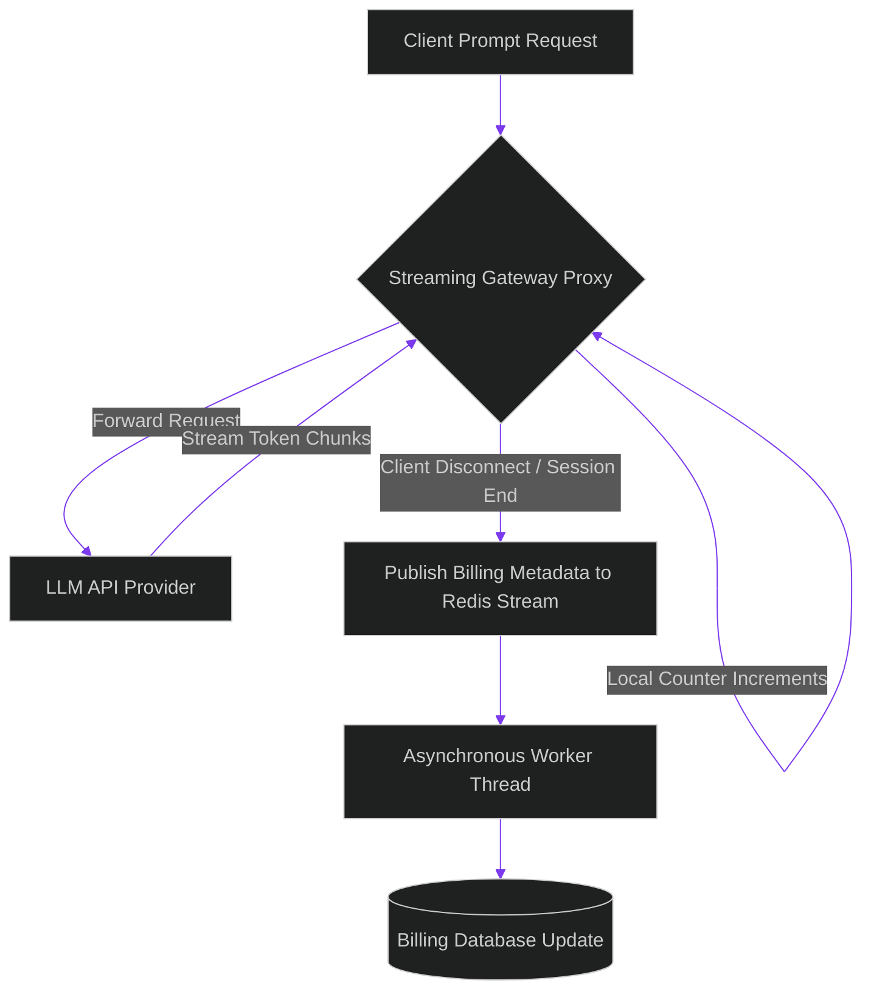

# Distributed Token Auditing: Real-Time Cost Tracking via Redis Streams

> [!NOTE]
> **📖 Article Overview**
> Monitoring inference costs inside enterprise agent swarms is a significant operational challenge. When agents generate thousands of asynchronous token streams, calculating expenses manually is impossible. Trying to save these metrics directly to PostgreSQL during active streams adds write latency, slowing down response times. To track costs efficiently, architects must build **Distributed Token Auditing** systems. By calculating chunk token counts asynchronously and publishing metrics to Redis Streams, we run real-time cost tracking with zero latency impact. In this article, we implement a cost audit middleware in Python.

---

## The Latency Penalty of Synchronous Auditing

In typical system setups:
* **The DB Write Bottleneck**: Running database `INSERT` commands to track token usage during a streaming HTTP connection blocks response threads, increasing latency.
* **The Streaming Token Challenge**: When streaming, the total token usage is only known after the final chunk is received. Tracking partial chunks requires lightweight, stateful counters.
* **The Solution**: **Redis Streams**. The gateway interceptor increments local token counters as chunks flow, and publishes usage metadata to a Redis Stream on session close. A background worker consumes the stream, saves records, and updates billing dashboards asynchronously.



---

## 1. Under the Hood: Cost Calculations per Model

Different models use distinct pricing rates per 1M tokens:
* **Claude 3.5 Sonnet**: \$3.00 per 1M input tokens, \$15.00 per 1M output tokens.
* **GPT-4o**: \$5.00 per 1M input tokens, \$15.00 per 1M output tokens.
* **Qwen-7B (Local)**: \$0.00 (Infrastructure cost only).

---

## 2. Decoupling the Billing Pipeline

Using Redis Streams guarantees:
1. **Zero Thread Blocking**: Publishing to a Redis Stream is an asynchronous memory write, taking under 1 millisecond.
2. **Horizontal Scaling**: Multiple billing workers can consume from the stream concurrently to write metadata records during high-traffic periods.

---

## Code Demo: Real-Time Token Auditing Middleware

Below is a Python implementation of a token auditing gateway proxy. It tracks token counts across a simulated session, calculates pricing per model rates, and publishes records to a mock Redis Stream.

```python
import json
import time
from typing import Dict, Any, Tuple

class RedisStreamMock:
    def __init__(self):
        self.stream: list = []

    def xadd(self, stream_name: str, fields: Dict[str, str]):
        # Simulate Redis XADD command
        payload = {
            "stream": stream_name,
            "id": f"{int(time.time() * 1000)}-0",
            "data": fields
        }
        self.stream.append(payload)
        print(f"📡 [Redis Stream] Published entry to '{stream_name}' (ID: {payload['id']}).")

class TokenAuditingGateway:
    def __init__(self, stream_db: RedisStreamMock):
        self.stream_db = stream_db
        # Model pricing rates per 1,000,000 tokens
        self.pricing_matrix = {
            "claude-3-5-sonnet": {"input_rate": 3.00, "output_rate": 15.00},
            "gpt-4o": {"input_rate": 5.00, "output_rate": 15.00}
        }

    def process_and_audit_stream(self, session_id: str, model: str, input_tokens: int, simulated_outputs: list):
        print(f"\n🚀 [Gateway] Starting stream processing for session: {session_id}")
        output_token_count = 0

        # Simulate local stream chunk counting
        for chunk in simulated_outputs:
            output_token_count += len(chunk.split()) # Simple token count approximation

        # Calculate costs based on model rates
        pricing = self.pricing_matrix.get(model, {"input_rate": 0.0, "output_rate": 0.0})
        input_cost = (input_tokens / 1_000_000.0) * pricing["input_rate"]
        output_cost = (output_token_count / 1_000_000.0) * pricing["output_rate"]
        total_cost = input_cost + output_cost

        # 2. Publish billing payload to Redis Stream asynchronously on session end
        billing_payload = {
            "session_id": session_id,
            "model": model,
            "input_tokens": str(input_tokens),
            "output_tokens": str(output_token_count),
            "calculated_cost_usd": f"{total_cost:.6f}"
        }
        
        self.stream_db.xadd("stream_billing_audits", billing_payload)

if __name__ == "__main__":
    redis_mock = RedisStreamMock()
    gateway = TokenAuditingGateway(redis_mock)

    # Simulated stream chunks from Claude 3.5
    raw_chunks = ["Executing migration script", " Table successfully updated", " Releasing database locks"]

    # Run auditing
    gateway.process_and_audit_stream(
        session_id="SESS-404-BILLING",
        model="claude-3-5-sonnet",
        input_tokens=1500,
        simulated_outputs=raw_chunks
    )

    print("\n--- Consumer Audit Worker Logs ---")
    # Simulate background worker reading the Redis Stream
    for entry in redis_mock.stream:
        data = entry["data"]
        print(f"📥 [Worker] Processed audit for {data['session_id']}: Model: {data['model']} | Cost: ${data['calculated_cost_usd']}")
```

---

## Architectural Guidelines

* **Audit Asynchronously**: Never run database inserts to track token usage inside streaming requests. Publish metadata to Redis Streams instead.
* **Define Pricing Matrices**: Maintain a centralized configuration schema mapping provider rates to track costs accurately.
* **Configure Stream Retries**: Ensure consumers use consumer groups with ACK flags to guarantee that no billing record is lost during network failures.
