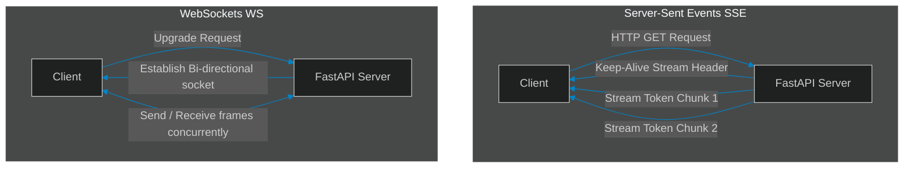

# SSE vs. WebSockets: Architectural Choices for Real-Time Token Streaming

> [!NOTE]
> **📖 Article Overview**
> When building agentic web applications, displaying the final output after the agent has spent 40 seconds executing tools is unacceptable. Users expect real-time feedback—they want to see token streams, planning updates, and tool call alerts instantly. To deliver this experience, leads must choose between **Server-Sent Events (SSE)** and **WebSockets**. In this article, we compare these streaming topologies, map their lifecycles, and implement a FastAPI streaming proxy in Python.

---

## Streaming Real-Time Agent Outputs

Traditional HTTP request-response cycles are built for static content:
* **The Latency Bottleneck**: Waiting for a complete LLM generation before sending a response frustrates users.
* **Bi-directional vs. Uni-directional Needs**: Agents stream data to the client, but clients occasionally need to interrupt execution threads mid-stream.
* **The Options**: **SSE** (Server-Sent Events) and **WebSockets**. While SSE is simple and built on standard HTTP, WebSockets supports full-duplex, bi-directional communication channels.



---

## 1. Comparing Topologies: SSE vs. WebSockets

Choose the correct protocol based on your application's communication requirements:
* **Server-Sent Events (SSE)**: Uses standard HTTP connections. It is uni-directional (Server to Client) and supports automatic reconnection out of the box. Ideal for streaming LLM text outputs.
* **WebSockets**: Establishes a persistent, bi-directional TCP socket. It is full-duplex, permitting clients to send interrupt controls or intermediate instructions to the running agent.

---

## 2. Decoupling Streaming Gateways

To scale real-time streaming:
1. **Configure Keep-Alives**: Ensure intermediate gateway proxies (like Nginx) do not close idle connections during planning phases.
2. **Buffer Chunks**: Bundle small token outputs into multi-token segments before sending to optimize network framing overhead.

---

## Code Demo: FastAPI SSE & WebSocket Streaming Server

Below is a Python script using FastAPI simulation libraries. It routes SSE events and WebSocket connection requests to handle real-time streaming token channels.

```python
import time
import asyncio
from typing import AsyncGenerator

# Mock FastAPI Streaming Server Simulation
class StreamingGatewayServer:
    async def simulate_sse_stream(self) -> AsyncGenerator[str, None]:
        # Server-Sent Events follow a strict "data: <content>\n\n" format
        tokens = ["Executing", " planning", " step...", " Querying", " database", " table."]
        
        for token in tokens:
            await asyncio.sleep(0.2) # Simulate model generation delay
            yield f"data: {json.dumps({'token': token})}\n\n"

        # Signal stream end
        yield "data: [DONE]\n\n"

    async def handle_websocket_session(self, ws_client_id: str):
        print(f"\n🔌 [Websocket] Established bi-directional socket for client: {ws_client_id}")
        
        # Simulating bi-directional event loop (receive interrupt and send updates)
        steps = ["Analyzing logs", "Linting files", "Executing tests"]
        
        for step in steps:
            await asyncio.sleep(0.3)
            # Send frame to client
            print(f"   📤 Sending WS Frame: {step}")
            
            # Simulate receiving client interrupt instruction
            if step == "Linting files":
                print("   📥 Received Client Interrupt: 'Abort execution loop'")
                print("   🚫 Halting WebSocket Session.")
                break

if __name__ == "__main__":
    import json
    server = StreamingGatewayServer()

    # 1. Run SSE Stream Simulation
    async def run_sse():
        print("⚡ Simulating Server-Sent Events (SSE) Stream...")
        print("-------------------------------------------------")
        async for chunk in server.simulate_sse_stream():
            print(chunk.strip())

    # 2. Run WebSocket Simulation
    async def run_ws():
        await server.handle_websocket_session("client_user_303")

    asyncio.run(run_sse())
    asyncio.run(run_ws())
```

---

## Architectural Guidelines

* **Default to SSE for Text**: Use Server-Sent Events (SSE) as your default protocol for simple streaming text outputs to minimize connection setup overhead.
* **Use WebSockets for Interactive Swarms**: Implement WebSockets when you need bi-directional communication to support real-time client interrupts.
* **Adjust Gateway Timeouts**: Configure proxy server timeouts (e.g. `proxy_read_timeout` in Nginx) to match maximum planning latencies.
