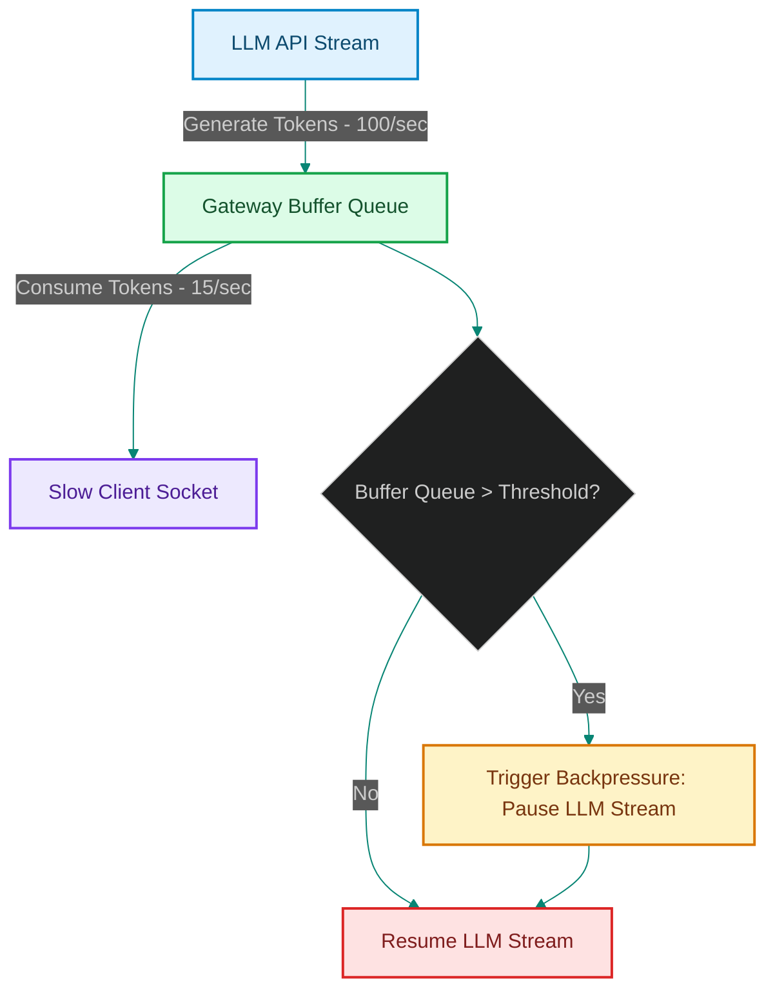

# Token Backpressure Control: Managing Generation Rates on Slow Clients

> [!NOTE]
> **📖 Article Overview**
> Real-time streaming gateways decouple LLM providers from web clients. However, they introduce a significant performance risk: **Rate Mismatch**. A frontier LLM easily generates tokens at 100+ tokens/sec, but a client on a slow mobile network can only consume 15 tokens/sec. If the gateway proxy buffers this excess data without limit, it exhausts server memory, leading to crashes. In this article, we analyze **Token Backpressure Control**, design flow-control logic, and implement an asynchronous stream throttle manager in Python.

---

## The Danger of Unbounded Buffering

When an API gateway streams token responses to clients:
* **Memory Exhaustion (OOM)**: If the client connection lags, the gateway holds open active connection buffers in RAM [1]. With thousands of active sessions, memory bloat triggers Out-Of-Memory (OOM) failures.
* **API Waste**: If the client disconnects due to lag, the LLM continues generating tokens in the background, consuming API credits for responses that will never be delivered.
* **The Solution**: **Backpressure**. The gateway monitors the client's consumption speed. If the buffer queue exceeds a threshold, the gateway throttles the LLM generator stream, resuming only when the client queue drains.



---

## 1. Under the Hood: TCP Window and Application-Level Flow Control

To implement backpressure, we evaluate two connection vectors:
* **TCP Socket Backpressure**: The host operating system's network socket layer blocks writes when the client's TCP window is full.
* **Application Buffer Queues**: The gateway proxy tracks the size of the output queue (e.g. `asyncio.Queue(maxsize=10)`). When the queue reaches capacity, the async generator halts generation.

---

## 2. Setting up Safety Throttles

The flow control manager enforces:
1. **Low Buffer Limits**: Keeping the maximum queue size small (under 20 tokens) to prevent RAM allocation spikes.
2. **Graceful Timeouts**: Terminating the upstream LLM API call immediately if the client disconnects or pauses for too long, preventing token billing waste.

---

## Code Demo: Asynchronous Token Flow Controller

Below is a Python implementation of a stream flow manager. It simulates token generation, checks socket output limits, and pauses the generator thread when client queues reach capacity.

```python
import asyncio
from typing import AsyncGenerator

class TokenBackpressureController:
    def __init__(self, max_buffer_size: int = 5):
        self.max_buffer_size = max_buffer_size
        self.buffer = asyncio.Queue(maxsize=max_buffer_size)
        self.generation_active = True

    async def generate_llm_tokens(self) -> AsyncGenerator[str, None]:
        # Simulated LLM provider generating tokens at 50/sec
        for token_idx in range(1, 15):
            if not self.generation_active:
                break
                
            token = f"Token_{token_idx}"
            
            # Check if buffer is full before adding token
            if self.buffer.full():
                print(f"⚠️ [Backpressure] Buffer Full ({self.buffer.qsize()}/{self.max_buffer_size}). Throttling LLM generator...")
                # Wait until client consumes tokens and frees space
                while self.buffer.full():
                    await asyncio.sleep(0.1)
                print("🔄 [Backpressure] Buffer drained. Resuming LLM generator.")

            await self.buffer.put(token)
            yield token

    async def simulate_slow_client_consume(self):
        # Simulated slow mobile client consuming tokens at 5/sec
        while self.generation_active:
            if not self.buffer.empty():
                token = await self.buffer.get()
                print(f"📥 [Client] Consumed: {token}")
                self.buffer.task_done()
            
            await asyncio.sleep(0.5) # Lag delay

if __name__ == "__main__":
    async def run_simulation():
        controller = TokenBackpressureController(max_buffer_size=4)
        
        print("⚡ Initiating Asynchronous Token Flow Control...")
        print("-------------------------------------------------")

        # Launch slow consumer in background
        consumer_task = asyncio.create_task(controller.simulate_slow_client_consume())

        # Run generator
        async for t in controller.generate_llm_tokens():
            # Generator pushes to buffer
            pass

        # Stop simulation
        await asyncio.sleep(1)
        controller.generation_active = False
        await consumer_task

    asyncio.run(run_simulation())
```

---

## Architectural Guidelines

* **Enforce Queue Size Limits**: Set strict maximum size limits on async gateway queues (e.g. `maxsize = 20`) to prevent memory leak crashes.
* **Stop Terminated Streams**: Monitor connection close events on client sockets and immediately cancel the corresponding LLM API requests.
* **Throttle, Don't Disconnect**: Implement progressive delays rather than hard socket closures to preserve connection stability. [2]

## References & Further Reading

1. **Lamport, L. (1978)**. *Time, Clocks, and the Ordering of Events in a Distributed System*. CACM. [https://lamport.azurewebsites.net/pubs/time-clocks.pdf](https://lamport.azurewebsites.net/pubs/time-clocks.pdf)
2. **Gilbert, S., & Lynch, N. (2002)**. *Brewer's Conjecture and the Feasibility of Consistent, Available, Partition-Tolerant Web Services*. ACM SIGACT News. [https://web.mit.edu/6.033/www/papers/p80-gilbert.pdf](https://web.mit.edu/6.033/www/papers/p80-gilbert.pdf)
3. **OpenTelemetry Authors (2024)**. *OpenTelemetry Specification*. CNCF. [https://opentelemetry.io/docs/specs/otel/](https://opentelemetry.io/docs/specs/otel/)
