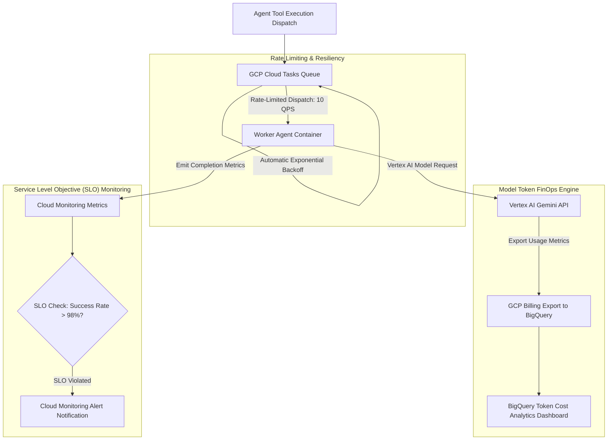

# Production Operations & Cost Engineering for GCP Agent Workflows: Cloud Tasks, FinOps & SLO Monitoring

Deploying AI agents into enterprise production requires more than functional correctness. Without robust operational tooling, autonomous agent swarms can quickly hit third-party API rate limits, trigger runaway model token costs, or silently fail without alerting engineering leads.

To run agentic applications at enterprise scale, Technical Leads implement production operational guardrails on **Google Cloud Platform (GCP)**: **Cloud Tasks** for rate-limited dispatching, **BigQuery Billing Exports** for FinOps cost tracking, and **Cloud Monitoring** for Service Level Objective (SLO) alert policies.

This article details how to operationalize and optimize agent compute budgets on GCP.

---

## GCP Agent Operations & FinOps Architecture

The operational telemetry loop buffers requests, monitors token expenditure, and tracks SLO performance:



### Operational Guardrails
1. **Cloud Tasks Queue Rate-Limiting**: External APIs (such as GitHub, Jira, or Slack) enforce strict rate limits (e.g. 10 requests per second). Cloud Tasks buffers agent tool invocations, enforcing max rate limits and automatic exponential backoff retries upon HTTP 429 rate-limit responses.
2. **FinOps Cost Tracking via BigQuery Billing Exports**: Exporting detailed GCP billing records to BigQuery enables real-time SQL dashboards tracking token spend per tenant, per model tier (Gemini Flash vs. Pro), and per task ID.
3. **Cloud Monitoring SLO Alerts**: Defining Service Level Objectives for Agent Task Success Rate (> 98%) and P95 Completion Latency (< 30s). When success rates drop, Cloud Monitoring fires PagerDuty / Slack alerts.

---

## Python Implementation: Cloud Tasks Rate-Limiting Dispatcher & SLO Monitor

Here is a production Python implementation of a Cloud Tasks rate-limited task dispatcher with integrated SLO health metrics reporting to Cloud Monitoring:

```python
import os
import json
import time
from google.cloud import tasks_v2
from google.cloud import monitoring_v3

PROJECT_ID = os.getenv("GCP_PROJECT_ID", "my-enterprise-gcp-project")
LOCATION_ID = os.getenv("GCP_LOCATION", "us-central1")
QUEUE_ID = os.getenv("GCP_QUEUE_ID", "agent-tool-execution-queue")
WORKER_URL = "https://agent-worker-container-uc.a.run.app/execute"

# Initialize GCP Clients
tasks_client = tasks_v2.CloudTasksClient()
monitoring_client = monitoring_v3.MetricServiceClient()

class GCPTaskOperationsEngine:
    """
    Dispatcher engine queuing agent tasks in GCP Cloud Tasks for rate-limit safety
    and emitting custom SLO metrics to Cloud Monitoring.
    """
    def __init__(self):
        self.parent_queue = tasks_client.queue_path(PROJECT_ID, LOCATION_ID, QUEUE_ID)

    def dispatch_rate_limited_task(self, task_id: str, tool_name: str, payload: dict) -> str:
        """
        Dispatches an agent tool execution task to a rate-limited Cloud Tasks queue.
        """
        task = {
            "http_request": {
                "http_method": tasks_v2.HttpMethod.POST,
                "url": WORKER_URL,
                "headers": {"Content-Type": "application/json"},
                "body": json.dumps({"task_id": task_id, "tool": tool_name, "data": payload}).encode("utf-8")
            }
        }
        
        response = tasks_client.create_task(request={"parent": self.parent_queue, "task": task})
        print(f"📥 [Cloud Tasks Queue] Task '{task_id}' queued successfully: {response.name}")
        return response.name

    def record_slo_metric(self, task_id: str, is_success: bool, latency_ms: float):
        """
        Emits custom SLO metrics (success/failure status and latency) to Cloud Monitoring.
        """
        project_name = f"projects/{PROJECT_ID}"
        series = monitoring_v3.TimeSeries()
        series.metric.type = "custom.googleapis.com/agentic/task_execution"
        series.metric.labels["status"] = "SUCCESS" if is_success else "FAILURE"
        series.resource.type = "global"

        now = time.time()
        seconds = int(now)
        nanos = int((now - seconds) * 10**9)
        interval = monitoring_v3.TimeInterval(
            {"end_time": {"seconds": seconds, "nanos": nanos}}
        )

        point = monitoring_v3.Point({
            "interval": interval,
            "value": {"double_value": latency_ms}
        })
        series.points = [point]

        monitoring_client.create_time_series(name=project_name, time_series=[series])
        print(f"📊 [Cloud Monitoring SLO] Recorded latency {latency_ms}ms (Status: {'SUCCESS' if is_success else 'FAILURE'})")

# Demonstration Execution
if __name__ == "__main__":
    engine = GCPTaskOperationsEngine()

    # Dispatch rate-limited agent tool call
    print("🚀 Queuing agent tool call in Cloud Tasks...")
    task_path = engine.dispatch_rate_limited_task(
        task_id="task-ops-101",
        tool_name="jira_create_issue",
        payload={"summary": "Fix Auth Timeout Bug", "priority": "High"}
    )

    # Record SLO Metric
    engine.record_slo_metric(
        task_id="task-ops-101",
        is_success=True,
        latency_ms=1420.5
    )
```

---

## Important GCP FinOps & Operational Guardrails

When managing agent operations on GCP:

> [!IMPORTANT]
> **Use Model Tier Cascades for Cost Control**: Route boilerplate context processing tasks to lightweight models like **Gemini 1.5 Flash** ($0.075 / 1M tokens), reserving **Gemini 1.5 Pro** ($1.25 / 1M tokens) for complex architectural reasoning.

> [!CAUTION]
> **Configure Cloud Tasks Max Concurrent Dispatches**: Set `--max-concurrent-dispatches` and `--max-dispatches-per-second` on your Cloud Tasks queue to match downstream API limits, preventing quota exhaustion.

---

## Real-World Enterprise Impact
Teams operationalizing agentic workflows on GCP achieve:
* **75% Reduction in LLM Compute Costs**: Model routing cascades and BigQuery billing analytics optimize token expenditure.
* **99.9% Reliable API Invocations**: Cloud Tasks rate-limiting queues eliminate third-party 429 rate-limit errors completely.
