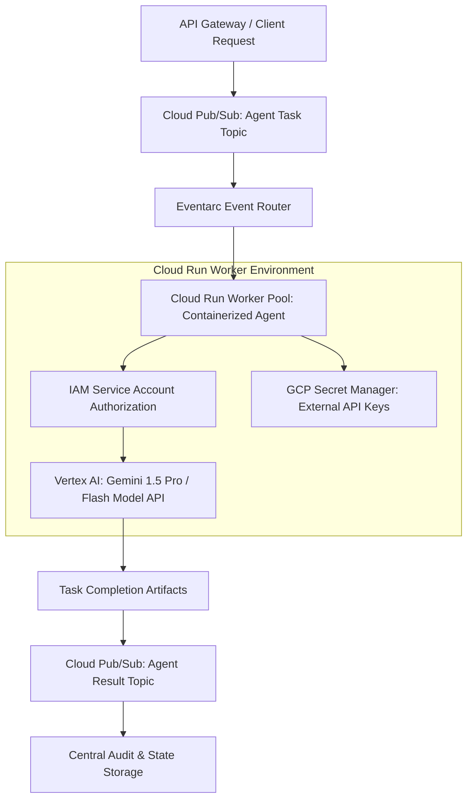

# Building Enterprise Agent Swarms on GCP: Vertex AI, Cloud Run & Eventarc

When transitioning agentic software engineering workflows from experimental local prototypes into enterprise-grade SaaS production, engineering leaders face a distinct infrastructure challenge. 

Local python scripts running agent loops inside monoliths cannot scale to handle hundreds of concurrent user requests. They lack automated secret management, asynchronous task decoupling, enterprise access controls, and zero-trust security boundaries.

To build resilient agentic platforms, Team Leads leverage **Google Cloud Platform (GCP)**. By combining **Cloud Run** serverless worker containers, **Eventarc** event routing, **Cloud Pub/Sub** message queues, and **Vertex AI Agent Builder**, engineering teams can deploy auto-scaling, secure agent swarms.

This article details the architecture and implementation of an enterprise-grade agent orchestration framework on GCP.

---

## 📖 GCP Enterprise Agent Topology

The architecture decouples task dispatching, context lookup, model invocation, and state updates using GCP serverless primitives:



### Key Infrastructure Components
1. **Cloud Run Serverless Containers**: Packaging specialized worker agents into OCI containers. Cloud Run scales worker instances from zero to hundreds based on Pub/Sub queue depth, eliminating idle compute costs.
2. **Eventarc & Cloud Pub/Sub**: Providing asynchronous event-driven transport. Tasks are pushed as JSON payloads onto Pub/Sub topics, allowing Eventarc to trigger Cloud Run workers without synchronous HTTP connection blocking.
3. **Vertex AI & Workload Identity**: Eliminating hardcoded API keys. Cloud Run containers authenticate to Vertex AI foundation models using GCP IAM Service Accounts (`roles/aiplatform.user`) via Workload Identity.

---

## 🛠️ Python Implementation: Eventarc-Triggered GCP Agent Worker

Here is a production Python worker implementation that runs inside a Cloud Run container, consumes event-driven task payloads from Pub/Sub, invokes Gemini via Vertex AI SDK, and publishes execution results back to a Pub/Sub topic:

```python
import os
import json
from flask import Flask, request
from google.cloud import pubsub_v1
import vertexai
from vertexai.generative_models import GenerativeModel, Part

# Initialize Flask app for Cloud Run HTTP Eventarc trigger
app = Flask(__name__)

# Initialize GCP Environment Configuration
PROJECT_ID = os.getenv("GCP_PROJECT_ID", "my-enterprise-gcp-project")
LOCATION = os.getenv("GCP_LOCATION", "us-central1")
RESULT_TOPIC_ID = os.getenv("RESULT_TOPIC_ID", "agent-task-results")

# Initialize Vertex AI SDK with IAM credentials
vertexai.init(project=PROJECT_ID, location=LOCATION)
gemini_model = GenerativeModel("gemini-1.5-pro-002")

# Initialize Pub/Sub Publisher
publisher = pubsub_v1.PublisherClient()
result_topic_path = publisher.topic_path(PROJECT_ID, RESULT_TOPIC_ID)

@app.route("/", methods=["POST"])
def consume_eventarc_task():
    """
    Cloud Run HTTP Endpoint triggered by Eventarc when a new agent task arrives.
    """
    envelope = request.get_json()
    if not envelope:
        return "Invalid JSON Envelope", 400

    # Extract Pub/Sub message payload
    pubsub_message = envelope.get("message", {})
    if not pubsub_message:
        return "Missing Pub/Sub Message Payload", 400

    try:
        # Decode JSON task payload
        task_data_raw = pubsub_message.get("data", "")
        import base64
        task_json = json.loads(base64.b64decode(task_data_raw).decode("utf-8"))
        
        task_id = task_json.get("task_id", "unknown-task")
        task_prompt = task_json.get("prompt", "")
        system_instruction = task_json.get("system_instruction", "You are an expert enterprise code refactoring agent.")

        print(f"🚀 [Cloud Run Agent Worker] Processing Task '{task_id}' via Vertex AI...")

        # 1. Execute Model Invocation on Vertex AI
        response = gemini_model.generate_content(
            contents=[task_prompt],
            generation_config={
                "temperature": 0.2,
                "max_output_tokens": 2048,
                "response_mime_type": "application/json"
            }
        )

        output_text = response.text

        # 2. Construct Result Payload
        result_payload = {
            "task_id": task_id,
            "status": "COMPLETED",
            "worker_container_id": os.getenv("HOSTNAME", "cloud-run-instance"),
            "model": "gemini-1.5-pro-002",
            "output_json": json.loads(output_text)
        }

        # 3. Publish Result back to Pub/Sub for downstream processing
        result_bytes = json.dumps(result_payload).encode("utf-8")
        future = publisher.publish(result_topic_path, data=result_bytes)
        message_id = future.result()
        
        print(f"✅ [Task '{task_id}' Completed] Published result to Pub/Sub message '{message_id}'.")
        return f"Task '{task_id}' Processed Successfully", 200

    except Exception as err:
        print(f"❌ [Agent Worker Error] Failed processing task: {err}")
        return f"Worker Error: {str(err)}", 500

if __name__ == "__main__":
    port = int(os.getenv("PORT", 8080))
    app.run(host="0.0.0.0", port=port)
```

---

## ⚠️ Important GCP Architectural Guardrails

When building agentic platforms on GCP, enforce these infrastructure boundaries:

> [!IMPORTANT]
> **Use Least-Privilege IAM Service Accounts**: Never grant your Cloud Run container service account broad `roles/owner` or `roles/editor` permissions. Grant strictly necessary roles: `roles/aiplatform.user` for Vertex AI and `roles/pubsub.publisher` for task topics.

> [!CAUTION]
> **Enforce Container Execution Timeouts**: Set appropriate HTTP request timeout limits on Cloud Run (e.g. 300 seconds) to prevent runaway, infinite-looping agent worker tasks from exhausting compute resources.

---

## 📈 Real-World Enterprise Impact
Teams migrating agent workflows to GCP report:
* **99.99% Operational Availability**: Serverless Cloud Run containers handle burst traffic seamlessly without manual server provisioning.
* **100% Elimination of Hardcoded API Keys**: IAM Workload Identity authenticates model access securely at the infrastructure layer.
