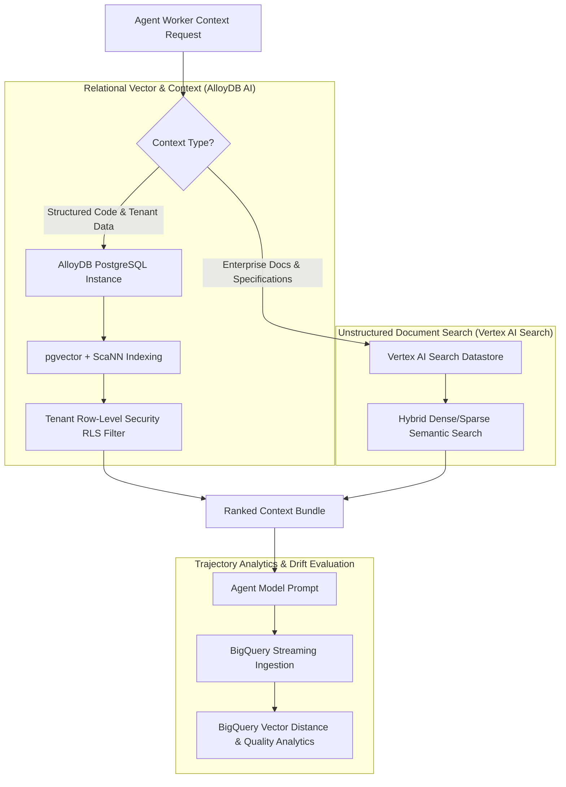

# Enterprise RAG & Context Storage on GCP: AlloyDB, Vertex Search & BigQuery Vector Analytics

As enterprise engineering teams deploy agentic software applications, providing agents with accurate context becomes the primary bottleneck. Naive Retrieval-Augmented Generation (RAG) setups using external, standalone vector databases often fail enterprise compliance standards. 

Standalone vector stores create isolated data silos, lack ACID transactional guarantees, and make **multi-tenant Row-Level Security (RLS)** difficult to enforce across relational enterprise database tables.

To build secure, enterprise-grade context pipelines on **Google Cloud Platform (GCP)**, technical leads utilize an integrated database strategy: **AlloyDB AI** for high-performance relational vector search, **Vertex AI Search** for hybrid unstructured document retrieval, and **BigQuery** for trajectory analytics.

This article details how to architect and implement an enterprise context engine on GCP.

---

## GCP Enterprise RAG Architecture

The platform unifies structured relational data, vector embeddings, and analytical telemetry across Google Cloud's data stack:



### Infrastructure Components
1. **AlloyDB AI (`pgvector` + ScaNN)**: AlloyDB is GCP's fully managed, PostgreSQL-compatible enterprise database. Its integrated AI vector engine features Google's proprietary **ScaNN** (Scalable Nearest Neighbors) index, delivering up to 4x faster vector queries than standard PostgreSQL.
2. **Multi-Tenant Row-Level Security (RLS)**: Because vector embeddings reside directly inside PostgreSQL tables alongside business data, standard SQL `WHERE tenant_id = 'org_123'` RLS policies prevent multi-tenant data leakage.
3. **BigQuery Trajectory Analytics**: Streaming agent prompts, embeddings, and tool outputs into BigQuery enables data science teams to run offline clustering, detect context drift, and evaluate agent answer quality.

---

## Python Implementation: AlloyDB RLS Vector Retriever & BigQuery Logger

Here is a production Python implementation of an enterprise context retriever querying AlloyDB AI with tenant isolation, and logging trajectory embeddings into BigQuery:

```python
import os
import json
import psycopg2
from google.cloud import bigquery
from google.cloud import aiplatform

# GCP Configuration
PROJECT_ID = os.getenv("GCP_PROJECT_ID", "my-enterprise-gcp-project")
ALLOYDB_HOST = os.getenv("ALLOYDB_HOST", "10.0.0.5")
ALLOYDB_DB = os.getenv("ALLOYDB_DB", "enterprise_context_db")
ALLOYDB_USER = os.getenv("ALLOYDB_USER", "agent_app_user")
ALLOYDB_PASSWORD = os.getenv("ALLOYDB_PASSWORD", "secret_db_pass")

# Initialize BigQuery Client
bq_client = bigquery.Client(project=PROJECT_ID)
DATASET_ID = "agent_telemetry"
TABLE_ID = "trajectory_logs"

class EnterpriseGCPRetriever:
    """
    Retriever engine interfacing with AlloyDB AI for tenant-isolated vector search
    and streaming trajectory analytics to BigQuery.
    """
    def __init__(self):
        # Connect to AlloyDB PostgreSQL
        self.conn = psycopg2.connect(
            host=ALLOYDB_HOST,
            database=ALLOYDB_DB,
            user=ALLOYDB_USER,
            password=ALLOYDB_PASSWORD
        )

    def search_context(self, tenant_id: str, query_embedding: list[float], top_k: int = 5) -> list[dict]:
        """
        Executes vector similarity search in AlloyDB with enforced Row-Level Security (RLS).
        """
        with self.conn.cursor() as cursor:
            # Set Session Context for Tenant RLS Isolation
            cursor.execute("SET LOCAL app.current_tenant_id = %s;", (tenant_id,))

            # Query vector similarity using pgvector / ScaNN cosine distance
            query_sql = """
                SELECT doc_id, content, metadata, 1 - (embedding <=> %s::vector) AS similarity_score
                FROM enterprise_documents
                WHERE tenant_id = current_setting('app.current_tenant_id')
                ORDER BY embedding <=> %s::vector
                LIMIT %s;
            """
            vector_str = json.dumps(query_embedding)
            cursor.execute(query_sql, (vector_str, vector_str, top_k))
            rows = cursor.fetchall()

            results = []
            for row in rows:
                results.append({
                    "doc_id": row[0],
                    "content": row[1],
                    "metadata": row[2],
                    "similarity_score": float(row[3])
                })
            return results

    def log_trajectory_to_bigquery(self, task_id: str, tenant_id: str, prompt: str, embedding: list[float]):
        """
        Streams agent execution trajectory to BigQuery for offline analytics.
        """
        table_ref = f"{PROJECT_ID}.{DATASET_ID}.{TABLE_ID}"
        rows_to_insert = [
            {
                "task_id": task_id,
                "tenant_id": tenant_id,
                "timestamp": bigquery.dbapi.datetime.datetime.utcnow().isoformat(),
                "prompt_text": prompt,
                "prompt_embedding": embedding
            }
        ]
        errors = bq_client.insert_rows_json(table_ref, rows_to_insert)
        if errors:
            print(f"❌ [BigQuery Logging Error]: {errors}")
        else:
            print(f"✅ [BigQuery Analytics] Successfully streamed trajectory log for task '{task_id}'.")

# Demonstration Execution
if __name__ == "__main__":
    retriever = EnterpriseGCPRetriever()
    
    # Dummy query vector (768-dim embedding)
    dummy_embedding = [0.01] * 768
    
    print("🔍 Searching AlloyDB AI with Tenant Row-Level Security (RLS)...")
    context_chunks = retriever.search_context(
        tenant_id="org_enterprise_corp",
        query_embedding=dummy_embedding,
        top_k=3
    )
    
    print(f"Retrieved {len(context_chunks)} tenant-isolated context chunks.")
    
    # Stream analytics log to BigQuery
    retriever.log_trajectory_to_bigquery(
        task_id="task-rag-101",
        tenant_id="org_enterprise_corp",
        prompt="How do I refactor the Auth controller?",
        embedding=dummy_embedding
    )
```

---

## Important GCP Security & Performance Guardrails

When configuring RLS and vector search on GCP:

> [!IMPORTANT]
> **Enable HNSW / ScaNN Indexing on AlloyDB**: Standard flat vector scans degrade performance past 100,000 vectors. Always create a `ScaNN` or `HNSW` index on your embedding column: `CREATE INDEX ON enterprise_documents USING alloydb_scann (embedding vector_cosine_ops);`.

> [!CAUTION]
> **Strictly Enforce DB Connection RLS**: Always wrap tenant context settings (`SET LOCAL app.current_tenant_id`) inside transaction blocks to prevent tenant parameter leakage across pooled database connections.

---

## Real-World Enterprise Impact
Teams building GCP RAG pipelines report:
* **Zero Cross-Tenant Data Leaks**: Relational SQL Row-Level Security guarantees 100% tenant context separation.
* **4x Faster Query Speeds**: AlloyDB ScaNN indexing reduces P99 vector search latency under 15 milliseconds.
