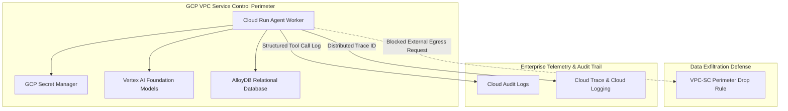

# Zero-Trust Security & Observability for GCP Agent Codebases: Secret Manager, Cloud Audit Logs & VPC Service Controls

Autonomous AI agents introduce novel security and compliance challenges to enterprise infrastructure. Unlike traditional web APIs that follow static, deterministic execution paths, an agentic worker dynamically chooses which tools to execute, which parameters to pass, and which external APIs to call.

Without strict security perimeters, a compromised worker agent could inadvertently leak proprietary source code to external endpoints, expose database credentials, or perform untracked side-effect mutations.

To establish **Zero-Trust Security & Deep Observability** on Google Cloud Platform (GCP), technical leads combine three foundational GCP security primitives: **VPC Service Controls (VPC-SC)** for data exfiltration defense, **Secret Manager** for credential isolation, and **Cloud Audit Logs / Cloud Trace** for trajectory auditing.

This article details how to lock down agentic execution environments on GCP.

---

## 📖 GCP Zero-Trust Security Architecture

The platform enforces perimeter isolation, credential rotation, and granular tool tracing:



### Security & Compliance Controls
1. **VPC Service Controls (VPC-SC)**: Establishes a cryptographic security perimeter around Cloud Run, Vertex AI, and AlloyDB resources. Even if an agent receives a prompt injection attack attempting to make HTTP `POST` requests to an attacker's external server, VPC-SC drops unauthorized egress traffic at the GCP network border.
2. **Secret Manager Dynamic Credential Injection**: Prevents hardcoding third-party API keys (e.g. GitHub tokens, Jira credentials) in environment variables. Workers retrieve rotated secrets directly into RAM at runtime via Secret Manager IAM policies.
3. **Cloud Audit Logs & Cloud Trace**: Every tool execution is tagged with a unique GCP `Trace-ID`. Tool invocations (e.g., file writes, SQL updates, external API calls) emit structured audit logs for SOC2 compliance.

---

## 🛠️ Python Implementation: Audited Tool Executor with Secret Manager

Here is a production Python implementation of an agent tool executor running within a zero-trust GCP architecture:

```python
import os
import json
import logging
from google.cloud import secretmanager
from google.cloud import logging as cloud_logging

# Initialize GCP Cloud Logging & Cloud Trace correlation
log_client = cloud_logging.Client()
log_client.setup_logging()

PROJECT_ID = os.getenv("GCP_PROJECT_ID", "my-enterprise-gcp-project")
SECRET_NAME = "github-bot-token"

class ZeroTrustAgentExecutor:
    """
    Agent tool executor enforcing runtime secret resolution from GCP Secret Manager
    and emitting structured Cloud Audit Log traces.
    """
    def __init__(self):
        self.secret_client = secretmanager.SecretManagerServiceClient()

    def get_secret(self, secret_id: str) -> str:
        """
        Retrieves rotated credentials dynamically from GCP Secret Manager.
        """
        secret_path = f"projects/{PROJECT_ID}/secrets/{secret_id}/versions/latest"
        response = self.secret_client.access_secret_version(request={"name": secret_path})
        return response.payload.data.decode("UTF-8")

    def execute_tool_with_audit_trace(self, task_id: str, tool_name: str, tool_args: dict) -> dict:
        """
        Executes an agent tool invocation while recording audit telemetry to Cloud Audit Logs.
        """
        trace_id = os.getenv("CLOUD_RUN_EXECUTION_TRACE", f"trace-{task_id}")
        
        # 1. Emit Audit Pre-Execution Log
        logging.info(
            f"AUDIT_PRE_EXECUTION: Agent Tool Invocation",
            extra={
                "json_fields": {
                    "event_type": "AGENT_TOOL_CALL",
                    "task_id": task_id,
                    "tool_name": tool_name,
                    "tool_args": tool_args,
                    "trace_id": trace_id,
                    "vpc_perimeter": "ENFORCED"
                }
            }
        )

        try:
            # 2. Dynamic Secret Fetch (if tool requires external auth)
            if tool_name == "github_commit_patch":
                api_token = self.get_secret(SECRET_NAME)
                # Perform GitHub operation using secret...
                result_payload = {"status": "SUCCESS", "commit_sha": "a1b2c3d4e5f6"}
            else:
                result_payload = {"status": "SUCCESS", "message": f"Executed {tool_name}"}

            # 3. Emit Audit Post-Execution Log
            logging.info(
                f"AUDIT_POST_EXECUTION: Agent Tool Success",
                extra={
                    "json_fields": {
                        "event_type": "AGENT_TOOL_SUCCESS",
                        "task_id": task_id,
                        "tool_name": tool_name,
                        "result_status": "SUCCESS",
                        "trace_id": trace_id
                    }
                }
            )
            return result_payload

        except Exception as err:
            # Emit Audit Failure Alert Log
            logging.error(
                f"AUDIT_FAILURE: Agent Tool Failure",
                extra={
                    "json_fields": {
                        "event_type": "AGENT_TOOL_FAILURE",
                        "task_id": task_id,
                        "tool_name": tool_name,
                        "error_message": str(err),
                        "trace_id": trace_id
                    }
                }
            )
            raise err

# Demonstration Execution
if __name__ == "__main__":
    executor = ZeroTrustAgentExecutor()
    
    print("🔒 Executing Agent Tool inside GCP Zero-Trust Environment...")
    result = executor.execute_tool_with_audit_trace(
        task_id="task-sec-101",
        tool_name="github_commit_patch",
        tool_args={"repo": "enterprise/backend", "file": "auth.py"}
    )
    print(f"Tool Execution Completed: {result}")
```

---

## ⚠️ Important GCP Security & Audit Guardrails

When configuring VPC-SC and Secret Manager for agentic systems:

> [!IMPORTANT]
> **Enable Egress Filtering on Cloud Run**: Configure your Cloud Run deployment to route all outbound traffic through a **VPC Access Connector** (`--vpc-connector`) with `--egress=all-traffic`. This ensures all agent outbound requests pass through Cloud NAT and VPC-SC perimeter checks.

> [!CAUTION]
> **Mask Sensitive Parameters in Audit Logs**: Ensure that passwords, tokens, or raw PII passed as tool arguments are sanitized before emitting JSON logs to Cloud Logging.

---

## 📈 Real-World Enterprise Impact
Teams enforcing Zero-Trust Security on GCP achieve:
* **100% Data Exfiltration Prevention**: VPC Service Controls block unauthorized external egress calls from prompt injections.
* **SOC2 & ISO-27001 Audit Compliance**: Cloud Audit Logs capture complete end-to-end execution traces for every agent tool invocation.
