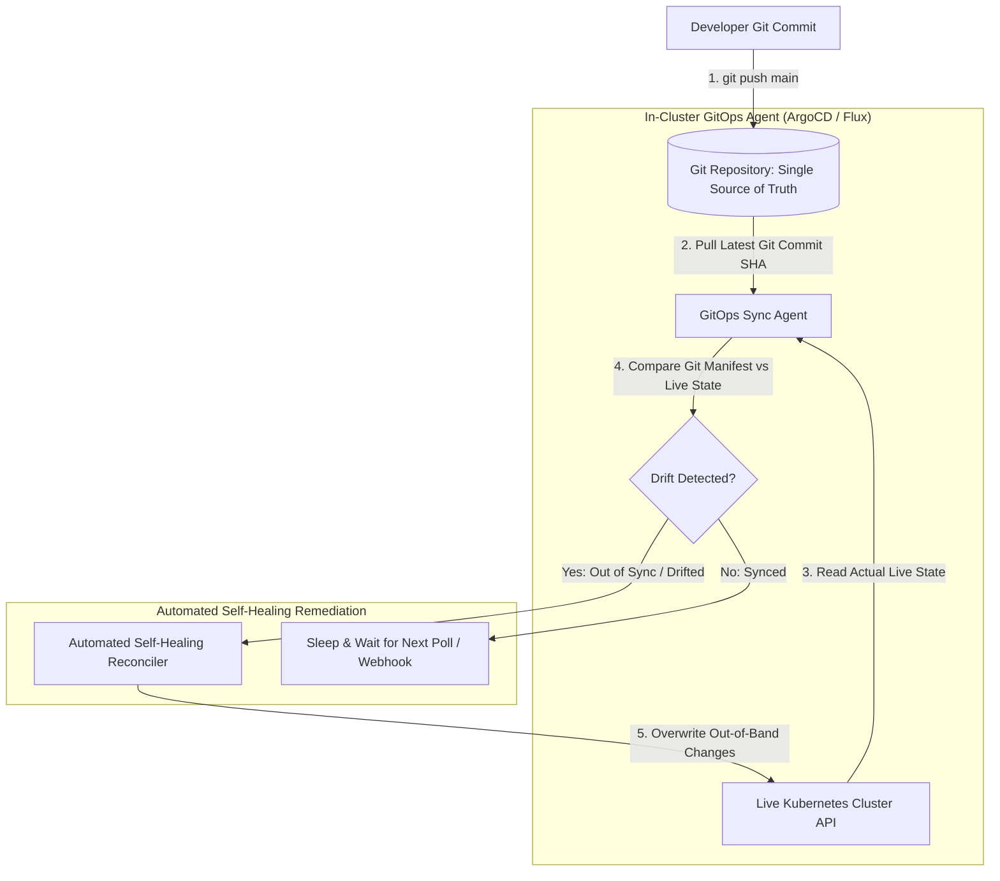

# GitOps Pipeline Engineering: Automated State Drift Detection & Remediation

In traditional CI/CD pipelines, external deployment runners (like Jenkins or GitHub Actions runners) execute imperative deployment commands (`kubectl apply -f manifest.yaml`) pushing changes into production. This **Push-Based** approach requires granting external CI systems cluster-admin credentials, creating significant security risks and potential configuration drift when developers make manual hotfix changes directly in production environments.

To guarantee security and compliance, platform teams adopt the **GitOps Model**.

Under GitOps, **Git is the single source of truth** for both infrastructure configurations and application manifests. A **Pull-Based GitOps Agent** (such as **ArgoCD** or **Flux**) running *inside* the cluster continuously watches Git repositories, detects out-of-band state drift, and automatically remediates live cluster resources.

This article details how to design and build a pull-based GitOps synchronization engine with automated drift remediation.

---

## GitOps Pull-Agent Synchronization Architecture

How an in-cluster GitOps Agent pulls Git commit manifests and heals live cluster state:



### Core GitOps Principles
1. **Declarative Manifests in Git**: The entire system state—including Kubernetes manifests, Helm values, and Terraform configurations—is declared as version-controlled code stored in Git.
2. **Pull-Based In-Cluster Agent**: Instead of opening firewall ports and storing cluster credentials in external CI systems, a lightweight agent running inside the target cluster polls Git (or receives webhooks). The agent pulls changes and applies them locally using in-cluster ServiceAccount permissions.
3. **Automated Self-Healing Drift Remediation**: If an engineer manually alters a production container using `kubectl edit` or AWS Management Console, the GitOps Agent detects the variance between Git `main` and the live environment, instantly triggering a self-healing sync to revert unauthorized changes.

---

## Python Implementation: GitOps Pull-Agent Engine

Here is a production-grade Python implementation of an in-cluster GitOps Agent featuring Git commit SHA tracking, state drift auditing, and automated self-healing remediation:

```python
import time
import hashlib
from typing import Dict, Any, List, Optional
from pydantic import BaseModel, Field

class GitManifest(BaseModel):
    commit_sha: str
    filename: str
    desired_content: Dict[str, Any]

class LiveClusterResource(BaseModel):
    resource_id: str
    actual_content: Dict[str, Any]
    last_synced_sha: str

class GitOpsSyncAgent:
    """
    In-Cluster GitOps Agent that continuously compares Git repo state
    against live cluster resources and executes self-healing remediation.
    """
    def __init__(self, repo_url: str):
        self.repo_url = repo_url
        # Simulated Git Repository HEAD commit
        self.git_head_commit: Optional[GitManifest] = None
        # Simulated Live Kubernetes Cluster: resource_id -> LiveClusterResource
        self.live_cluster: Dict[str, LiveClusterResource] = {}

    def push_git_commit(self, commit_sha: str, filename: str, content: Dict[str, Any]):
        """Simulates a developer pushing a commit to Git main branch."""
        self.git_head_commit = GitManifest(
            commit_sha=commit_sha,
            filename=filename,
            desired_content=content
        )
        print(f" 🔀 [Git Repo] New Commit Pushed: SHA {commit_sha[:8]} -> Config: {content}")

    def sync_and_heal(self):
        """
        Polls Git repository, detects state drift, and enforces self-healing sync.
        """
        if not self.git_head_commit:
            print(" ⏳ [GitOps Agent] No Git manifests found.")
            return

        manifest = self.git_head_commit
        resource_id = manifest.desired_content.get("resource_id", "default-app")
        print(f"\n🔄 [GitOps Agent] Inspecting Sync Status for '{resource_id}' against Git SHA {manifest.commit_sha[:8]}...")

        live_res = self.live_cluster.get(resource_id)

        # 1. State 1: Resource Missing in Cluster (Initial Deploy)
        if not live_res:
            print(f" ➕ [GitOps Sync] Resource missing in cluster. Deploying from Git SHA {manifest.commit_sha[:8]}...")
            self.live_cluster[resource_id] = LiveClusterResource(
                resource_id=resource_id,
                actual_content=manifest.desired_content.copy(),
                last_synced_sha=manifest.commit_sha
            )
            print(f" ✅ [GitOps Sync] Status: SYNCED.")
            return

        # 2. State 2: Compare Git Desired Content vs Live Actual Content
        if live_res.actual_content != manifest.desired_content:
            print(f" 🚨 STATE DRIFT DETECTED!")
            print(f"    Git Desired: {manifest.desired_content}")
            print(f"    Live Actual: {live_res.actual_content}")
            
            # Execute Self-Healing Sync
            print(" 🩹 [Automated Self-Healing] Overwriting live cluster drift with Git source of truth...")
            live_res.actual_content = manifest.desired_content.copy()
            live_res.last_synced_sha = manifest.commit_sha
            print(f" ✅ [GitOps Sync] Status: HEALED & SYNCED.")
        else:
            print(f" ✅ [GitOps Sync] Status: IN_SYNC (Git SHA {manifest.commit_sha[:8]} matches Live Cluster).")

# Demonstration Execution
if __name__ == "__main__":
    agent = GitOpsSyncAgent(repo_url="https://github.com/org/k8s-manifests.git")

    print("🚀 Demonstrating GitOps Pull-Agent & Automated Drift Remediation...")
    print("=" * 75)

    # 1. Developer Pushes Initial Deployment Manifest to Git
    agent.push_git_commit(
        commit_sha="a1b2c3d4e5",
        filename="deployment.yaml",
        content={"resource_id": "payment-api", "replicas": 3, "image": "payment-api:v1.0.0"}
    )

    # Agent Polls and Syncs Cluster
    agent.sync_and_heal()

    # 2. Out-of-Band Incident: Operator manually edits deployment via kubectl
    print("\n🚨 Out-of-Band Manual Drift: Operator runs 'kubectl edit' altering image to 'payment-api:v1.1.0-custom'...")
    agent.live_cluster["payment-api"].actual_content["image"] = "payment-api:v1.1.0-custom"  # Unauthorized Drift!

    # GitOps Agent Polls and Automatically Heals Live Cluster!
    agent.sync_and_heal()

    # 3. Developer Updates Git Repository with V2 Release
    print("\n⚡ Developer merges PR updating image to 'payment-api:v2.0.0' in Git...")
    agent.push_git_commit(
        commit_sha="f9e8d7c6b5",
        filename="deployment.yaml",
        content={"resource_id": "payment-api", "replicas": 5, "image": "payment-api:v2.0.0"}
    )

    # Agent Syncs New Version
    agent.sync_and_heal()
```

---

## GitOps Pipeline Gotchas & Best Practices

When building GitOps deployment pipelines:

> [!IMPORTANT]
> **Enforce Immutable Git History & Branch Protections**: Since Git is the sole authority for production deployments, protect your production branches (`main` or `release/*`) with strict branch rules, requiring signed commits and peer PR approvals before merging.

> [!CAUTION]
> **Store Secrets Using Encryption Tools**: Never commit plain-text API keys or database passwords into Git. Use secret management tools like **Sealed Secrets**, **External Secrets Operator**, or **SOPS** to encrypt secrets before committing them to Git repos.

---

## Real-World Enterprise Impact
Teams deploying GitOps pipelines report:
* **Zero Out-of-Band Production Drift**: In-cluster pull agents continuously audit and revert unauthorized manual changes back to verified Git code states.
* **Streamlined Security Auditing**: Every production change is linked directly to a Git commit SHA, providing complete audit compliance for SOC2 and ISO27001.
