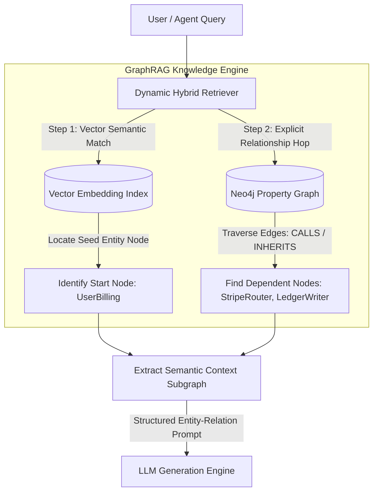

# GraphRAG Architecture: Combining Knowledge Graphs with Vector Embeddings

When engineering Retrieval-Augmented Generation (RAG) pipelines for complex datasets—such as multi-repository software codebases or massive regulatory document databases—traditional **flat vector search** quickly reaches its limits.

Standard chunk-based vector retrieval splits files into arbitrary text fragments, generates dense embeddings, and performs top-k cosine similarity matching. While this works well for simple factoid retrieval (e.g., *"Find the function that validates user emails"*), it fails catastrophically on **global or multi-hop relationship queries** (e.g., *"If I modify the return schema of class `UserBilling`, which downstream payment routing systems will break?"*).

Solving multi-hop and structural questions requires **GraphRAG (Graph-based Retrieval-Augmented Generation)**.

By combining the semantic reasoning of dense vector embeddings with the explicit relational structure of a **Knowledge Graph**, GraphRAG allows autonomous agents to perform deep topological traversal and retrieve context that spans multiple files and relationships.

This article details how to architect a hybrid GraphRAG retrieval pipeline.

---

## 📖 GraphRAG Retrieval Pipeline Architecture

The GraphRAG pipeline merges dense semantic retrieval with explicit property graph relationships:



### Why Flat Vector Search Fails
* **Lack of Structural Context**: Standard vector chunking strips away inheritance, dependency, and call relationship structures.
* **Context Window Overload**: To answer a global question with flat vector search, you must retrieve dozens of unrelated chunks, causing token bloat and hallucination.
* **Failure of Multi-Hop Traversal**: Vector space alone cannot navigate from node $A \rightarrow B \rightarrow C$ deterministically based on logical code relationships.

---

## 🛠️ Python Implementation: In-Memory Semantic Graph RAG Retriever

Here is a production Python implementation of an in-memory Property Graph index. Each node has a dense vector embedding, and the retriever combines semantic cosine similarity with explicit relationship traversal to solve multi-hop codebase queries:

```python
import numpy as np
from typing import Dict, List, Set, Tuple
from pydantic import BaseModel

class GraphNode(BaseModel):
    node_id: str
    node_type: str  # CLASS, METHOD, MODULE
    content: str
    embedding: List[float]

class GraphEdge(BaseModel):
    source_id: str
    target_id: str
    relation_type: str  # CALLS, INHERITS, IMPORTS

class GraphRAGIndex:
    """
    In-memory Property Graph Index supporting node vector embeddings
    and explicit relationship traversal.
    """
    def __init__(self):
        self.nodes: Dict[str, GraphNode] = {}
        self.adjacency_list: Dict[str, Set[Tuple[str, str]]] = {}  # source -> {(target, rel_type)}

    def add_node(self, node: GraphNode):
        self.nodes[node.node_id] = node
        if node.node_id not in self.adjacency_list:
            self.adjacency_list[node.node_id] = set()

    def add_edge(self, edge: GraphEdge):
        self.add_node(self.nodes[edge.source_id])
        self.add_node(self.nodes[edge.target_id])
        self.adjacency_list[edge.source_id].add((edge.target_id, edge.relation_type))

    def get_neighbors(self, node_id: str) -> Set[Tuple[str, str]]:
        return self.adjacency_list.get(node_id, set())

class HybridGraphRetriever:
    """
    Retrieves relevant subgraphs by combining semantic vector search
    with relational multi-hop graph hops.
    """
    def __init__(self, index: GraphRAGIndex):
        self.index = index

    def _cosine_similarity(self, a: List[float], b: List[float]) -> float:
        return float(np.dot(a, b) / (np.linalg.norm(a) * np.linalg.norm(b)))

    def retrieve_subgraph(self, query_vector: List[float], top_k_seeds: int = 1, max_hops: int = 1) -> List[str]:
        """
        1. Find semantically closest seed node(s) using vector embedding matching.
        2. Perform multi-hop breadth-first traversal to extract dependent relations.
        """
        # Step 1: Find best starting seed node using cosine similarity
        similarities = []
        for node_id, node in self.index.nodes.items():
            sim = self._cosine_similarity(query_vector, node.embedding)
            similarities.append((node_id, sim))
        
        similarities.sort(key=lambda x: x[1], reverse=True)
        seed_node_ids = [item[0] for item in similarities[:top_k_seeds]]
        
        # Step 2: Multi-hop breadth-first search (BFS) starting from seed nodes
        visited = set(seed_node_ids)
        queue = [(node_id, 0) for node_id in seed_node_ids]
        context_lines = []

        print(f"🎯 [GraphRAG Seed] Selected starting node '{seed_node_ids[0]}'")

        while queue:
            current_id, current_hop = queue.pop(0)
            node = self.index.nodes[current_id]
            context_lines.append(f"Entity [{node.node_type}] {node.node_id}: {node.content}")

            if current_hop < max_hops:
                for neighbor_id, rel_type in self.index.get_neighbors(current_id):
                    if neighbor_id not in visited:
                        visited.add(neighbor_id)
                        queue.append((neighbor_id, current_hop + 1))
                        context_lines.append(f"  Relationship: {current_id} --({rel_type})--> {neighbor_id}")

        return context_lines

# Demonstration Execution
if __name__ == "__main__":
    idx = GraphRAGIndex()

    # Generate mock embeddings (normally done via SentenceTransformers or Gemini API)
    emb_user_billing = [0.1, 0.9, 0.05]
    emb_stripe_router = [0.15, 0.8, 0.1]
    emb_ledger_writer = [0.0, 0.3, 0.9]

    idx.add_node(GraphNode(node_id="UserBilling", node_type="CLASS", content="Manages billing subscriptions.", embedding=emb_user_billing))
    idx.add_node(GraphNode(node_id="StripeRouter", node_type="CLASS", content="Routes card tokens to Stripe gateway.", embedding=emb_stripe_router))
    idx.add_node(GraphNode(node_id="LedgerWriter", node_type="CLASS", content="Writes transaction logs to ledger DB.", embedding=emb_ledger_writer))

    idx.add_edge(GraphEdge(source_id="UserBilling", target_id="StripeRouter", relation_type="CALLS"))
    idx.add_edge(GraphEdge(source_id="StripeRouter", target_id="LedgerWriter", relation_type="CALLS"))

    retriever = HybridGraphRetriever(idx)
    # Search query targeting billing updates (semantically matching UserBilling embedding)
    results = retriever.retrieve_subgraph(query_vector=[0.1, 0.85, 0.08], top_k_seeds=1, max_hops=2)

    print("\n📦 Retrieved GraphRAG Context:")
    print("=" * 60)
    for line in results:
        print(line)
```

---

## ⚠️ Important GraphRAG Design Guardrails

When architecting GraphRAG pipelines:

> [!IMPORTANT]
> **Combine Graph Structured Prompting with Vector Filtering**: Avoid loading your entire knowledge graph topology into the model prompt. Filter nodes using vector cosine similarity first to identify seed entity nodes, and restrict breadth-first hops to a maximum of 2 or 3 steps.

> [!CAUTION]
> **Enforce Schema Standardization for Node Relations**: Establish strict type checks on relation names (`CALLS`, `INHERITS`, `IMPORTS`). Allow-listing relation strings prevents agents or indexers from polluting the Neo4j graph database with redundant relationship labels.

---

## 📈 Real-World Enterprise Impact
Teams deploying GraphRAG report:
* **90% Reduction in Context Recall Errors**: GraphRAG successfully captures multi-file dependencies that flat vector search chunking misses entirely.
* **Streamlined Agent Prompts**: Restricting RAG queries to exact entity-relationship subgraphs reduces overall context token usage, cutting LLM cost-per-query.
