# GraphRAG & Entity Graphs: Merging Knowledge Graphs with Vector Embeddings

> [!NOTE]
> **📖 Article Overview**
> While standard vector-based RAG excels at local information retrieval, it struggles with global document queries and multi-hop reasoning. This article details **GraphRAG**, an advanced retrieval architecture that overlays structured Knowledge Graphs (nodes, edges, properties) on top of text vector embeddings. We evaluate the core trade-offs of this system—balancing thematic synthesis against high indexing costs—and provide a complete, runable integration pipeline using Python, **LlamaIndex**, and **Neo4j**.

---

## The Limitations of Naive Vector Search

Standard Retrieval-Augmented Generation (RAG) is built on a simple pipeline: split documents into chunks, calculate semantic vector embeddings for each chunk, and retrieve the top-$K$ most similar chunks during query time using cosine similarity.

This approach is highly effective for localized questions (e.g., *"What was the revenue of Company X in Q3?"*). However, it fails catastrophically under two scenarios:

1.  **Multi-Hop Reasoning**: Answering queries where the information is scattered across disparate sections of a document or across multiple files (e.g., *"How did the security vulnerability in Module A affect the data isolation policy in Module C?"*).
2.  **Global Document Synthesis**: Answering thematic questions about the entire corpus (e.g., *"What are the primary structural bottlenecks identified across all engineering audit logs?"*).

Because naive chunking strips away the relationships between entities, the retriever cannot navigate the connections between data blocks. The solution is **GraphRAG** (originally popularized by Microsoft Research), which models documents as structured entities and relationships, mapping them to a unified Knowledge Graph.

---

## Architectural Workflow: From Raw Text to Graph Queries

A production-grade GraphRAG system operates in two distinct phases: **Graph Ingestion & Construction** and **Hybrid Retrieval (Local vs. Global Querying)**.

```mermaid
%%{init: {'theme': 'dark', 'themeVariables': { 'primaryColor': '#0ea5e9', 'primaryTextColor': '#f3f4f6', 'primaryBorderColor': '#38bdf8', 'lineColor': '#0ea5e9', 'secondaryColor': '#111827', 'tertiaryColor': '#111827'}}}%%
graph TD
    A[Raw Text Documents] --> B[LLM Entity Extractor]
    B -->|Extract Nodes & Edges| C[Entity Registry]
    B -->|Compute Text Embeddings| D[Vector Index]
    C --> E[Neo4j Property Graph Store]
    D --> E
    
    subgraph Query Execution Gate
        F[User Query] --> G{Query Classifier}
        G -->|Local Search: Entity Specific| H[Local Query Engine]
        G -->|Global Search: Thematic| I[Global Community Search]
        
        E --> H
        E --> I
        H --> J[Context Aggregator]
        I --> J
    end
    
    J --> K[LLM Synthesis & Response]

    style A fill:#1e293b,stroke:#0ea5e9,stroke-width:2px
    style B fill:#0f172a,stroke:#38bdf8,stroke-width:2px
    style E fill:#0ea5e9,stroke:#0f172a,stroke-width:2px,color:#0f172a
    style G fill:#1e293b,stroke:#a855f7,stroke-width:2px
    style H fill:#111827,stroke:#10b981,stroke-width:2px
    style I fill:#111827,stroke:#eab308,stroke-width:2px
    style K fill:#1e293b,stroke:#0ea5e9,stroke-width:2px
```



### Ingestion Pipeline
1.  **Entity & Relation Extraction**: Documents are parsed by an LLM instructed to extract specific entity classes (e.g., `Person`, `SoftwareComponent`, `Vulnerability`) and relationship links (e.g., `DEPENDS_ON`, `EXPLOITS`, `IMPLEMENTS`).
2.  **Entity Resolution**: Merging duplicate entities (e.g., mapping "API Gateway", "API Gateway Component", and "Gateway Service" to a single node).
3.  **Vector Mapping**: Computing vector representations for every entity's description and saving them to a vector index linked to the graph node.

### Query Pipeline
*   **Local Search**: Navigating the immediate neighbors of a specific entity. Ideal for querying detailed dependencies.
*   **Global Search**: Utilizing hierarchical clustering (like Leiden community detection) to summarize subgroups of the graph. Summaries are pre-calculated, allowing the engine to aggregate thematic answers without traversing the entire database in real-time.

---

## What's Good & What's Not

To make an informed architectural decision, we must weigh the system's pros against its operational overhead:

```
+---------------------------------------------------------------------------------------------------------------------+
|                                              GRAPHRAG TRADE-OFFS MATRIX                                             |
+---------------------------------------------------+-----------------------------------------------------------------+
| What's Good (Pros)                                | What's Not (Cons)                                               |
+---------------------------------------------------+-----------------------------------------------------------------+
| * Multi-Hop Context Navigation: Traverses graph   | * Extreme Indexing Cost: LLM-based entity extraction            |
|   edges to resolve multi-file dependency flows.   |   requires hundreds of API calls per document.                  |
| * Thematic Synthesis: Leiden clustering creates   | * Index Construction Latency: Graph generation for a large      |
|   accurate global summaries of massive corpora.   |   repository can take hours of compute.                         |
| * Structured Data Governance: Properties can contain| * High Memory/Hardware Load: Demands graph databases like       |
|   strict schema constraints, types, and scopes.   |   Neo4j alongside vector indexes, increasing stack complexity.  |
+---------------------------------------------------+-----------------------------------------------------------------+
```

---

## Technical Implementation: Property Graph Indexing with LlamaIndex & Neo4j

Below is a complete, production-ready implementation of a GraphRAG indexing pipeline using Python, **LlamaIndex**, and **Neo4j**. This script parses text documents, extracts entities/relations, loads them into a Neo4j database, and executes a local graph query.

```python
import os
from llama_index.core import SimpleDirectoryReader, StorageContext
from llama_index.core import PropertyGraphIndex
from llama_index.graph_stores.neo4j import Neo4jPropertyGraphStore
from llama_index.llms.openai import OpenAI
from llama_index.embeddings.openai import OpenAIEmbedding

# 1. Enforce API Environment Configurations
os.environ["OPENAI_API_KEY"] = "your-openai-api-key"
NEO4J_URL = "bolt://localhost:7687"
NEO4J_USERNAME = "neo4j"
NEO4J_PASSWORD = "secure_password_here"

# Initialize LLM and Embedding models
llm = OpenAI(model="gpt-4o-mini", temperature=0.1)
embed_model = OpenAIEmbedding(model="text-embedding-3-small")

def construct_graph_rag_pipeline(data_directory_path: str):
    print(f"[*] Reading documents from: {data_directory_path}")
    documents = SimpleDirectoryReader(data_directory_path).load_data()

    # 2. Establish Connection to Neo4j Graph Database
    print("[*] Connecting to Neo4j Property Graph Store...")
    graph_store = Neo4jPropertyGraphStore(
        username=NEO4J_USERNAME,
        password=NEO4J_PASSWORD,
        url=NEO4J_URL,
        database="neo4j"
    )

    # 3. Configure Storage Context
    storage_context = StorageContext.from_defaults(graph_store=graph_store)

    # 4. Construct Property Graph Index
    # This automatically runs entity extraction, relation mapping, and loading
    print("[*] Extracting entities and generating graph. This makes active LLM calls...")
    index = PropertyGraphIndex.from_documents(
        documents,
        storage_context=storage_context,
        llm=llm,
        embed_model=embed_model,
        show_progress=True
    )
    return index

def execute_local_graph_query(index, query_str: str):
    print(f"\n[*] Executing GraphQuery: '{query_str}'")
    query_engine = index.as_query_engine(
        sub_retrievers=["vector", "synonym"], # Performs hybrid lookup inside the graph
        llm=llm
    )
    response = query_engine.query(query_str)
    return response

if __name__ == "__main__":
    # Create temporary directory for testing ingestion
    os.makedirs("./temp_docs", exist_ok=True)
    with open("./temp_docs/sys_arch.txt", "w") as f:
        f.write(
            "The API Gateway Component handles client validation and routes requests to the Billing Service. "
            "The Billing Service depends on PostgreSQL and implements the Stripe payment engine. "
            "A database deadlock in PostgreSQL will cause the Billing Service to throw transaction errors, "
            "which the API Gateway translates to HTTP 500 status codes."
        )

    # Run build pipeline
    graph_index = construct_graph_rag_pipeline("./temp_docs")
    
    # Run a multi-hop dependency query
    res = execute_local_graph_query(
        graph_index, 
        "Explain the propagation chain and system behavior if PostgreSQL experiences a deadlock."
    )
    print("\n[+] GraphRAG Response:")
    print(res)
```

---

## 🏁 Conclusion & Key Takeaways

GraphRAG is not a drop-in replacement for standard vector search, but a powerful extension for complex environments. It transforms the context window from a collection of isolated text fragments into an interconnected web of structured knowledge.

*   **When to deploy**: Use GraphRAG when your application requires thematic summaries, code dependency mapping, or answering questions spread across multiple files.
*   **When to avoid**: For simple semantic searches, qa loops, or low-budget setups, the high indexing cost of GraphRAG makes standard dense-vector indexing (like pgvector) more practical.

In our next article, [Hybrid Search & Reranking: Balancing Dense Retrieval with Sparse BM25 + Cross-Encoders](file:///G:/ReplitProjects/akmalkhaniub.github.io/blog/hybrid-search-reranking-dense-sparse.html), we will explore how to combine keyword-level search with vector lookups to prevent precise database queries from failing.

---

### Research References & Resources
*   **Microsoft Research**: *From Local to Global: A GraphRAG Approach to Query-Focused Summarization* — [arXiv:2404.16130](https://arxiv.org/abs/2404.16130)
*   **LlamaIndex Guide**: [Property Graph Index Documentation](https://docs.llamaindex.ai/)
*   **Neo4j Developer Portal**: [GraphRAG patterns with Neo4j](https://neo4j.com/)
