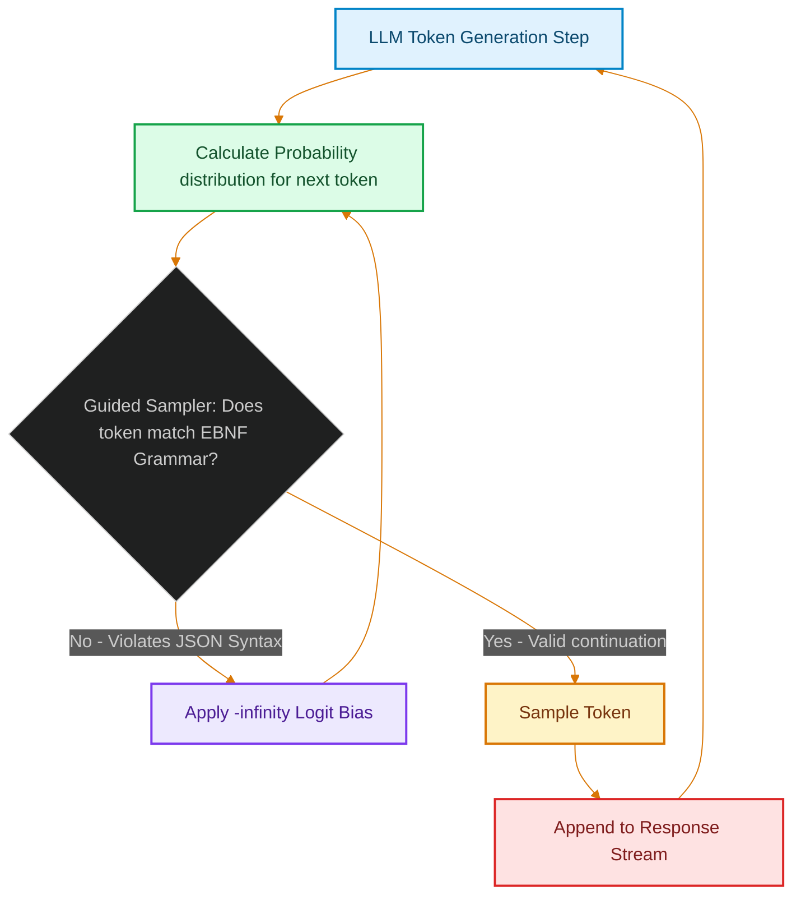

# Hardening Structured LLM Outputs: JSON Schema Constraints and Context-Free Grammars at the Edge

> [!NOTE]
> **📖 Article Overview**
> Feeding LLM outputs directly into downstream API endpoints is risky. Even with detailed system prompts and few-shot examples, models occasionally output Markdown code blocks, omit closing brackets, inject trailing commas, or miss required fields. When parsing fails, your application crashes. This article explores how to enforce 100% structured schema compliance at the token-generation level using **Context-Free Grammars (CFGs)** and guided decoding runtimes (like vLLM and Outlines) at the edge.

---

## The Prompting Deficit: Why Parser Schemes Fail

Traditionally, developers get structured JSON outputs from LLMs by combining system prompts ("always respond in valid JSON") with validation parsers (like Pydantic) [1]. 

This is a reactive approach: the model generates tokens freely, and the parser validates the completed string. If the model generates a single unescaped quote or a missing comma, the entire JSON string becomes invalid, requiring expensive, high-latency API retries.



To solve this, we can act proactively using **Guided Generation**. Instead of parsing after generation, we hook into the model's token selection loop. At each generation step, a compiler parses the JSON schema into a **Context-Free Grammar (EBNF)**. The EBNF analyzer evaluates the partially generated string and flags which tokens are syntactically valid next steps, setting the probability of all invalid tokens to zero.

---

## What is an EBNF Grammar?

An **Extended Backus-Naur Form (EBNF)** grammar defines the syntax rules of a language. For example, a simple grammar forcing the model to only output a valid boolean key-value pair looks like this:

```ebnf
root   ::= "{" space "\"status\":" space boolean "}"
boolean ::= "true" | "false"
space   ::= " " | ""
```

During generation, if the model has output `{"status": `, the only valid next sequences of tokens are those forming the words `true` or `false`. If the model attempts to generate `"` or `1`, the sampler intercepts and filters those tokens out.

---

## Implementing Guided Generation with Outlines

Below is a complete, production-ready Python example using the **Outlines** library to force a local Hugging Face model to return structured user profiles matching a Pydantic schema with 100% reliability.

```python
import pydantic
from typing import List, Optional
import outlines

# 1. Define the target output schema using Pydantic
class UserProfile(pydantic.BaseModel):
    name: str
    age: int
    skills: List[str]
    current_title: Optional[str] = None

# 2. Initialize the local model runtime (uses Transformers/GGUF/vLLM under the hood)
# For this example, we load a lightweight, fast model
model = outlines.models.transformers("Qwen/Qwen2.5-0.5B-Instruct")

# 3. Create the guided generator targeting our Pydantic schema
# Outlines compiles the Pydantic schema into an EBNF grammar automatically
generator = outlines.generate.json(model, UserProfile)

# 4. Define the input prompt
prompt = (
    "Extract the user profile from this text: "
    "Akmal is a 42-year-old staff engineer specializing in Python, Go, and Kubernetes."
)

# 5. Run guided generation
# The model CANNOT generate invalid JSON or violate the schema fields
result: UserProfile = generator(prompt)

# Print verified, type-safe output
print(f"Name: {result.name}")
print(f"Age: {result.age}")
print(f"Skills: {result.skills}")
print(f"Title: {result.current_title}")

# Output is a true Pydantic object instance:
# UserProfile(name='Akmal', age=42, skills=['Python', 'Go', 'Kubernetes'], current_title=None)
```

---

## Edge Guided Decoding vs. Closed API JSON Modes

| Comparison Metric | Edge Guided Generation (vLLM / Outlines) | Closed API JSON Mode (OpenAI / Anthropic) |
| :--- | :--- | :--- |
| **Fidelity Guarantee** | **100% Guaranteed** (Engine-level token masks) | High (95-99% - prompt-based constraints) |
| **Token Sizing Cost** | Zero overhead | Minor token count tax |
| **Custom Grammars** | Yes (Can define arbitrary EBNF rules) | No (Strictly JSON Schema only) |
| **Latency Profile** | Low (Limits active vocabulary sampling) | Standard (Slightly slower search iterations) |

---

## Conclusion & Takeaways

To ensure reliable, crash-free structured data ingestion:
* [ ] **Enforce structured outputs at the engine level**: Stop relying on post-generation regex or JSON parse try-catch blocks. Mask invalid tokens before they are selected.
* [ ] **Leverage Outlines or vLLM**: Use compiler wrappers that translate Pydantic models directly into EBNF grammars for guided decoding.
* [ ] **Minimize nested object depth**: Keep your schemas relatively flat, as deep recursion can slow down grammar validation latency during token selection.
* [ ] **Verify type alignments**: Ensure fields like `Optional` or list allocations are correctly configured in Pydantic, as the model will be forced to output null structures if no value matches. [2]

## References & Further Reading

1. **Kwon, W., et al. (2023)**. *Efficient Memory Management for Large Language Model Serving with PagedAttention*. SOSP. [https://arxiv.org/abs/2309.06180](https://arxiv.org/abs/2309.06180)
2. **Dao, T., et al. (2022)**. *FlashAttention: Fast and Memory-Efficient Exact Attention with IO-Awareness*. NeurIPS. [https://arxiv.org/abs/2205.14135](https://arxiv.org/abs/2205.14135)
3. **Leviathan, Y., Kalman, M., & Matias, Y. (2023)**. *Fast Inference from Transformers via Speculative Decoding*. ICML. [https://arxiv.org/abs/2211.17192](https://arxiv.org/abs/2211.17192)
4. **Vercel Engineering (2025)**. *Next.js 16*. Next.js Blog. [https://nextjs.org/blog/next-16](https://nextjs.org/blog/next-16)
5. **Vercel Engineering (2024)**. *Next.js 15*. Next.js Blog. [https://nextjs.org/blog/next-15](https://nextjs.org/blog/next-15)
6. **Vercel Documentation (2026)**. *Caching in Next.js*. Next.js Docs. [https://nextjs.org/docs/app/getting-started/caching](https://nextjs.org/docs/app/getting-started/caching)
7. **React Team (2024)**. *React Server Components and Related RFCs*. reactjs/rfcs. [https://github.com/reactjs/rfcs](https://github.com/reactjs/rfcs)
