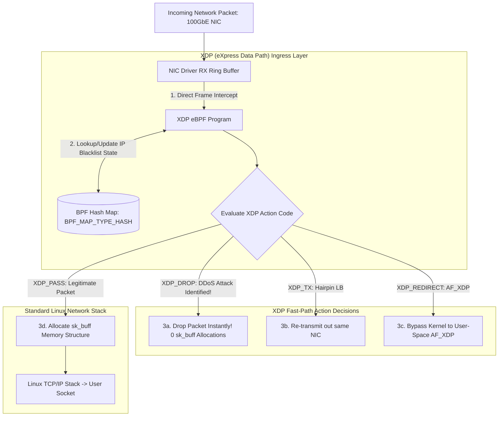

# High-Speed Packet Processing: XDP (eXpress Data Path) & BPF Map State Engines

In high-throughput edge network infrastructure (**Cloudflare**, **Cilium**, **Katran**), processing incoming network packets using traditional Linux networking stack abstractions introduces severe latency and CPU performance overheads.

In standard Linux network ingress, every incoming packet forces the NIC driver to allocate a complex kernel socket buffer memory structure (`struct sk_buff`), allocate memory, parse headers, and trigger CPU software interrupts—long before firewall rules (`iptables` / `nftables`) can inspect or drop the packet.

During a volumetric Distributed Denial of Service (DDoS) attack (receiving $50,000,000$ malicious packets per second), the CPU starves simply allocating `sk_buff` structures, causing host kernel crashes.

To achieve wire-speed packet processing, Linux introduced **XDP (eXpress Data Path)**.

XDP executes eBPF programs **directly inside the NIC driver RX ring buffer** before `sk_buff` allocation, making decisions in sub-nanosecond time.

This article details XDP driver hooks, packet action codes (`XDP_DROP`, `XDP_TX`, `XDP_REDIRECT`), and BPF Map state sharing.

---

## XDP Networking Ingress & BPF Map State Architecture

How XDP intercepts raw ethernet frames at the NIC driver layer before traditional Linux kernel stack processing:



### Core XDP Architecture Principles
1. **Driver-Level Packet Intercept**: XDP executes eBPF bytecode inside the main receive ring (`RX`) of the network driver, operating on raw Direct Memory Access (DMA) memory descriptors (`struct xdp_buff`).
2. **Sub-Nanosecond Action Codes**:
   * `XDP_DROP`: Instantly drops the packet, recycling its DMA memory buffer back to the NIC ring. A single Linux server can drop over **$40,000,000$ packets/sec per core**!
   * `XDP_TX`: Bounces the packet back out of the exact same network interface it entered, modifying IP/MAC headers (the engine powering Meta's **Katran** Layer-4 Load Balancer).
   * `XDP_REDIRECT`: Bypasses the OS network stack entirely, streaming raw frames to another network interface or directly into a zero-copy **AF_XDP socket**.
   * `XDP_PASS`: Allows the packet to proceed up into the standard Linux TCP/IP stack.
3. **BPF Map State Storage**: eBPF programs are stateless by design. To maintain dynamic state (such as blacklisted IP addresses or connection tracking tables), eBPF programs read and write to **BPF Maps** (`BPF_MAP_TYPE_HASH`, `BPF_MAP_TYPE_LRU_HASH`). User-space control daemons update BPF maps asynchronously via `bpf()` system calls.

---

## Python Implementation: XDP DDoS Packet Filter & BPF Map Engine

Here is a production-grade Python implementation of an XDP Packet Processing Engine with DDoS IP Filtering and BPF Map State Management:

```python
import struct
from typing import Dict, List, Tuple, Optional
from pydantic import BaseModel

class XDPAction:
    XDP_ABORTED = 0
    XDP_DROP = 1
    XDP_PASS = 2
    XDP_TX = 3
    XDP_REDIRECT = 4

class PacketHeader(BaseModel):
    src_ip: str
    dst_ip: str
    src_port: int
    dst_port: int
    protocol: str  # "TCP", "UDP"

class BPFHashMap:
    """
    Simulates a Linux BPF Kernel Hash Map (BPF_MAP_TYPE_HASH).
    """
    def __init__(self, max_entries: int = 1000):
        self.max_entries = max_entries
        self.map_data: Dict[str, int] = {}  # {key: packet_count}

    def lookup(self, key: str) -> Optional[int]:
        return self.map_data.get(key)

    def update(self, key: str, value: int):
        self.map_data[key] = value

    def delete(self, key: str):
        if key in self.map_data:
            del self.map_data[key]

class XDPRxPacketEngine:
    """
    Simulates an XDP Driver Ingress Program for Wire-Speed DDoS Protection.
    """
    def __init__(self):
        self.blacklist_bpf_map = BPFHashMap()
        self.metrics_bpf_map = BPFHashMap()

    def process_raw_packet(self, pkt: PacketHeader) -> Tuple[int, str]:
        """
        Sub-nanosecond XDP Ingress Decision Function.
        """
        # 1. Check BPF Blacklist Map
        if self.blacklist_bpf_map.lookup(pkt.src_ip) is not None:
            # Increment Drop Metric
            current_drops = self.metrics_bpf_map.lookup(pkt.src_ip) or 0
            self.metrics_bpf_map.update(pkt.src_ip, current_drops + 1)
            
            print(f" 💣 [XDP_DROP] Instantly Dropped DDoS Packet from '{pkt.src_ip}'! (0 sk_buff allocations)")
            return (XDPAction.XDP_DROP, "XDP_DROP")

        # 2. Legitimate Packet: Pass up to Linux TCP/IP Stack
        print(f" 🟢 [XDP_PASS] Legitimate Packet from '{pkt.src_ip}' -> Passed to Linux TCP/IP Stack")
        return (XDPAction.XDP_PASS, "XDP_PASS")

# Demonstration Execution
if __name__ == "__main__":
    xdp_engine = XDPRxPacketEngine()

    print("🚀 Demonstrating High-Speed XDP Packet Processing & BPF Maps...")
    print("=" * 75)

    # 1. User-Space Daemon Blacklists Malicious Attacker IP in BPF Map
    attacker_ip = "192.168.1.66"
    xdp_engine.blacklist_bpf_map.update(attacker_ip, 1)
    print(f" 🛡️ [User-Space Daemon] Inserted Attacker IP '{attacker_ip}' into BPF Blacklist Map")

    # 2. Simulate Incoming Wire Packets
    packets = [
        PacketHeader(src_ip="10.0.0.15", dst_ip="10.0.0.1", src_port=54321, dst_port=80, protocol="TCP"),
        PacketHeader(src_ip=attacker_ip, dst_ip="10.0.0.1", src_port=44444, dst_port=80, protocol="UDP"),
        PacketHeader(src_ip=attacker_ip, dst_ip="10.0.0.1", src_port=44445, dst_port=80, protocol="UDP"),
        PacketHeader(src_ip="10.0.0.20", dst_ip="10.0.0.1", src_port=12345, dst_port=443, protocol="TCP"),
    ]

    print("\n🌐 Processing 4 Wire Network Packets at NIC Driver Layer:")
    for idx, pkt in enumerate(packets):
        action_code, action_str = xdp_engine.process_raw_packet(pkt)

    # 3. Read BPF Metric Map
    total_drops = xdp_engine.metrics_bpf_map.lookup(attacker_ip)
    print(f"\n📊 BPF Map Drop Counter for '{attacker_ip}': {total_drops} packets dropped at wire speed.")
```

---

## XDP Networking Gotchas & Best Practices

When engineering XDP networking drivers:

> [!IMPORTANT]
> **Ensure NIC Driver Supports Native XDP (`XDP_FLAGS_DRV_MODE`)**: XDP operates in 3 modes: **Native DRV** (processed in NIC driver, fastest), **Offloaded HW** (executed directly on SmartNIC ASIC), and **Generic SKB** (fallback mode in kernel stack, slower). Always verify NIC driver support (e.g. `i40e`, `mlx5`, `ixgbe`).

> [!CAUTION]
> **Always Perform Bounds Checks on Packet Offsets**: eBPF verifiers strictly enforce that all ethernet, IP, and TCP header offset reads perform explicit bounds checks (`data + sizeof(struct iphdr) <= data_end`) before accessing packet bytes. Missing a bounds check causes verifier load rejection.

---

## Real-World Enterprise Impact
Platforms implementing XDP packet filtering (such as **Cloudflare** and **Meta Katran**) report:
* **Over $100\times$ Higher DDoS Mitigating Capacity**: Dropping malicious packets before `sk_buff` memory allocation allows nodes to withstand multi-terabit volumetric attacks.
* **Low-Latency Edge Load Balancing**: Hairpinning packets (`XDP_TX`) processes over $20,000,000$ load-balanced requests per second on standard commodity hardware.
