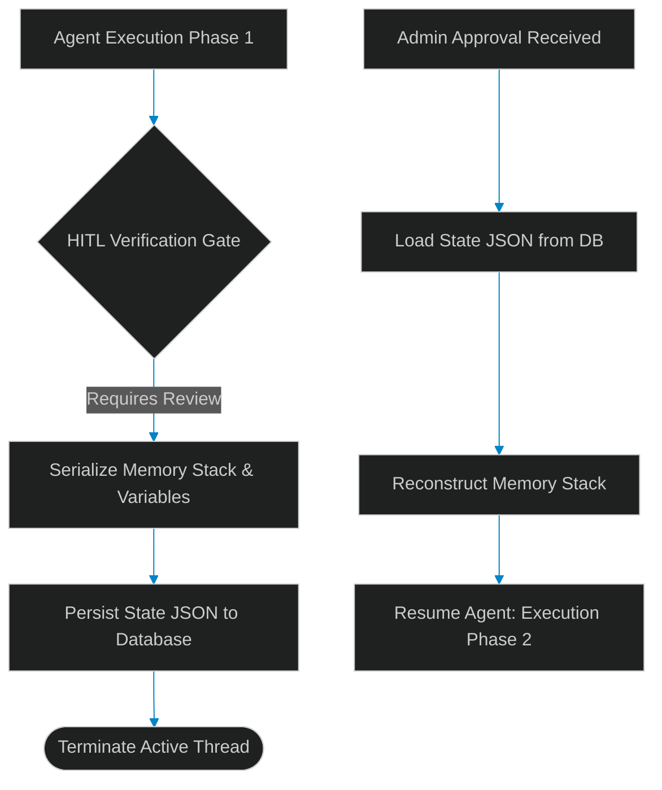

# Asynchronous Checkpoint Persistence: Designing Pause-and-Resume State Machines

> [!NOTE]
> **📖 Article Overview**
> Multi-agent workflows are non-deterministic, long-running processes. When an agent performs high-risk actions—such as initiating a banking transfer or committing direct code changes to main branches—it must pause for human verification. Keeping execution threads active in RAM while waiting for an approval callback is extremely expensive and fragile. In this article, we analyze **Asynchronous Checkpointing**, design state-serialization models, and implement a JSON state persistence manager in Python.

---

## The Fragility of Blocking Execution Threads

In basic code structures, developers wait for input using blocking loops (e.g. `input()`). In multi-agent services handling thousands of concurrent users, keeping system threads active during a human-in-the-loop (HITL) gate introduces several problems:
* **Resource Exhaustion**: Active threads consume memory, thread pools, and database connections.
* **Server Crash Risk**: If the host container restarts while waiting for a 2-hour approval callback, the agent's progress is lost forever.
* **The Solution**: **Checkpointing**. When hitting an approval gate, the state machine serializes the agent's variables (memory stack, history logs, tool history), saves the payload to a persistent database, and terminates the active process. When the callback resumes the task, the runner fetches the state, reconstructs the agent, and continues execution.



---

## 1. Under the Hood: Serializing the Agent Context

To checkpoint a running agent, the state store must serialize its execution scope:
* **The History Stack**: The complete chain of chat tokens, tool executions, and model responses.
* **Metadata Pointers**: Pointers tracking the current step in the execution graph.
* **Configuration State**: Variables and tool permissions associated with the session.

---

## 2. Setting up Non-Blocking State Stores

A production-grade checkpointer uses:
1. **Asynchronous Drivers**: Writing serialization blocks asynchronously using async database adaptors to prevent blocking other processing loops.
2. **Schema Validation**: Using Pydantic models to assert that the state configuration schema matches the application version upon load.

---

## Code Demo: Asynchronous Agent State Checkpointer

Below is a Python script modeling a state serialization checkpointer. It runs a multi-step task, serializes memory and states to a mock database file, pauses execution, and reconstructs the session parameters upon resumption.

```python
import json
from typing import Dict, Any, List

class AgentCheckpointStore:
    def __init__(self):
        # Database mock storing serialized agent sessions
        self._db: Dict[str, str] = {}

    def save_checkpoint(self, session_id: str, memory_stack: List[str], current_step: str, config: Dict[str, Any]):
        payload = {
            "session_id": session_id,
            "memory_stack": memory_stack,
            "current_step": current_step,
            "config": config
        }
        # Serialize to JSON string
        self._db[session_id] = json.dumps(payload, indent=2)
        print(f"💾 [Checkpointer] Checkpoint persisted for session '{session_id}' (Step: {current_step}).")

    def load_checkpoint(self, session_id: str) -> Dict[str, Any]:
        raw_payload = self._db.get(session_id)
        if not raw_payload:
            raise KeyError(f"No checkpoint found for session: {session_id}")
        print(f"📥 [Checkpointer] Checkpoint loaded for session '{session_id}'.")
        return json.loads(raw_payload)

if __name__ == "__main__":
    store = AgentCheckpointStore()
    session = "SESSION-808"

    # Agent runs Phase 1: Planning and Code Generation
    print("🚀 [Agent] Starting Execution Phase 1...")
    memory = [
        "System: You are an agent tasked with updating the API database schema.",
        "Agent: I will generate the migration script and run safety validations.",
        "Agent: Migration script completed. Awaiting review before running deployment tool."
    ]
    agent_config = {"VRAM_limit_gb": 16.0, "user_id": "usr_99"}

    # Save state and terminate the execution process
    store.save_checkpoint(
        session_id=session,
        memory_stack=memory,
        current_step="AWAITING_HUMAN_APPROVAL",
        config=agent_config
    )
    print("💤 [System] Execution thread suspended. Memory cleared.")

    # ... Time passes (e.g. human reviewer clicks Approve in Jira) ...
    print("\n" + "="*50 + "\n")
    print("🔔 [System] Approval Webhook received! Resuming execution...")

    # Load state from database
    checkpoint = store.load_checkpoint(session)

    # Reconstruct variables and resume Agent Phase 2
    resumed_memory = checkpoint["memory_stack"]
    resumed_step = checkpoint["current_step"]
    
    print(f"👉 Resumed Step: {resumed_step}")
    print("👉 Reconstructed Memory Logs:")
    for line in resumed_memory:
        print(f"   {line}")
```

---

## Architectural Guidelines

* **Serialize at Graph Boundaries**: Only serialize agent states at clean graph transition boundaries, avoiding mid-execution tool locks.
* **Secure State Payload**: Encrypt serialized state values stored in your database to prevent unauthorized developers from viewing API key context.
* **Validate Schemas**: Always check state schema version indicators upon load to prevent deprecated parameters from causing runtime exceptions.
