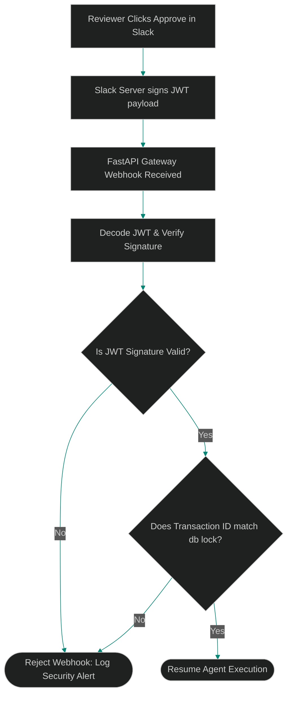

# JWT-Verified Approval Callbacks: Securing Human Review Gates against Context Injection

> [!NOTE]
> **📖 Article Overview**
> Resuming a suspended agent process via Webhooks introduces significant security vulnerabilities. If an attacker intercepts or spoofs an approval callback, they can trigger unauthorized agent execution or inject malicious command payloads. To protect human-in-the-loop (HITL) gates, engineers must implement **JWT-Verified Callbacks**. By wrapping approvals in cryptographically signed JSON Web Tokens, we verify client identities and prevent payload injections. In this article, we map callback vulnerability vectors and implement a JWT validation endpoint in Python.

---

## The Callback Spoofing Threat

When an agent pauses to await approval, it exposes a callback URL (e.g. `POST /api/v1/sessions/{id}/resume`).

If this endpoint is unsecured:
* **Webhook Spoofing**: An attacker can guess the session ID and trigger a resume call, bypassing the human approval gate.
* **Context Hijacking**: An attacker can inject modified parameters inside the webhook payload (e.g. changing the target branch from `release/v1` to a malicious repository fork).
* **The Solution**: **JWT signatures**. The approval client (e.g. Slack App or Jira Webhook) signs the callback payload with a shared secret or a private key. The API gateway verifies the signature, decodes the claims, and matches the transaction before resuming.



---

## 1. Structuring the JWT Approval Token

The token claims must specify the exact execution constraints:
* **Issuer (`iss`)**: Verifying that the callback originated from the authorized approval app (e.g., Slack Integration).
* **Subject (`sub`)**: The target agent session ID to resume.
* **Task Hash (`hash`)**: A cryptographic hash of the approved code change. If the code changes between the time the agent pauses and the admin approves, the hash fails, preventing outdated deployments.

---

## 2. Setting up Public-Key Signature Verification

Using asymmetric cryptography (RS256) is recommended:
1. The approval client signs the token using its **private key**.
2. The agent gateway decodes the token using the client's public keys fetched via JWKS (JSON Web Key Sets) endpoints.
3. This ensures that even if the network channel is compromised, the signature cannot be forged.

---

## Code Demo: Secure JWT Callback Validator

Below is a Python implementation of a secure callback gate. It verifies JWT signatures, extracts claims, and asserts that the task parameters match transaction schemas before resuming the agent.

```python
import time
import hmac
import hashlib
import base64
import json
from typing import Dict, Any, Tuple

# Shared secret for HMAC-SHA256 signature simulation (HS256)
# In production, use asymmetric RS256 with public/private keys
SHARED_SECRET = "super-secret-validation-key"

class SecureCallbackGateway:
    def __init__(self, secret: str):
        self.secret = secret

    def generate_signed_token(self, payload: Dict[str, Any]) -> str:
        # Base64url encode header
        header = {"alg": "HS256", "typ": "JWT"}
        header_b64 = self._b64_encode(json.dumps(header))
        
        # Base64url encode payload
        payload_b64 = self._b64_encode(json.dumps(payload))
        
        # Compute HMAC signature
        signature = self._compute_signature(header_b64, payload_b64)
        return f"{header_b64}.{payload_b64}.{signature}"

    def verify_and_resume(self, token: str, expected_session: str, expected_hash: str) -> Tuple[bool, str]:
        parts = token.split(".")
        if len(parts) != 3:
            return False, "Malformed token structure."

        header_b64, payload_b64, signature = parts

        # 1. Verify cryptographic signature
        expected_sig = self._compute_signature(header_b64, payload_b64)
        if not hmac.compare_digest(signature, expected_sig):
            return False, "Security Alert: Invalid cryptographic signature!"

        # 2. Decode claims
        payload = json.loads(self._b64_decode(payload_b64))

        # 3. Assert expiration claim
        if payload.get("exp", 0) < time.time():
            return False, "Token has expired."

        # 4. Assert Subject and Task Hash constraints
        if payload.get("sub") != expected_session:
            return False, f"Subject mismatch: expected {expected_session}, found {payload.get('sub')}."

        if payload.get("task_hash") != expected_hash:
            return False, "Security Alert: Task hash mismatch. Approved code has been modified!"

        return True, f"Token Verified. Resuming session {expected_session} with action: {payload.get('action')}."

    def _b64_encode(self, s: str) -> str:
        return base64.urlsafe_b64encode(s.encode()).decode().rstrip("=")

    def _b64_decode(self, s: str) -> str:
        padding = "=" * (4 - len(s) % 4)
        return base64.urlsafe_b64decode(s + padding).decode()

    def _compute_signature(self, header: str, payload: str) -> str:
        message = f"{header}.{payload}".encode()
        sig = hmac.new(self.secret.encode(), message, hashlib.sha256).digest()
        return base64.urlsafe_b64encode(sig).decode().rstrip("=")

if __name__ == "__main__":
    gateway = SecureCallbackGateway(SHARED_SECRET)
    session_id = "SESSION-808"
    code_hash = "sha256-abc123xyz"

    # Slack App creates an approval payload
    claims = {
        "iss": "slack-approval-app",
        "sub": session_id,
        "task_hash": code_hash,
        "action": "APPROVE_DEPLOYMENT",
        "exp": int(time.time()) + 60 # Valid for 60 seconds
    }

    # Generate token
    signed_token = gateway.generate_signed_token(claims)
    print(f"🎟️ Generated signed JWT Token: {signed_token[:40]}...[truncated]")

    # Case 1: Verification succeeds
    print("\n[Callback 1] Submitting valid token...")
    success, msg = gateway.verify_and_resume(signed_token, session_id, code_hash)
    print(f"Result: **{success}** | Message: {msg}")

    # Case 2: Attack simulation (tampered payload - changing action to bypass validation)
    parts = signed_token.split(".")
    tampered_payload = {"iss": "slack-approval-app", "sub": session_id, "task_hash": code_hash, "action": "BYPASS_APPROVAL", "exp": claims["exp"]}
    tampered_token = f"{parts[0]}.{gateway._b64_encode(json.dumps(tampered_payload))}.{parts[2]}"

    print("\n[Callback 2] Submitting tampered token...")
    success, msg = gateway.verify_and_resume(tampered_token, session_id, code_hash)
    print(f"Result: **{success}** | Message: {msg}")
```

---

## Security Takeaways for Technical Leads

* **Reject Raw Webhooks**: Never expose unauthenticated callback endpoints to resume agent pipelines. Enforce JWT signature verification.
* **Pin Task Hashes**: Include cryptographic hashes of the agent's work payloads inside the JWT claims to block modification between pause and resume states.
* **Enforce Expiration Limits**: Keep token expirations short (under 5 minutes) to prevent replay attacks on callback controllers.
