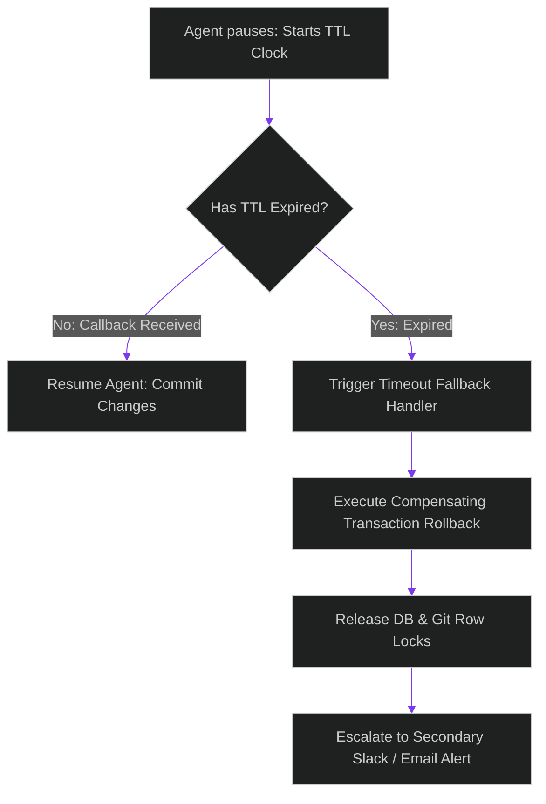

# TTL Escalation & Fallback: Managing Timed-Out Approvals in Agent Pipelines

> [!NOTE]
> **📖 Article Overview**
> Designing human-in-the-loop (HITL) gates inside agent workflows introduces operational risks: what happens when an agent pauses to ask a human manager for deployment approval, but the manager is away from their keyboard? Leaving database locks active, resources allocated, or systems suspended indefinitely compromises system stability. In this article, we analyze **Time-to-Live (TTL) escalations**, map fallback topologies, and implement an automated timeout monitor and rollback script in Python.

---

## The Operational Risk of Suspended State Locks

When an agent halts mid-transaction to await validation:
* **Active Resource Locking**: The agent might hold open database connections, pessimistic row locks, or staged branch files.
* **Pipeline Staging**: Staged feature branches remain unmerged, blocking subsequent developer deployments.
* **The Solution**: **TTL Expirations**. We assign a strict Time-to-Live limit to every human approval request. If the TTL expires without validation, a daemon process triggers a fallback plan, rolls back database transactions, and alerts backup managers.



---

## 1. Designing Escalation Topologies

When a TTL expires, we choose between two main fallback topologies:
* **Passive Rollback**: Reverting all staged changes and moving the ticket back to the `Todo` queue.
* **Active Re-Routing**: Promoting the approval request to a secondary queue (e.g. escalating from a single team lead to a team-wide channel or a senior director).
* **Compensating Transactions**: Running inverse API operations to clean up any temporary files or sandbox allocations created during Phase 1.

---

## 2. Setting up Reliable Daemon Schedulers

In production systems:
1. **Cron Daemons**: Running background monitors (using Redis keys with TTL expiries, or Celery beat schedules) to check for expired session states.
2. **Idempotence**: Ensuring that rollback triggers can be safely executed multiple times without side effects if network errors cause duplicate trigger firings.

---

## Code Demo: Automated Timeout Monitor and Rollback Manager

Below is a Python implementation of a TTL task monitor. It tracks pending approvals, simulates clock progression, and triggers rollback hooks when a task exceeds its allotted window.

```python
import time
from typing import Dict, Any, List

class TaskTimeoutMonitor:
    def __init__(self):
        # Database containing task states, start times, and TTL limits
        self.task_store: Dict[str, Dict[str, Any]] = {
            "TASK-301": {
                "status": "AWAITING_APPROVAL",
                "start_time": time.time() - 3600, # Created 1 hour ago
                "ttl_seconds": 1800,              # 30-minute limit (Expired)
                "resources": ["db_lock_usr_301", "staged_branch_v1"],
                "rollback_action": "REVERT_STAGED_BRANCH"
            },
            "TASK-302": {
                "status": "AWAITING_APPROVAL",
                "start_time": time.time() - 60,   # Created 1 minute ago
                "ttl_seconds": 1800,              # 30-minute limit (Active)
                "resources": ["db_lock_usr_302"],
                "rollback_action": "RELEASE_DATABASE_LOCK"
            }
        }

    def process_timeouts(self) -> List[str]:
        now = time.time()
        escalated_tasks = []

        for task_id, task in self.task_store.items():
            if task["status"] != "AWAITING_APPROVAL":
                continue

            elapsed = now - task["start_time"]
            limit = task["ttl_seconds"]

            if elapsed > limit:
                print(f"\n🚨 [Monitor] Task '{task_id}' has expired! Elapsed: {int(elapsed)}s, Limit: {limit}s.")
                self._execute_rollback(task_id, task)
                escalated_tasks.append(task_id)
                
        return escalated_tasks

    def _execute_rollback(self, task_id: str, task: Dict[str, Any]):
        action = task["rollback_action"]
        resources = task["resources"]
        
        print(f"⚙️ [Rollback Engine] Executing Compensating Action: '{action}' for task {task_id}.")
        print(f"   Releasing resources: {resources}")
        
        # Update database record status
        task["status"] = "TIMEOUT_ESCALATED"
        task["resources"] = []
        print(f"✅ [Rollback Engine] Task {task_id} successfully rolled back and clean.")

if __name__ == "__main__":
    monitor = TaskTimeoutMonitor()

    print("🕰️ Running background task timeout scans...")
    print("------------------------------------------")

    # Run check
    escalations = monitor.process_timeouts()

    print("\n" + "="*50)
    print("🏁 Scan Complete.")
    print(f"👉 Escalated Task IDs: {escalations}")
```

---

## Architectural Guidelines

* **Set Strict TTL Limits**: Never allow agent processes to pause indefinitely. Always attach a Time-To-Live expiration limit to every human review request.
* **Design Compensating Actions**: For every state modification executed in Phase 1, define a reverse compensating action to clean up changes upon timeout.
* **Escalate, Don't Fail Silently**: Configure email or PagerDuty alerts to flag escalated timeouts, ensuring critical tasks are not forgotten in the queue.
