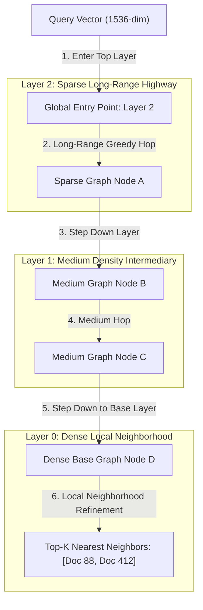

# Hierarchical Navigable Small World (HNSW) Graphs for Fast Vector Search

With the rapid adoption of Large Language Models (LLMs), Retrieval-Augmented Generation (RAG), and semantic search engines, modern applications represent unstructured data (text, images, audio) as high-dimensional floating-point **Vector Embeddings** (e.g., $1536$-dimensional vectors generated by OpenAI `text-embedding-3-large`).

Finding the most relevant documents requires computing vector similarity metrics—such as **Cosine Similarity** or **Euclidean Distance ($L_2$)**—between a query vector and millions of stored embeddings.

Executing a brute-force exact $k$-Nearest Neighbor ($k$-NN) search across 10 million $1536$-dimensional vectors requires $15$ billion floating-point operations per query, taking seconds to return results.

To achieve sub-millisecond query latencies with high recall, modern vector databases (**Pinecone**, **Milvus**, **Qdrant**, **pgvector**) utilize **Hierarchical Navigable Small World (HNSW)** graphs.

This article details the multi-layer graph architecture and greedy routing algorithms of HNSW.

---

## HNSW Multi-Layer Graph & Greedy Routing Architecture

How multi-layer HNSW graphs enable logarithmic $O(\log N)$ vector search:



### Core HNSW Graph Mechanics
1. **Multi-Layer Skip-List Graph Architecture**: HNSW combines the concepts of 1D Skip-Lists with Proximity Graphs. The index consists of multiple hierarchical layers:
   * **Top Layers ($l = L_{\text{max}}$)**: Contain sparse nodes connected by long-range "highway" edges. Used for fast global routing across large vector space distances.
   * **Base Layer ($l = 0$)**: Contains all $N$ vectors connected in a dense local proximity graph. Used for local neighborhood refinement to achieve high recall ($>98\%$).
2. **Probability Node Assignment**: When inserting a new vector, its maximum layer level $l$ is selected randomly using an exponential decay distribution: $l = \lfloor -\ln(\text{uniform}(0, 1)) \cdot m_L \rfloor$.
3. **Greedy Routing Search**: Search begins at the top-layer entry point. At each layer, the algorithm greedily hops to the adjacent neighbor closest to the query vector. When a local minimum is reached on layer $l$, the current nearest node becomes the entry point for layer $l-1$, repeating until reaching layer 0.

---

## Python Implementation: Multi-Layer HNSW Graph Engine

Here is a production-grade Python simulation of a Multi-Layer HNSW Graph Vector Index with Cosine Distance and greedy nearest-neighbor routing:

```python
import math
import random
from typing import List, Dict, Tuple, Set
from pydantic import BaseModel

def cosine_distance(v1: List[float], v2: List[float]) -> float:
    """Computes Cosine Distance = 1.0 - Cosine Similarity."""
    dot_product = sum(a * b for a, b in zip(v1, v2))
    norm_v1 = math.sqrt(sum(a * a for a in v1))
    norm_v2 = math.sqrt(sum(b * b for b in v2))
    if norm_v1 == 0.0 or norm_v2 == 0.0:
        return 1.0
    return 1.0 - (dot_product / (norm_v1 * norm_v2))

class VectorNode(BaseModel):
    vector_id: str
    vector: List[float]

class HNSWMultiLayerIndex:
    """
    Simulates a Multi-Layer Hierarchical Navigable Small World (HNSW) Vector Index.
    """
    def __init__(self, M: int = 4, ml: float = 0.62):
        self.M = M                    # Max edges per node per layer
        self.ml = ml                  # Layer probability scale factor
        self.nodes: Dict[str, VectorNode] = {}
        # layer -> node_id -> List of neighbor_node_ids
        self.layers: Dict[int, Dict[str, List[str]]] = {}
        self.entry_point_id: Optional[str] = None
        self.max_layer: int = -1

    def _select_random_layer(self) -> int:
        return int(-math.log(random.uniform(0.0001, 1.0)) * self.ml)

    def insert(self, vector_id: str, vector: List[float]):
        node = VectorNode(vector_id=vector_id, vector=vector)
        self.nodes[vector_id] = node
        target_layer = self._select_random_layer()

        # Initialize missing layer graphs
        for l in range(target_layer + 1):
            if l not in self.layers:
                self.layers[l] = {}

        if self.entry_point_id is None:
            self.entry_point_id = vector_id
            self.max_layer = target_layer
            for l in range(target_layer + 1):
                self.layers[l][vector_id] = []
            print(f" 📌 [HNSW] First Node '{vector_id}' assigned as Global Entry Point (Max Layer: {target_layer})")
            return

        # 1. Greedy Search from top layer down to target_layer + 1
        curr_obj = self.entry_point_id
        for l in range(self.max_layer, target_layer, -1):
            curr_obj = self._greedy_search_layer(query=vector, start_id=curr_obj, layer=l)

        # 2. Insert node into layers from target_layer down to 0
        for l in range(min(target_layer, self.max_layer), -1, -1):
            self.layers[l][vector_id] = []
            neighbors = self._find_k_nearest_in_layer(query=vector, start_id=curr_obj, k=self.M, layer=l)
            
            # Connect bi-directional edges
            for n_id in neighbors:
                self.layers[l][vector_id].append(n_id)
                if len(self.layers[l][n_id]) < self.M:
                    self.layers[l][n_id].append(vector_id)
            
            curr_obj = neighbors[0] if neighbors else curr_obj

        if target_layer > self.max_layer:
            self.entry_point_id = vector_id
            self.max_layer = target_layer
            print(f" ⬆️ [HNSW Promoted] New Global Entry Point '{vector_id}' at Layer {target_layer}")

    def _greedy_search_layer(self, query: List[float], start_id: str, layer: int) -> str:
        """Greedily navigates a single HNSW graph layer to find local minimum."""
        curr = start_id
        curr_dist = cosine_distance(query, self.nodes[curr].vector)

        while True:
            changed = False
            neighbors = self.layers[layer].get(curr, [])
            for n_id in neighbors:
                dist = cosine_distance(query, self.nodes[n_id].vector)
                if dist < curr_dist:
                    curr_dist = dist
                    curr = n_id
                    changed = True
            if not changed:
                break
        return curr

    def _find_k_nearest_in_layer(self, query: List[float], start_id: str, k: int, layer: int) -> List[str]:
        """Finds k nearest neighbors on a specific layer."""
        visited = {start_id}
        candidates = [(cosine_distance(query, self.nodes[start_id].vector), start_id)]
        results = list(candidates)

        while candidates:
            candidates.sort(key=lambda x: x[0])
            dist, curr = candidates.pop(0)

            for n_id in self.layers[layer].get(curr, []):
                if n_id not in visited:
                    visited.add(n_id)
                    n_dist = cosine_distance(query, self.nodes[n_id].vector)
                    results.append((n_dist, n_id))
                    candidates.append((n_dist, n_id))

        results.sort(key=lambda x: x[0])
        return [item[1] for item in results[:k]]

    def search_knn(self, query_vector: List[float], k: int = 2) -> List[Tuple[str, float]]:
        """Executes full HNSW multi-layer k-NN search."""
        if not self.entry_point_id:
            return []

        curr = self.entry_point_id
        # Step down through top layers to Layer 0
        for l in range(self.max_layer, 0, -1):
            curr = self._greedy_search_layer(query=query_vector, start_id=curr, layer=l)

        # Refine on dense Base Layer 0
        nearest_ids = self._find_k_nearest_in_layer(query=query_vector, start_id=curr, k=k, layer=0)
        return [(n_id, cosine_distance(query_vector, self.nodes[n_id].vector)) for n_id in nearest_ids]

# Demonstration Execution
if __name__ == "__main__":
    hnsw = HNSWMultiLayerIndex(M=4)

    print("🚀 Demonstrating HNSW Multi-Layer Vector Graph Index...")
    print("=" * 75)

    # 1. Populate Vector Embeddings (4-dimensional sample vectors)
    vectors = {
        "doc-ai": [0.91, 0.12, 0.05, 0.38],
        "doc-ml": [0.88, 0.15, 0.08, 0.42],
        "doc-db": [0.05, 0.89, 0.91, 0.12],
        "doc-sql": [0.08, 0.85, 0.88, 0.15],
        "doc-cooking": [0.10, 0.05, 0.12, 0.98]
    }

    for v_id, vec in vectors.items():
        hnsw.insert(v_id, vec)

    # 2. Execute k-NN Search for AI Query Vector
    query_ai = [0.90, 0.10, 0.04, 0.40]
    print(f"\n🔍 Searching 2-Nearest Neighbors for Query Vector {query_ai}...")
    results = hnsw.search_knn(query_ai, k=2)

    print("\n📊 HNSW Nearest Neighbor Search Results:")
    for v_id, dist in results:
        sim = 1.0 - dist
        print(f"   • Vector ID '{v_id}' -> Cosine Distance: {dist:.4f} (Similarity: {sim:.4f})")
```

---

## HNSW Index Gotchas & Best Practices

When building vector search indexes:

> [!IMPORTANT]
> **Balance $M$ and $ef\_construction$ Parameters**: $M$ controls the maximum number of graph edges per node (typically $16$ to $64$), while $ef\_construction$ controls search depth during index building (typically $64$ to $200$). Increasing $ef\_construction$ increases index build times, but significantly improves final search recall.

> [!CAUTION]
> **Normalize Vectors Before Cosine Distance Calculation**: Computing full Cosine Distance requires calculating vector norms ($\sqrt{\sum v_i^2}$) during every edge evaluation. If vectors are pre-normalized to unit length ($\|v\| = 1.0$) upon ingestion, Cosine Distance simplifies to a fast Dot Product operation ($\text{Dist} = 1.0 - \sum a_i \cdot b_i$), cutting CPU query latency in half.

---

## Real-World Enterprise Impact
Vector databases utilizing HNSW graph indexes report:
* **Sub-Millisecond $k$-NN Latency**: Searching across millions of high-dimensional embeddings in under $2\text{ms}$.
* **Over 98% Search Recall**: HNSW delivers near-exact search accuracy while executing $1,000\times$ faster than brute-force linear matrix scans.
