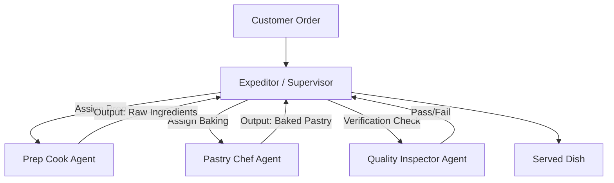

In multi-agent systems, naming agents "Expert Helper" or "Smart Writer" is a recipe for system drift. When agent roles are fuzzy, their system prompts overlap. The resulting system suffers from **cognitive duplication** and **"agent soup"**—where agents pass context back and forth, consuming tokens without resolving the task.

To build reliable systems, we must treat agent roles as strict **software interfaces** with defined scopes, tool permissions, and communication contracts.

This article reviews the principles of structured role design for multi-agent applications.

> ### 📖 Article Overview
> * **What this article is about:** This article discusses the pitfalls of fuzzy agent roles in multi-agent systems and introduces principles for structured role design.
> * **Why it matters:** Fuzzy roles lead to cognitive duplication, wasted tokens, and unreliable system behavior, impacting performance and development costs.
> * **What we synthesized:** We synthesized key rules for defining strict input/output schemas, enforcing the Single Responsibility Principle, and restricting tool access to build robust agent systems.

---

## The Hazards of Fuzzy Roles

When agents have overlapping domains of responsibility:
1.  **Context Contamination**: If two agents both believe they are responsible for editing a file, they will overwrite each other's changes.
2.  **Infinite Communication Loops**: An agent without clear boundaries will repeatedly ask other agents for feedback, consuming thousands of tokens in an loop of clarification.
3.  **Tool List Bloat**: To cover all bases, developers give every agent access to every tool. This dilutes LLM attention, resulting in high rates of tool call hallucinations.

---

## The Specialist Kitchen Analogy

A good multi-agent system operates like a Michelin-starred restaurant kitchen. There is no generic "helper." Instead, roles are highly specialized and bounded:

*   **Prep Cook (Researcher)**: Has access to knife tools (search APIs). Only responsible for raw ingredient cleaning (data cleaning).
*   **Pastry Chef (Writer)**: Has access to baking oven tools (template rendering). Only handles pastry prep (drafting).
*   **Expeditor (Supervisor/Router)**: Coordinates tickets (queries), assigns tasks, and ensures the plate matches the order.
*   **Quality Inspector (Validator)**: Compares the dish to the recipe contract before it leaves the kitchen.

---

## Rules for Structuring Agent Roles

To prevent role drift, implement these three rules in your system prompts:

### 1. Define Strict Input/Output Schema Contracts
Never pass raw, unstructured chat history between agents. Treat agent handoffs like API endpoints. Agent A must output a specific JSON schema (e.g., an outline array), which is validated programmatically before being fed as input to Agent B.

### 2. Enforce the Single Responsibility Principle (SRP)
Every agent must have a single, non-overlapping task.
*   **Bad**: Naming an agent `LeadDeveloper` and giving it tools to search, write files, compile, and deploy.
*   **Better**: Split into `CodeWriterAgent` (writes files), `TestRunnerAgent` (compiles and executes test scripts), and `DeploymentAgent` (pushes to production).

### 3. Restrict Tool Lists to a Maximum of 3 Tools
If an agent needs more than 3 tools to execute its task, its scope is too broad. Split the agent. A narrow tool list ensures the model has 99.9% accuracy when selecting which tool to call.

---

## The Role Design Checklist

*   [ ] **Strict Prompts**: Remove generic words like "help," "assist," or "smart" from system instructions. Replace them with operational verbs: "extract," "query," "generate," "validate."
*   [ ] **Interface Validation**: Enforce Pydantic schema contracts on all messages exchanged between agent nodes.
*   [ ] **Isolation Audit**: Ensure worker agents do not have visibility into the global plan, limiting their attention strictly to their assigned sub-tasks.

---

## Conclusion & Key Takeaways

Building robust multi-agent systems hinges on meticulously defined agent roles and communication protocols.
1.  **Fuzzy Roles Lead to System Drift:** Undefined or overlapping agent responsibilities result in "cognitive duplication," context contamination, infinite communication loops, and tool list bloat, severely impacting system reliability and efficiency.
2.  **Structured Roles are Essential Interfaces:** Treating agent roles as strict software interfaces with defined scopes, tool permissions, and communication contracts, much like a specialized kitchen, is crucial for preventing these issues and ensuring predictable behavior.
3.  **Implement Strict Design Principles:** Adhering to rules like defining strict input/output schema contracts, enforcing the Single Responsibility Principle, and restricting tool lists to a maximum of three tools per agent are fundamental for creating focused, accurate, and maintainable agent systems.

*Takeaway: Clear, bounded agent roles with strict interfaces are the bedrock of reliable and scalable multi-agent applications.*

---

## References & Further Reading

*   **SOPs in Multi-Agent Systems**: Hong et al., 2023. *MetaGPT: Meta Programming for Multi-Agent Collaborative Framework*. Explains how standard operating procedures (SOPs) eliminate role confusion in agent networks. [arXiv:2308.08155](https://arxiv.org/abs/2308.08155)
*   **Engineering MAS Taxonomy**: *Engineering LLM-based Multi-Agent Systems: A Taxonomy of Emerging Frameworks* (June 2026). Explains task decomposition and interface design between agents. [diva-portal.org](https://diva-portal.org/) (Needs verification)

*To explore complete code implementations of all 17 agent microservices in a single monorepo, check out the public [agentic-apps-portfolio](https://github.com/akmalkhaniub/agentic-apps-portfolio) repository.*