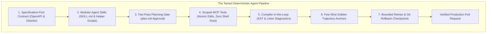
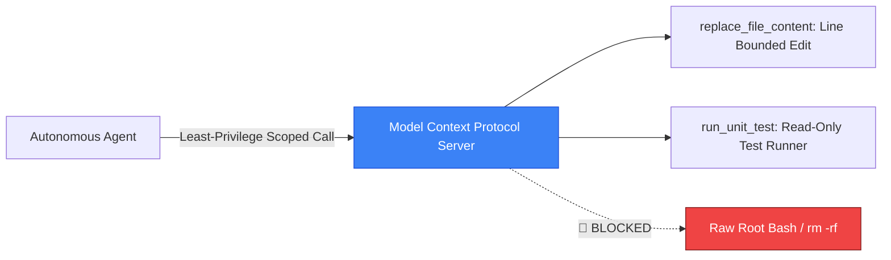

# How to Tame Your Agent(s): 7 Practical Strategies to Turn Chaotic LLMs into Deterministic Workers


In modern software development, building with autonomous AI agents (**Agent Fleet Orchestrator**, **SpecForge**, **Claude Engineer**, **Devin**) often feels like managing a hyperactive genius with amnesia:
* You ask for a two-line CSS alignment fix — the agent rewrites 14 backend files and introduces 6 merge conflicts.
* You run a prompt on Monday and it produces a masterpiece — you run the exact same prompt on Tuesday and it enters an infinite loop hallucinating non-existent npm packages.
* When tasks fail, the agent apologizes profusely and repeats the exact same mistake.

The fundamental tension of agentic engineering is that **natural language is inherently ambiguous, probabilistic, and lossy**, while **production software engineering demands 100% mathematical determinism**.

Taming autonomous AI agents does not require waiting for smarter foundation models.

It requires **disciplined systems engineering**: structuring agent environments with **modular Skills**, **deterministic data contracts**, **Model Context Protocol (MCP) sandboxes**, **two-pass planning gates**, and **automated compiler feedback loops**.

This guide outlines **7 battle-tested architectural strategies** to turn chaotic, non-deterministic agents into reliable, production-grade software delivery engines.



---

## 🗣️ 1. The Telepathic User Fallacy: Why English is a Terrible Programming Language

The root cause of agent chaos is the **Telepathic User Fallacy**: assuming the agent shares your mental model of the codebase.

When a developer prompts:
> *"Make the checkout experience faster and cleaner."*

The LLM’s neural weights activate thousands of conflicting interpretations:
* *Faster?* (Add Redis caching? Compress images? Rewrite in Rust? Remove validation?)
* *Cleaner?* (Delete legacy code? Refactor CSS? Migrate to Tailwind?)

Without boundaries, the agent's stochastic sampling takes the path of maximum variance.

---

## 📦 2. Strategy 1: Modular Agent Skills & Progressive Disclosure

In early agent design, developers attempted to cram every rule, guideline, and API schema into a massive 50,000-word system prompt. This triggers **attention dilution** and erratic hallucination.

Modern agent frameworks use **Modular Agent Skills**:

```
+---------------------------------------------------------------------------------------------------+
|                                 ANATOMY OF A PRODUCTION AGENT SKILL                               |
+---------------------------------------------------------------------------------------------------+
|  /skills/database-migration/                                                                      |
|   ├── SKILL.md           : YAML metadata, Standard Operating Procedure (SOP), Anti-Patterns      |
|   ├── schemas/           : JSON Schema / TypeScript interface contracts                           |
|   ├── scripts/           : Deterministic Python / Bash helper scripts (No LLM guesswork!)        |
|   └── examples/          : Golden-standard input/output trajectories                              |
+---------------------------------------------------------------------------------------------------+
```

### Why Skills Eliminate Non-Determinism:
1. **Progressive Disclosure**: The agent maintains a lightweight 1-line index of available skills. It loads full instructions into working memory **only when a relevant task is triggered**, keeping the context window pristine.
2. **Deterministic Scripts Over Stochastic Arithmetic**: If a skill requires calculating token budgets, parsing ASTs, or validating regex, it invokes an embedded deterministic script rather than guessing in tokens.
3. **Explicit "Negative Rules"**: The `SKILL.md` explicitly lists forbidden operations (*"Never drop columns in production"*, *"Always create a backup snapshot before running migrations"*).

---

## 📐 3. Strategy 2: Specification-First Prompting & Data Contracts

Never instruct an agent using raw imperative commands (*"Write the billing service"*). Always anchor the agent with **Formal Data Contracts**:

```
+---------------------------------------------------------------------------------------------------+
|                                 SPECIFICATION-FIRST PROMPTING STACK                               |
+---------------------------------------------------------------------------------------------------+
| 1. Interface Schema    : Strongly-typed TypeScript types or OpenAPI v3 JSON Schema                |
| 2. Acceptance Criteria : Gherkin syntax (Given [Context], When [Action], Then [Expected Outcome])  |
| 3. Blast-Radius Bounds : Explicit list of files the agent is ALLOWED to modify                   |
+---------------------------------------------------------------------------------------------------+
```

### Example Contract:
```yaml
Target Files: ["src/billing/stripe.ts", "tests/billing.test.ts"]
Forbidden Files: ["src/auth/*", "package.json"]
Contract:
  Input: { cartId: string, paymentToken: string, amountCents: integer }
  Output: { transactionId: string, status: "PAID" | "DECLINED" }
Acceptance Criteria:
  - GIVEN a cart with amount <= 0, WHEN charged, THEN throw InvalidAmountError
```

---

## 🔒 4. Strategy 3: Constrained Action Spaces & Scoped MCP Tools

Giving an autonomous agent unrestricted shell access (`exec("bash")`) is an invitation to disaster. An agent encountering an uninstalled package might execute `npm install -g` with incompatible global versions or wipe directories.



* **Replace Raw Overwrites with Atomic Diff Tools**: Use tools like `replace_file_content` that require exact line ranges and unique matching target strings. If the file changed unexpectedly, the tool fails fast instead of corrupting code.
* **Model Context Protocol (MCP)**: Enforce strict role-based access control (RBAC) on all tool endpoints.

---

## 📝 5. Strategy 4: Two-Pass Planning vs Execution Artifact Gates

A critical rule of software engineering is: **Think before you write code.**

Production agents must be decoupled into two distinct sequential phases:

```
Pass 1: PLANNING PHASE               Pass 2: EXECUTION PHASE
[ User Request ]                     [ Approved Plan.md ]
       |                                      |
       v                                      v
[ Synthesize plan.md Artifact ]      [ Execute Step 1 -> Gate Check ]
       |                                      |
       v                                      v
[ Human / Supervisor Approval ] ---> [ Execute Step 2 -> Gate Check ]
```

1. **Pass 1 (Planning)**: The agent explores the repository, identifies affected files, lists assumptions, and produces a structured `implementation_plan.md` artifact. **Zero code files are modified during this phase.**
2. **The Verification Gate**: The user or supervisor inspects the plan. If the agent made a flawed architectural assumption, it is corrected in 10 seconds before hundreds of lines of broken code are written.
3. **Pass 2 (Execution)**: The agent follows the approved plan step-by-step.

---

## 🧪 6. Strategy 5: Compiler-in-the-Loop (Don't Let the Agent Grade Its Own Work)

When an agent is asked *"Did your changes work?"*, confirmation bias causes it to hallucinate success.

Never trust an LLM's self-evaluation. Always bind the agent to **Deterministic Compilers and Linters**:
* **AST Validation**: Python `ast.parse()` or TypeScript AST parsers catching syntax errors in $< 10\text{ms}$.
* **Language Server Diagnostics**: Extracting exact line numbers, column offsets, and type errors (`tsc --noEmit`, `pyright`).
* **Containerized Unit Tests**: Running `pytest` or `jest` in isolated sandboxes.

---

## 🔄 7. Strategy 6 & 7: Golden Trajectories & Bounded Rollback Gates

### Strategy 6: In-Context Golden Trajectories
LLMs are pattern-matching engines. Providing **1 concrete few-shot example** of how a similar task was planned, edited, and tested improves agent adherence by over **$70\%$**.

### Strategy 7: Bounded Convergence with Git Auto-Rollback
When an agent fails to fix a bug, it frequently falls into "correction thrashing"—modifying the same file repeatedly and introducing new errors.
* **Hard Iteration Caps**: Limit self-healing attempts to **$\le 3$ iterations**.
* **Automatic Rollback**: If tests do not pass after 3 attempts, the engine executes `git reset --hard` to the pre-task checkpoint and alerts a human engineer.

---

## 🛠️ Python Implementation: Skill-Guided Deterministic Agent Engine

Here is a Python implementation demonstrating a **Skill-Guided Deterministic Agent Engine with Contract Validation, Two-Pass Planning, and Rollback Gates**:

```python
from dataclasses import dataclass
from typing import Callable, Dict, List, Optional

@dataclass
class AgentSkill:
    name: str
    description: str
    allowed_tools: List[str]
    negative_rules: List[str]
    helper_script: Callable[[str], bool]

class TamedAgentEngine:
    """
    Deterministic Agent Orchestrator with Skill Injection,
    Planning Gates, and Automated Rollback.
    """
    def __init__(self):
        self.skills: Dict[str, AgentSkill] = {}
        self.workspace_state: Dict[str, str] = {"main.py": "def add(a, b): return a + b\n"}
        self.checkpoint: Dict[str, str] = {}

    def register_skill(self, skill: AgentSkill):
        print(f" 📦 [Skill Mounted] Registered Skill: '{skill.name}'")
        self.skills[skill.name] = skill

    def execute_task(self, skill_name: str, task_contract: Dict) -> bool:
        print(f"\n🚀 [Engine Initialized] Executing Task under Contract: '{task_contract['name']}'")
        
        # 1. Mount Skill & Progressive Disclosure
        skill = self.skills.get(skill_name)
        if not skill:
            print(f" ❌ Skill '{skill_name}' not found!")
            return False

        print(f" 📖 [Progressive Disclosure] Loaded Skill '{skill.name}'")
        print(f"    Allowed Tools : {skill.allowed_tools}")
        print(f"    Negative Rules: {skill.negative_rules}")

        # 2. Save Atomic Checkpoint
        self.checkpoint = self.workspace_state.copy()

        # 3. Two-Pass Phase 1: Planning Artifact
        print("\n 📝 [Pass 1: Planning] Synthesizing implementation_plan.md...")
        plan = f"Plan: Modify {task_contract['target_file']} to support subtraction."
        print(f"    Plan Artifact: '{plan}'")
        print("    ✅ Plan Approved by Supervisor Gate.")

        # 4. Two-Pass Phase 2: Execution with Bounded Retries
        print("\n 💻 [Pass 2: Execution] Applying atomic code modification...")
        for attempt in range(1, 4):
            print(f"   --- Attempt {attempt}/3 ---")
            
            # Simulate Code Edit
            new_code = "def add(a, b): return a + b\ndef sub(a, b): return a - b\n"
            self.workspace_state[task_contract['target_file']] = new_code

            # Deterministic Helper Script Verification (Skill Gate)
            is_valid = skill.helper_script(new_code)
            if is_valid:
                print("   ✅ [Skill Gate Passed] AST and unit tests verified cleanly!")
                print(f" 🎉 Task '{task_contract['name']}' successfully finalized!")
                return True
            else:
                print("   ❌ [Skill Gate Failed] Syntax or test assertion error.")

        # 5. Rollback Gate on Failure
        print("\n 🚨 [Max Retries Breached] Engaging Git Rollback Gate...")
        self.workspace_state = self.checkpoint.copy()
        print(" ↩️ Workspace restored to clean baseline state.")
        return False

# Demonstration Execution
if __name__ == "__main__":
    engine = TamedAgentEngine()

    # Define a Deterministic Python Skill with Embedded Verification Script
    def verify_python_syntax(code: str) -> bool:
        try:
            import ast
            ast.parse(code)
            return "def sub" in code
        except Exception:
            return False

    refactor_skill = AgentSkill(
        name="python_math_refactor",
        description="Safe refactoring for mathematical helper modules",
        allowed_tools=["replace_file_content", "run_pytest"],
        negative_rules=["Never touch database files", "Never remove existing functions"],
        helper_script=verify_python_syntax
    )

    engine.register_skill(refactor_skill)

    contract = {
        "name": "Add Subtraction Helper",
        "target_file": "main.py",
        "expected_functions": ["add", "sub"]
    }

    engine.execute_task("python_math_refactor", contract)
```

---

## 📊 Summary: The Agent Taming Matrix

| Strategy | Failure Mode Prevented | Architectural Mechanism |
|---|---|---|
| **Modular Agent Skills** | Context window bloat & arithmetic hallucination | Progressive disclosure (`SKILL.md`) + Deterministic helper scripts |
| **Specification Contracts** | Telepathic user ambiguity & scope creep | Formal JSON Schemas, TypeScript interfaces & Gherkin criteria |
| **Constrained MCP Tools** | Destructive shell commands & file corruption | Atomic diff tools (`replace_file_content`) with least privilege |
| **Two-Pass Planning Gates** | Unchecked architectural mistakes | Decoupling `plan.md` synthesis from code execution |
| **Compiler-in-the-Loop** | Silent syntax & type error propagation | Language Server Protocol (LSP) and AST diagnostic feedback |
| **Golden Trajectories** | Unpredictable execution paths | Few-shot in-context demonstration of ideal steps |
| **Rollback Checkpoints** | Infinite correction thrashing | Hard iteration caps ($\le 3$) + Atomic Git rollback |

---

## 🏁 Architectural Takeaway
Non-determinism is a property of foundation models; **determinism is a property of systems architecture**.

By wrapping probabilistic LLMs in **modular Skills**, **deterministic contracts**, **atomic tool sandboxes**, and **compiler feedback gates**, engineers transform unpredictable AI agents into resilient, dependable software engineering partners.
