# Hybrid Search & Reranking: Balancing Dense Retrieval with Sparse BM25 + Cross-Encoders

> [!NOTE]
> **📖 Article Overview**
> Semantic vector embeddings are powerful for conceptual matching, but they struggle with exact keyword targets, SKU codes, and precise system IDs. In this article, we show how to construct a high-recall **Hybrid Search** pipeline combining dense vector embeddings (**pgvector**) with sparse keyword matching (**BM25 / TSQuery**). We outline the reciprocal rank fusion (RRF) score merger algorithm, evaluate the latency trade-offs of neural **Cross-Encoder rerankers**, and provide a complete Python implementation.

---

## The Semantic Similarity Blind Spot

A common pitfall when building RAG systems is relying exclusively on dense vector search. Vector models (like OpenAI's `text-embedding-3` or Cohere's `embed-english-v3.0`) compress sentences into high-dimensional numerical spaces to capture semantic concepts. 

While this is excellent for matching *"How do I fix database deadlock errors?"* with a paragraph discussing database lock contentions, it fails on exact keyword matches. 

For instance, consider a user query searching for a specific class or serial number: *"Show logs containing JVM-20499"* or *"How to configure the `pg_advisory_xact_lock` function?"*. Because the vector model evaluates the conceptual similarity of the string, it may prioritize general database locking tutorials, washing out the exact, critical SKU code or function signature.

To prevent this information loss, we must run **Hybrid Search**: executing a parallel keyword lookup alongside the vector lookup and merging their results.

---

## The Hybrid Retrieval Pipeline

A production-grade hybrid retrieval pipeline executes parallel search queries, merges the results using an algebraic score-normalization algorithm, and filters the final list through a neural reranker.

```mermaid
%%{init: {'theme': 'dark', 'themeVariables': { 'primaryColor': '#0ea5e9', 'primaryTextColor': '#f3f4f6', 'primaryBorderColor': '#38bdf8', 'lineColor': '#0ea5e9', 'secondaryColor': '#111827', 'tertiaryColor': '#111827'}}}%%
graph TD
    A[User Search Query] --> B[Dense Retrieval Branch]
    A --> C[Sparse Retrieval Branch]
    
    B -->|Cosine Distance Lookup| D[pgvector Index Search]
    C -->|TF-IDF / BM25 Inverted Index| E[PostgreSQL tsvector Search]
    
    D -->|Top 50 Vector Candidates| F[Reciprocal Rank Fusion RRF Merger]
    E -->|Top 50 Keyword Candidates| F
    
    F -->|Top 20 Merged Candidates| G[Neural Cross-Encoder Reranker]
    G -->|Calculate Pairwise Relevance| H[Re-sorted Final List]
    H -->|Top 5 Chunks| I[LLM Context Ingestion]

    style A fill:#1e293b,stroke:#0ea5e9,stroke-width:2px
    style B fill:#111827,stroke:#a855f7,stroke-width:2px
    style C fill:#111827,stroke:#eab308,stroke-width:2px
    style F fill:#0ea5e9,stroke:#0f172a,stroke-width:2px,color:#0f172a
    style G fill:#111827,stroke:#10b981,stroke-width:2px
    style I fill:#1e293b,stroke:#0ea5e9,stroke-width:2px
```



### The RRF (Reciprocal Rank Fusion) Merger
Vector search and keyword search return scores in entirely different ranges: cosine similarity returns values between $-1.0$ and $1.0$, while BM25 returns unbounded floating-point scores ($0$ to $\infty$). 

We cannot directly add or multiply these scores. Instead, we use **Reciprocal Rank Fusion (RRF)**, which evaluates only the *rank* (position) of a document in each list. The RRF score for a document $d$ is:

$$RRF\_Score(d \in D) = \sum_{m \in M} \frac{1}{k + r_m(d)}$$

Where $M$ is the set of retrieval models (dense and sparse), $r_m(d)$ is the rank of document $d$ in model $m$, and $k$ is a smoothing constant (typically set to $60$). RRF is parameter-free, highly robust, and consistently outperforms individual retrievers.

### The Neural Reranker (Cross-Encoder)
After merging the results via RRF, we have a pool of candidates (e.g., 20 documents). To maximize context relevance, we feed these candidates into a **Cross-Encoder** reranker (e.g., `BAAI/bge-reranker-large`). 

Unlike Bi-Encoders (which embed questions and documents separately), a Cross-Encoder processes the query and document *together* through self-attention layers, calculating a direct, pairwise relevance score. This is far more accurate but too computationally heavy to run on the entire database, which is why it is used strictly as a secondary filtering step.

---

## What's Good & What's Not

| What's Good (Pros) | What's Not (Cons) |
| --- | --- |
| * Near-Perfect Recall: Combines conceptual search with exact keyword/ID retrieval. | * Latency Overhead: Running parallel queries and a neural reranker adds 80ms–200ms of latency per query. |
| * Highly Robust: RRF algorithm merges diverse retrievers without manual score calibration. | * Index Management Complexity: Requires maintaining both a vector index and a text-search inverted index. |
| * Filters Out Noise: Cross-Encoder reranker trims retrieved lists down to the absolute best. | * Compute Costs: Reranker execution requires active CPU/GPU processing during runtime. |

---

## Technical Implementation: Hybrid pgvector & tsvector Search

The script below demonstrates a complete, hybrid query engine using PostgreSQL (**pgvector** for dense search, and **tsvector** for sparse text search) and the `SentenceTransformer` Cross-Encoder model to rerank candidates.

```python
import psycopg2
from sentence_transformers import CrossEncoder

# 1. Establish Database Connection (PostgreSQL with pgvector installed)
DB_CONN_STRING = "dbname=rag_database user=postgres password=secure_password host=localhost"
reranker_model = CrossEncoder("BAAI/bge-reranker-base")

def execute_hybrid_retrieval(query_str: str, query_vector: list, limit: int = 5):
    conn = psycopg2.connect(DB_CONN_STRING)
    cur = conn.cursor()
    
    # 2. Dense Vector Search (pgvector Cosine Distance)
    # Returns the top 30 candidates
    cur.execute("""
        SELECT id, content, ROW_NUMBER() OVER (ORDER BY embedding <=> %s::vector) as rank
        FROM document_chunks
        LIMIT 30;
    """, (query_vector,))
    dense_results = cur.fetchall()
    
    # 3. Sparse Keyword Search (PostgreSQL Full-Text Search using tsquery)
    # Returns the top 30 candidates
    cur.execute("""
        SELECT id, content, ROW_NUMBER() OVER (ORDER BY ts_rank_cd(text_vector, plainto_tsquery('english', %s)) DESC) as rank
        FROM document_chunks
        WHERE text_vector @@ plainto_tsquery('english', %s)
        LIMIT 30;
    """, (query_str, query_str))
    sparse_results = cur.fetchall()
    
    cur.close()
    conn.close()

    # 4. Reciprocal Rank Fusion (RRF) Calculation
    rrf_scores = {}
    k = 60 # Smoothing constant
    
    # Map dense ranks
    for doc_id, content, rank in dense_results:
        rrf_scores[doc_id] = {"content": content, "score": 1 / (k + rank)}
        
    # Map sparse ranks & merge
    for doc_id, content, rank in sparse_results:
        if doc_id in rrf_scores:
            rrf_scores[doc_id]["score"] += 1 / (k + rank)
        else:
            rrf_scores[doc_id] = {"content": content, "score": 1 / (k + rank)}

    # Sort candidates by RRF score
    sorted_candidates = sorted(rrf_scores.items(), key=lambda x: x[1]["score"], reverse=True)[:20]
    
    # 5. Neural Cross-Encoder Reranking
    pairs = [[query_str, item[1]["content"]] for item in sorted_candidates]
    rerank_scores = reranker_model.predict(pairs)
    
    # Apply reranker scores
    final_results = []
    for idx, (doc_id, info) in enumerate(sorted_candidates):
        final_results.append({
            "id": doc_id,
            "content": info["content"],
            "relevance_score": float(rerank_scores[idx])
        })
        
    # Sort by neural relevance score
    final_results = sorted(final_results, key=lambda x: x["relevance_score"], reverse=True)[:limit]
    return final_results

if __name__ == "__main__":
    # Mocking execution example
    # Note: Requires a running postgres container with table 'document_chunks' populated:
    # id (uuid/int), content (text), embedding (vector(1536)), text_vector (tsvector)
    
    print("[*] Performing Hybrid Search & Reranking execution...")
    # query_vec = [0.015] * 1536  # Replace with actual LLM embedding output
    # results = execute_hybrid_retrieval("PostgreSQL deadlocks on pg_advisory_xact_lock", query_vec)
    # for idx, doc in enumerate(results):
    #     print(f"[{idx+1}] Score: {doc['relevance_score']:.4f} | Content: {doc['content'][:80]}...")
    print("[+] Model loaded successfully. Configure database schemas to run live retrieval queries.")
```

---

## Conclusion & Key Takeaways

Naive retrieval is a major bottleneck in enterprise RAG pipelines. By deploying hybrid search, we combine the strengths of both semantic and keyword indices, ensuring SKU numbers, precise function names, and structural terms are never missed.

*   **RRF is a must**: Do not attempt to add vector distance values to BM25 scores directly. Use Reciprocal Rank Fusion to normalize scores cleanly based on rank.
*   **Budget your latency**: Check your target query budgets. If you need sub-50ms responses, skip the neural Cross-Encoder stage and rely strictly on RRF output. If accuracy is paramount (e.g., medical, compliance, financial lookups), run the reranker.

In our next article, [Automated RAG Evals: Stress-Testing Pipelines with DeepEval and Synthetic Ground Truths](file:///G:/ReplitProjects/akmalkhaniub.github.io/blog/automated-rag-evals-deepeval.html), we will discuss how to implement programmatic unit tests to prove your hybrid indices remain stable under prompt modifications.

---

### Research References & Resources
*   **RRF Paper**: *Reciprocal Rank Fusion Outperforms Single Retrieval Models* (Cormack et al., Waterloo) — [ResearchGate Link](https://www.researchgate.net/)
*   **pgvector Documentation**: [PostgreSQL extension for vector similarity search](https://github.com/pgvector/pgvector)
*   **Sentence Transformers**: [Cross-Encoder Documentation](https://sbert.net/)
