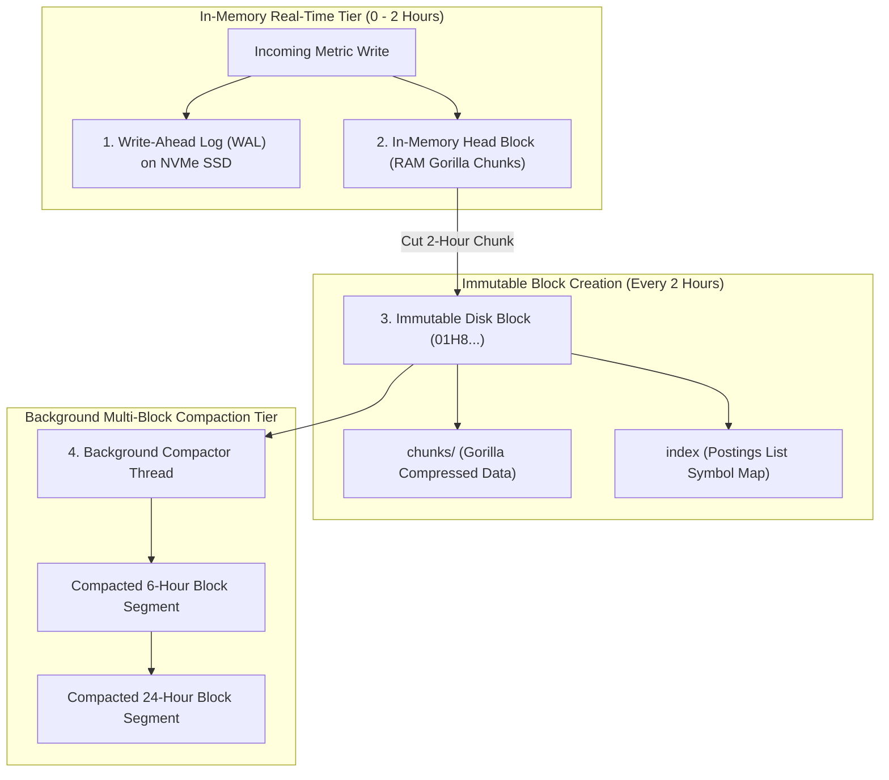

# In-Memory Columnar Chunk Compaction: Prometheus TSDB & VictoriaMetrics Segment Layouts

In cloud-native observability systems (**Prometheus**, **VictoriaMetrics**, **Thanos**, **Cortex**), time-series storage engines must sustain relentless ingestion workloads while serving instant range queries over months of historical telemetry.

A major engineering challenge in time-series database (TSDB) design is balancing **Low-Latency Write Ingestion** (append-only streaming) with **High-Performance Query Execution** (columnar block scans).

To optimize memory usage and query throughput, modern engines split metric storage into two distinct tiers: an **In-Memory Head Block** (for real-time ingestion) and **Compacted Block Segments** (for historical disk storage).

Pioneered by **Prometheus TSDB** and optimized by **VictoriaMetrics**, this architecture uses 2-hour memory chunk freezing and multi-stage background compaction.

This article details the Prometheus 2-hour Head Block layout, Write-Ahead Log (WAL) crash recovery, inverted postings symbol indices, block compaction merging algorithms, and VictoriaMetrics LSM-part storage.

---

## TSDB Architecture & Block Compaction Pipeline

How time-series databases handle real-time RAM ingestion, 2-hour block cutting, and multi-tier background compaction:



### Core TSDB Storage Engine Mechanics
1. **The Prometheus 2-Hour Head Block**:
   * All incoming metric data points are initially appended to the active **Head Block** held in memory.
   * **Write-Ahead Log (WAL)**: To survive power failures or process crashes, writes are sequentially appended to a $128\text{ MB}$ WAL file on disk before updating RAM chunks.
   * **Active Chunks (`memChunk`)**: Metrics are accumulated in Gorilla-compressed memory chunks until reaching $120$ samples or a 2-hour boundary.
2. **Immutable 2-Hour Disk Block Directory Layout**:
   * Every 2 hours, the Head Block is frozen, written to a timestamp-named directory (e.g. `01H8X...`), and replaced by a new Head Block.
   * *Block Anatomy*:
     * **`chunks/`**: Files containing Gorilla-compressed 120-sample metric chunks.
     * **`index`**: Inverted index file mapping metric labels (`__name__="http_requests_total"`, `job="api"`, `status="500"`) to postings lists of chunk offsets.
     * **`meta.json`**: Contains block UUID, minimum/maximum timestamp range ($t_{\text{min}}, t_{\text{max}}$), and sample counts.
3. **Background Multi-Block Compaction**:
   * As 2-hour blocks accumulate on disk, query latency over long time ranges (e.g. 30 days) deteriorates because the engine must open hundreds of individual index files.
   * **Compaction Merge Engine**: Background threads periodically merge adjacent 2-hour blocks into larger 6-hour, 18-hour, and 2-day blocks.
   * *Deduplication & Tombstones*: During compaction, tombstone-marked deleted metrics are purged, and overlapping metrics are deduplicated.
4. **VictoriaMetrics MergeTree Architecture**:
   * While Prometheus TSDB uses fixed 2-hour time blocks, **VictoriaMetrics** deploys a specialized **LSM-Tree (Log-Structured Merge-Tree)** variant.
   * Incoming metrics are written into small immutable "Parts" that are continuously merged in the background into larger Parts, achieving $2\times$ lower RAM consumption than Prometheus TSDB.

---

## Python Implementation: TSDB Head Block & Compaction Engine

Here is a production-grade Python implementation of a Time-Series Database Head Block and Multi-Block Compactor Simulator:

```python
import time
from typing import Dict, List, Set, Tuple
from pydantic import BaseModel

class TSDBChunk(BaseModel):
    series_id: str
    min_time: int
    max_time: int
    sample_count: int
    compressed_bytes: int

class TSDBDiskBlock(BaseModel):
    block_id: str
    min_time: int
    max_time: int
    chunks: List[TSDBChunk]
    postings_index: Dict[str, Set[str]]  # { label_pair -> set(series_ids) }

class TSDBHeadBlockEngine:
    """
    Simulates Prometheus TSDB 2-Hour In-Memory Head Block & Block Compactor.
    """
    def __init__(self, block_duration_sec: int = 7200): # 2-hour blocks
        self.block_duration = block_duration_sec
        self.active_wal: List[str] = []
        self.head_chunks: Dict[str, List[Tuple[int, float]]] = {}
        self.disk_blocks: List[TSDBDiskBlock] = []
        self.block_counter = 1

    def ingesting_metric(self, series_id: str, labels: Dict[str, str], timestamp: int, value: float):
        """1. Write to WAL + In-Memory Head Block."""
        self.active_wal.append(f"{series_id},{timestamp},{value}")
        if series_id not in self.head_chunks:
            self.head_chunks[series_id] = []
        self.head_chunks[series_id].append((timestamp, value))

    def cut_head_block(self) -> TSDBDiskBlock:
        """2. Freezes 2-Hour Head Block and cuts immutable disk block directory."""
        print(f"\n✂️ [TSDB Head Block Cut] Cutting 2-Hour In-Memory Block to Disk Directory #01H8_00{self.block_counter}...")
        
        block_chunks: List[TSDBChunk] = []
        postings: Dict[str, Set[str]] = {}
        all_times = []

        for s_id, samples in self.head_chunks.items():
            if not samples:
                continue
            t_min = samples[0][0]
            t_max = samples[-1][0]
            all_times.extend([t_min, t_max])
            
            # Simulate Gorilla compression (approx 1.5 bytes per sample)
            comp_size = max(10, int(len(samples) * 1.5))
            chunk = TSDBChunk(series_id=s_id, min_time=t_min, max_time=t_max, sample_count=len(samples), compressed_bytes=comp_size)
            block_chunks.append(chunk)

            # Build inverted index posting
            postings.setdefault(f"series={s_id}", set()).add(s_id)

        min_t = min(all_times) if all_times else 0
        max_t = max(all_times) if all_times else 0

        block = TSDBDiskBlock(
            block_id=f"01H8_00{self.block_counter}", min_time=min_t, max_time=max_t, chunks=block_chunks, postings_index=postings
        )
        self.disk_blocks.append(block)
        self.block_counter += 1

        # Clear Head Block & WAL
        self.head_chunks.clear()
        self.active_wal.clear()
        print(f" ✅ Block Directory Created: {len(block_chunks)} Chunks | Range: [{min_t}..{max_t}]")
        return block

    def compact_blocks(self):
        """3. Merges adjacent 2-hour blocks into compacted multi-hour blocks."""
        print(f"\n🧹 [Background Compactor] Inspecting {len(self.disk_blocks)} disk blocks for compaction...")
        if len(self.disk_blocks) < 2:
            print(" ℹ️ Insufficient blocks for compaction. Minimum 2 required.")
            return

        b1 = self.disk_blocks.pop(0)
        b2 = self.disk_blocks.pop(0)

        merged_chunks = b1.chunks + b2.chunks
        compacted_block = TSDBDiskBlock(
            block_id=f"COMPACTED_{b1.block_id}_{b2.block_id}",
            min_time=min(b1.min_time, b2.min_time),
            max_time=max(b1.max_time, b2.max_time),
            chunks=merged_chunks,
            postings_index={**b1.postings_index, **b2.postings_index}
        )
        self.disk_blocks.append(compacted_block)
        print(f" 🎉 [Compaction Complete] Merged '{b1.block_id}' + '{b2.block_id}' -> '{compacted_block.block_id}' ({len(merged_chunks)} Chunks)")

# Demonstration Execution
if __name__ == "__main__":
    tsdb = TSDBHeadBlockEngine(block_duration_sec=7200)

    print("🚀 Demonstrating TSDB Head Block Ingestion & Compaction Engine...")
    print("=" * 75)

    base_time = 1700000000
    labels_api = {"__name__": "http_requests_total", "job": "api"}

    # 1. Ingest metric data into 1st 2-hour window
    for i in range(10):
        tsdb.ingesting_metric("series_api_500", labels_api, base_time + (i * 60), 100.0 + i)

    # 2. Cut 1st Block
    tsdb.cut_head_block()

    # 3. Ingest metric data into 2nd 2-hour window
    for i in range(10):
        tsdb.ingesting_metric("series_api_500", labels_api, base_time + 7200 + (i * 60), 200.0 + i)

    # 4. Cut 2nd Block
    tsdb.cut_head_block()

    # 5. Perform Background Multi-Block Compaction
    tsdb.compact_blocks()
```

---

## TSDB Storage Engine Gotchas & Best Practices

When designing time-series storage infrastructure:

> [!IMPORTANT]
> **Size In-Memory Head Block RAM for Peak Ingestion Rates**: The Head Block must retain up to 2 hours of un-compacted metric data in RAM. Ensure Prometheus or VictoriaMetrics nodes have at least $30\%$ RAM buffer room to prevent OOM crashes during Head Block cuts.

> [!CAUTION]
> **Avoid High-Cardinality Label Explosion**: Inverting indices maps label key-value pairs (`user_id="12345"`) to series IDs. Adding unique IDs or GUIDs into metric labels causes exponential index memory bloat, crippling TSDB query performance.

---

## Real-World Enterprise Impact
Time-series storage engines (such as **Prometheus TSDB** and **VictoriaMetrics**) report:
* **Sub-Second Range Query Speeds**: Compacted 24-hour block layouts and inverted postings indices allow Prometheus to scan millions of time series per second.
* **$10\times$ Lower Disk I/O Overhead**: Batching RAM chunks into 2-hour immutable block cuts eliminates continuous disk write amplification.
