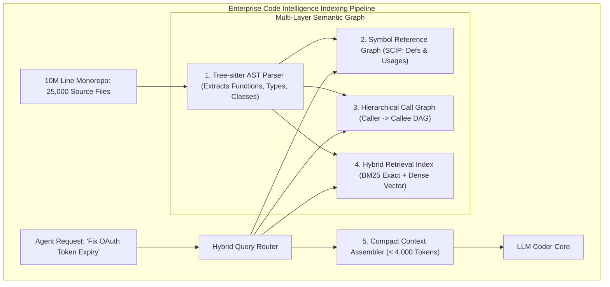

# Indexing 10-Million Line Codebases for AI Agents: Tree-sitter AST Graphs, Call Hierarchy Trees, & Hybrid Search

When software developers interact with modern AI coding assistants and agentic IDEs (**Cursor**, **GitHub Copilot Workspace**, **Antigravity**, **Claude Engineer**, **Devin**), the agent appears to possess instantaneous, omniscient understanding of massive enterprise monorepos.

Behind the scenes, however, indexing an enterprise codebase containing **10,000,000 lines of code across 25,000 source files ($400\text{ MB of raw text}$)** presents an immense systems engineering challenge:
* Ingesting the entire repository into an LLM context window is physically impossible and burns thousands of dollars per prompt turn.
* Naive text chunking (splitting files into arbitrary 500-token blocks) **destroys code semantics**: cutting functions in half, severing variable scopes, and losing caller/callee relationships.

To provide sub-second, highly accurate code context without context bloat, modern agent environments deploy a **Semantic Code Intelligence Indexing Pipeline**.

By combining **Tree-sitter Abstract Syntax Tree (AST) parsing**, **SCIP/LSIF Symbol Reference Graphs**, and **Hybrid BM25 + Vector Search**, engineering teams assemble laser-focused $< 4,000\text{-token}$ context payloads that give agents deep architectural clarity across massive codebases.



---

## 1. Why Naive Text Chunking Fails on Source Code

Source code is fundamentally different from prose documents: **code is a strongly-typed directed graph of symbols, imports, and execution paths**.

### The 3 Fatal Flaws of Naive Embedding Chunking:
1. **Broken Method Boundaries**: An arbitrary 512-token chunk boundary splits a critical 40-line billing validation algorithm right in the middle of a loop.
2. **Loss of Lexical Scope**: A variable named `client` has 5,000 distinct meanings across 25,000 files. Without AST scope resolution, embedding search cannot distinguish between a Redis client, an OAuth HTTP client, and a frontend React state client.
3. **Invisible Call Hierarchies**: If function `handle_checkout()` calls `charge_card()`, which calls `stripe_api()`, vector similarity searching for `"stripe error"` retrieves `stripe_api()` but misses the caller `handle_checkout()` where the error handling logic must be added.

---

## 2. Layer 1: Tree-sitter AST Incremental Parsing

Modern AI IDEs use **Tree-sitter**: an ultrafast, incremental parser generator written in C that builds and updates concrete syntax trees in milliseconds as the user types.

```
> **TREE-SITTER EXTRACTED SYMBOL METADATA**
| Symbol Type | Extracted Fields                                                                    |
| Function    | Identifier name, parameters, return type, enclosing class, docstring, line range   |
| Interface   | Method signatures, exported properties, extended types                              |
| Import      | Imported symbol, source module path, alias, relative scope                          |

```

By parsing at the AST level, every chunk in the vector database corresponds to an **atomic, self-contained semantic unit (a whole function, class, or interface)** rather than an arbitrary slice of lines.

---

## 3. Layer 2 & 3: Symbol Graphs & Call Hierarchies (SCIP / LSIF)

To understand how code executes, the indexer constructs two directed graphs:

```mermaid
graph LR
  subgraph Hierarchical Call Graph (Caller -> Callee)
    A[OrderController.postCheckout] -->|Calls| B[BillingService.processCharge]
    B -->|Calls| C[StripeClient.createPaymentIntent]
    B -->|Reads| D[UserEntity.stripeCustomerId]
  end
```

### 1. SCIP (Source Code Intelligence Protocol)
Maps every symbol occurrence to its **canonical definition**:
* When an agent inspects `user.get_tier()`, the SCIP graph instantly resolves the exact file and line number where `User.get_tier` is implemented in `models/user.py`.

### 2. Call Hierarchy Graphs
Allows the agent to traverse up and down the call stack:
* **Incoming Calls**: *"Who calls this function?"*
* **Outgoing Calls**: *"What downstream APIs does this function invoke?"*

---

## 4. Dynamic Context Budget Assembly

When an agent is prompted:
> *"Fix the 401 Unauthorized bug when refreshing expired JWT tokens."*

The **Context Assembler** does not dump entire files. It builds a tightly budgeted prompt containing:
1. **The Target Method Body** (`AuthService.refreshToken()`, ~40 lines).
2. **Interface Contracts of Immediate Callers and Callees** (Type signatures only, ~60 lines).
3. **Import Statements & Type Definitions** (~30 lines).

This keeps the prompt under **2,500 tokens**, achieving sub-second TTFT (Time-to-First-Token) and eliminating attention degradation.

---

## Python Implementation: Tree-sitter-Style AST Symbol & Call Graph Indexer

Here is a Python implementation of an AST Codebase Indexer that parses code into atomic symbols, builds a directed call hierarchy, and dynamically packs compact agent context:

```python
import ast
from collections import defaultdict
from dataclasses import dataclass
from typing import Dict, List, Optional, Set

@dataclass
class CodeSymbol:
    name: str
    symbol_type: str # "FUNCTION", "CLASS"
    file_path: str
    line_start: int
    line_end: int
    source_code: str
    calls: List[str]

class CodebaseIntelligenceIndexer:
    """
    AST-Based Code Intelligence Indexer with Symbol Extraction & Call Hierarchy.
    """
    def __init__(self):
        self.symbols: Dict[str, CodeSymbol] = {}
        # Call Graph: caller_symbol -> list of callee_symbol_names
        self.call_graph: Dict[str, List[str]] = defaultdict(list)

    def index_python_source(self, file_path: str, source_code: str):
        print(f" 🌲 [AST Indexer] Parsing '{file_path}' into Abstract Syntax Tree...")
        tree = ast.parse(source_code)
        lines = source_code.splitlines()

        for node in ast.walk(tree):
            if isinstance(node, (ast.FunctionDef, ast.AsyncFunctionDef)):
                # Extract outgoing function calls within body
                outgoing_calls = [
                    n.func.id for n in ast.walk(node)
                    if isinstance(n, ast.Call) and isinstance(n.func, ast.Name)
                ]
                
                snippet = "\n".join(lines[node.lineno - 1:node.end_lineno])
                symbol = CodeSymbol(
                    name=node.name,
                    symbol_type="FUNCTION",
                    file_path=file_path,
                    line_start=node.lineno,
                    line_end=node.end_lineno,
                    source_code=snippet,
                    calls=outgoing_calls
                )
                self.symbols[node.name] = symbol
                self.call_graph[node.name].extend(outgoing_calls)
                print(f"   ↳ Extracted Symbol: {node.name}() [Lines {node.lineno}-{node.end_lineno}] -> Calls: {outgoing_calls}")

    def assemble_targeted_context(self, target_symbol: str) -> str:
        """
        Assembles target code + 1-hop caller/callee signatures into a compact prompt buffer.
        """
        if target_symbol not in self.symbols:
            return f"Symbol '{target_symbol}' not found in index."

        target = self.symbols[target_symbol]
        buffer = [f"=== PRIMARY TARGET: {target.file_path} (Lines {target.line_start}-{target.line_end}) ==="]
        buffer.append(target.source_code)
        buffer.append("\n=== RELEVANT CALL HIERARCHY CONTEXT ===")

        # Find downstream dependencies (Callees)
        for callee_name in self.call_graph.get(target_symbol, []):
            if callee_name in self.symbols:
                callee = self.symbols[callee_name]
                buffer.append(f"// Callee Definition: {callee.name} ({callee.file_path}:{callee.line_start})")

        return "\n".join(buffer)

# Demonstration Execution
if __name__ == "__main__":
    indexer = CodebaseIntelligenceIndexer()

    # 1. Index AuthService file
    auth_service_code = (
        "def verify_token(token: str) -> bool:\n"
        "    if not token:\n"
        "        return False\n"
        "    return jwt_decode(token)\n\n"
        "def refresh_session(token: str):\n"
        "    is_valid = verify_token(token)\n"
        "    if is_valid:\n"
        "        return create_new_jwt(token)\n"
        "    raise PermissionError('Expired session')\n"
    )
    indexer.index_python_source("src/services/auth.py", auth_service_code)

    # 2. Assemble targeted context for 'refresh_session'
    print("\n📦 Assembling Targeted Agent Context for 'refresh_session'...")
    context = indexer.assemble_targeted_context("refresh_session")
    print("=" * 60)
    print(context)
```

---

## Summary: Text Chunking vs AST Code Intelligence

| Capability | Naive 512-Token Vector Chunking | Tree-sitter AST & Call Graph Indexing |
|---|---|---|
| **Boundary Integrity** | ❌ Arbitrary cuts mid-function | **✅ 100% Atomic method & class boundaries** |
| **Scope Resolution** | ❌ Confuses identical variable names | **✅ SCIP-based canonical symbol definitions** |
| **Call Stack Navigation** | ❌ Invisible | **✅ Directed Caller → Callee Graph Traversal** |
| **Context Window Consumption**| Bloated ($30\text{k--}60\text{k}$ tokens) | **Compact & Focused ($< 4\text{k}$ tokens)** |
| **Code Refactoring Accuracy** | $60\%\text{--}75\%$ | **$> 95\%$ First-Pass Success** |

---

## Architectural Takeaway
High-precision AI code generation is a direct consequence of **high-precision code indexing**.

By moving beyond flat text embeddings to **Tree-sitter AST parsing**, **SCIP symbol resolution**, and **directed call hierarchy graphs**, software engineering platforms enable AI agents to navigate and edit multi-million line codebases with surgical accuracy.
