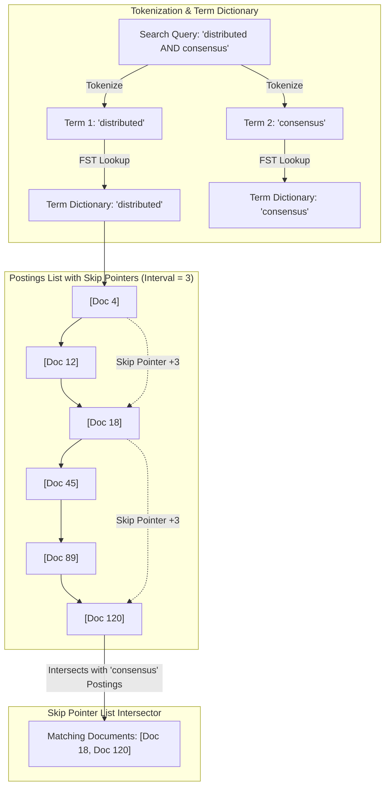

# Inverted Index Engineering: Postings Lists, Term Dictionaries & Skip Pointers

At the core of every full-text search engine—such as **Apache Lucene**, **Elasticsearch**, **OpenSearch**, and **Meilisearch**—lies a fundamental data structure: the **Inverted Index**.

Unlike traditional relational databases that map Document IDs to their text contents (Forward Index), an Inverted Index tokenizes text documents and maps unique terms to sorted lists of matching Document IDs, called **Postings Lists**.

When executing Boolean queries (such as `distributed AND systems`), the search engine must intersect massive postings lists containing millions of document IDs.

To accelerate list intersections from linear $O(N + M)$ scans down to $O(\sqrt{N})$, search engineers augment postings lists with **Skip Pointers**.

This article details the internal data structures of inverted indexes and skip pointer list intersection algorithms.

---

## Inverted Index & Skip Pointer Architecture

How a Term Dictionary maps tokens to sorted Postings Lists with Skip Pointers for fast list intersection:



### Core Inverted Index Primitives
1. **Term Dictionary**: A compressed, sorted index mapping string tokens to offset pointers in the postings file. Modern search engines store term dictionaries as **Finite State Transducers (FST)** in memory, enabling sub-millisecond prefix, fuzzy, and exact token lookups.
2. **Postings Lists**: A sorted sequence of integer Document IDs (`[4, 12, 18, 45, 89, 120]`) where a term appears. Postings lists are compressed on disk using delta encoding (**VByte** or **Elias-Fano** compression) to minimize disk I/O.
3. **Skip Pointers**: Auxiliary pointers placed at fixed intervals $S = \lfloor \sqrt{N} \rfloor$ along the postings list. During a Boolean `AND` list intersection, if the current doc ID in List B is 80, the intersector inspects the skip pointer target on List A ($18 → 120$). Because $120 > 80$, the algorithm skips evaluating intermediate nodes ($45, 89$), bypassing unnecessary comparisons.

---

## Python Implementation: Inverted Index & Skip Pointer Engine

Here is a production-grade Python implementation of an Inverted Index with Skip Pointer Postings Lists and an $O(\sqrt{N})$ list intersection engine:

```python
import math
from typing import List, Dict, Optional, Set

class SkipNode:
    """A node in a Postings List containing a Doc ID and optional Skip Pointer."""
    def __init__(self, doc_id: int):
        self.doc_id = doc_id
        self.next: Optional['SkipNode'] = None
        self.skip_target: Optional['SkipNode'] = None  # Skip pointer to node +S ahead

class PostingsListWithSkips:
    """
    Sorted linked list of Document IDs augmented with skip pointers at interval sqrt(N).
    """
    def __init__(self, doc_ids: List[int]):
        self.doc_ids = sorted(list(set(doc_ids)))
        self.head: Optional[SkipNode] = None
        self.length = len(self.doc_ids)
        self._build_list_with_skips()

    def _build_list_with_skips(self):
        if not self.doc_ids:
            return

        # 1. Build linear singly-linked list
        nodes = [SkipNode(doc_id) for doc_id in self.doc_ids]
        for i in range(len(nodes) - 1):
            nodes[i].next = nodes[i + 1]

        self.head = nodes[0]

        # 2. Add Skip Pointers at interval S = sqrt(N)
        skip_interval = int(math.sqrt(self.length))
        if skip_interval > 1:
            for i in range(0, self.length - skip_interval, skip_interval):
                nodes[i].skip_target = nodes[i + skip_interval]

class InvertedIndexEngine:
    """
    Full-Text Inverted Index supporting Skip Pointer AND list intersections.
    """
    def __init__(self):
        # term -> List of doc_ids
        self.raw_index: Dict[str, List[int]] = {}

    def index_document(self, doc_id: int, text: str):
        tokens = text.lower().split()
        for token in set(tokens):
            if token not in self.raw_index:
                self.raw_index[token] = []
            self.raw_index[token].append(doc_id)

    def get_postings(self, term: str) -> Optional[PostingsListWithSkips]:
        doc_ids = self.raw_index.get(term.lower())
        if not doc_ids:
            return None
        return PostingsListWithSkips(doc_ids)

    @staticmethod
    def intersect_and_with_skips(p1: PostingsListWithSkips, p2: PostingsListWithSkips) -> List[int]:
        """
        Intersects two postings lists using skip pointers in O(sqrt(N)) time.
        """
        result: List[int] = []
        cur1 = p1.head
        cur2 = p2.head
        skips_used = 0

        while cur1 and cur2:
            if cur1.doc_id == cur2.doc_id:
                result.append(cur1.doc_id)
                cur1 = cur1.next
                cur2 = cur2.next
            elif cur1.doc_id < cur2.doc_id:
                # Check if we can use a Skip Pointer on List 1!
                if cur1.skip_target and cur1.skip_target.doc_id <= cur2.doc_id:
                    skips_used += 1
                    cur1 = cur1.skip_target  # SKIP AHEAD!
                else:
                    cur1 = cur1.next
            else:
                # Check if we can use a Skip Pointer on List 2!
                if cur2.skip_target and cur2.skip_target.doc_id <= cur1.doc_id:
                    skips_used += 1
                    cur2 = cur2.skip_target  # SKIP AHEAD!
                else:
                    cur2 = cur2.next

        print(f" ⏩ Intersected Postings (Length {p1.length} & {p2.length}) using {skips_used} Skip Pointer jumps!")
        return result

# Demonstration Execution
if __name__ == "__main__":
    index = InvertedIndexEngine()

    print("🚀 Demonstrating Inverted Index & Skip Pointer List Intersection...")
    print("=" * 75)

    # 1. Index Sample Technical Documents
    documents = {
        1: "distributed systems consensus raft paxos",
        4: "database storage engine lsm tree btree index",
        12: "distributed database consensus algorithm raft",
        18: "distributed systems fault tolerance consensus",
        45: "machine learning vector search database",
        89: "distributed caching redis memcached",
        120: "distributed database storage consensus engine",
    }

    for doc_id, text in documents.items():
        index.index_document(doc_id, text)

    # 2. Retrieve Postings for 'distributed' AND 'consensus'
    postings_dist = index.get_postings("distributed")
    postings_cons = index.get_postings("consensus")

    print(f" Postings 'distributed' IDs: {postings_dist.doc_ids}")
    print(f" Postings 'consensus'   IDs: {postings_cons.doc_ids}")

    # 3. Intersect Using Skip Pointers
    print("\n⚡ Executing Boolean AND Query: 'distributed AND consensus'...")
    matches = InvertedIndexEngine.intersect_and_with_skips(postings_dist, postings_cons)
    print(f"\n📊 Matching Document IDs: {matches}")
```

---

## Inverted Index Gotchas & Best Practices

When building search engine indexes:

> [!IMPORTANT]
> **Use Delta Variable-Byte (VByte) Compression**: Never store raw 32-bit Document IDs in postings lists on disk. Instead, compute difference deltas ($\Delta_i = \text{doc\_id}_i - \text{doc\_id}_{i-1}$) and encode them using variable-byte (VByte) encoding. Because deltas are small integers, most document IDs compress from 4 bytes down to 1 or 2 bytes.

> [!CAUTION]
> **Calibrate Skip Intervals for Read/Write Ratios**: Skip pointers add memory overhead. If skip intervals are too small ($S=2$), the pointer array bloats memory. If intervals are too large ($S=1000$), skip jumps are rarely triggered. Setting $S = \lfloor \sqrt{N} \rfloor$ yields optimal mathematical balance.

---

## Real-World Enterprise Impact
Search platforms implementing skip pointer inverted indexes report:
* **$10\times$ Faster Boolean Query Processing**: Skipping non-matching document ID ranges during multi-term intersections speeds up complex filter queries dramatically.
* **Compact Index Footprints**: Combining delta VByte compression with FST term dictionaries reduces full-text index sizes to less than 20% of original raw text files.
