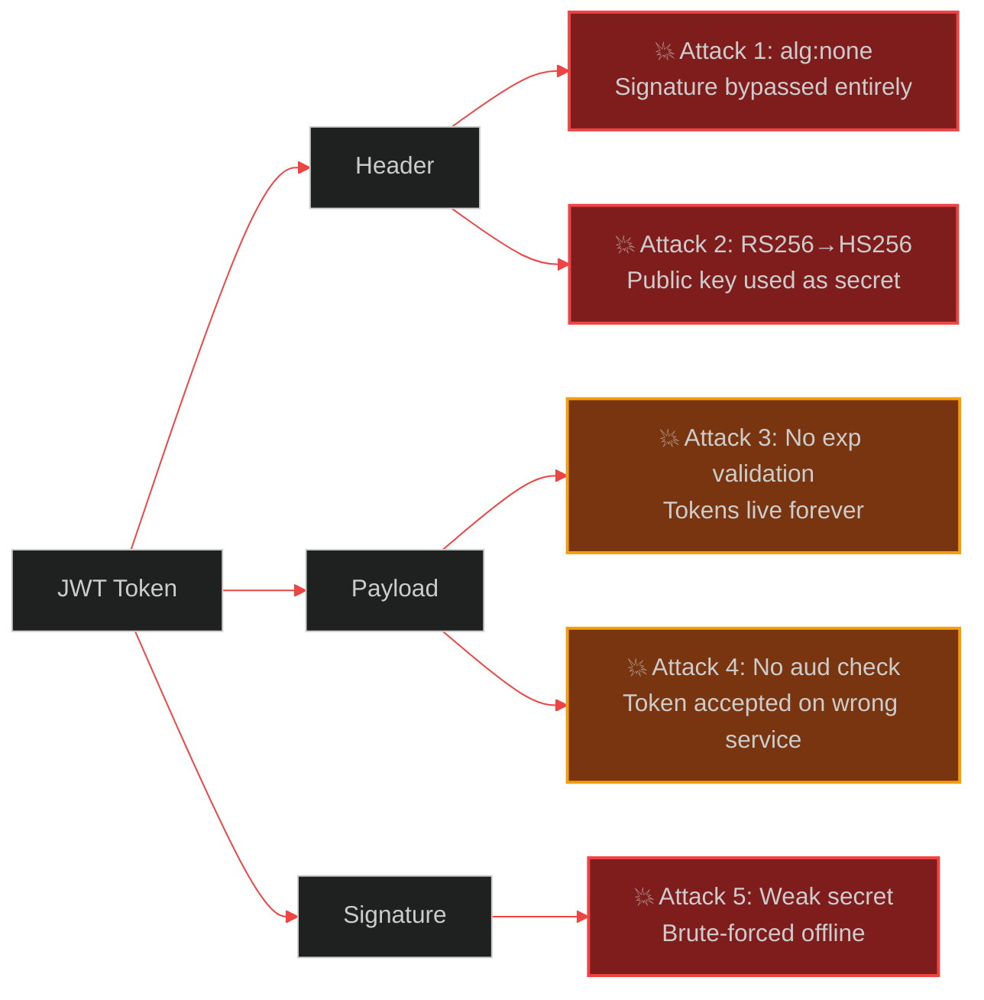

# JWT: What They Don't Teach You Until You Get Hacked

> [!NOTE]
> **📖 Article Overview**
> JSON Web Tokens are the dominant authentication mechanism in modern AI APIs, agent systems, and SaaS platforms. They also contain a minefield of subtle implementation flaws that have caused real-world breaches at companies like Auth0, HashiCorp, and countless smaller startups. This article covers **8 JWT security failures** — the `alg: none` attack, algorithm confusion exploits, missing expiry validation, refresh token rotation race conditions, improper token storage, and audience claim bypass — with concrete Python (`PyJWT`) and TypeScript (`jose`) defences. Read this before your next security audit.

---

## Why JWTs Are Deceptively Dangerous

A JWT looks trustworthy. It's base64-encoded, has a signature, and is issued by your auth server. But JWTs are only as secure as their implementation — and the JWT specification is famously permissive, allowing configurations that are outright broken.



---

## Flaw 1: The `alg: none` Attack — Trusting the Token's Own Algorithm

**Severity**: Critical. Allows complete auth bypass.

The JWT spec allows an `alg` field of `"none"` — meaning no signature is required. An attacker can:
1. Take any valid JWT
2. Change the payload to any user ID (e.g., admin)
3. Set `alg: none` in the header
4. Remove the signature entirely
5. Submit the forged token

Vulnerable libraries that accept the algorithm from the token header will validate it as legitimate.

```python
import jwt  # PyJWT

# ❌ NEVER trust the algorithm from the token header
def decode_insecure(token: str, secret: str) -> dict:
    # PyJWT < 2.0 default behaviour — reads alg from header
    # An attacker can set alg=none and bypass signature entirely
    return jwt.decode(token, secret, algorithms=None)  # 🚨 Catastrophic

# ✅ Always explicitly specify allowed algorithms
def decode_secure(token: str, secret: str) -> dict:
    return jwt.decode(
        token,
        secret,
        algorithms=["HS256"],          # ← Whitelist ONLY your expected algorithm
        options={
            "require": ["exp", "iat", "sub", "aud"],  # ← Require critical claims
            "verify_exp": True,
            "verify_aud": True,
        },
        audience="api.yourdomain.com"  # ← Must match aud claim
    )
```

```typescript
import { jwtVerify, SignJWT } from 'jose';

// ✅ jose library — secure by default
async function verifyToken(token: string, secret: Uint8Array): Promise<{sub: string}> {
  const { payload } = await jwtVerify(token, secret, {
    algorithms: ['HS256'],             // ← Explicit algorithm whitelist
    audience: 'api.yourdomain.com',   // ← Required audience
    issuer: 'auth.yourdomain.com',    // ← Required issuer
    clockTolerance: '5s',             // ← Allow 5s clock skew max
  });

  if (!payload.sub) throw new Error('Missing subject claim');
  return { sub: payload.sub as string };
}
```

---

## Flaw 2: Algorithm Confusion — RS256 Public Key Used as HS256 Secret

**Severity**: Critical. Another full auth bypass.

If your server signs tokens with RS256 (asymmetric — private key signs, public key verifies) and an attacker knows your public key (often published at `/.well-known/jwks.json`), they can:
1. Forge a token signed with HS256 using your public key as the HMAC secret
2. Submit it to a server that accepts both RS256 and HS256
3. The server uses the public key to verify — which is correct for HS256 with that key — and accepts it

```python
# ❌ Accepting multiple algorithm families opens the door to confusion attacks
def decode_confused(token: str, public_key: str) -> dict:
    return jwt.decode(token, public_key, algorithms=["RS256", "HS256"])  # 🚨 Dangerous

# ✅ Each token type must have exactly ONE algorithm
def decode_rsa_only(token: str, public_key: str) -> dict:
    return jwt.decode(
        token,
        public_key,
        algorithms=["RS256"],  # ← Only RS256. Never mix asymmetric + symmetric.
    )
```

---

## Flaw 3: Missing or Unchecked Expiry

**Symptom**: Stolen tokens work indefinitely. User logout doesn't revoke access. Compromised API keys remain valid forever.

```python
from datetime import datetime, timezone, timedelta

def create_secure_token(user_id: str, secret: str) -> str:
    now = datetime.now(timezone.utc)
    payload = {
        "sub": user_id,
        "iat": now,
        "nbf": now,                              # Not valid before now
        "exp": now + timedelta(minutes=15),      # ← SHORT expiry: 15 minutes
        "jti": secrets.token_hex(16),            # ← Unique token ID (for revocation)
        "aud": "api.yourdomain.com",
        "iss": "auth.yourdomain.com",
    }
    return jwt.encode(payload, secret, algorithm="HS256")

# ✅ Verify expiry explicitly (belt-and-suspenders for some libraries)
def decode_with_expiry_check(token: str, secret: str) -> dict:
    payload = jwt.decode(token, secret, algorithms=["HS256"],
                        options={"verify_exp": True})
    
    # Extra check: reject tokens issued far in the future (clock skew attack)
    iat = payload.get("iat", 0)
    if datetime.now(timezone.utc).timestamp() - iat < -300:  # > 5 min in future
        raise jwt.InvalidTokenError("Token issued suspiciously far in the future")
    
    return payload
```

---

## Flaw 4: Refresh Token Rotation Race Condition

**Symptom**: Users get logged out randomly. Auth logs show "token already used" errors. Happens more on mobile under poor network conditions.

**Root cause**: Refresh token rotation (invalidate old token, issue new one) has a race condition: if the network request carrying the new token is lost, the client retries with the old (now invalid) token and gets locked out.

```python
import redis
import secrets
from datetime import datetime, timezone, timedelta

r = redis.Redis(decode_responses=True)

class RefreshTokenStore:
    TOKEN_TTL = 60 * 60 * 24 * 30  # 30 days
    GRACE_PERIOD = 30               # seconds — allows retry window

    def create(self, user_id: str) -> str:
        token = secrets.token_urlsafe(32)
        r.setex(
            f"refresh:{token}",
            self.TOKEN_TTL,
            user_id
        )
        return token

    def rotate(self, old_token: str) -> tuple[str, str] | None:
        """
        Rotate refresh token with grace period.
        If old token was recently rotated, returns the SAME new token
        instead of creating yet another — prevents lockout on retry.
        """
        user_id = r.get(f"refresh:{old_token}")
        if not user_id:
            # Check grace period store
            pending = r.get(f"refresh:grace:{old_token}")
            if pending:
                # Token is in grace period — return the already-issued replacement
                new_token = pending
                user_id = r.get(f"refresh:{new_token}")
                if user_id:
                    new_access = _create_access_token(user_id)
                    return new_access, new_token
            return None  # Truly invalid token

        # Create new refresh token
        new_refresh = self.create(user_id)

        # Keep old token valid for grace period (handles retry scenarios)
        r.setex(f"refresh:grace:{old_token}", self.GRACE_PERIOD, new_refresh)

        # Invalidate old token after grace period (it now just points to new)
        r.expire(f"refresh:{old_token}", self.GRACE_PERIOD)

        new_access = _create_access_token(user_id)
        return new_access, new_refresh

def _create_access_token(user_id: str) -> str:
    import jwt, secrets as sec
    from datetime import datetime, timezone, timedelta
    now = datetime.now(timezone.utc)
    return jwt.encode({
        "sub": user_id,
        "iat": now,
        "exp": now + timedelta(minutes=15),
        "jti": sec.token_hex(16),
    }, "your-secret", algorithm="HS256")
```

---

## Flaw 5: Storing JWTs in localStorage — XSS = Full Auth Bypass

**Symptom**: XSS vulnerability anywhere in your app gives attackers all user tokens.

```typescript
// ❌ localStorage is accessible by any JavaScript on your domain
localStorage.setItem('token', jwt);  // XSS → stolen token → full account takeover

// ✅ HttpOnly cookies — inaccessible to JavaScript entirely
// Set on the server response:
res.cookie('access_token', jwt, {
  httpOnly: true,      // ← Cannot be read by JavaScript
  secure: true,        // ← HTTPS only
  sameSite: 'strict',  // ← No cross-site request sending
  maxAge: 15 * 60,     // ← 15 minutes (matches token expiry)
  path: '/api',        // ← Only sent to /api routes
});

// ✅ If you must use memory storage (SPA): use module-scoped variable
// Never window., never localStorage., never sessionStorage.
let _accessToken: string | null = null;  // Module scope only

export const TokenStore = {
  set: (token: string) => { _accessToken = token; },
  get: () => _accessToken,
  clear: () => { _accessToken = null; },
};
// Token is gone on page refresh — intentional for security-sensitive apps
```

---

## Flaw 6: Missing `aud` Claim Allows Cross-Service Token Replay

**Symptom**: A JWT issued for your `api.yourdomain.com` service is accepted by your `admin.yourdomain.com` service. An attacker who compromises a low-privilege service can replay its tokens against high-privilege services.

```python
# ❌ No audience check — any service accepts any token
payload = jwt.decode(token, secret, algorithms=["HS256"])

# ✅ Enforce audience per service
API_AUDIENCE = "api.yourdomain.com"
ADMIN_AUDIENCE = "admin.yourdomain.com"

def verify_api_token(token: str, secret: str) -> dict:
    return jwt.decode(
        token, secret,
        algorithms=["HS256"],
        audience=API_AUDIENCE  # ← Rejects tokens issued for admin service
    )

def verify_admin_token(token: str, secret: str) -> dict:
    return jwt.decode(
        token, secret,
        algorithms=["HS256"],
        audience=ADMIN_AUDIENCE  # ← Rejects tokens issued for API service
    )

# Issue tokens with specific audience
def create_api_token(user_id: str, secret: str) -> str:
    return jwt.encode({
        "sub": user_id,
        "aud": API_AUDIENCE,    # ← Scoped to API only
        "exp": datetime.now(timezone.utc) + timedelta(minutes=15),
    }, secret, algorithm="HS256")
```

---

## Flaw 7: Weak HS256 Secrets Are Brute-Forceable Offline

**Symptom**: Attacker captures a JWT from an API response. They can brute-force the HS256 secret offline using tools like `hashcat` — no server interaction required.

```python
import secrets
import os

# ❌ Weak secrets — brute-forceable in minutes
SECRET = "mysecret"          # 8 chars
SECRET = "your-secret-key"   # Dictionary word
SECRET = os.environ.get("JWT_SECRET", "default")  # Falls back to 'default'!

# ✅ Cryptographically random secret — 256 bits minimum
def generate_jwt_secret() -> str:
    return secrets.token_hex(32)  # 256-bit random secret

# Generate and store securely (run once, store in secrets manager)
print(generate_jwt_secret())
# e.g.: "a3f8c2d1e4b7a9f0c8e2d4b6a1f3c5e7d9b1a3f5c7e9d1b3a5f7c9e1d3b5a7f9"

# ✅ For RS256: use 2048-bit RSA minimum (prefer 4096-bit for longevity)
from cryptography.hazmat.primitives.asymmetric import rsa
from cryptography.hazmat.backends import default_backend

private_key = rsa.generate_private_key(
    public_exponent=65537,
    key_size=4096,           # ← 4096-bit RSA
    backend=default_backend()
)
```

---

## Flaw 8: No Token Revocation for Sensitive Operations

**Symptom**: User changes their password. Their old tokens (still valid for 15 minutes) continue to work. Attacker who had the old token retains access.

```python
# ✅ Token revocation via Redis blocklist (fast O(1) lookup)
import redis
import jwt

blocklist = redis.Redis(decode_responses=True)

def revoke_token(jti: str, exp: int) -> None:
    """Add token JTI to blocklist until its natural expiry."""
    ttl = exp - int(datetime.now(timezone.utc).timestamp())
    if ttl > 0:
        blocklist.setex(f"revoked:{jti}", ttl, "1")

def verify_not_revoked(payload: dict) -> None:
    jti = payload.get("jti")
    if not jti:
        raise ValueError("Token missing jti claim — cannot check revocation")
    if blocklist.exists(f"revoked:{jti}"):
        raise jwt.InvalidTokenError("Token has been revoked")

# On password change: revoke all existing tokens
def on_password_change(user_id: str, current_token_jti: str, current_token_exp: int):
    revoke_token(current_token_jti, current_token_exp)
    # Also invalidate all refresh tokens for this user
    for key in blocklist.scan_iter(f"refresh:*"):
        if blocklist.get(key) == user_id:
            blocklist.delete(key)
```

---

## 🏁 Conclusion & Key Takeaways

JWT security is not about the library you choose — it's about whether you understand the attack surface well enough to configure it correctly. Most JWT vulnerabilities are implementation errors, not library bugs.

- **Pin your algorithm explicitly** — never accept the algorithm from the token's own header. Whitelist exactly one algorithm per token type.
- **Keep access tokens short-lived (15 min)** and use long-lived refresh tokens with rotation + grace periods to balance security and UX.
- **Always check `aud`, `iss`, `exp`, and `jti`** — these four claims together prevent replay attacks, cross-service abuse, and token reuse after revocation.

---

### Research References & Resources
- **OWASP JWT Security Cheatsheet**: [JWT Security Considerations](https://cheatsheetseries.owasp.org/cheatsheets/JSON_Web_Token_for_Java_Cheat_Sheet.html)
- **jwt.io Debugger**: [Inspect and decode JWTs](https://jwt.io/)
- **PyJWT Documentation**: [Encoding and Decoding Tokens](https://pyjwt.readthedocs.io/en/stable/)
- **jose (TypeScript)**: [JavaScript JOSE library](https://github.com/panva/jose)
