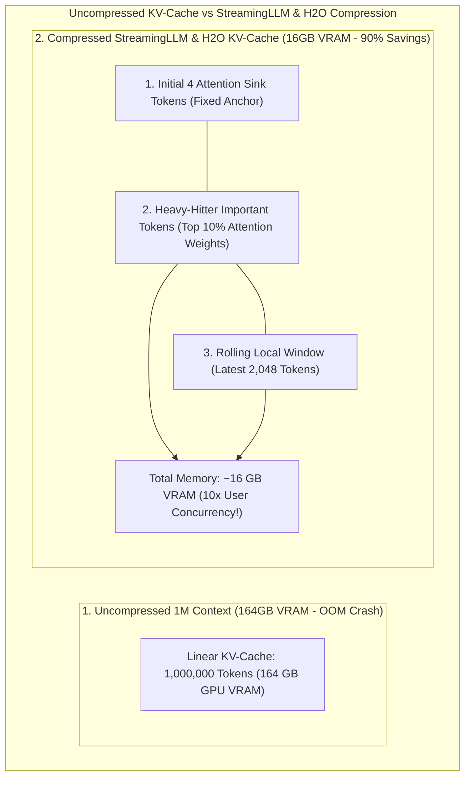
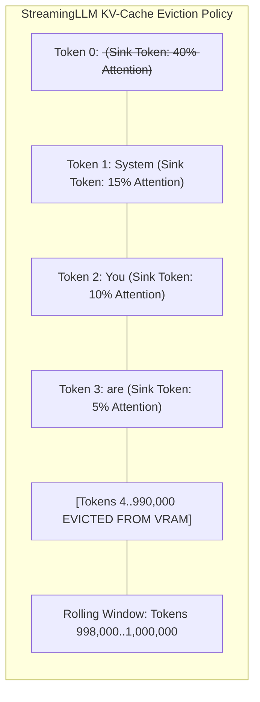

# KV-Cache Compression for 1M+ Context Agents: StreamingLLM, SnapKV & H2O Heavy-Hitter Eviction

With the emergence of ultra-long context language models (**Gemini 1.5 Pro**, **Claude 3.5 Sonnet**, **Llama 3.1 405B**), autonomous AI agents can ingest entire codebases, legal repositories, and multi-hour audio streams into a single prompt.

In production inference infrastructure, however, long-context serving hits a catastrophic physical barrier: **the KV-Cache VRAM Memory Wall**.

During autoregressive generation, the Key-Value (KV) cache stores past token key and value tensors in GPU High Bandwidth Memory (HBM) to avoid recomputing self-attention:

$$\text{KV-Cache Memory Size} = 2 \times \text{Batch Size} \times \text{Seq Length} \times N_{\text{layers}} \times N_{\text{kv\_heads}} \times D_{\text{head}} \times \text{Bytes}$$

For a 70B parameter model serving a $1,000,000\text{-token}$ context in standard `float16`:

$$\text{KV-Cache Size} = 2 \times 1 \times 10^6 \times 80 \text{ layers} \times 8 \text{ heads} \times 128 \times 2 \text{ bytes} \approx \mathbf{163.84 \text{ Gigabytes of GPU VRAM per request!}}$$

The KV-cache memory footprint **vastly exceeds the size of the model weights themselves ($140\text{ GB}$)**, limiting GPU concurrency to $1$ user per $\$30,000$ Nvidia H100 GPU.

To make long-context agents economically viable, modern inference engines deploy **KV-Cache Compression**: leveraging **StreamingLLM Attention Sinks**, **SnapKV Positional Clustering**, and **H2O Heavy-Hitter Eviction** to reduce VRAM consumption by **$80\%\text{ to }90\%$** with near-zero degradation in reasoning accuracy.



---

## 1. The Long-Context VRAM Memory Wall

Why does KV-cache memory scale so aggressively compared to model weights?

### Key-Value Cache Scaling Math:
Model weights remain **static** regardless of sequence length. The KV-cache, however, grows **linearly ($O(N)$) with every single token generated**.

```
> **KV-CACHE VRAM FOOTPRINT AT SCALE (Llama-3-70B, FP16)**
| Context Length | KV-Cache Size (Single Request) | GPU Hardware Required                           |
| 4,000 tokens   | 0.65 GB                        | 1x RTX 4090 / A10G                              |
| 32,000 tokens  | 5.24 GB                        | 1x A100 (80GB)                                  |
| 128,000 tokens | 20.97 GB                       | 2x A100 (80GB) Tensor Parallel                  |
| 1,000,000 tokens| 163.84 GB                     | 🚨 Requires 4x H100 (80GB) just for ONE USER!   |

```

---

## 2. The Attention Sink Phenomenon & StreamingLLM

In early attempts to bound KV-cache size, engineers implemented **Naive Sliding Window Attention** (keeping only the most recent 4,000 tokens and dropping older ones).

Naive sliding window suffered from a catastrophic failure: **after token 4,001, the model’s perplexity spiked to infinity, outputting complete gibberish**.

### Why did sliding window fail? The Discovery of Attention Sinks
In 2023, researchers at MIT and Meta (Xiao et al.) discovered the **Attention Sink Phenomenon**:
* In Softmax self-attention ($\text{Softmax}(QK^T / \sqrt{d})$), the exponential sum across all keys must equal $1.0$.
* Even when an initial token has no semantic relevance to the current sentence, the model dumps **massive unallocated attention weights ($> 50\%$) onto the first 4 tokens of the prompt**.
* When sliding window attention evicted those initial tokens, the softmax denominator destabilized, destroying the model's internal attention distribution.



**The StreamingLLM Invariant**: By permanently pinning the **first 4 Attention Sink Tokens** in GPU memory and pairing them with a **rolling local window**, an LLM can generate text infinitely over millions of tokens with a bounded $O(1)$ VRAM memory footprint!

---

## 3. H2O (Heavy-Hitter Oracle) & SnapKV

While StreamingLLM maintains fluency for streaming dialogue, agents performing code analysis require retaining critical entities and function definitions located midway through a $500\text{k-token}$ prompt.

### 1. H2O (Heavy Hitter Oracle)
* Tracks the cumulative attention scores assigned to each token over time.
* Retains the **Top 10% Heavy-Hitter (H2) Tokens** (e.g. database schemas, class definitions, specific instructions) while evicting the bottom $90\%$ low-attention filler tokens.

### 2. SnapKV (Positional Clustering)
* Observes the attention patterns during prompt processing and selects key semantic clusters per attention head, compressing the prompt KV-cache by **$85\%$** in a single pass before autoregressive decoding begins.

---

## Python Implementation: StreamingLLM & H2O KV-Cache Simulator

Here is a Python implementation simulating an attention sink retention and H2O Heavy-Hitter dynamic KV-cache eviction engine:

```python
import numpy as np
from dataclasses import dataclass
from typing import Dict, List, Tuple

@dataclass
class KVCacheEntry:
    token_id: int
    token_str: str
    cumulative_attention: float
    is_sink: bool = False

class CompressedKVCache:
    """
    Simulates StreamingLLM (Attention Sinks) + H2O (Heavy Hitter) KV-Cache Eviction.
    """
    def __init__(self, max_capacity: int = 8, sink_tokens_count: int = 2, heavy_hitter_ratio: float = 0.5):
        self.max_capacity = max_capacity
        self.sink_count = sink_tokens_count
        self.heavy_hitter_budget = int((max_capacity - sink_tokens_count) * heavy_hitter_ratio)
        self.rolling_window_budget = (max_capacity - sink_tokens_count) - self.heavy_hitter_budget
        
        self.entries: List[KVCacheEntry] = []

    def append_token(self, token_id: int, token_str: str, attention_score: float):
        is_sink = len(self.entries) < self.sink_count
        entry = KVCacheEntry(token_id, token_str, cumulative_attention=attention_score, is_sink=is_sink)
        self.entries.append(entry)

        # Evict if exceeding capacity
        if len(self.entries) > self.max_capacity:
            self._evict_cache()

    def _evict_cache(self):
        # 1. Protect Attention Sinks (First N tokens)
        sinks = self.entries[:self.sink_count]
        remaining = self.entries[self.sink_count:]

        # 2. Protect Rolling Local Window (Most recent N tokens)
        recent_window = remaining[-self.rolling_window_budget:]
        middle_candidates = remaining[:-self.rolling_window_budget]

        # 3. H2O Selection: Keep top heavy-hitters from middle candidates
        if middle_candidates:
            # Sort by cumulative attention score
            middle_candidates.sort(key=lambda x: x.cumulative_attention, reverse=True)
            kept_heavy_hitters = middle_candidates[:self.heavy_hitter_budget]
        else:
            kept_heavy_hitters = []

        # Reconstruct compact KV-cache
        self.entries = sinks + sorted(kept_heavy_hitters + recent_window, key=lambda x: x.token_id)

    def print_cache_state(self):
        tokens_repr = []
        for e in self.entries:
            tag = " [SINK]" if e.is_sink else ""
            tokens_repr.append(f"'{e.token_str}'(att:{e.cumulative_attention:.2f}){tag}")
        print(f" 📦 Active KV-Cache ({len(self.entries)}/{self.max_capacity} tokens): [ {', '.join(tokens_repr)} ]")

# Demonstration Execution
if __name__ == "__main__":
    cache = CompressedKVCache(max_capacity=6, sink_tokens_count=2, heavy_hitter_ratio=0.5)

    print("🚀 Ingesting Long Token Sequence into Compressed KV-Cache...")
    tokens_stream = [
        (0, "<s>", 0.95),          # Sink 1 (High Attention)
        (1, "System:", 0.85),      # Sink 2 (High Attention)
        (2, "import", 0.10),       # Low Attention
        (3, "PostgresDB", 0.90),   # Critical Entity (Heavy Hitter!)
        (4, "as", 0.05),           # Filler
        (5, "db", 0.20),           # Filler
        (6, "def", 0.15),          # Filler
        (7, "query():", 0.75),     # Rolling Window
    ]

    for tid, tstr, att in tokens_stream:
        print(f"\n⚡ Ingesting Token #{tid}: '{tstr}' (Attention: {att})")
        cache.append_token(tid, tstr, att)
        cache.print_cache_state()
```

---

## Summary: KV-Cache Compression Matrix

| Technique | Memory Footprint | Attention Sinks Kept? | Needle-in-a-Haystack Recall | Best Use Case |
|---|---|---|---|---|
| **Uncompressed KV-Cache** | $100\%$ ($164\text{ GB}$ per 1M context) | N/A | $100\%$ | High-budget offline batch runs |
| **Naive Sliding Window** | $10\%\text{--}20\%$ | ❌ No (Perplexity spikes) | $0\%$ | 🚫 Broken Anti-pattern |
| **StreamingLLM** | **$5\%\text{--}10\%$** ($O(1)$ bounded) | **✅ Yes (First 4 tokens)** | Local only | Infinite streaming agents |
| **H2O Heavy-Hitter** | **$15\%\text{--}20\%$** | **✅ Yes** | **$> 95\%$ Recall** | Long-context coding & document analysis |
| **SnapKV** | **$10\%\text{--}15\%$** | **✅ Yes** | **$> 98\%$ Recall** | Production prompt compression |

---

## Architectural Takeaway
Serving 1M+ token context windows is not a hardware brute-force challenge—**it is an attention geometry optimization problem**.

By locking in **Attention Sinks (StreamingLLM)** and dynamically pruning low-salience tokens with **H2O Heavy-Hitter and SnapKV algorithms**, AI systems engineers unlock multi-million token agent capabilities with an **$80\%\text{ to }90\%$ reduction in GPU VRAM costs**.
