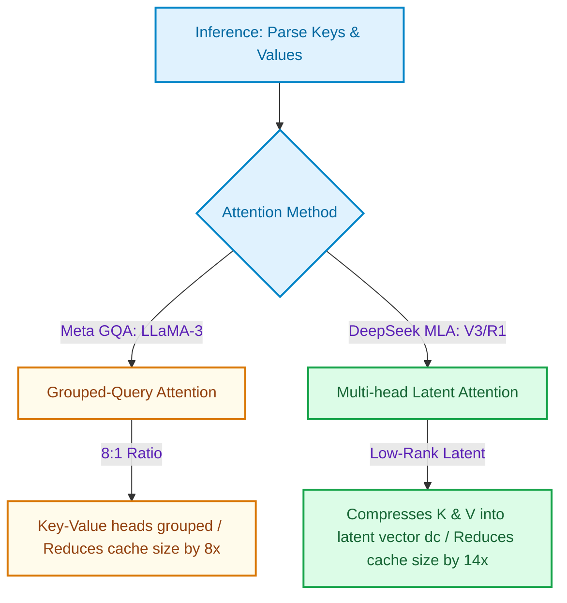

# Compressing the KV Cache: DeepSeek's Latent Projections (MLA) vs. Meta's Grouped Queries (GQA)

> ### 📖 Article Overview
> * **What this article is about:** An analysis of Key-Value (KV) cache compression methods, comparing low-rank Multi-head Latent Attention (MLA, used in DeepSeek V3/R1) against Grouped-Query Attention (GQA, used in Meta LLaMA-3).
> * **Why it matters:** LLM serving throughput is bounded by memory bandwidth. Storing the historical keys and values of concurrent active users consumes massive amounts of VRAM, limiting concurrency.
> * **What we synthesized:** GQA groups heads to reduce cache footprint by 8x with minimal information loss. MLA projects keys and values into a compressed latent vector space to achieve a 14x (93%) cache reduction, significantly boosting server throughput but adding mathematical projection overhead.

---

The primary bottleneck in serving large language models is not compute capability—it is memory bandwidth. 

When generating text, the model must store the Key-Value (KV) tensors of all past tokens in GPU memory. This is called the **KV Cache**. For a 70B parameter model processing a 32K context window, the KV Cache for a single user request can consume over **12GB of VRAM**, severely limiting the number of concurrent requests a server can process.

To resolve this bottleneck, framework developers use key cache compression strategies: Meta's **Grouped-Query Attention (GQA)** and DeepSeek's **Multi-head Latent Attention (MLA)**.

This article synthesizes the trade-offs of MLA vs. GQA, detailing **what is good (pros)**, **what is not (cons)**, and how to write a TypeScript telemetry profiling script, drawing from high-throughput optimization designs modeled in my async engine, [django-payroll-engine](https://github.com/akmalkhaniub/django-payroll-engine).

---

## Attention Projections: GQA vs. MLA

GQA groups multiple Query heads to share single Key/Value heads, while MLA compresses keys and values into a shared low-rank latent vector space, expanding them dynamically during computation.



---

## Synthesis: What's Good & What's Not

### 1. Grouped-Query Attention (GQA)
Used as the standard attention mechanism in Meta's LLaMA-3 and Mistral's Mixtral models.

*   **What's Good (The Pros)**:
    *   *Simplicity*: Easy to implement and fully supported by all major GPU serving runtimes (vLLM, TensorRT-LLM).
    *   *8x Cache Compression*: Reduces the KV Cache memory footprint by a factor of 8 by grouping 8 Query heads per single Key/Value head.
*   **What's Not (The Cons)**:
    *   *Information Loss*: Grouping heads degrades the model's ability to attend to multiple different facts simultaneously, slightly impacting long-context recall.

---

### 2. Multi-head Latent Attention (MLA)
Introduced in DeepSeek-V3 and utilized in the DeepSeek-R1 reasoning models.

*   **What's Good (The Pros)**:
    *   *93% Cache Reduction*: MLA compresses keys and values into a compact, low-rank latent vector space ($d_c = 512$ dimensions) during inference. This reduces the KV Cache footprint by **14x** compared to standard Multi-Head Attention.
    *   *Massive Concurrent Throughput*: By freeing up VRAM, servers can process 10x more concurrent user streams on the same GPU cluster, slashing operational hosting costs.
*   **What's Not (The Cons)**:
    *   *Increased Computation Load*: Decompressing the latent KV representation during the attention forward pass adds extra mathematical projection steps, increasing the active GPU compute load.
    *   *Integration Complexity*: The custom projection equations are highly complex, requiring specialized serving kernels that are not yet natively supported by all standard model runners.

---

## Profiling KV-Cache Memory in TypeScript

To monitor and scale high-concurrency systems, you must track the active memory footprint of your model's context caches. 

Here is a TypeScript class that calculates the KV Cache memory footprint of a serving cluster under concurrent user requests, using the structural principles found in our asynchronous transaction processors in [django-payroll-engine](https://github.com/akmalkhaniub/django-payroll-engine).

```typescript
interface ModelSpec {
  name: string;
  numLayers: number;
  numHeads: number;
  headDim: number;
  numKvHeads: number; // For GQA
  latentDim?: number;  // For MLA
}

class KVCacheProfiler {
  private spec: ModelSpec;

  constructor(spec: ModelSpec) {
    this.spec = spec;
  }

  /**
   * Calculates KV Cache size in Bytes per single user request
   * Formula for standard/GQA: 2 * numLayers * numKvHeads * headDim * seqLen * bytesPerFloat
   */
  public calculateRequestCacheSize(seqLen: number, precisionBytes: number = 2): number {
    const { numLayers, headDim, numKvHeads, latentDim } = this.spec;

    if (latentDim) {
      // MLA formula: Compresses K&V into a latent dimension (dc)
      // KV Cache size = (latentDim + positional_dimension) * numLayers * seqLen * precisionBytes
      const posDim = 64; // DeepSeek-V3 positional embedding dimension
      return (latentDim + posDim) * numLayers * seqLen * precisionBytes;
    }

    // GQA / Standard formula
    return 2 * numLayers * numKvHeads * headDim * seqLen * precisionBytes;
  }

  /**
   * Profiles total VRAM consumption for concurrent sessions
   */
  public profileCluster(activeUsers: number, avgSeqLen: number): void {
    const cachePerUserBytes = this.calculateRequestCacheSize(avgSeqLen);
    const totalCacheBytes = cachePerUserBytes * activeUsers;
    const totalCacheGB = totalCacheBytes / (1024 * 1024 * 1024);

    console.log(`[Memory Profile - ${this.spec.name}]:`);
    console.log(`- KV Cache per user: ${(cachePerUserBytes / (1024 * 1024)).toFixed(2)} MB`);
    console.log(`- Total KV Cache for ${activeUsers} concurrent users: ${totalCacheGB.toFixed(2)} GB`);
  }
}

// Example usage comparing LLaMA-3 (GQA) vs DeepSeek-V3 (MLA)
const llama3Profiler = new KVCacheProfiler({
  name: "LLaMA-3-70B (GQA)",
  numLayers: 80,
  numHeads: 64,
  headDim: 128,
  numKvHeads: 8 // GQA ratio 8:1
});

const deepseekProfiler = new KVCacheProfiler({
  name: "DeepSeek-V3 (MLA)",
  numLayers: 61,
  numHeads: 128,
  headDim: 128,
  numKvHeads: 128, // MLA uses latent projection instead
  latentDim: 512    // Compressed low-rank representation
});

// Profile 100 concurrent users at 32K context window
llama3Profiler.profileCluster(100, 32768);
deepseekProfiler.profileCluster(100, 32768);
```

---

## KV-Cache Management Guardrails

* **vLLM PagedAttention**: Always deploy KV Cache configurations inside dynamic paging engines (like vLLM PagedAttention) to prevent fragmentation crashes.
* **Prefill Decoupling**: Separate prefill instances (which compute KV tensors) from decoding instances (which iterate token generation) to prevent latency spikes during high-concurrency request bursts.

---

## Conclusion & Key Takeaways

Optimizing memory utilization during token decoding is the key to scaling LLM deployments:
1. **The Concurrency Revolution:** DeepSeek's MLA demonstrates that low-rank compression of keys and values allows a single server to handle up to 10x more concurrent users, drastically lowering hosting costs.
2. **Compute vs. Memory Trade-off:** GQA is mathematically simpler and universally supported by serving frameworks, making it the choice for general deployments. MLA trades additional GPU matrix projections (FLOPs) for high VRAM compression.
3. **Deploy with Paging:** Regardless of the attention optimization selected, combining compression with block-allocation schemes (like PagedAttention) is necessary to eliminate cache fragmentation.

*Takeaway:* Choose GQA for out-of-the-box framework compatibility; choose MLA to maximize active concurrent user densities.

---

## References & Further Reading

* **DeepSeek MLA Specification**: DeepSeek-AI. *DeepSeek-V3 Technical Report*. Details Multi-head Latent Attention math and low-rank projections. [DeepSeek Portal](https://github.com/deepseek-ai/DeepSeek-V3).
* **Meta LLaMA GQA**: Meta AI. *LLaMA 3 Model Architecture*. Details on Grouped-Query Attention scaling. [Meta AI Blog](https://ai.meta.com/blog/meta-llama-3/).
* **Attention Compression**: ICLR papers on KV-cache compression and low-rank tensor decompositions.

*To check out our high-throughput asynchronous engine logic and database scaling structures, inspect the source code of our [django-payroll-engine](https://github.com/akmalkhaniub/django-payroll-engine) repository.*
