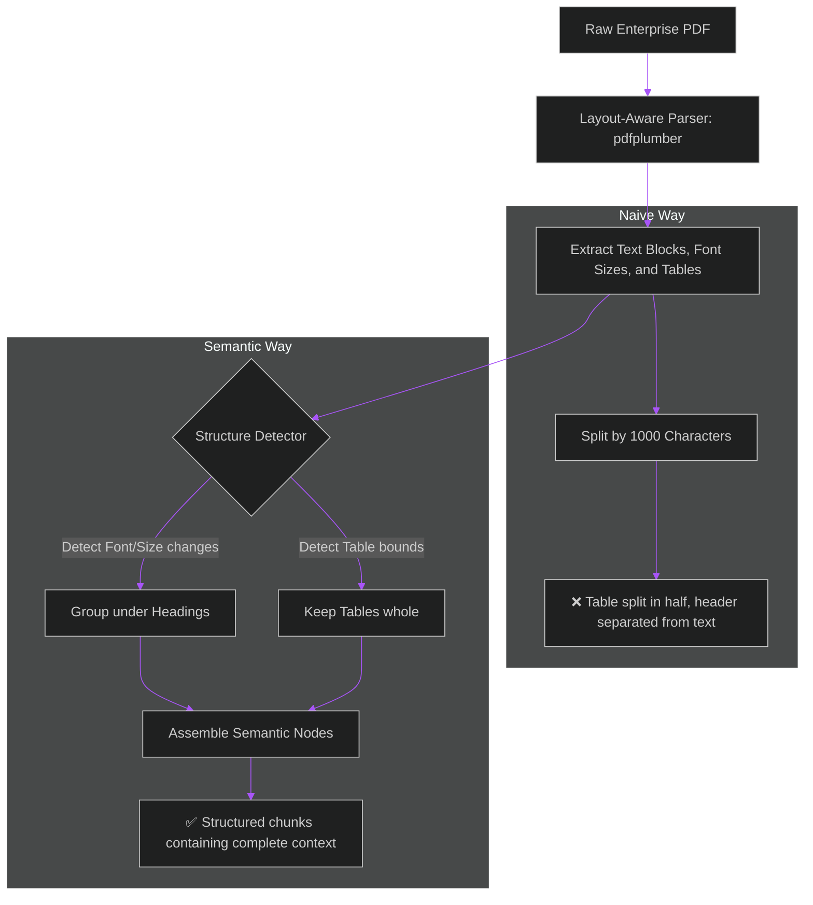

# Semantic Chunking & Layout-Aware PDF Ingestion for Enterprise RAG

> [!NOTE]
> **📖 Article Overview**
> The most common failure mode in enterprise Retrieval-Augmented Generation (RAG) is **poor document chunking**. Most developer guides suggest splitting documents into chunks using a simple character limit (e.g., `1000 characters with 200 overlap`). However, when applied to PDF files, this naive strategy regularly splits tables in half, cuts off headers from their corresponding paragraphs, and separates list items. The result is context fragmentation that causes the LLM to retrieve incomplete information. This article shows you how to build a **layout-aware, semantic chunking pipeline** in Python to keep your RAG contexts clean and cohesive.

---

## Naive Chunking vs. Semantic Layout-Aware Chunking

* **Naive Chunking (Recursive Character Split)**: Splitting text at arbitrary character limits. It ignores headings, tables, and document layout. This ruins the semantic structure, causing vector models to index fragments of unrelated sentences.
* **Layout-Aware Semantic Chunking**: Reading the PDF file structure, detecting structural boundaries (headings, subheadings, tables, lists), and grouping text blocks into semantic nodes.



---

## Implementing a Layout-Aware Parser in Python

Here is a complete, production-grade parser class utilizing `pdfplumber` to extract tables intact and group text blocks by structural headings.

```python
import os
import pdfplumber

class SemanticPDFIngestor:
    def __init__(self, filepath: str):
        self.filepath = filepath

    def extract_layout_chunks(self) -> list[dict]:
        chunks = []
        
        with pdfplumber.open(self.filepath) as pdf:
            for page_num, page in enumerate(pdf.pages, start=1):
                # 1. Extract Tables Intact
                tables = page.extract_tables()
                table_texts = []
                for table in tables:
                    # Format table rows into Markdown string representation
                    table_str = "\n".join([" | ".join([cell or "" for cell in row]) for row in table])
                    table_texts.append(table_str)
                    
                    chunks.append({
                        "page": page_num,
                        "type": "table",
                        "content": f"Table on Page {page_num}:\n{table_str}"
                    })

                # 2. Extract Text Blocks with layout awareness
                # We filter out text that is already captured in the table extraction coordinates
                text_objects = page.extract_words(
                    keep_blank_chars=True,
                    extra_attrs=["size", "fontname"]
                )
                
                if not text_objects:
                    continue

                # Group words into lines and detect headings based on font size
                current_line = []
                lines = []
                last_top = None
                
                for word in text_objects:
                    # Detect new line based on vertical coordinate changes
                    if last_top is not None and abs(word["top"] - last_top) > 3:
                        lines.append(current_line)
                        current_line = []
                    current_line.append(word)
                    last_top = word["top"]
                if current_line:
                    lines.append(current_line)

                # Assemble lines and classify headings
                current_chunk = []
                current_heading = "General"
                
                for line in lines:
                    line_text = " ".join([w["text"] for w in line]).strip()
                    if not line_text:
                        continue
                        
                    # Calculate average font size for this line
                    avg_font_size = sum([w["size"] for w in line]) / len(line)
                    
                    # Assume font sizes > 14 are section headings
                    if avg_font_size > 14:
                        # Yield the previous semantic chunk before starting the new heading
                        if current_chunk:
                            chunks.append({
                                "page": page_num,
                                "type": "paragraph",
                                "heading": current_heading,
                                "content": "\n".join(current_chunk)
                            })
                            current_chunk = []
                        current_heading = line_text
                    else:
                        current_chunk.append(line_text)

                if current_chunk:
                    chunks.append({
                        "page": page_num,
                        "type": "paragraph",
                        "heading": current_heading,
                        "content": "\n".join(current_chunk)
                    })
                    
        return chunks

# Example Run
if __name__ == "__main__":
    # Assuming a PDF exists at the given path
    pdf_path = "mock_manual.pdf"
    
    # Create a dummy PDF for testing if not present
    if not os.path.exists(pdf_path):
        print(f"File {pdf_path} not found. Please provide a PDF to test.")
    else:
        parser = SemanticPDFIngestor(pdf_path)
        extracted_chunks = parser.extract_layout_chunks()
        
        for idx, chunk in enumerate(extracted_chunks[:3], start=1):
            print(f"--- Chunk {idx} (Type: {chunk['type']}, Page: {chunk['page']}) ---")
            if "heading" in chunk:
                print(f"Heading: {chunk['heading']}")
            print(chunk["content"])
            print("-" * 40 + "\n")
```

---

## 🏁 Conclusion & Takeaways

To build production-grade document ingestion engines:
* [ ] **Keep tables whole**: Extract tables using coordinate extraction and convert them to Markdown tables before vectorizing.
* [ ] **Detect section headers**: Use font size and styling changes to mark boundaries between semantic topics, appending the active header to sub-paragraphs to preserve context.
* [ ] **Filter headers and footers**: Remove page numbers, repeating headers, and footers from text chunks to prevent indexing noise.
* [ ] **Include metadata tags**: Always tag each chunk with source metadata (filename, page number, active section header) to allow downstream filtering and source citation.
