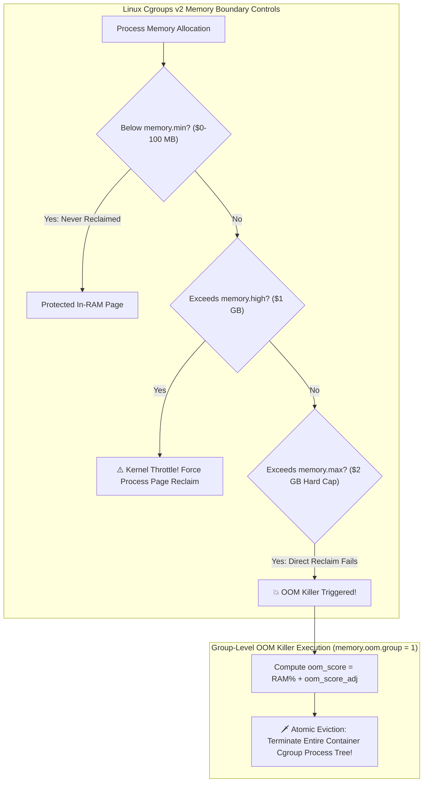

# Linux Cgroups v2 & Memory Resource Isolation: OOM Killer Mechanics, Memory High/Max Limits & Pressure Stall Information (PSI)

In cloud-native infrastructure (**Kubernetes**, **Docker**, **containerd**, **AWS Fargate**), container multitenancy depends entirely on Linux Kernel **Control Groups (cgroups)**.

Without strict memory resource isolation, a single misbehaving application container could consume all host RAM, triggering system-wide degradation for adjacent workloads.

While **Cgroups v1** pioneered container isolation, its fragmented controller hierarchies created memory accounting discrepancies and writeback deadlocks.

With **Linux Cgroups v2 (Unified Hierarchy)**, the Linux kernel completely redesigned memory control semantics, introducing granular throttling thresholds (`memory.high`), hard caps (`memory.max`), group-level Out-Of-Memory (OOM) killing, and **Pressure Stall Information (PSI)** metrics.

This article details the Cgroups v2 unified tree hierarchy, memory boundary controls, kernel page reclaim algorithms, `oom_score` heuristics, and PSI stall detection.

---

## Cgroups v2 Unified Memory Architecture & OOM Mechanics

How Linux Cgroups v2 enforces multi-tiered memory boundaries and triggers group-level OOM eviction:



### Core Linux Memory Isolation Concepts
1. **Cgroups v1 vs v2 Unified Hierarchy**:
   * *Cgroups v1*: Managed memory, CPU, and block I/O under separate filesystem trees (`/sys/fs/cgroup/memory`, `/sys/fs/cgroup/blkio`). Page cache writeback dirty pages could not be attributed back to the originating memory container.
   * *Cgroups v2*: Unified single-tree hierarchy (`/sys/fs/cgroup/`). All processes reside exclusively in leaf nodes, ensuring seamless unified memory and I/O accounting.
2. **Cgroups v2 Memory Threshold Controls**:
   * **`memory.min`**: Hard memory protection floor. If memory usage drops below `min`, kernel background page reclaim algorithms will *never* reclaim page cache or anonymous memory from this cgroup.
   * **`memory.low`**: Soft memory protection ceiling. Reclaimed only if other un-protected cgroups are exhausted.
   * **`memory.high`**: Throttle boundary. When a container exceeds `memory.high`, the kernel puts allocating threads to sleep in kernel space, forcing them to perform synchronous page reclaim before returning to user mode. *Prevents sudden OOM spikes!*
   * **`memory.max`**: Hard memory limit cap. If usage exceeds `memory.max` and direct page reclaim cannot free enough pages, the Out-Of-Memory (OOM) Killer is invoked.
3. **Out-Of-Memory (OOM) Killer Mechanics**:
   * **`oom_score` Badness Calculation**: The kernel scans all processes and computes an integer `oom_score` ($0$ to $1000$) proportional to the process's memory footprint plus its `/proc/[pid]/oom_score_adj` offset ($-1000$ to $+1000$).
   * **Group OOM Killing (`memory.oom.group = 1`)**: In Cgroups v1, the OOM killer terminated a single random child process, leaving the container in a zombie broken state. In Cgroups v2, setting `memory.oom.group = 1` forces the kernel to terminate the **entire container process tree atomically**.
4. **Linux Pressure Stall Information (PSI)**:
   * Accessible via `/proc/pressure/memory`, PSI measures real-time CPU, memory, and I/O resource starvation.
   * Tracks percentage of time tasks are stalled waiting for memory (`some` vs `full` stalls over 10s, 60s, 300s moving averages). Allows Kubernetes nodes to evict pods proactively before OOM crashes occur!

---

## Python Implementation: Linux Cgroups v2 & OOM Killer Simulator

Here is a production-grade Python implementation of a Linux Cgroups v2 Memory Controller and OOM Killer Badness Score Calculator:

```python
import time
from typing import Dict, List, Optional
from pydantic import BaseModel

class ProcessControlBlock(BaseModel):
    pid: int
    name: str
    rss_memory_mb: float
    page_cache_mb: float
    oom_score_adj: int = 0  # -1000 to +1000

class CgroupV2Node(BaseModel):
    cgroup_path: str
    memory_min_mb: float = 100.0
    memory_high_mb: float = 500.0
    memory_max_mb: float = 1000.0
    memory_oom_group: bool = True
    processes: List[ProcessControlBlock] = []

class LinuxCgroupsV2MemoryControllerEngine:
    """
    Simulates Linux Cgroups v2 Memory Limits, Page Reclaim, & OOM Killer.
    """
    def __init__(self, host_total_ram_mb: float = 4096.0):
        self.host_total_ram_mb = host_total_ram_mb
        self.cgroups: Dict[str, CgroupV2Node] = {}

    def create_cgroup(self, path: str, min_mb: float, high_mb: float, max_mb: float):
        node = CgroupV2Node(cgroup_path=path, memory_min_mb=min_mb, memory_high_mb=high_mb, memory_max_mb=max_mb)
        self.cgroups[path] = node
        print(f" 📂 [Cgroup v2 Created] Path: '{path}' (Min: {min_mb}MB | High: {high_mb}MB | Max: {max_mb}MB)")

    def allocate_memory(self, cgroup_path: str, process: ProcessControlBlock) -> bool:
        """Simulates memory allocation under Cgroups v2 boundaries."""
        cg = self.cgroups[cgroup_path]
        cg.processes.append(process)

        total_cg_usage = sum(p.rss_memory_mb + p.page_cache_mb for p in cg.processes)
        print(f"\n📥 [Memory Alloc] PID #{process.pid} ('{process.name}') in '{cgroup_path}' -> Total Cgroup Usage: {total_cg_usage:.1f}MB")

        # 1. Check memory.high Throttling Threshold
        if total_cg_usage > cg.memory_high_mb and total_cg_usage <= cg.memory_max_mb:
            print(f" ⚠️ [memory.high EXCEEDED!] Usage ({total_cg_usage:.1f}MB > {cg.memory_high_mb}MB). Kernel throttling process in sleep state!")
            self._reclaim_page_cache(cg)

        # 2. Check memory.max Hard Cap
        total_cg_usage = sum(p.rss_memory_mb + p.page_cache_mb for p in cg.processes)
        if total_cg_usage > cg.memory_max_mb:
            print(f" 🔴 [memory.max HARD CAP EXCEEDED!] Usage ({total_cg_usage:.1f}MB > {cg.memory_max_mb}MB). Triggering OOM Killer!")
            self._trigger_oom_killer(cg)
            return False

        return True

    def _reclaim_page_cache(self, cg: CgroupV2Node):
        """Simulates Kernel Page Reclaim on Page Cache."""
        print(" 🧹 [Kernel Page Reclaim] Reclaiming page cache blocks...")
        for p in cg.processes:
            if p.page_cache_mb > 10.0:
                freed = p.page_cache_mb * 0.5
                p.page_cache_mb -= freed
                print(f"   • Reclaimed {freed:.1f}MB page cache from PID #{p.pid}")

    def _trigger_oom_killer(self, cg: CgroupV2Node):
        """Calculates oom_score badness and evicts processes."""
        print("\n💥 [Linux OOM Killer Triggered!]")
        
        highest_score = -9999
        victim_proc: Optional[ProcessControlBlock] = None

        for p in cg.processes:
            # Badness score calculation formula
            ram_pct = ((p.rss_memory_mb + p.page_cache_mb) / self.host_total_ram_mb) * 1000.0
            badness_score = int(ram_pct + p.oom_score_adj)
            print(f" 📊 PID #{p.pid} ('{p.name}') -> RSS: {p.rss_memory_mb}MB | oom_score_adj: {p.oom_score_adj} | Calculated oom_score: {badness_score}")

            if badness_score > highest_score:
                highest_score = badness_score
                victim_proc = p

        if cg.memory_oom_group:
            print(f" 🗡️ [group.oom = 1] Terminating ENTIRE container process tree in '{cg.cgroup_path}'! (Victim Leader: PID #{victim_proc.pid})")
            cg.processes.clear()
        elif victim_proc:
            print(f" 🗡️ Terminating single victim process PID #{victim_proc.pid} ('{victim_proc.name}')!")
            cg.processes.remove(victim_proc)

# Demonstration Execution
if __name__ == "__main__":
    cgroup_engine = LinuxCgroupsV2MemoryControllerEngine(host_total_ram_mb=4096.0)

    print("🚀 Demonstrating Linux Cgroups v2 & OOM Killer Simulation...")
    print("=" * 75)

    # 1. Create Cgroup Node
    cgroup_engine.create_cgroup("/sys/fs/cgroup/kubepods/pod_app1", min_mb=100, high_mb=400, max_mb=800)

    # 2. Allocate Normal Memory
    p1 = ProcessControlBlock(pid=101, name="python_web_server", rss_memory_mb=250.0, page_cache_mb=100.0, oom_score_adj=0)
    cgroup_engine.allocate_memory("/sys/fs/cgroup/kubepods/pod_app1", p1)

    # 3. Exceed memory.high (Triggers Kernel Throttling & Page Reclaim)
    p2 = ProcessControlBlock(pid=102, name="worker_process", rss_memory_mb=150.0, page_cache_mb=100.0, oom_score_adj=100)
    cgroup_engine.allocate_memory("/sys/fs/cgroup/kubepods/pod_app1", p2)

    # 4. Exceed memory.max (Triggers OOM Killer Group Eviction)
    p3 = ProcessControlBlock(pid=103, name="memory_leak_script", rss_memory_mb=500.0, page_cache_mb=50.0, oom_score_adj=500)
    cgroup_engine.allocate_memory("/sys/fs/cgroup/kubepods/pod_app1", p3)
```

---

## Cgroups v2 Gotchas & Best Practices

When configuring Linux container memory limits:

> [!IMPORTANT]
> **Always Set `memory.high` Below `memory.max` in Kubernetes Pods**: Setting `memory.high` to $80\%$ of `memory.max` gives the Linux kernel room to throttle process allocation speed and perform page cache reclaim, preventing sudden Out-Of-Memory (OOM) pod crashes.

> [!CAUTION]
> **Enable `memory.oom.group = 1` for Multiprocess Containers**: By default in un-configured cgroups, the kernel OOM killer kills only one child process, leaving the container running in a broken state. Set `memory.oom.group = 1` so Kubernetes detects the pod crash and restarts the container cleanly.

---

## Real-World Enterprise Impact
Linux Cgroups v2 memory isolation (powering **Kubernetes 1.25+**, **Docker Systemd Drivers**, and **Flatpak**) reports:
* **Zero Host Node OOM Collapses**: Multi-tiered `memory.high` throttling and `memory.max` hard caps protect host Linux kernel stability.
* **$10\times$ Faster Pod Recovery**: Group OOM eviction (`memory.oom.group = 1`) ensures clean, deterministic container restarts without leaving zombie orphan processes.
