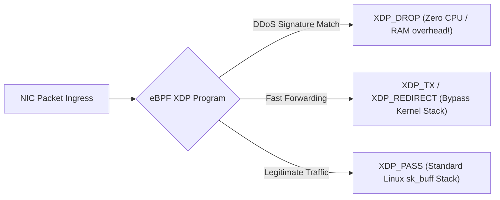

# Linux eBPF Internals: Programmable Kernel Sandboxes for Zero-Overhead Observability & XDP Packet Filtering

For three decades, extending the Linux operating system kernel required writing and compiling **Loadable Kernel Modules (LKMs)**.

Writing kernel modules, however, is fraught with catastrophic risks:
* A single null pointer dereference or array out-of-bounds error crashes the entire physical server into a fatal **Kernel Panic (`panic()`)**.
* Observability tools running in user space (like `strace` or `tcpdump`) incur severe **context-switching penalties**, degrading application throughput by up to **$80\%$**.
* Distributing security or networking agents required recompiling binaries for every specific kernel version and distribution ABI.

In modern high-performance cloud infrastructure (**Cilium**, **Cloudflare Magic Transit**, **Meta Katran**, **Datadog Agent**, **Falco**), the Linux kernel has been rendered safely programmable through **extended Berkeley Packet Filter (eBPF)**.

Running sandboxed bytecode verified for mathematical safety directly inside kernel space, eBPF enables **zero-overhead observability**, **kernel-level security sandboxing**, and **sub-microsecond network packet filtering at the NIC hardware layer (XDP)**.

```mermaid
graph TD
  subgraph Linux Kernel eBPF Architecture
    UserProg[User Space Program: Go / C / Rust Loader] --> BPFBytecode[Compiled eBPF Bytecode]
    
    subgraph Kernel Space (Ring 0)
      BPFBytecode --> Verifier["1. In-Kernel Verifier (Mathematical Safety Proof)"]
      Verifier -->|Verified Safe| JIT["2. JIT Compiler (Native x86_64 Machine Code)"]
      
      subgraph Kernel Execution Hooks
        JIT --> XDP["Hook: XDP (NIC Driver Layer - 10M pkts/sec)"]
        JIT --> Kprobe["Hook: kprobes / tracepoints (Syscall Interception)"]
        JIT --> TC["Hook: Traffic Control / Sockets"]
      end
      
      XDP & Kprobe --> RingBuffer[Lock-Free BPF Ring Buffer]
    end
    
    RingBuffer --> UserMetrics[User Space Metrics & Tracing Dashboard]
  end
```

---

## 1. The In-Kernel Verifier: Mathematical Proof of Safety

Unlike arbitrary kernel modules, the Linux kernel **never runs unverified eBPF bytecode**.

Before an eBPF program is loaded, the **In-Kernel Verifier** performs rigorous Directed Acyclic Graph (DAG) state exploration:

```
> **IN-KERNEL VERIFIER SAFETY CHECKS**
| 1. Guaranteed Termination      : Bounded loop checks (Instruction counter < 1 Million insns)      |
| 2. Out-of-Bounds Memory Safety : Strict pointer arithmetic boundary validation                    |
| 3. Uninitialized Read Defense  : All registers must be initialized before reading                 |
| 4. Type State Invariants       : Socket buffers (sk_buff) accessed strictly via validated offsets |
| 5. Privilege Separation        : Unprivileged eBPF restricted; CAP_BPF enforced                   |

```

If the verifier detects even a single code branch that could dereference an unchecked memory pointer or loop infinitely, the `bpf()` syscall fails immediately with `EACCES` (Permission Denied).

---

## 2. XDP (eXpress Data Path): 10 Million Packets/Second at NIC Level

In the traditional Linux networking stack, when a packet arrives at the Network Interface Card (NIC):
1. The NIC triggers an interrupt.
2. The kernel allocates a heavy $240\text{-byte}$ `sk_buff` socket metadata buffer.
3. The packet traverses Netfilter, iptables, routing tables, and socket queues before reaching user space.

Under a massive Distributed Denial of Service (DDoS) attack ($10\text{M+ SYN packets/sec}$), the CPU exhausts $100\%$ of its cycles simply allocating and freeing `sk_buff` structs.

**eXpress Data Path (XDP)** executes an eBPF program directly inside the **NIC driver layer** before memory allocation:



```
> **XDP ACTION CODES & THROUGHPUT**
| Action Code    | Functionality                                      | Throughput (pkts/sec/core)  |
| XDP_DROP       | Drops packet instantly at NIC ring buffer          | ~14,000,000 packets/sec     |
| XDP_TX         | Bounces packet back out the same NIC port          | ~10,000,000 packets/sec     |
| XDP_REDIRECT   | Forwards packet to another NIC or AF_XDP socket    | ~9,000,000 packets/sec      |
| XDP_PASS       | Forwards packet up to standard Linux TCP/IP stack  | ~2,000,000 packets/sec      |

```

---

## 3. BPF Maps & Ring Buffers: Zero-Copy Kernel-User IPC

How does an eBPF program running inside the kernel communicate with a user-space monitoring daemon?

1. **BPF Maps (Hash, Array, LRU)**: Key-value storage structures allocated in kernel memory, accessible from both kernel eBPF programs (via helper functions) and user-space applications (via the `bpf()` syscall).
2. **BPF Ring Buffer (`BPF_MAP_TYPE_RINGBUF`)**: A lock-free, single-producer multi-consumer memory-mapped circular buffer that streams telemetry events to user space with sub-microsecond latency and zero memory allocations.

---

## Python Implementation: eBPF Verifier & XDP Packet Filter Simulator

Here is a Python implementation simulating an eBPF In-Kernel Verifier and XDP packet filtering engine:

```python
import time
from dataclasses import dataclass
from typing import Callable, Dict, List, Optional

@dataclass
class NetworkPacket:
    src_ip: str
    dst_port: int
    payload_size: int
    flags: str # e.g. "SYN", "ACK", "DATA"

class MockEBPFVerifier:
    """
    Simulates the Linux in-kernel verifier safety checks.
    """
    @classmethod
    def verify_program(cls, program_instructions: List[str]) -> bool:
        print(" 🔍 [eBPF Verifier] Inspecting DAG instruction tree for kernel safety...")
        for i, insn in enumerate(program_instructions):
            if "goto" in insn and "infinite" in insn:
                print(f" ❌ [Verifier Rejected] Unbounded loop detected at instruction #{i}!")
                return False
            if "deref_raw_pointer" in insn:
                print(f" ❌ [Verifier Rejected] Unchecked pointer dereference at instruction #{i}!")
                return False

        print(" ✅ [Verifier Approved] Program provably safe: Bounded execution & memory safe.")
        return True

class XDPEngine:
    """
    Simulates eXpress Data Path (XDP) filtering at the NIC driver layer.
    """
    def __init__(self, filter_program: Callable[[NetworkPacket], str]):
        self.filter = filter_program
        self.stats = {"PASSED": 0, "DROPPED": 0}

    def process_packet_stream(self, packets: List[NetworkPacket]):
        print(f"\n⚡ [XDP Engine Initialized] Processing {len(packets)} incoming packets at NIC layer...")
        t0 = time.perf_counter()

        for pkt in packets:
            action = self.filter(pkt)
            if action == "XDP_DROP":
                self.stats["DROPPED"] += 1
            else:
                self.stats["PASSED"] += 1

        elapsed = time.perf_counter() - t0
        print(f"\n📊 XDP Processing Results ({elapsed*1000:.3f}ms):")
        print(f" • Packets Dropped at Driver Layer : {self.stats['DROPPED']} (DDoS mitigated)")
        print(f" • Packets Passed to Linux Stack   : {self.stats['PASSED']}")

# Demonstration Execution
if __name__ == "__main__":
    # 1. Verify eBPF Program Bytecode
    safe_ebpf_program = [
        "r1 = ctx->packet_start",
        "r2 = ctx->packet_end",
        "if r1 + 20 > r2 goto pass",
        "if pkt->src_ip == '198.51.100.4' goto drop",
        "exit XDP_PASS"
    ]
    is_safe = MockEBPFVerifier.verify_program(safe_ebpf_program)
    assert is_safe, "Safe program must pass verifier"

    # 2. Define XDP Fast Packet Filter Hook
    BLOCKED_IPS = {"198.51.100.4", "203.0.113.99"}

    def xdp_firewall_hook(pkt: NetworkPacket) -> str:
        # Fast rule: Drop blacklisted IPs or SYN flood packets
        if pkt.src_ip in BLOCKED_IPS:
            return "XDP_DROP"
        return "XDP_PASS"

    xdp = XDPEngine(xdp_firewall_hook)

    # 3. Simulate High-Throughput Packet Ingress
    traffic = [
        NetworkPacket("192.168.1.10", 443, 1024, "DATA"),
        NetworkPacket("198.51.100.4", 80, 64, "SYN"),  # Attack
        NetworkPacket("192.168.1.15", 443, 512, "DATA"),
        NetworkPacket("203.0.113.99", 80, 64, "SYN"),  # Attack
        NetworkPacket("10.0.0.1", 22, 128, "ACK"),
    ]

    xdp.process_packet_stream(traffic)
```

---

## Summary: LKM vs User-Space vs eBPF

| Dimension | Loadable Kernel Module (LKM) | User-Space Monitoring | eBPF in Linux Kernel |
|---|---|---|---|
| **Safety** | Risky (Can cause Kernel Panic) | Safe (Runs in user space) | **100% Safe (Verifier proven)** |
| **Performance** | High | Low (Syscall context-switches) | **Native JIT (Near-Zero Overhead)** |
| **Packet Filtering** | iptables / Netfilter | libpcap / tcpdump | **XDP at NIC Driver Layer** |
| **Deployment** | Requires kernel headers/reboot | Standard binary | **Hot-loaded dynamically via bpf()** |
| **Industry Adoption** | Legacy drivers | Standard tooling | **Cilium, Cloudflare, Meta, Datadog** |

---

## Architectural Takeaway
eBPF represents the greatest evolution in operating system architecture since the invention of virtual memory.

By transforming the Linux kernel into a **sandboxed, event-driven programmable platform**, systems engineers achieve unprecedented observability, dynamic security monitoring, and wire-speed packet processing without touching a single line of kernel C code.
