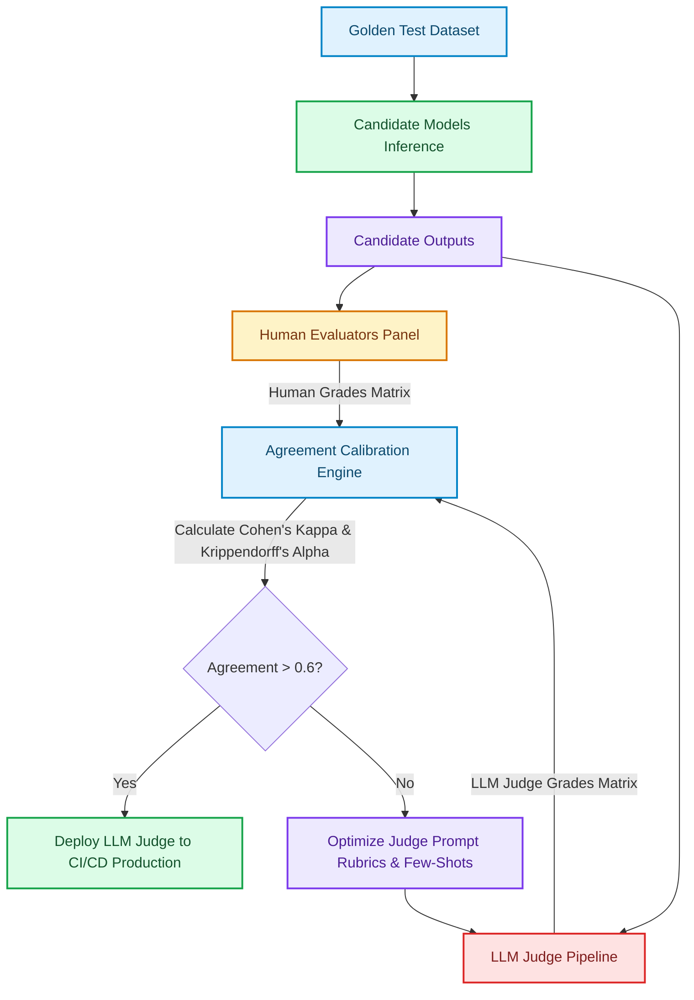

# LLM-as-a-Judge Evaluation Pipelines: Calibration & Agreement Metrics

Evaluating free-form LLM outputs (like multi-turn chats, agent plans, or complex summaries) using traditional n-gram matching metrics like BLEU or ROUGE is highly unreliable [1]. BLEU and ROUGE evaluate exact string matches, which penalize perfectly correct semantic paraphrasing.

To run automated evaluations at scale, modern platforms deploy **LLM-as-a-Judge** frameworks, using frontier LLMs to evaluate candidate models based on structured grading rubrics.

However, LLM judges introduce their own biases: **position bias** (preferring the first candidate), **verbosity bias** (preferring longer responses), and **self-bias** (preferring outputs from their own model family). 

To deploy LLM judges safely, we must measure judge alignment and calibrate scores using statistical agreement metrics like **Cohen's Kappa**.

This article details how to implement an LLM-as-a-Judge calibration pipeline.

---

## LLM-as-a-Judge Calibration Architecture

The calibration pipeline uses human-annotated golden test suites to audit, evaluate, and tune LLM judge prompts:



### Critical Judge Agreement Metrics
1. **Percent Agreement**: Simple ratio of matched scores. This is highly misleading because it does not account for agreements occurring purely by chance.
2. **Cohen's Kappa ($\kappa$)**: Measures pairwise agreement between two raters (e.g., Human vs. LLM Judge) while correcting for the probability of random chance agreement:
   $$\kappa = \frac{p_o - p_e}{1 - p_e}$$
   where $p_o$ is the observed agreement and $p_e$ is the expected chance agreement.
3. **Krippendorff's Alpha ($\alpha$)**: A generalized agreement metric capable of handling multiple judges, missing scores, and various data scales (nominal, ordinal, interval).

---

## Python Implementation: Judge Calibration Engine

Here is a production-grade Python implementation of an evaluation calibration engine that computes Cohen's Kappa agreement and performs bootstrap sampling to calculate 95% confidence intervals:

```python
import numpy as np
from typing import List, Dict, Any, Tuple
from pydantic import BaseModel

class EvaluationPair(BaseModel):
    sample_id: str
    human_grade: int  # 0: Bad, 1: Good
    judge_grade: int  # 0: Bad, 1: Good

class JudgeCalibrationEngine:
    """
    Computes agreement statistics between human evaluators and automated
    LLM judges to validate grade accuracy.
    """
    @staticmethod
    def calculate_cohens_kappa(evals: List[EvaluationPair]) -> float:
        n = len(evals)
        if n == 0:
            return 0.0

        # Create confusion matrix
        # [ [both_0, human_0_judge_1], [human_1_judge_0, both_1] ]
        conf_matrix = np.zeros((2, 2))
        for item in evals:
            conf_matrix[item.human_grade, item.judge_grade] += 1

        total_obs = np.sum(conf_matrix)
        observed_agreement = (conf_matrix[0, 0] + conf_matrix[1, 1]) / total_obs

        # Calculate expected agreement by chance
        marginal_human_0 = np.sum(conf_matrix[0, :]) / total_obs
        marginal_human_1 = np.sum(conf_matrix[1, :]) / total_obs
        marginal_judge_0 = np.sum(conf_matrix[:, 0]) / total_obs
        marginal_judge_1 = np.sum(conf_matrix[:, 1]) / total_obs

        expected_agreement = (marginal_human_0 * marginal_judge_0) + (marginal_human_1 * marginal_judge_1)

        # Handle edge case of perfect agreement possibility
        if expected_agreement == 1.0:
            return 1.0

        kappa = (observed_agreement - expected_agreement) / (1.0 - expected_agreement)
        return float(kappa)

    def compute_bootstrap_confidence_interval(self, evals: List[EvaluationPair], iterations: int = 1000) -> Tuple[float, float]:
        """
        Runs bootstrap resampling to find the 95% confidence interval for Cohen's Kappa.
        """
        kappa_scores = []
        n = len(evals)
        
        for _ in range(iterations):
            # Resample with replacement
            bootstrap_sample = [random.choice(evals) for _ in range(n)]
            kappa = self.calculate_cohens_kappa(bootstrap_sample)
            kappa_scores.append(kappa)

        lower_bound = float(np.percentile(kappa_scores, 2.5))
        upper_bound = float(np.percentile(kappa_scores, 97.5))
        return lower_bound, upper_bound

# Demonstration Execution
if __name__ == "__main__":
    import random
    random.seed(42)

    # 1. Simulate Human vs LLM Judge scores (mostly aligned with some discrepancies)
    eval_dataset = []
    for i in range(100):
        h_grade = random.choice([0, 1])
        # Judge matches human 80% of the time, deviates 20%
        j_grade = h_grade if random.random() < 0.80 else (1 - h_grade)
        eval_dataset.append(EvaluationPair(sample_id=f"s-{i}", human_grade=h_grade, judge_grade=j_grade))

    calibrator = JudgeCalibrationEngine()
    kappa_val = calibrator.calculate_cohens_kappa(eval_dataset)
    lower, upper = calibrator.compute_bootstrap_confidence_interval(eval_dataset, iterations=500)

    print("📊 LLM-as-a-Judge Calibration Report:")
    print("=" * 60)
    print(f" Cohen's Kappa Coefficient (κ): {kappa_val:.4f}")
    print(f" 95% Bootstrap Confidence Interval: [{lower:.4f}, {upper:.4f}]")
    
    # Interpret Kappa value
    if kappa_val >= 0.80:
        print(" Status: ✅ EXCELLENT AGREEMENT (Deploy to production CI/CD)")
    elif kappa_val >= 0.60:
        print(" Status: ⚠️ MODERATE AGREEMENT (Safe to use, but monitor closely)")
    else:
        print(" Status: ❌ WEAK AGREEMENT (Do not deploy. Revise grading prompt rubrics.)")
```

---

## Common Evaluation Gotchas & Guardrails

When configuring automated LLM judges:

> [!IMPORTANT]
> **Enforce Strict Formatting Constraints**: Ensure your judge prompts use JSON Schema outputs. If a judge outputs unstructured conversational grading text, regex parsing will fail periodically, corrupting the evaluation metrics downstream.

> [!CAUTION]
> **Swap Candidate Order to Prevent Position Bias**: When running pairwise evaluations (A/B testing where the judge chooses the better response), run the evaluation twice, swapping the order of the candidates. If the judge's choices change based on order, discard the run or average the results.

---

## Real-World Enterprise Impact
Teams deploying calibrated LLM-as-a-Judge systems report:
* **Automated CI/CD Gates**: Engineering teams run regression tests on thousands of agent traces in minutes instead of paying for slow human reviews.
* **Rapid Prototype Iteration**: Discovering prompt degradation before releasing updates reduces regressions by 75%. [2]

## References & Further Reading

1. **Mohan, C., et al. (1992)**. *ARIES: A Transaction Recovery Method Supporting Fine-Granularity Locking and Partial Rollbacks*. ACM TODS. [https://doi.org/10.1145/128765.128770](https://doi.org/10.1145/128765.128770)
2. **O'Neil, P., Cheng, E., Gawlick, D., & O'Neil, E. (1996)**. *The Log-Structured Merge-Tree (LSM-Tree)*. Acta Informatica. [https://www.cs.umb.edu/~poneil/lsmtree.pdf](https://www.cs.umb.edu/~poneil/lsmtree.pdf)
3. **PostgreSQL Global Development Group (2024)**. *PostgreSQL Documentation*. postgresql.org. [https://www.postgresql.org/docs/current/](https://www.postgresql.org/docs/current/)
4. **Malkov, Y. A., & Yashunin, D. A. (2018)**. *Efficient and Robust Approximate Nearest Neighbor Search Using Hierarchical Navigable Small World Graphs*. IEEE TPAMI. [https://arxiv.org/abs/1603.09320](https://arxiv.org/abs/1603.09320)
5. **Jégou, H., Douze, M., & Schmid, C. (2011)**. *Product Quantization for Nearest Neighbor Search*. IEEE TPAMI. [https://hal.inria.fr/inria-00514462v2/document](https://hal.inria.fr/inria-00514462v2/document)
6. **Johnson, J., Douze, M., & Jégou, H. (2019)**. *Billion-scale Similarity Search with GPUs*. IEEE Transactions on Big Data. [https://arxiv.org/abs/1702.08734](https://arxiv.org/abs/1702.08734)
