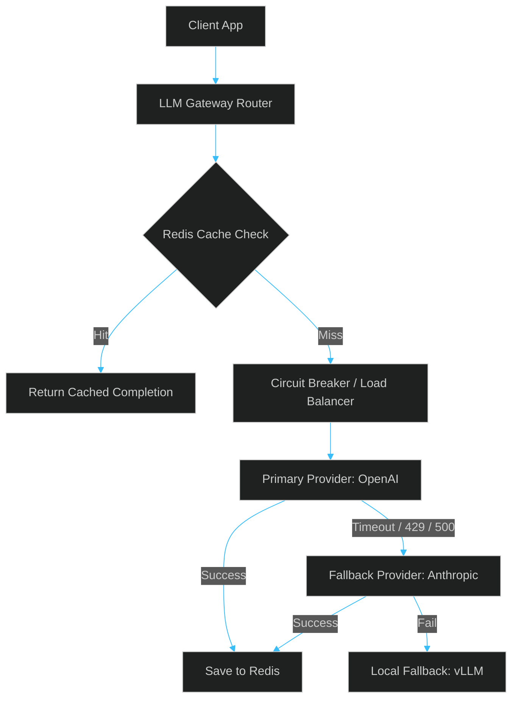

# The LLM Gateway Pattern: Building a Resilient Proxy Layer for Production APIs

> [!NOTE]
> **📖 Article Overview**
> Embedding raw API calls to OpenAI, Anthropic, or DeepSeek directly into your product code is a recipe for system fragility. When an upstream provider experiences a spike in latency, runs out of quota, or goes down, your application will freeze and error. This article outlines the **LLM Gateway Pattern** — a design pattern that intercepts every LLM request to handle fallback orchestration, caching, rate limiting, and telemetry in a central, resilient microservice. We will walk through the design and implement a gateway router in TypeScript.

---

## Why You Need an LLM Gateway

As your AI application scales, calling APIs directly creates several systemic issues:
1. **Model Outages and LATENCY spikes**: Upstream APIs fail. If your application relies on a single provider, you suffer outages.
2. **Quota and Rate Limits**: 429 Errors will interrupt user interactions unless requests are queued or routed to replica models.
3. **Duplicate Costs**: Users frequently ask similar questions. Without a semantic cache in front of your calls, you pay for redundant completions.
4. **Scattered Logs**: Auditing what prompts were sent, how many tokens were used, and what it cost becomes a nightmare if logs are spread across dozens of serverless lambdas.



---

## Core Pillars of the Gateway Pattern

A production-grade LLM Gateway handles four essential operations:

### 1. Semantic Caching
Before routing to the upstream API, the gateway runs a vector search on a cache database (like Redis or Qdrant) to see if a semantically identical query has already been answered. If the cosine similarity matches above `0.96`, it returns the cached response in `<10ms`, bypassing LLM generation completely.

### 2. Failover Orchestration
The gateway maintains a prioritised list of backup endpoints. If a request to OpenAI fails or times out (e.g. after 8 seconds), the router catches the exception, switches to Anthropic or a self-hosted vLLM engine, translates the payload schema, and completes the request seamlessly.

### 3. Circuit Breaking
If an upstream provider fails 5 times consecutively, the gateway trips the circuit breaker for that model. For the next 30 seconds, all requests bypass the failing model immediately, preventing request threads from stacking up and consuming connection pool sockets.

---

## Implementation: TypeScript LLM Gateway Router

Here is a clean TypeScript implementation of an LLM Gateway router that orchestrates fallback routing across different providers, handles connection timeouts, and executes request retry logic.

```typescript
import axios from 'axios';

interface LLMRequest {
  prompt: string;
  temperature?: number;
  maxTokens?: number;
}

interface GatewayResponse {
  provider: string;
  model: string;
  text: string;
  tokensUsed: number;
}

interface ModelProviderConfig {
  name: string;
  endpoint: string;
  apiKey: string;
  model: string;
  timeoutMs: number;
}

export class ResilientLLMGateway {
  private providers: ModelProviderConfig[];

  constructor(providers: ModelProviderConfig[]) {
    this.providers = providers;
  }

  /**
   * Translates unified gateway request to provider-specific payloads
   */
  private buildPayload(provider: string, config: ModelProviderConfig, request: LLMRequest) {
    if (provider === 'openai') {
      return {
        model: config.model,
        messages: [{ role: 'user', content: request.prompt }],
        temperature: request.temperature ?? 0.7,
        max_tokens: request.maxTokens
      };
    }
    // Anthropic-compatible format
    return {
      model: config.model,
      messages: [{ role: 'user', content: request.prompt }],
      max_tokens: request.maxTokens ?? 1000
    };
  }

  /**
   * Executes LLM request with fallback orchestration
   */
  public async executeChat(request: LLMRequest): Promise<GatewayResponse> {
    let lastError: Error | null = null;

    // Loop through providers sequentially as fallbacks
    for (const providerConfig of this.providers) {
      try {
        console.log(`Routing request to: ${providerConfig.name} (${providerConfig.model})`);

        const payload = this.buildPayload(providerConfig.name, providerConfig, request);

        // Fetch completion with connection timeout enforcement
        const response = await axios.post(
          providerConfig.endpoint,
          payload,
          {
            headers: {
              'Content-Type': 'application/json',
              'Authorization': `Bearer ${providerConfig.apiKey}`,
              'x-api-key': providerConfig.apiKey // For Anthropic
            },
            timeout: providerConfig.timeoutMs
          }
        );

        // Parse outputs based on provider format
        let text = '';
        let tokensUsed = 0;

        if (providerConfig.name === 'openai') {
          text = response.data.choices[0].message.content;
          tokensUsed = response.data.usage.total_tokens;
        } else {
          // Anthropic format parsing
          text = response.data.content[0].text;
          tokensUsed = response.data.usage?.input_tokens + response.data.usage?.output_tokens || 0;
        }

        return {
          provider: providerConfig.name,
          model: providerConfig.model,
          text,
          tokensUsed
        };

      } catch (err: any) {
        lastError = err;
        console.warn(`Provider ${providerConfig.name} failed: ${err.message}. Cascading to fallback.`);
        // Continues to next provider in loop
      }
    }

    throw new Error(`All LLM providers failed. Last error: ${lastError?.message}`);
  }
}

// Example Usage
const gateway = new ResilientLLMGateway([
  {
    name: 'openai',
    endpoint: 'https://api.openai.com/v1/chat/completions',
    apiKey: process.env.OPENAI_API_KEY || '',
    model: 'gpt-4o-mini',
    timeoutMs: 6000 // Strict 6 second timeout
  },
  {
    name: 'anthropic',
    endpoint: 'https://api.anthropic.com/v1/messages',
    apiKey: process.env.ANTHROPIC_API_KEY || '',
    model: 'claude-3-5-haiku-20241022',
    timeoutMs: 8000
  }
]);

// Call gateway - If OpenAI times out or fails, Anthropic will automatically handle it
gateway.executeChat({ prompt: 'Write an optimized quicksort algorithm in Rust.' })
  .then(res => console.log('Response Success:', res))
  .catch(err => console.error('Response Failure:', err.message));
```

---

## Conclusion & Takeaways

To build resilient, scale-ready AI platform backends:
* [ ] **Decouple upstream APIs**: Never let your product code communicate directly with provider APIs. Route everything through a gateway layer.
* [ ] **Enforce strict request timeouts**: Upstream model latencies can stall connections indefinitely. Cap wait times between `6s` and `12s` and failover immediately.
* [ ] **Implement semantic caching**: Prevent duplicate queries from hitting LLMs. Save token costs and reduce round-trip latency to milliseconds.
* [ ] **Add a circuit breaker**: Detect consecutive failures and temporarily redirect traffic to prevent cascading app failures.
