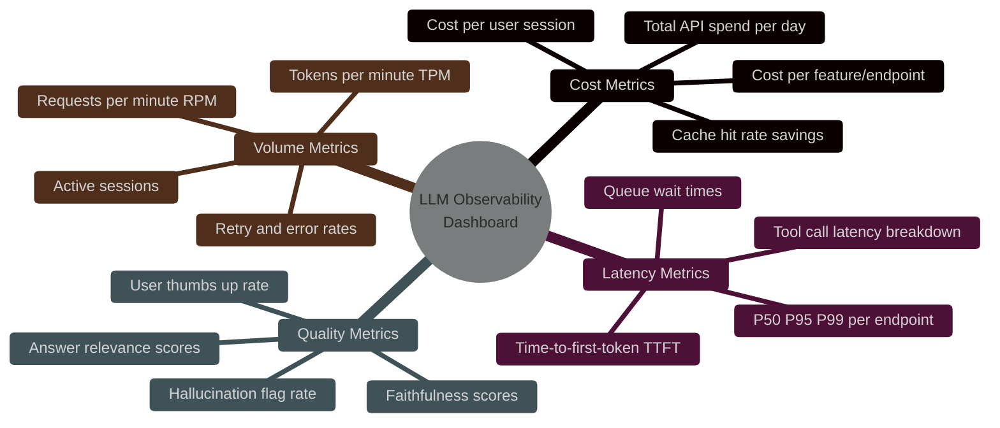

# LLM Observability with Langfuse & OpenTelemetry: Building AI System Visibility

> [!NOTE]
> **📖 Article Overview**
> Deploying an LLM application without observability is like operating a production database with no query logs, no slow-query alerts, and no index usage metrics. You cannot optimise what you cannot measure. This article covers the complete **LLM Observability Stack** — tracing every agent reasoning step with **Langfuse**, forwarding infrastructure telemetry with **OpenTelemetry (OTEL)**, and building dashboards that surface cost anomalies, latency regressions, and hallucination rates in real-time. Includes a full Python + TypeScript implementation.

---

## Why Standard APM Tools Fall Short for AI Systems

Classic Application Performance Monitoring (APM) tools like Datadog, New Relic, or AWS CloudWatch capture request latency, error rates, and CPU utilisation. These metrics are necessary but fundamentally insufficient for AI applications. The failure modes in LLM systems are semantic, not structural:

*   **A 200 OK response** can contain a hallucinated fact, a wrong code block, or a harmful output.
*   **A 500ms latency** might be acceptable for a tool call but unacceptable for a streaming response.
*   **An agent loop completing successfully** might have consumed 3× the expected tokens due to reasoning inefficiency.

LLM Observability adds a **semantic layer** on top of infrastructure metrics: traces that capture the full prompt, the complete reasoning chain, tool invocations with inputs/outputs, and evaluation scores — all linked to a unique `trace_id` for cross-system debugging.

---

## The Three Layers of LLM Observability

```mermaid
%%{init: {'theme': 'dark', 'themeVariables': { 'primaryColor': '#06b6d4', 'primaryTextColor': '#f3f4f6', 'primaryBorderColor': '#22d3ee', 'lineColor': '#06b6d4', 'secondaryColor': '#111827', 'tertiaryColor': '#0f172a'}}}%%
graph TB
    subgraph Layer 3 — Evaluation
        E1[Faithfulness Score]
        E2[Answer Relevance]
        E3[Hallucination Detector]
    end

    subgraph Layer 2 — LLM Traces
        T1[Span: System Prompt]
        T2[Span: RAG Retrieval]
        T3[Span: LLM Generation]
        T4[Span: Tool Call]
        T5[Span: Final Output]
    end

    subgraph Layer 1 — Infrastructure
        I1[Request Latency P50/P99]
        I2[Token Usage per Model]
        I3[API Error Rates]
        I4[Cost per Request]
    end

    subgraph Platforms
        P1[Langfuse<br/>Semantic Tracing]
        P2[OpenTelemetry<br/>OTEL Collector]
        P3[Grafana / Datadog<br/>Dashboards]
    end

    Layer 3 --> P1
    Layer 2 --> P1
    Layer 1 --> P2
    P2 --> P3
    P1 -.->|OTEL Export| P2

    style P1 fill:#4c1d95,stroke:#a855f7,stroke-width:2px
    style P2 fill:#0f172a,stroke:#06b6d4,stroke-width:2px
    style P3 fill:#0f172a,stroke:#f59e0b,stroke-width:2px
```

---

## What's Good & What's Not

| What's Good (Pros) | What's Not (Cons) |
| --- | --- |
| * Full Trace Reconstruction: Every reasoning step, tool call, and token count is logged and linked. | * Data Privacy Risk: Traces capture full prompts — any PII in user inputs must be masked before export. |
| * Cost Attribution: Track API spend per user, per feature, per agent — down to the cent. | * Storage Overhead: High-volume systems produce gigabytes of trace data; retention policies must be defined. |
| * Regression Detection: Compare evaluation scores before/after model or prompt changes. | * Instrumentation Effort: Retrofitting tracing into existing agent code requires non-trivial refactoring. |
| * Hallucination Flagging: Automated LLM-as-judge scoring on every production response. | * Eval Cost: Running automated evaluation judges adds ~20% to your LLM API bill. |

---

## Implementation: Langfuse Tracing for a Python Agent

Langfuse provides an SDK that wraps LLM API calls, automatically capturing prompts, completions, token usage, and latency into a structured trace hierarchy.

```python
import os
import time
from langfuse import Langfuse
from langfuse.decorators import observe, langfuse_context
from anthropic import Anthropic

# ─────────────────────────────────────────────
# 1. Initialise Clients
# ─────────────────────────────────────────────
langfuse = Langfuse(
    public_key=os.environ["LANGFUSE_PUBLIC_KEY"],
    secret_key=os.environ["LANGFUSE_SECRET_KEY"],
    host="https://cloud.langfuse.com"  # or self-hosted URL
)

anthropic_client = Anthropic()

# ─────────────────────────────────────────────
# 2. Use @observe Decorator for Automatic Tracing
# ─────────────────────────────────────────────
@observe(name="rag-retrieval-step")
def retrieve_context(query: str, top_k: int = 5) -> list[str]:
    """Simulated RAG retrieval — automatically traced as a span."""
    langfuse_context.update_current_observation(
        input={"query": query, "top_k": top_k},
        metadata={"retriever": "pgvector", "index": "enterprise-docs-v3"}
    )
    
    # Simulate vector search latency
    time.sleep(0.08)
    
    # Mock retrieved chunks
    chunks = [
        f"Document chunk {i}: Relevant content about {query}" 
        for i in range(1, top_k + 1)
    ]
    
    langfuse_context.update_current_observation(
        output={"chunks_retrieved": len(chunks)},
    )
    return chunks

@observe(name="llm-generation-step", as_type="generation")
def generate_response(system_prompt: str, context: list[str], user_query: str) -> dict:
    """LLM generation step — traced with full token usage and cost attribution."""
    
    context_block = "\n\n".join(context)
    
    langfuse_context.update_current_observation(
        input={
            "system": system_prompt,
            "context_chunks": len(context),
            "user_query": user_query
        },
        model="claude-3-5-sonnet-20241022",
    )
    
    response = anthropic_client.messages.create(
        model="claude-3-5-sonnet-20241022",
        max_tokens=1024,
        system=system_prompt,
        messages=[{
            "role": "user",
            "content": f"Context:\n{context_block}\n\nQuestion: {user_query}"
        }]
    )
    
    output_text = response.content[0].text
    
    # Manually log token usage for cost tracking
    langfuse_context.update_current_observation(
        usage={
            "input": response.usage.input_tokens,
            "output": response.usage.output_tokens,
            "unit": "TOKENS"
        },
        output=output_text
    )
    
    return {
        "text": output_text,
        "input_tokens": response.usage.input_tokens,
        "output_tokens": response.usage.output_tokens
    }

@observe(name="rag-agent-pipeline")
def run_rag_pipeline(user_query: str, user_id: str, session_id: str) -> str:
    """
    Top-level agent pipeline — root trace with full session metadata.
    All child functions (@observe decorated) become nested spans.
    """
    # Tag the root trace with user and session metadata
    langfuse_context.update_current_trace(
        user_id=user_id,
        session_id=session_id,
        tags=["rag", "production", "claude-3-5-sonnet"],
        metadata={
            "pipeline_version": "2.1.0",
            "environment": "production"
        }
    )
    
    SYSTEM_PROMPT = """You are an expert AI assistant. Answer questions accurately using 
    the provided context. If the context doesn't contain the answer, say so clearly."""
    
    # Step 1: Retrieve context (creates a child span)
    context_chunks = retrieve_context(query=user_query, top_k=5)
    
    # Step 2: Generate response (creates another child span with token tracking)
    result = generate_response(
        system_prompt=SYSTEM_PROMPT,
        context=context_chunks,
        user_query=user_query
    )
    
    # Step 3: Log evaluation score (hallucination check placeholder)
    langfuse_context.score_current_trace(
        name="completeness",
        value=0.92,  # From an automated eval pipeline
        comment="Response covers all key points in retrieved context"
    )
    
    return result["text"]

# ─────────────────────────────────────────────
# 3. Execute with Full Session Context
# ─────────────────────────────────────────────
if __name__ == "__main__":
    answer = run_rag_pipeline(
        user_query="How do I implement sliding window rate limiting with Redis sorted sets?",
        user_id="usr_engineer_1042",
        session_id="sess_20260612_001"
    )
    print("Answer:", answer)
    
    # Flush traces to Langfuse (important in short-lived scripts)
    langfuse.flush()
    print("\n✅ Traces exported to Langfuse dashboard.")
```

---

## OpenTelemetry Integration: Forwarding Traces to Your APM

Langfuse supports OTEL export, enabling you to forward all LLM traces into your existing Datadog, Grafana Tempo, or Jaeger setup for unified infrastructure + AI observability.

```python
from opentelemetry import trace
from opentelemetry.sdk.trace import TracerProvider
from opentelemetry.sdk.trace.export import BatchSpanProcessor
from opentelemetry.exporter.otlp.proto.http.trace_exporter import OTLPSpanExporter
from opentelemetry.sdk.resources import Resource
import os

# ─────────────────────────────────────────────
# OTEL Tracer Setup (ships traces to Collector)
# ─────────────────────────────────────────────
resource = Resource.create({
    "service.name": "enterprise-rag-api",
    "service.version": "2.1.0",
    "deployment.environment": "production",
})

provider = TracerProvider(resource=resource)

# Ship to OTEL Collector (e.g. Datadog Agent, Grafana Agent, Jaeger)
otlp_exporter = OTLPSpanExporter(
    endpoint=os.environ.get("OTEL_EXPORTER_OTLP_ENDPOINT", "http://localhost:4318/v1/traces"),
    headers={"Authorization": f"Bearer {os.environ.get('OTEL_AUTH_TOKEN', '')}"}
)
provider.add_span_processor(BatchSpanProcessor(otlp_exporter))
trace.set_tracer_provider(provider)

tracer = trace.get_tracer("rag-pipeline")

def run_traced_request(user_id: str, query: str):
    """Wrap an API handler with OTEL tracing for infrastructure metrics."""
    with tracer.start_as_current_span("handle-rag-request") as span:
        span.set_attribute("user.id", user_id)
        span.set_attribute("query.length", len(query))
        span.set_attribute("rag.pipeline.version", "2.1.0")
        
        try:
            with tracer.start_as_current_span("vector-db-query") as db_span:
                db_span.set_attribute("db.system", "pgvector")
                db_span.set_attribute("db.query.top_k", 5)
                # ... vector search logic ...
                db_span.set_attribute("db.results.count", 5)
            
            with tracer.start_as_current_span("llm-api-call") as llm_span:
                llm_span.set_attribute("llm.model", "claude-3-5-sonnet-20241022")
                llm_span.set_attribute("llm.prompt.tokens", 8500)
                # ... LLM call logic ...
                llm_span.set_attribute("llm.completion.tokens", 342)
                llm_span.set_attribute("llm.cost.usd", 0.0147)
            
            span.set_attribute("request.status", "success")
            
        except Exception as e:
            span.set_attribute("request.status", "error")
            span.record_exception(e)
            raise
```

---

## TypeScript SDK: Tracing in Next.js / Hono APIs

```typescript
import Langfuse from 'langfuse';

const langfuse = new Langfuse({
  publicKey: process.env.LANGFUSE_PUBLIC_KEY!,
  secretKey: process.env.LANGFUSE_SECRET_KEY!,
  baseUrl: 'https://cloud.langfuse.com',
});

interface RagResult {
  answer: string;
  inputTokens: number;
  outputTokens: number;
  cost: number;
}

export async function tracedRagRequest(
  userId: string,
  sessionId: string,
  userQuery: string
): Promise<RagResult> {
  // Create root trace
  const trace = langfuse.trace({
    name: 'rag-api-request',
    userId,
    sessionId,
    tags: ['production', 'nextjs-api'],
    metadata: { version: '2.1.0' },
  });

  try {
    // Span 1: Vector retrieval
    const retrievalSpan = trace.span({
      name: 'vector-retrieval',
      input: { query: userQuery, topK: 5 },
    });
    
    // ... vector search ...
    const retrievedChunks = ['chunk1', 'chunk2', 'chunk3'];
    
    retrievalSpan.end({ output: { count: retrievedChunks.length } });

    // Span 2: LLM generation (use generation type for token tracking)
    const generationSpan = trace.generation({
      name: 'claude-completion',
      model: 'claude-3-5-sonnet-20241022',
      input: { query: userQuery, contextChunks: retrievedChunks.length },
    });

    const inputTokens = 8200;
    const outputTokens = 380;
    const cost = (inputTokens * 0.015 + outputTokens * 0.075) / 1000;

    generationSpan.end({
      output: 'The sliding window rate limiter uses Redis sorted sets...',
      usage: { input: inputTokens, output: outputTokens },
      metadata: { cost_usd: cost },
    });

    // Add evaluation score
    trace.score({
      name: 'user-feedback',
      value: 1,
      comment: 'Thumbs up from user',
    });

    await langfuse.flushAsync();

    return {
      answer: 'Rate limiting implementation...',
      inputTokens,
      outputTokens,
      cost,
    };
    
  } catch (error) {
    trace.update({ metadata: { error: String(error), status: 'failed' } });
    await langfuse.flushAsync();
    throw error;
  }
}
```

---

## Key Metrics Dashboard: What to Monitor



---

## Conclusion & Key Takeaways

LLM Observability is not optional in production AI systems — it is the foundation of continuous improvement. Without traces, you are debugging by intuition. With Langfuse + OpenTelemetry, every reasoning step, every dollar spent, and every quality regression becomes a queryable, alertable data point.

*   **Instrument first, optimise second**: Before tuning prompts or switching models, establish your baseline metrics. You cannot improve what you haven't measured.
*   **Mask PII at the trace boundary**: Configure Langfuse's masking rules to redact sensitive fields before traces are stored. Compliance is a day-one concern, not an afterthought.
*   **Link traces to evaluations**: Every automated eval score (faithfulness, relevance, hallucination) should be attached to the same `trace_id` as the generation it evaluated.

In our next article, we tackle **Guardrails & Input/Output Validation** — using Guardrails AI and NVIDIA NeMo to build structured safety layers that intercept harmful inputs and enforce schema-compliant agent outputs before they reach your users.

---

### Research References & Resources
*   **Langfuse Documentation**: [Open-Source LLM Engineering Platform](https://langfuse.com/docs)
*   **OpenTelemetry for AI**: [Semantic Conventions for LLM Spans](https://opentelemetry.io/docs/specs/semconv/gen-ai/)
*   **Langfuse + OTEL Integration**: [Exporting Langfuse Traces via OTLP](https://langfuse.com/docs/integrations/opentelemetry)
